# Entitiy-Relationship Model

ER 数据模型是为了便于数据库设计而开发的，它允许描述一个表示数据库整体逻辑结构的企业模式。  
ER 数据模型采用三个基本概念：

- 实体集，
- 关系集，
- 属性。

ER 模型还具有相应的图示表示法，即 ER 图，可以图形化地表达数据库的整体逻辑结构。

## 实体集

现实世界可以建模为：  
- 实体的集合
- 实体之间的联系

实体是一个存在且能够与其他对象区分开来的对象。实体可以是具体的，也可以是抽象的。示例：某个学生、公司、事件、植物。

实体具有属性。示例：学生有学号、姓名、年龄、性别和地址。

实体集是具有相同属性的一类实体的集合。示例：所有学生的集合、公司的集合、树木的集合、节日的集合、顾客的集合、账户的集合、贷款的集合。

一个实体集包含多个同类实体的实例。

实体集可以图形化表示如下：  
  - 矩形表示实体集。
  - 属性列在实体矩形内部
  - 下划线表示主键属性

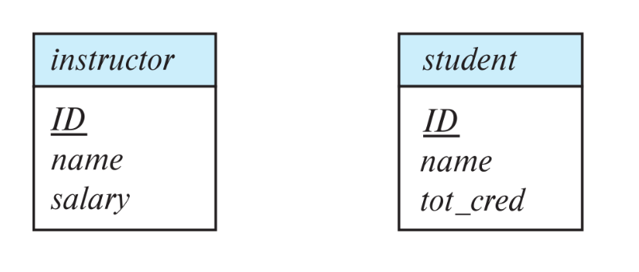

### 属性

实体由一组属性表示，这些属性是实体集中所有成员所拥有的描述性性质。

域（值集）是每个属性所允许的取值集合。

属性类型有很多种：

- 简单属性和复合属性（例如：性别、姓名）。
- 单值属性和多值属性（例如：电话号码（可能有多个电话号码））。
- 派生属性：可以根据其他属性计算得到，例如根据出生日期计算年龄。与之相对的是基属性（或称存储属性）。

## 关系集

关系是多个实体之间的关联（是两个或多个不同类实体之间的关联）。

关系集是具有相同类型的一组关系。示例：`borrower (customer-name, loan-number)`

一个关系集包含多个同类关系（或关系实例，relationship instance）

一个关系集表示两个或多个实体集之间的关联。

形式化地说，关系集是 $n \geq 2$ 个实体之间的数学关系，每个实体分别取自各自的实体集

$$
 \{(e_1, e_2, \dots, e_n) \mid e_1 \in E_1, e_2 \in E_2, \dots, e_n \in E_n\} 
$$

其中 $(e_1, e_2, \dots, e_n)$ 是一个关系，$E_i$ 是一个实体集。

实体集之间的关联称为参与（participation）；即实体集 $E_1, E_2, \dots, E_n$ 参与关系集 $R$。

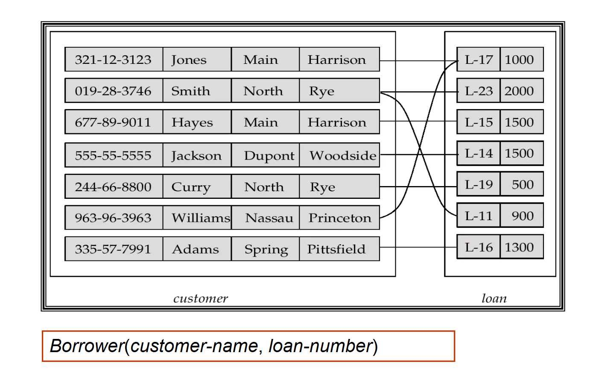

在 E-R 图中，关系集用菱形表示，并通过线条连接到多个不同的实体集（矩形）。

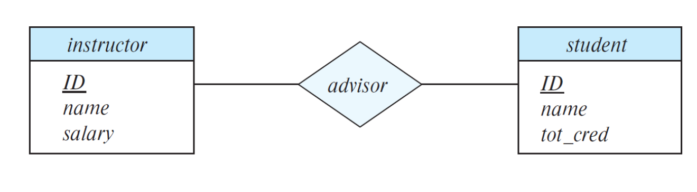

属性也可以是关系集的属性。例如，实体集 customer 和 account 之间的 depositor 关系集可能具有属性 access-date。

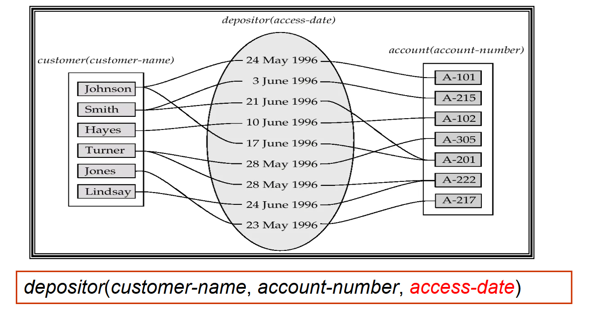

在 E-R 图中，关系集的属性用虚线与关系集相连。

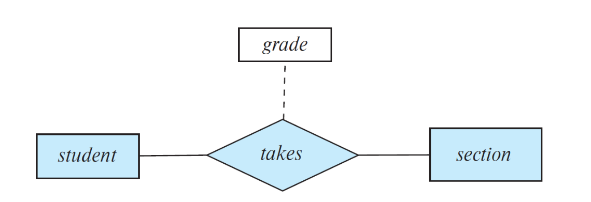

### 角色
关系中的实体集不必互异。实体集的每一次出现都在关系中扮演一个“角色” 。

实体在关系中所起的作用称为该实体的角色。  

以下是一个自联系（递归关系），具体表示课程之间的先修关系。其中标签“course_id”和“prereq_id”被称为角色。

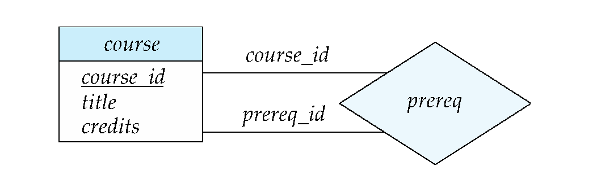
### 关系集的度

关系集的度指参与一个关系集的实体集的数目。涉及两个实体集的关系集是二元关系集（或称为二度关系）。

关系集可能涉及两个以上的实体集。
  
- 例如，假设银行员工可能在多个分行有工作职责，在不同分行担任不同职务。那么，在（员工、职务、分行）实体集之间存在一个三元关系集。

涉及两个以上实体集的关系很少见。大多数关系都是二元的。

某些看似非二元的关系，用二元关系来表示可能会更好。

- 例如：三元关系 parents（将孩子与其父亲和母亲关联起来），最好用两个二元关系 father（父亲）和 mother（母亲）来替代。使用两个二元关系可以支持部分信息，例如只知道母亲的情况。

但有些关系本质上是非二元的，例如 works-on(员工, 分行, 职位)。

一般而言，任何非二元关系都可以通过创建一个人工实体集，并使用二元关系来表示。

- 将实体集 $A$ 、$B$ 和 $C$ 之间的非二元关系 $R$ 替换为一个实体集 $E$，以及三个新的关系集。
- 为 $E$ 创建一个特殊的标识属性。
- 将 $R$ 的任何属性添加到 $E$ 中。
- 对于 $R$ 中的每个关系$(a_i, b_j, c_k)$，创建对应的关系实例$R_A, R_B, R_C$。

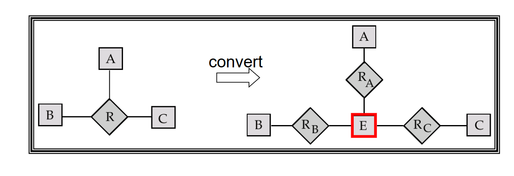

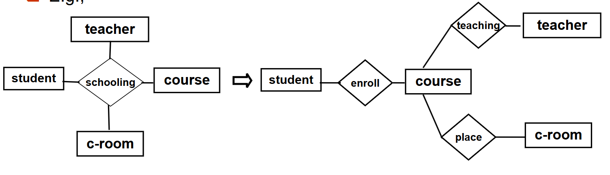

### 映射基数

映射基数（apping Cardinalities）一个联系集中，一个实体可以与另一类实体相联系的实体数目。其中数目是指最多一个还是多个。在描述二元关系集时十分有用。

对于二元关系集，映射基数必须是以下类型之一$（A : B）$：

- 一对一（1 : 1），例如：现任总统（总统，国家）
- 一对多（1 : n），例如：分班情况（班级，学生）
- 多对一（n : 1），例如：就医（病人，医生）
- 多对多（n : m），例如：选课（学生，课程）

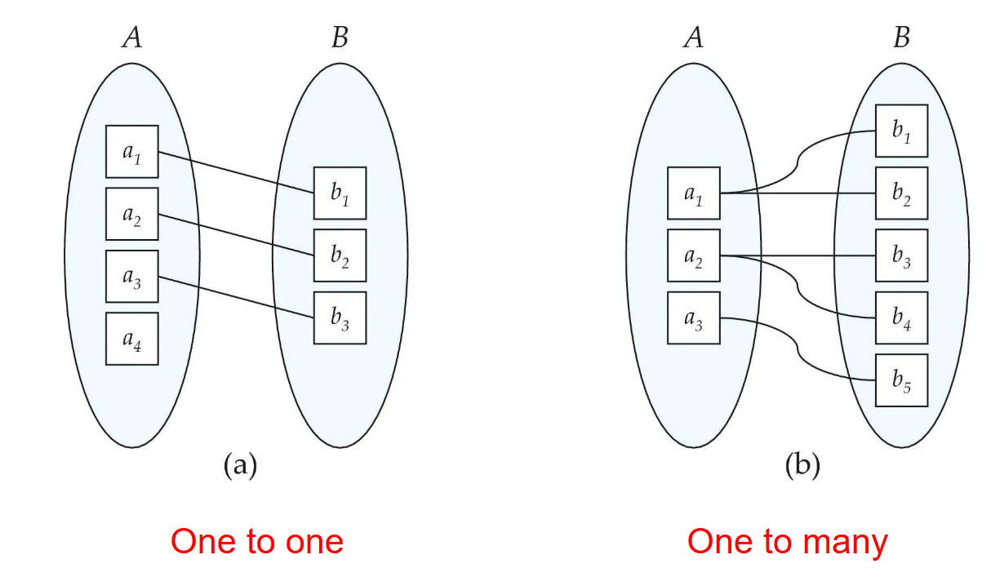

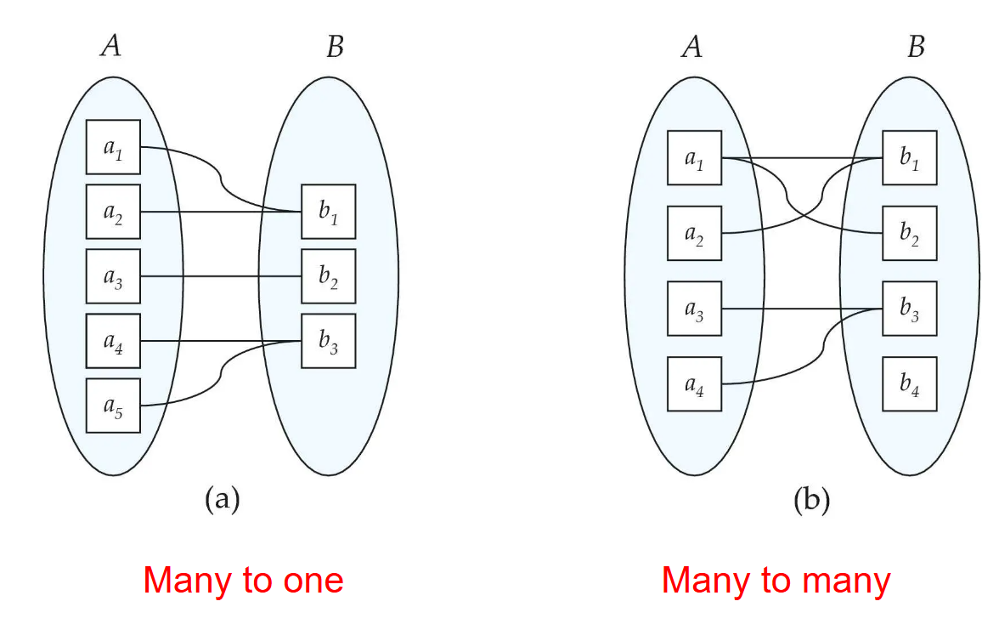

注意：在实体集A或B中的某些元素可能不会映射到另一个集合的任何元素。

我们通过在关系集和实体集之间画有向线（→）表示“一”，或者画无向线（—）表示“多”来表达基数约束。

以下是关系集的基数约束在 E-R 图中的表示：

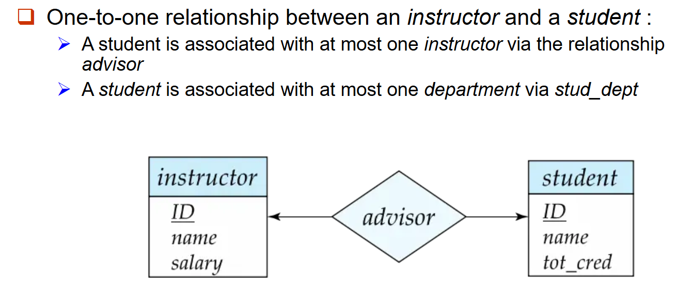

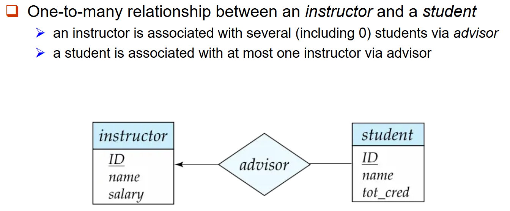

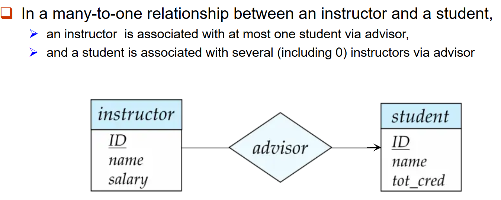

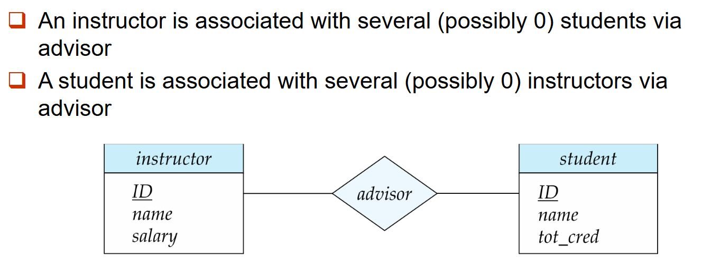

一条连线可以关联最小和最大基数，表示为 $l..h$的形式，其中 $l$ 是最小基数，$h$ 是最大基数

- 最小值为 1 表示全参与。
- 最大值为 1 表示该实体最多参与一个关系
- 最大值为 * 表示无限制。

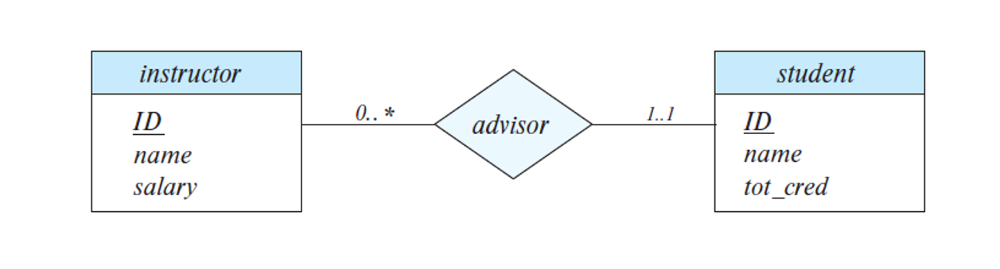

#### 三元关系上的基数约束

- 我们允许在三元（或更高阶）关系上最多画出一个箭头来表示基数约束。
- 如果存在多个箭头，则其含义有两种不同的定义方式。
- 例如，三元关系 $R$ 涉及 $A$、$B$ 和 $C$ ，并带有指向 $B$ 和 $C$ 的箭头，可能意味着：  
    1. 每个 $A$ 实体与一个唯一的 $B$ 实体和一个唯一的 $C$ 实体相关联。
    2. 每一对 $(A, B)$ 实体与一个唯一的 $C$实体相关联，并且每一对 $(A, C)$ 实体与一个唯一的 $B$ 实体相关联。

- 为避免混淆，我们禁止使用多个箭头。

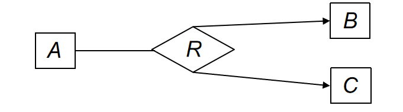

### 全参与和部分参与

- 全参与（用双线表示）：实体集中的每个实体都至少参与关系集中的一个关系
- 部分参与：某些实体可能不参与关系集中的任何关系

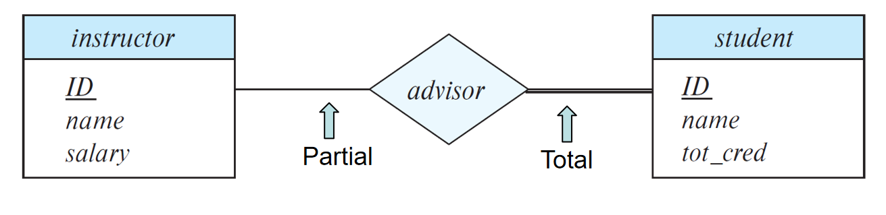

## 键/码

### 实体集中的键
实体集的超键是一个或多个属性的集合，这些属性的值能够唯一确定每个实体。

实体集的候选键是最小的超键。

虽然可能存在多个候选键，但会选择其中一个候选键作为主键。

### 联系集中的键

参与关系集的各实体集的主键的组合构成了该关系集的一个超键。

- 设 $R$ 是一个涉及实体集 $E_1, E_2, \ldots, E_n$ 的关系集
- $R$ 的主键由实体集 $E_1, E_2, \ldots, E_n$ 的主键的并集构成
- 如果关系集 $R$ 还关联有属性 $a_1, a_2, \ldots, a_m$，则 $R$ 的主键也包含这些属性 $a_1, a_2, \ldots, a_m$
- 注意：这意味着在给定的关系集中，一对实体之间最多只能有一个关系。

 在确定关系集的候选键时，必须考虑关系集的映射基数（1:1、1:n、m:n）。

在存在多个候选键的情况下，选择主键时需要考虑关系集的语义，例如：作为码的属性不能为空，值不应常变。

- 多对多关系：前述各主键的并集是最小超键，被选为主键。
- 一对多关系：“多”方的主键是最小超键，被用作主键。
- 多对一关系：“多”方的主键是最小超键，被用作主键。
- 一对一关系：任意一个参与实体集的主键都构成最小超键，两者中的任意一个都可以被选为主键。（完全参与的一方的主键一般被选为主键）

### 弱实体集
- 考虑一个教学班（section）实体，它由 `course_id`、`semester`、`year` 和 `sec_id` 唯一标识。
- 显然，教学班实体与课程实体是相关的。假设我们在教学班实体集和课程实体集之间创建一个关系集 `sec_course`。
- 注意，`sec_course` 中的信息是冗余的，因为教学班已经有一个属性 `course_id`，该属性标识了该教学班所对应的课程。
- 处理这种冗余的一种方法是去掉 `sec_course` 关系；然而，这样做会使教学班与课程之间的关系隐式地体现在一个属性中，这是不可取的。
- 处理这种冗余的另一种方式是：不在教学班实体中存储属性 `course_id`，而只存储其余属性 `section_id`、`year` 和 `semester`。
- 然而，这样一来，教学班实体集就没有足够的属性来唯一标识一个具体的教学班实体。
- 为了解决这个问题，我们将关系 `sec_course` 视为一种特殊的关系，它提供了识别教学班实体所需的额外信息，即 `course_id`。
- 这样，我们就得到了一个弱实体集，即 `section` 实体集。

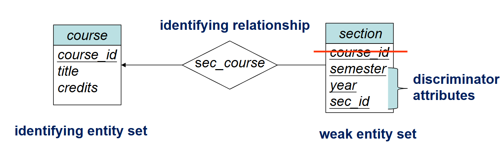

弱实体集是指其存在依赖于另一个实体的实体集，所依赖的实体称为其标识性实体。不是弱实体集的实体集称为强实体集。将弱实体集与标识性实体集关联起来的关系称为标识性联系

我们不为弱实体关联一个主键，而是使用标识性实体，再加上称为分辨符的额外属性，来唯一标识一个弱实体。分辨符也称为部分键。

每个弱实体都必须与一个标识性实体相关联；也就是说，弱实体集对标识性实体集存在存在依赖。

标识性实体集被称为拥有它所标识的弱实体集。

请注意，尽管我们已从实体集 section 中删除了属性course_id，我们最终从实体集section创建的关系模式确实包含了属性course_id。

弱实体集的主键由其所依赖的强实体集的主键加上弱实体集的分辨符共同构成。

以下是弱实体集和标识性联系在 E-R 图中的表示：

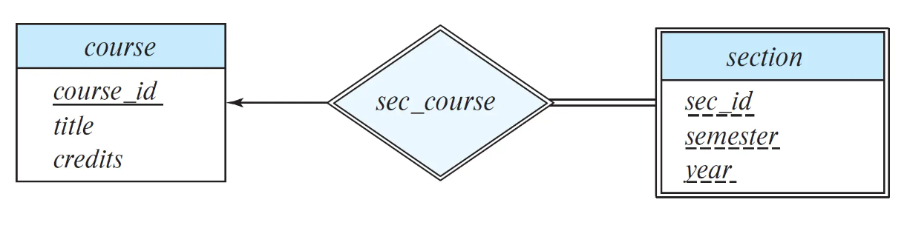

标识性联系一定是一对多的，且相关的弱实体集一定是完全参与的。

## 扩展 E-R 特性

### 实体集的层次

#### 特殊化（具体化）

- 一个实体集中可能包含一些子组，这些子组中的实体在某种程度上与该实体集中的其他实体有所区别。
- 这是一种自顶向下的设计过程；我们在一个实体集内部指定出与该实体集中其他实体有所区别的子组。
- 这些子组成为较低层的实体集，它们拥有不适用于较高层实体集的属性，或者参与不适用于较高层实体集的关系。
- 属性继承 —— 较低层实体集会继承与之相连的较高层实体集的所有属性以及所参与的关系。

以下是特殊化在E-R图的两种表示方式：

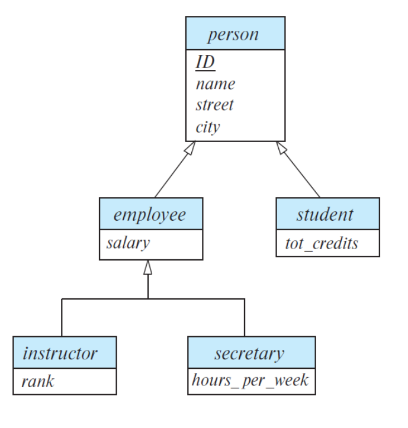

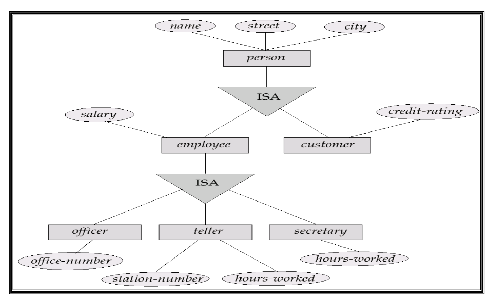

#### 泛化（普遍化）

- 一种自底向上的设计过程 —— 将多个具有相同特征的实体集组合成一个更高层次的实体集。
- 特殊化与泛化互为逆过程；它们在 E-R 图中采用相同的表示方式。
- 术语“特殊化”和“泛化”可以互换使用。

#### 成员约束

关于哪些实体可以成为给定低层实体集成员的约束。

- 条件定义的。例如：(1) 所有年龄超过 65 岁的客户成为 senior-citizen 实体集的成员。
- 用户定义的。

关于实体是否可以属于多个低层实体集的约束。

- 不相交
    - 一个实体只能属于一个低层实体集。
- 可重叠
    - 一个实体可以属于多个低层实体集。

以下是成员约束在 E-R 图中的表示：

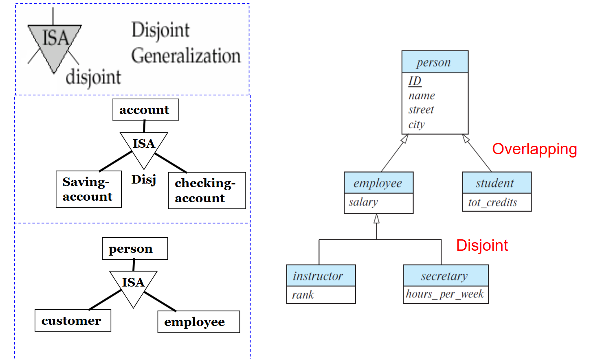

完全性约束 —— 指定高层实体集中的实体是否必须属于泛化中的至少一个低层实体集。

- 完全泛化（Total）：实体必须属于某一个低层实体集。
- 部分泛化（Partial）：实体不必属于任何一个低层实体集。

以下是完全性约束在 E-R 图中的两种表示：

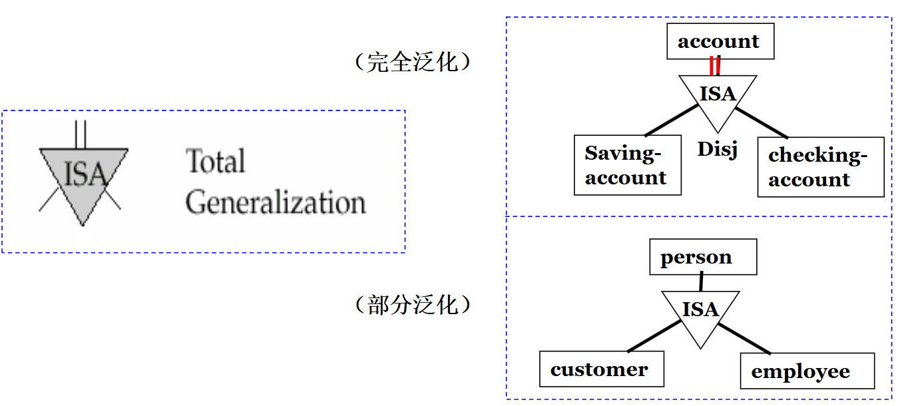

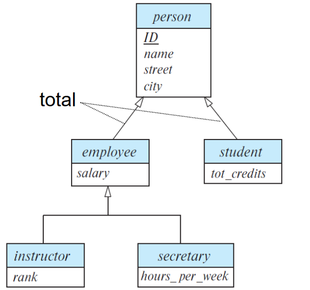

### 聚合

我们看如图的例子：

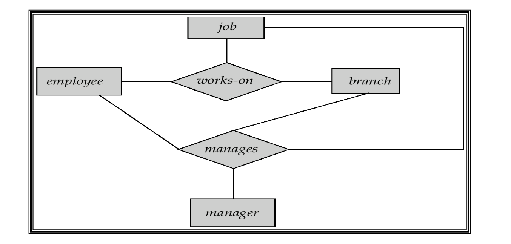

关系集 works-on（工作于）和 manages（管理）表示重叠的信息。

每个 manages 关系都对应一个 works-on 关系。

然而，有些 works-on 关系可能不对应任何 manages 关系。

因此我们不能丢弃works-on 关系。

我们可以通过聚合消除这种冗余。聚合的过程如下：

- 将关系视为一个抽象实体。
- 允许关系之间再建立关系。
- 将关系抽象为新的实体。

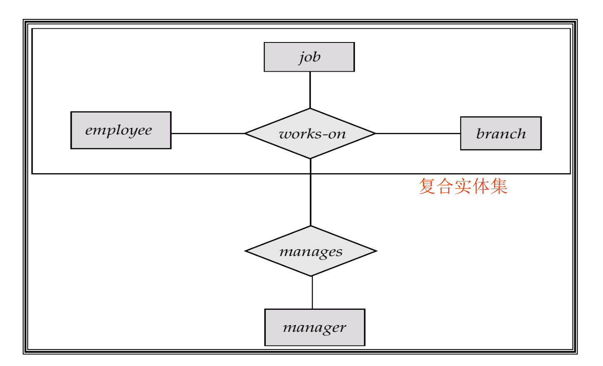

## E-R图
E-R图是一种用于描述实体-关系模型的图形表示法。一下是一些常用的符号，我们之前已经有所提及。

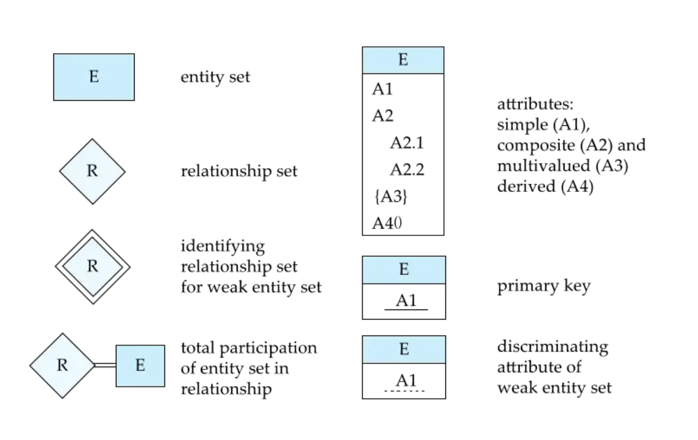
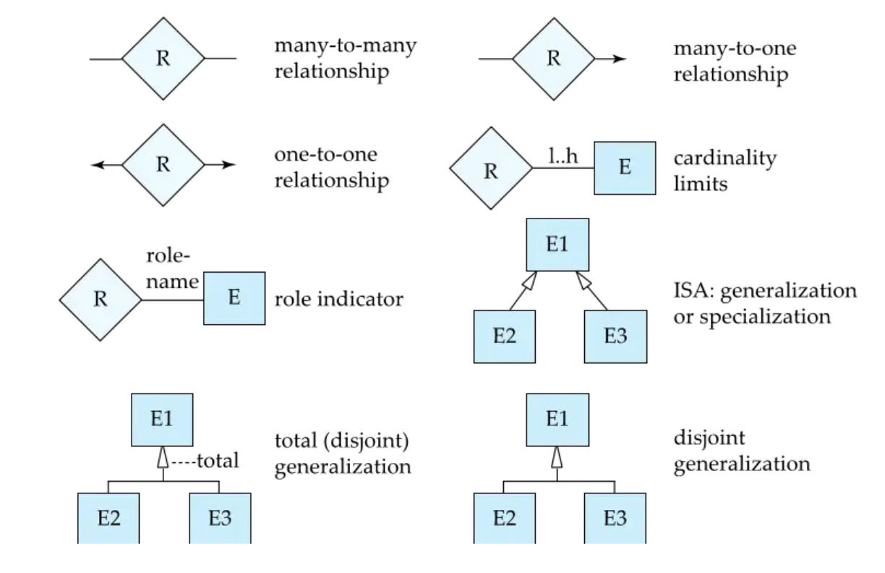
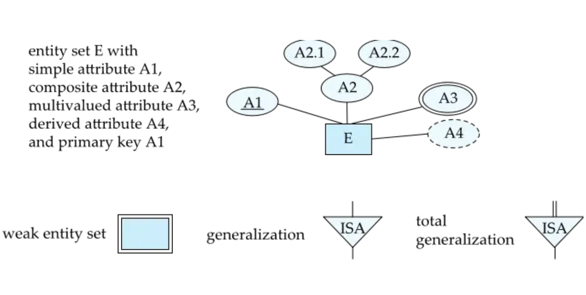
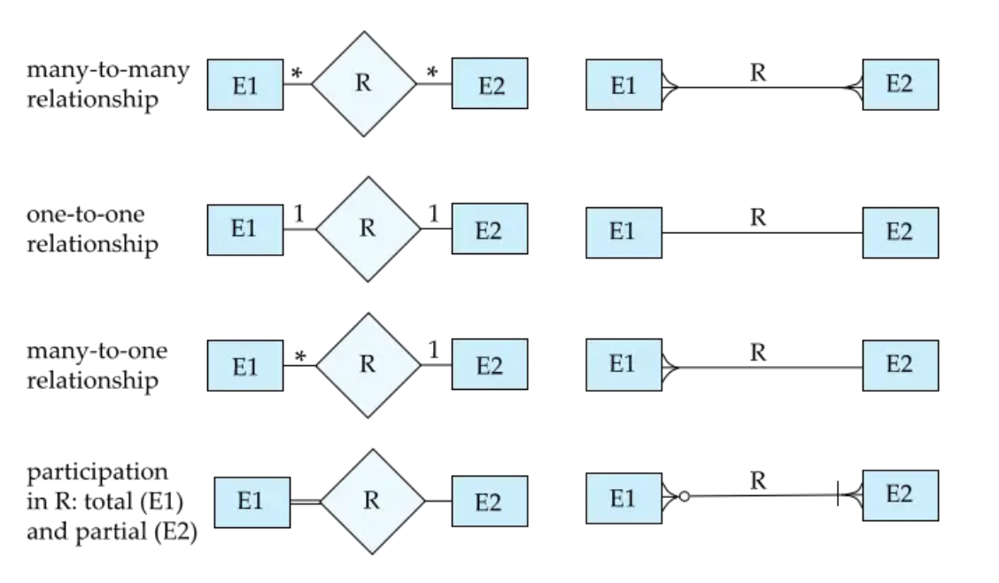

## E-R图的设计
在E-R图的设计中，我们需要考虑许多问题。一些常见的问题如下：

1.使用属性还是实体集来表示一个对象？

- 若一个对象只对其名字及单值感兴趣，则可作为属性，如性别；若一个对象除名字外，本身还有其他属性需描述，则该对象应定义为实体集（如电话、部门）。
- 一个对象不能同时作为实体和属性。
- 一个实体集不能与另一实体集的属性相关联，只能实体与实体相联系。

2.将其用作实体集还是关系集？

- 可能的指导原则是：将关系集用于描述实体之间发生的动作。

3.将其用作实体或关系的属性？

-  要从对象的语义独立性和减少数据冗余方面考虑

4.用三元或 n 元关系与使用一对二元关系的对比。

5.使用强实体集还是弱实体集。

6.使用特化/泛化 —— 有助于设计的模块化。

7.使用聚合 —— 可以将 E-R 图的一部分分组为一个单独的实体集，并将其视为一个单元，无需关心其内部结构的细节。

## ER图到表格的转化

将 E-R 图转换为表格格式是从 E-R 图推导关系数据库设计的基础。

对于每个实体集和关系集，都有一个唯一的表，该表被赋予相应实体集或关系集的名称。

若实体集中或关系集中包含复合属性，复合属性通过为每个分量属性创建一个单独的属性来展开。  
例如：给定实体集 `customer`，其中包含复合属性 `name`，该属性由分量属性 `first-name` 和 `last-name` 组成。则该实体集对应的表将具有两个属性：`name.first-name` 和 `name.last-name`。

实体 $E$ 的多值属性 $M$ 通过单独的表 $EM$ 来表示。多值属性的每个值对应表 $EM$ 中的一行。   
例如，employee 的多值属性dependent-names（家属姓名）通过以下方式表示：
- `employee(emp-id, ename, sex, age, dependent-names)` （不推荐）
- 实际应拆分为：
    - `employee(emp-id, ename, sex, age)`
    - `employee-dependent-names(emp-id, dependent-name)`

一个弱实体集转换为一张表，该表中包含一个用于存放其所依赖的强实体集主键的列。弱实体集的主码由其所依赖的强实体集的主码和弱实体集的分辨符组成。

一个关系集表示为一张表，该表的列包括两个参与实体集的主键（这些主键在此处作为外键），以及关系集本身的任何描述性属性。

-  多对多关系集的表：对应于两个实体集的两个属性成为该表的主键。
-  多对一关系集的表：对应于“多”方实体集的属性成为该表的主键。
-  一对一关系集的表：选择任一实体集的主键作为表的主键（选择完全参与的那一方更好）。
  
### 表的冗余

对1:n联系，如果“多”方是全参与的，可则可以通过在“多”方实体表中增加一个属性，将“联系”所对应的表，合并到对应“多”端实体的表中。

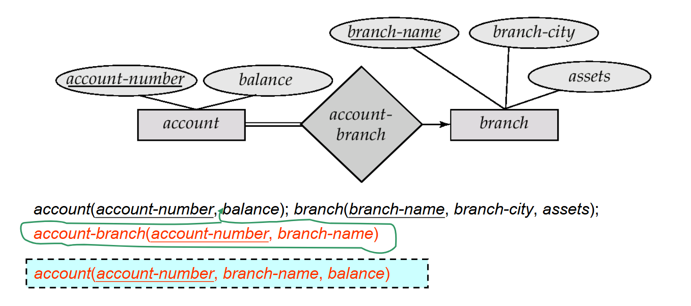

如果“多”方的参与是部分参与的，那么用“多”方关系中的一个额外属性来替换表可能会导致空值。

对于一对一关系集，可以选择任一方作为“多”方。也就是说，可以在两个实体集对应的两个表中的任意一个表中添加额外属性来实现表的合并。

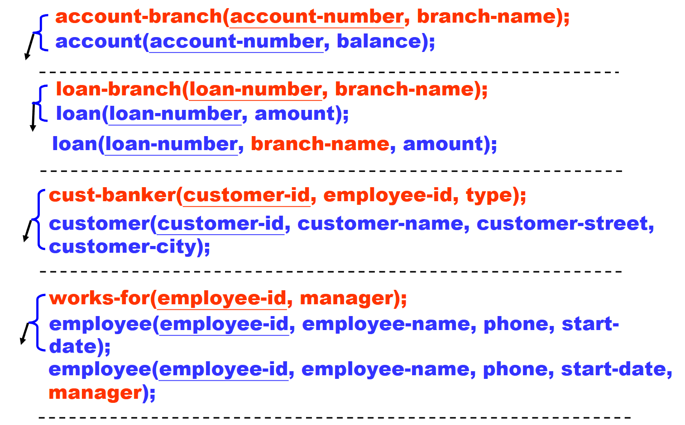

联系弱实体集及其标识性实体集的联系集对应的表是冗余的，可以直接去掉。

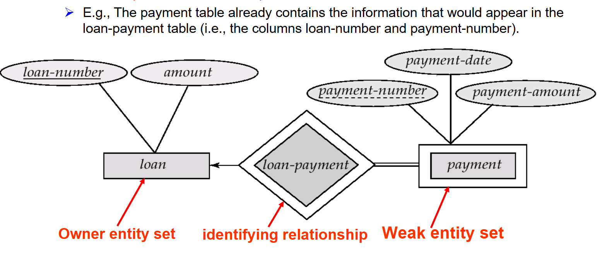