# 关系型数据库设计

关系数据库设计的目的是生成一组关系模式，在存储信息时避免不必要的冗余，且能够方便地检索信息。

这可以通过设计符合适当范式的关系模式来实现。

不良设计可能导致：冗余存储，插入/删除/更新异常等问题。

## 分解

分解：将一个关系模式分解为多个关系模式。

例如将 (ABCD) 替换为 (AB) 和 (BCD)，或者 (ACD) 和 (ABD)，或者 (ABC) 和 (CD)，或者 (AB)、(BC) 和 (CD)，或者 (AD) 和 (BCD)。

原始模式（R）中的所有属性必须出现在分解得到的模式（$R_1, R_2$）中，即 $R = R_1 \cup R_2$。

同时我们一般要求分解是无损连接分解（lossless-join decomposition），即对于模式$R$上的所有可能关系 $r$， 

$$
r = \Pi_{R_1}(r) \bowtie \Pi_{R_2}(r)
$$

反过来，如果 $r \subset \Pi_{R_1}(r) \bowtie \Pi_{R_2}(r)$，则该分解是有损的。

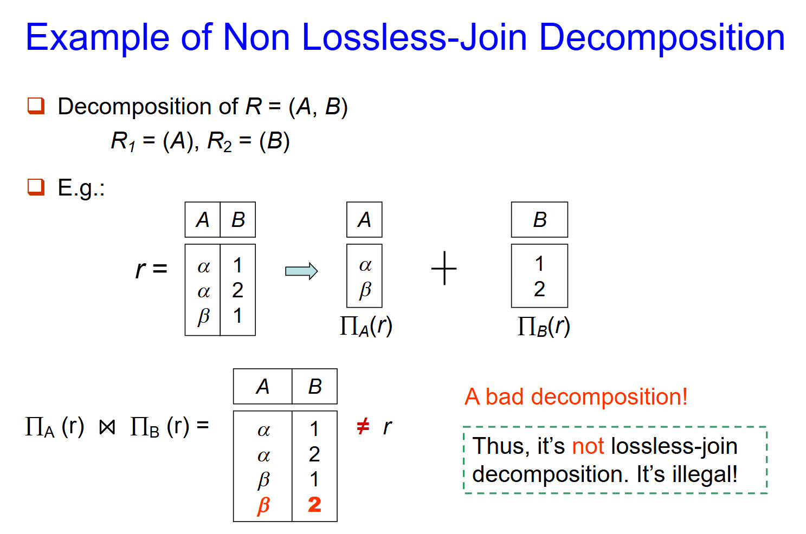

## 第一范式（First Normal Form，1NF）

如果域的元素被视为不可分割的单元，则该域是原子的。

非原子域的例子：

- 复合属性——例如姓名集合
- 多值属性——例如一个人的电话号码
- 复杂数据类型——面向对象中的类型

如果关系模式 $R$ 的所有属性的域都是原子的，则称 $R$ 属于第一范式（1NF）。

对于关系数据库而言，要求所有关系都满足第一范式。

对于非原子的值，我们需要进行进一步处理：

- 对于复合属性：使用多个属性来表示。
- 对于多值属性：
    - 使用多字段，例如 `person(pname, ..., phon1, phon2, phon3, ...)`；
    - 使用单独的表，例如 `phone(pname, phone)`；
    - 使用单个字段，例如 `person(pname, ..., phones, ...)`

## 函数依赖

设 $R$ 为一个关系模式，$\alpha$ 和 $\beta$ 为属性集，即 $\alpha \subseteq R$ 且 $\beta \subseteq R$。

函数依赖 $\alpha \to \beta$ 在 $R$ 上成立，当且仅当对于任意合法关系 $r(R)$，只要 $r$ 中的任意两个元组 $t_1$ 和 $t_2$ 在属性 $\alpha$ 上取值相同，它们在属性 $\beta$ 上也必然取值相同，即

$$
t_1[\alpha] = t_2[\alpha] \implies t_1[\beta] = t_2[\beta]
$$

$\beta$ 函数依赖于 $\alpha$，$\alpha$ 函数决定 $\beta$。

函数依赖是一种完整性约束，表达了特定属性上取值之间的关系，可用于判断模式的规范化程度并指导优化。

函数依赖是键概念的一种推广。

- $K$ 是关系模式 $R$ 的超键当且仅当 $K \to R$。
- $K$ 是 $R$ 的候选键当且仅当：$K \to R$，且不存在 $K$ 的真子集 $\alpha$ 使得 $\alpha \to R$（即不存在 $\alpha \subset K, \alpha \to R$）

我们使用函数依赖来：

- (1) 测试关系在给定的函数依赖集$F$下是否为合法的。（如果关系 $r$在函数依赖集 $F$ 下是合法的，则称 $r$ 满足 $F$。）

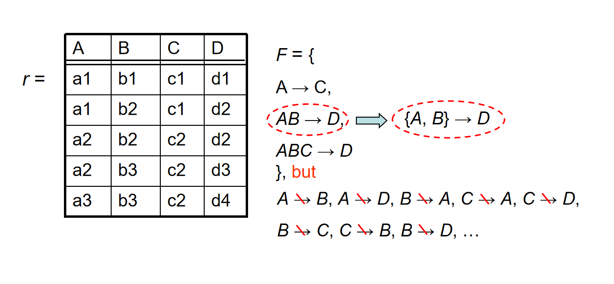

- (2) 在一组合法关系上指定约束 —— 即模式。（如果关系模式 $R$ 上的所有合法关系$r$ 都满足函数依赖集 $F$，则称 $F$在 $R$ 上成立（即 $F$ holds on $R$））

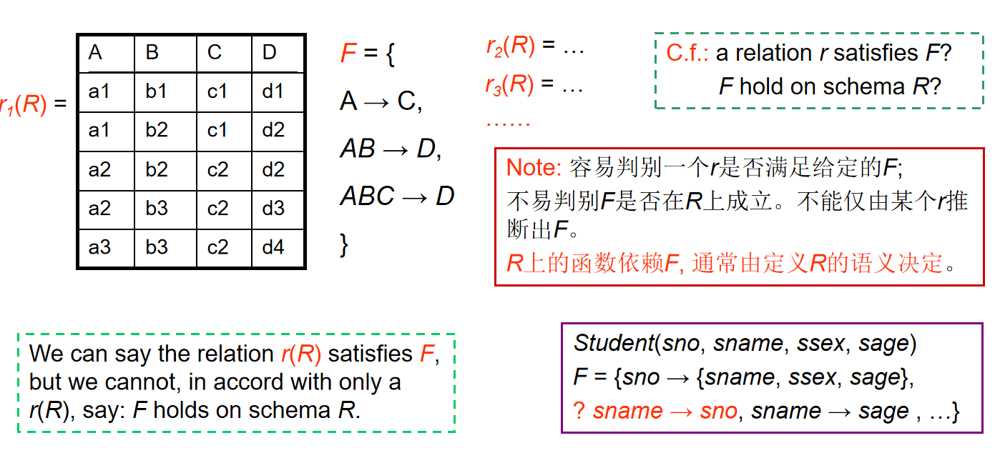

### 平凡函数依赖

如果一个函数依赖在所有关系上都成立，则称它是平凡的。例如：$A \to A$，$AB \to A$

一般来说，若 $\beta \subseteq \alpha$，则 $\alpha \to \beta$ 是平凡的；否则是非平凡的，即：
    
- 平凡依赖：$\alpha \to \beta$，如果 $\beta \subseteq \alpha$
- 非平凡依赖：$\alpha \to \beta$，如果 $\beta \not\subseteq \alpha$

### 函数依赖闭包

给定一个函数依赖集 $F$，存在某些其他函数依赖被 $F$ 逻辑蕴含。

例如：若 $F = \{A \to B, B \to C\}$，则根据 $F$ 可推出 $A \to C$：$A \to C$ 被 $F$ 所逻辑蕴含，即 $F$ 逻辑蕴含 $A \to C$。

定义：被 $F$ 逻辑蕴含的所有函数依赖的集合称为 $F$ 的闭包，记为 $F^+$（函数依赖集 $F$ 的闭包）

例如：$F = \{A \to B, B \to C\}$，则 $F^+ = \{A \to B,\; B \to C,\; A \to C,\; A \to A,\; AB \to A,\; AB \to B,\; AC \to C,\; A \to BC,\; \dots\}$。

Armstrong 公理提供了求 $F^+$ 的推理规则。

我们可以通过应用 Armstrong 公理来找出 $F^+$ 中的所有函数依赖：

- 若 $\beta \subseteq \alpha$，则 $\alpha \to \beta$（**自反律**）—— 平凡依赖

- 若 $\alpha \to \beta$，则 $\gamma \alpha \to \gamma \beta$，$\gamma \alpha \to \beta$（**增补律**）

- 若 $\alpha \to \beta$ 且 $\beta \to \gamma$，则 $\alpha \to \gamma$（**传递律**）

这些规则具有：
- **保真性**（Sound）：只生成实际成立的函数依赖
- **完备性**（Complete）：能生成所有成立的函数依赖

我们可以使用以下附加规则进一步简化 $F^+$ 的手工计算。

- 若 $\alpha \to \beta$ 且 $\alpha \to \gamma$ 成立，则 $\alpha \to \beta\gamma$ 成立（**合并律**）
- 若 $\alpha \to \beta\gamma$ 成立，则 $\alpha \to \beta$ 和 $\alpha \to \gamma$ 成立（**分解律**）
- 若 $\alpha \to \beta$ 且 $\gamma\beta \to \delta$ 成立，则 $\alpha\gamma \to \delta$ 成立（**伪传递律**）

计算 $F^+$ 的过程如下：  
重复执行：  

- 对于 $F^+$ 中的每一个函数依赖 $f$
- 对 $f$ 应用自反律和增补律
- 将得到的函数依赖添加到 $F^+$ 中
- 对于 $F^+$ 中的每一对函数依赖 $f_1$ 和 $f_2$
- 如果 $f_1$ 和 $f_2$ 可以通过传递律组合
- 则将得到的函数依赖添加到 $F^+$ 中
- 直到 $F^+$ 不再发生变化

注意：对于 $n$ 个属性，可能的函数依赖的最大数量为 $2^n \times 2^n$。

### 属性集的闭包

如何测试 $\alpha$ 是否为超键？

- 方法一：首先求出 $F^+$，然后对于 $F^+$ 中的所有 $\alpha \to \beta_i$，检查 $\{ \beta_1, \beta_2, \beta_3, \dots \}$ 是否等于 $R$？但这样计算 $F^+$ 并不容易。
- 方法二：求 $\alpha$ 的闭包。

定义：给定属性集 $\alpha$，在 $F$ 下 $\alpha$ 的闭包记为 $\alpha^+$，它是在 $F$ 下由 $\alpha$ 所直接和间接函数决定的属性的集合。

要测试 $\alpha \to \beta$ 是否属于 $F^+$，只需检查 $\beta \subseteq \alpha^+$。
 
要测试 $\alpha$ 是否为超键，只需检查：$\alpha \to R$ 是否属于 $F^+ \iff R \subseteq \alpha^+$ 

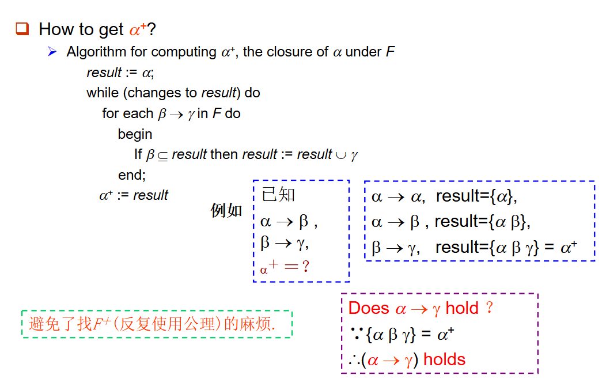

以下是一个通过属性集闭包判断超键的例子：

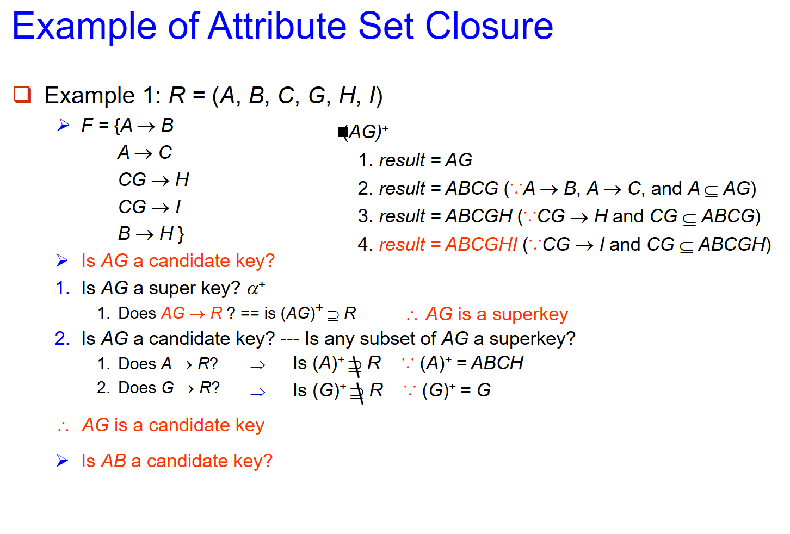

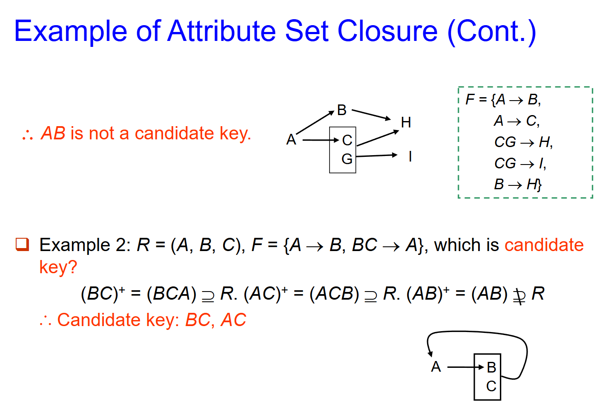

属性集闭包算法有三种用途：

- 测试超键 —— $(\alpha \to R?)$
    - 要测试 $\alpha$ 是否为超键，我们计算 $\alpha^+$，然后检查 $\alpha^+$ 是否包含 $R$ 中的所有属性，即检查 $R \subseteq \alpha^+$ 是否成立。

- 测试函数依赖 —— $(\alpha \to \beta?)$
    - 要检查函数依赖 $\alpha \to \beta$ 是否成立（或者说是否属于 $F^+$），只需检查 $\beta \subseteq \alpha^+$ 是否成立。
    
- 计算 $F$ 的闭包 —— $(F^+ = ?)$
  - 对于每个 $\gamma \subseteq R$，我们求出其闭包 $\gamma^+$，然后对于每个 $S \subseteq \gamma^+$，输出一个函数依赖 $\gamma \to S$，所有这些 $\gamma \to S$ 就构成了 $F^+$。

### 正则覆盖（Canonical Cover）

数据库管理系统应始终进行检查，以确保不违反 $F$ 中的任何函数依赖。如果 $F$ 过大，检查成本会很高。因此，我们需要简化函数依赖集。

直观上讲，$F$ 的正则覆盖（记为 $F_c$）是一个与 $F$ 等价且“最小”的函数依赖集。

它没有冗余的函数依赖，也没有依赖中的冗余部分，即 $F_c$ 中的任何函数依赖都不包含无关属性。

如果 $F$ 中某个函数依赖的一个属性可以被移除而不改变 $F^+$，则该属性是无关的（extraneous）。

无关属性共有三种情况：

(1) 函数依赖集中可能存在冗余的依赖，这些依赖可以从其他依赖中推导出来。

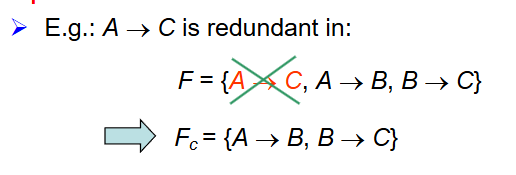

(2)  函数依赖左侧的某些部分可能是冗余的——即无关属性。

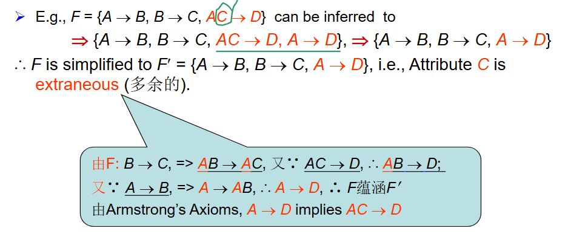

(3)  函数依赖右侧的某些部分可能是冗余的。

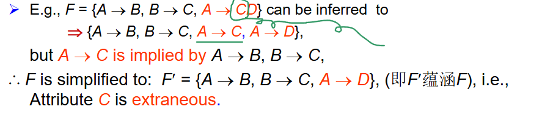

后两种情况的判断比较麻烦，以下是具体讨论：

要消去现有函数依赖 $\alpha \to \beta$ 中的 extraneous（无关的、多余的）属性，无非有 2 种情况：

- (1) **Extraneous** 属性在左边（即 $\alpha$ 中，$\alpha = A\alpha', A\alpha' \to \beta$），
  
- (2) **Extraneous** 属性在右边（即 $\beta$ 中，$\beta = A\beta', A\beta' \to \beta$）。

对于情况(1)，$A\alpha' \to \beta$：如果 $\alpha' \to \beta$ 已经由原来的函数依赖集 $F$ 所蕴涵（即 $F$ 中已经包含了 $\alpha' \to \beta$，或 $F$ 可以推出 $\alpha' \to \beta$），则根据 Armstrong 公理，$\alpha' \to \beta$ 可以推出 $A\alpha' \to \beta$，因此 $A\alpha' \to \beta$ 是多余的（replace $A\alpha' \to \beta$ with $\alpha' \to \beta$），也即 $A$ 是多余的属性。也就是说，如果 $F$ 蕴涵 $F'$，则左属性 $A$ 可删除，只要保留剩余部分就可以了。

对于情况（2），$\alpha \to A\beta'$，等价于 $\{\alpha \to \beta', \alpha \to A\}$，如果 $\alpha \to A$ 可以由其余的函数依赖所蕴涵，则说明 $\alpha \to A$ 多余，即 $\alpha \to A\beta'$ 中的 $A$ 多余，只要保留 $\alpha \to \beta'$ 就可以了。换句话说，如果我们把 $F$ 中去掉 $\alpha \to A$ 之后余下的部分叫 $F'$，即 $F' = (F - \{\alpha \to \beta\}) \cup \{\alpha \to (\beta - A)\}$，则如果 $F'$ 可以推出 $\alpha \to A$，这说明 $\alpha \to A$ 多余，只要保留 $F'$ 就可以了。也就是说，如果 $F'$ 蕴涵 $F$，则右属性 $A$ 可删除。

那我们就可以得出得到一个函数依赖集的正则覆盖的过程：

- 使用合并律将 $F$ 中形如 $\alpha_1 \to \beta_1$ 和 $\alpha_1 \to \beta_2$ 的依赖替换为 $\alpha_1 \to \beta_1\beta_2$
- 找出一个含有无关属性的函数依赖 $\alpha \to \beta$（无关属性可在 $\alpha$ 或 $\beta$ 中）
- 如果找到无关属性，则将其从 $\alpha \to \beta$ 中删除，直到 $F$ 不再变化
- 注意：删除某些无关属性后，合并律可能再次适用，因此需要重新应用合并律。

以下是一个例子：

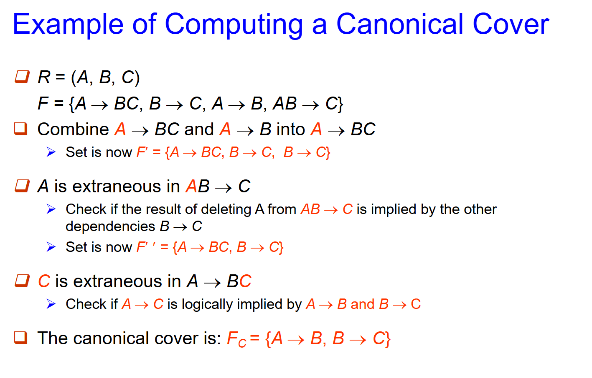

## 无损连接分解

将 $R$ 分解为 $R_1$ 和 $R_2$ 是无损连接分解，当且仅当 $F^+$ 中至少包含以下依赖之一：  

$\{R_1 \cap R_2\} \to R_1$ 或 $\{R_1 \cap R_2\} \to R_2$

即分解后的两个子模式的共同属性必须是 $R_1$ 或 $R_2$ 的码（适用于一分为二的分解）。

如果分解后两个子模式没有共同属性，则肯定为有损连接分解。

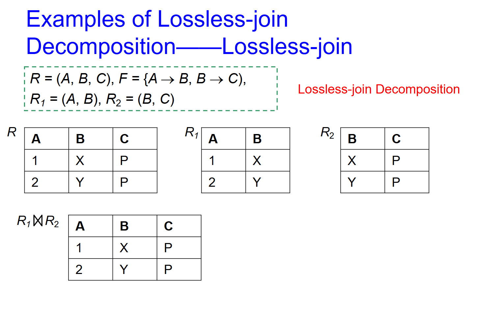

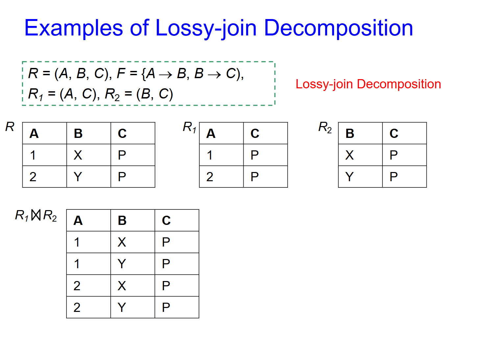 

## 依赖保持

设 $F$ 是模式 $R$ 上的依赖集；设 $R_1, R_2, \dots, R_n$ 是 $R$ 的一个分解。

$F$ 在 $R_i$ 上的限制是指 $F^+$ 中所有仅包含$R_i$ 中属性的函数依赖所构成的集合，记为 $F_i$。

注意，限制的定义使用的是$F^+$ 中的所有依赖，而不仅仅是 $F$ 中的依赖。

如果 $(F_1 \cup F_2 \cup \dots \cup F_n)^+ = F^+$，则称该分解是依赖保持的。

要检查在将 $R$ 分解为 $R_1, R_2, \dots, R_n$ 后依赖 $\alpha \to \beta$ 是否保持，可以使用以下简化测试：

- result = $\alpha$
- while (result 发生变化) do
- for each $R_i$ in the decomposition

$$
t = (\text{result} \cap R_i)^+ \cap R_i 
$$

- result = result $\cup$ t

- 如果 result 包含 $\beta$ 中的所有属性，则函数依赖 $\alpha \to \beta$ 得到保持。

该过程的时间复杂度为多项式时间，而不是计算 $F^+$ 和 $(F_1 \cup F_2 \cup \dots \cup F_n)^+$ 所需的指数时间。

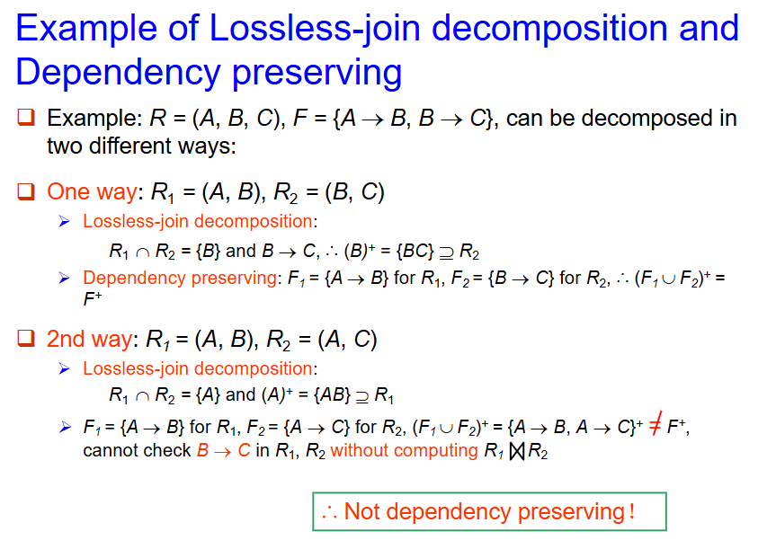

## Boyce-Codd 范式

定义：给定函数依赖集 $F$，关系模式 $R$ 属于 BCNF，当且仅当对于 $F^+$ 中所有形如 $\alpha \to \beta$ 的函数依赖（其中 $\alpha \subseteq R$，$\beta \subseteq R$），至少满足以下条件之一：

- $\alpha \to \beta$ 是平凡的（即 $\beta \subseteq \alpha$）

- $\alpha$是$R$的超键（即$R \subseteq \alpha^+$，且$\alpha \subseteq R$）

对所有 $F^+$ 中的 $\alpha \to \beta$ 均成立。

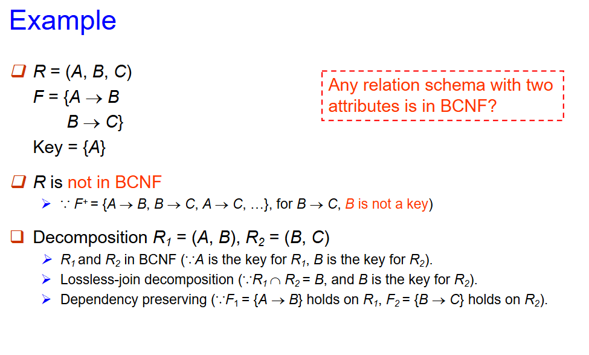

任意只有两个属性的关系模式都属于 BCNF。

要检查非平凡依赖 $\alpha \to \beta$ 是否违反 BCNF：

- 计算 $\alpha^+$（$\alpha$ 的属性闭包），然后
  
- 验证 $\alpha^+$ 是否包含 $R$ 的所有属性，即 $\alpha$ 是否为 $R$ 的超键。

要检查关系模式 $R$ 是否属于 BCNF，只需检查给定依赖集 $F$ 中的依赖是否违反 BCNF，而不必检查 $F^+$ 中的所有依赖。

如果 $F$ 中没有依赖导致违反 BCNF，那么 $F^+$ 中也不会有任何依赖导致违反 BCNF。（$F^+$是由Armstrong的3个公理从$F$推出的, 而任何公理都不会使Functional Dependency (FD)左边变小(拆分), 故如果$F$中没有违反BCNF的FD (即左边是superkey), 则$F^+$中也不会. ）

然而，仅使用 $F$ 来测试 BCNF 在检查分解后的关系 $R_i$ 时可能不正确。（可在 $F$ 下判别 $R$ 是否违反 BCNF，但必须在 $F^+$ 下判别 $R$ 的分解式是否违反 BCNF。）

对于 $R_i$ 中的每一个属性子集 $\alpha$，我们可以检查 $\alpha^+$（在 $F$ 下 $\alpha$ 的属性闭包）来测试BCNF，要么不包含 $R_i - \alpha$ 中的任何属性，要么包含 $R_i$ 的所有属性。

若一个关系模式 $R$ 不是 BCNF，我们需要对它进行分解，直到它属于 BCNF。以下是分解的过程：

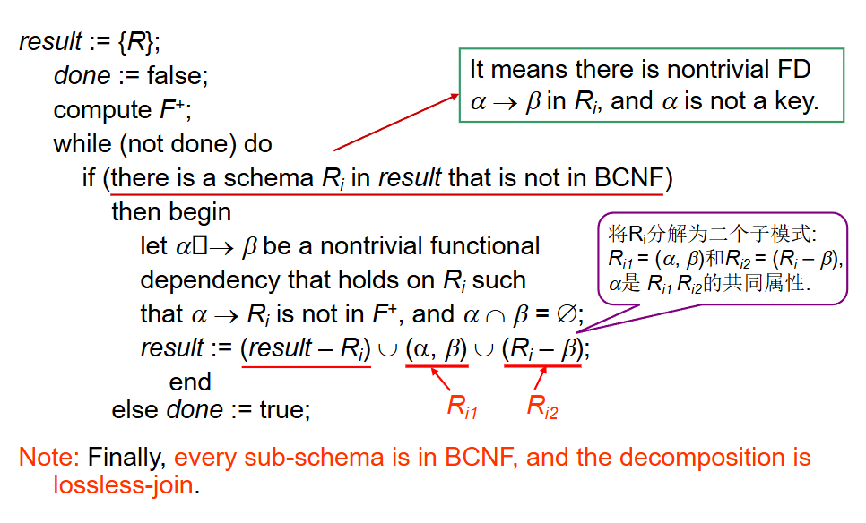

以下是一个分解的例子

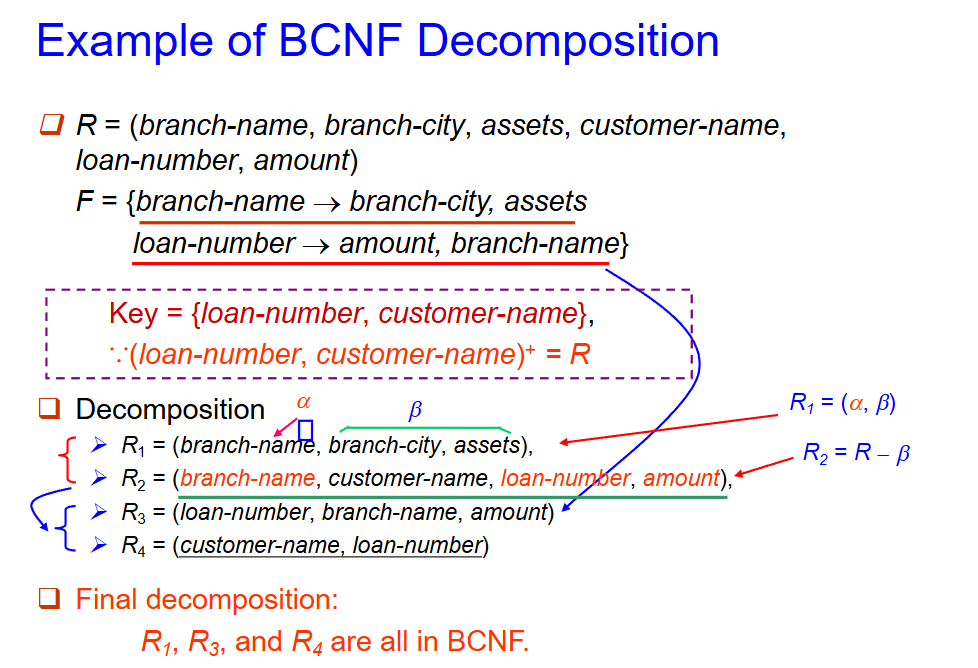

我们并不总是能得到既满足 BCNF 又保持依赖的分解。如下例：

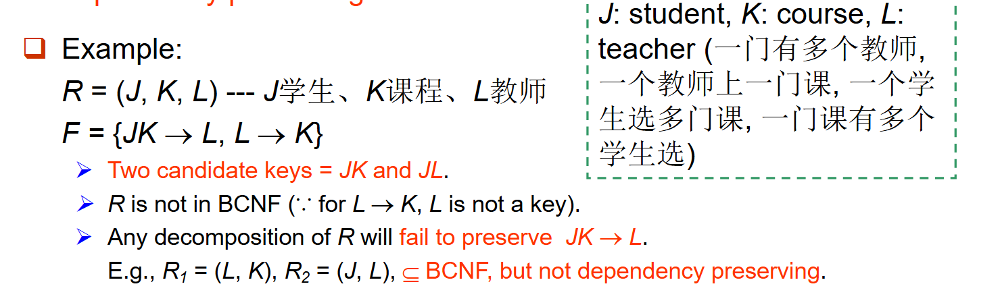

因此，我们无法总是同时满足以下三个设计目标：无损连接，依赖保持，BCNF。

## 第三范式

我们引入一种更弱的范式，称为第三范式（Third Normal Form，3NF）。

它允许一定程度的冗余，但总是存在一个无损连接且依赖保持的 3NF 分解。

定义：关系模式 $R$ 属于第三范式（3NF），如果对于 $F^+$ 中的所有 $\alpha \to \beta$，至少满足以下条件之一：

- $\alpha \to \beta$ 是平凡的（即 $\beta \subseteq \alpha$）。
- $\alpha$ 是 $R$ 的超键。
- $\beta - \alpha$ 中的每个属性 $A$ 都包含在 $R$ 的某个候选键中（即 $A \in \beta - \alpha$ 是主属性；若 $\alpha \cap \beta = \emptyset$，则 $A = \beta$ 是主属性）。（注意：每个属性可能包含在不同的候选键中。）

如果一个关系属于 BCNF，则它也属于 3NF（因为 BCNF 中必须满足上述前两个条件之一）。

第三个条件是对 BCNF 的最小放松，以保证依赖保持。

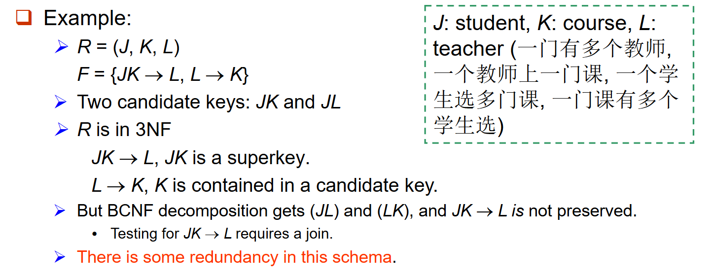

一个属于 3NF 但不属于 BCNF 的模式可能存在信息重复的问题（例如关系 $l_1, k_1$），并且可能需要使用空值（例如表示关系 $l_2, k_2$ 时，如果没有对应的 $J$ 值）。

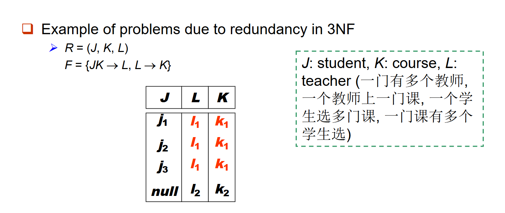

同样的，我们在第三范式的判断中，只需检查 $F$ 中的函数依赖，无需检查 $F^+$ 中的所有函数依赖。

要检查一个关系模式是否属于 3NF：

- 使用属性闭包来检查每个依赖 $\alpha \to \beta$，判断 $\alpha$ 是否为超键。

- 如果 $\alpha$ 不是超键，则必须验证 $\beta$ 中的每个属性是否都包含在 $R$ 的某个候选键中。
    - 这一测试代价较高，因为它涉及找出所有候选键。
    - 测试 3NF 已被证明是 NP 难的。（但有趣的是分解为第三范式（见后）可以在多项式时间内完成）。

以下是将一个关系模式分解为 3NF 的过程：

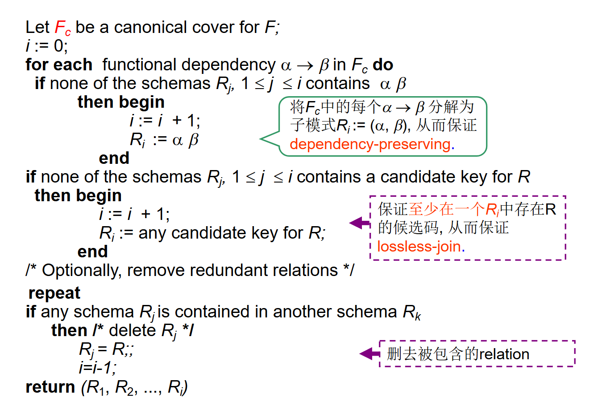

以下是一个分解的例子：

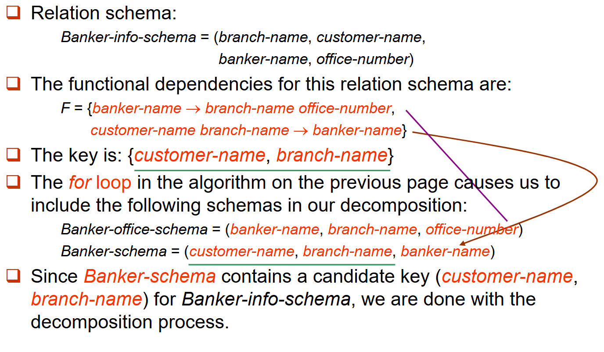

对于任意一个关系模式 $R$，总是可以将它分解为属于 3NF 的关系，并且满足无损分解和依赖保持。但对于BCNF的分解，分解只能保证无损分解，而不能保证依赖保持。

在关系库设计中，我们的目标是同时满足：BCNF，无损连接，依赖保持。但如果无法同时实现这些目标，我们则接受以下之一：缺乏依赖保持，或因使用 3NF 而导致的冗余。

## 多值依赖

定义：设 $R$ 为关系模式，且 $\alpha \subseteq R$，$\beta \subseteq R$。多值依赖$\alpha \rightarrow\!\!\rightarrow \beta$在 $R$ 上成立，如果对于任意合法关系 $r(R)$，以及 $r$ 中任意一对满足 $t_1[\alpha] = t_2[\alpha]$ 的元组 $t_1, t_2$，在 $r$ 中一定存在元组 $t_3$ 和 $t_4$，使得：

$$
t_1[\alpha] = t_2[\alpha] = t_3[\alpha] = t_4[\alpha]
$$

$$
t_3[\beta] = t_1[\beta]
$$

$$
t_4[\beta] = t_2[\beta]
$$

$$
t_3[R - \alpha - \beta] = t_2[R - \alpha - \beta]
$$

$$
t_4[R - \alpha - \beta] = t_1[R - \alpha - \beta]
$$

令 $R - \alpha - \beta = z$，则：

$$
t_3[z] = t_2[z]
$$

$$
t_4[z] = t_1[z]
$$

直观的理解就是给定$\alpha$的值，$\beta$的取值集合与$z$的取值集合相互独立，即$\alpha$决定了$\beta$的一组值，而这组值与$z$ 的值无关。

多值依赖表示的是"独立变化"的概念。当$X→→Y$时，意味着$Y$的取值与$Z$的取值是独立的，仅由$X$决定。

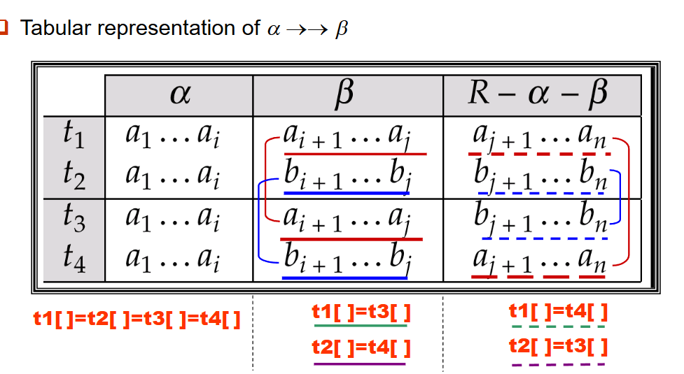

如果$\alpha \rightarrow\!\!\rightarrow \beta$在 $R$ 上成立，则$\alpha \rightarrow\!\!\rightarrow R - \alpha - \beta$也成立。

多值依赖有以下性质：

- 互补性/对称性：如果 $X \rightarrow\!\!\rightarrow Y$，则 $X \rightarrow\!\!\rightarrow (U - X - Y)$
- 自反性：如果 $Y \subseteq X$，则 $X \rightarrow\!\!\rightarrow Y$
- 增广性：如果 $X \rightarrow\!\!\rightarrow Y$ 且 $V \subseteq W$，则 $WX \rightarrow\!\!\rightarrow VY$
- 传递性：如果 $X \rightarrow\!\!\rightarrow Y$ 且 $Y \rightarrow\!\!\rightarrow Z$，则 $X \rightarrow\!\!\rightarrow (Z - Y)$

若 $\alpha \to \beta$（函数依赖），则 $\alpha \rightarrow\!\!\rightarrow \beta$（多值依赖）成立（当 $R - \alpha - \beta = \emptyset$，即 $\alpha \cup \beta = R$ 时），也就是说，每个函数依赖同时也是多值依赖。所有函数依赖都是多值依赖的特例，多值依赖描述的是更一般的独立性关系。

$D$ 的闭包 $D^+$ 是由 $D$ 逻辑蕴含的所有函数依赖和多值依赖的集合。
  

## 第四范式

给定函数依赖和多值依赖的集合 $D$，关系模式 $R$ 属于第四范式（4NF），如果对于 $D^+$ 中所有形如 $\alpha \rightarrow\!\!\rightarrow \beta$ 的多值依赖（其中 $\alpha \subseteq R$，$\beta \subseteq R$），至少满足以下条件之一：

- $\alpha \rightarrow\!\!\rightarrow \beta$ 是平凡的（即 $\beta \subseteq \alpha$ 或 $\alpha \cup \beta = R$）
- $\alpha$ 是模式 $R$ 的超键

如果一个关系属于 4NF，则它也属于 BCNF。

$D$ 在 $R_i$ 上的限制是集合 $D_i$，包含：
  
- $D^+$ 中所有只包含 $R_i$ 属性的函数依赖。
- 所有形如 $\alpha \to (\beta \cap R_i)$ 的多值依赖（其中 $\alpha \subseteq R_i$ 且 $\alpha \to \beta$ 属于 $D^+$）。

以下是将一个关系模式分解为 4NF 的过程：

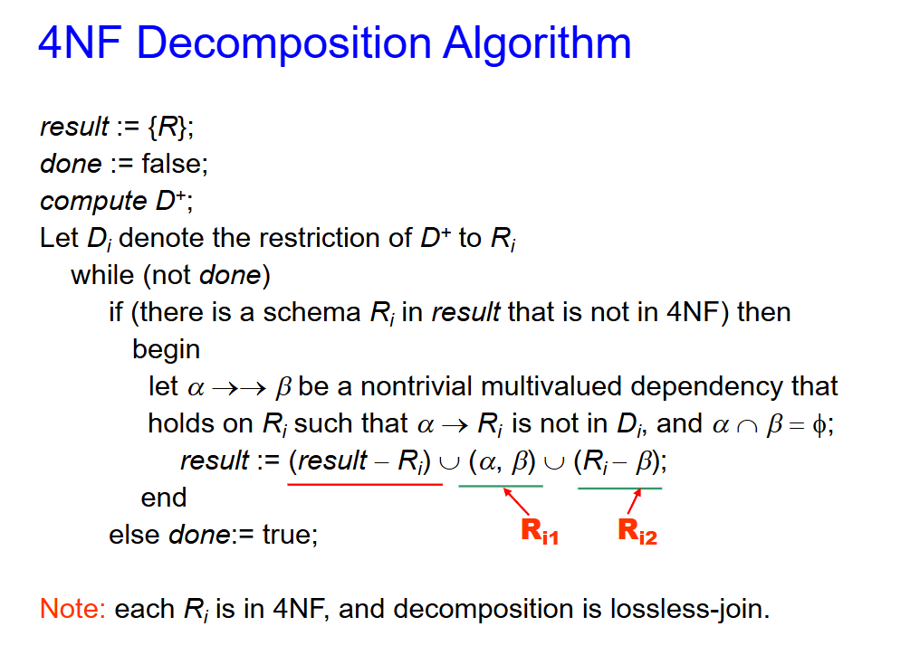