# 存储和文件结构

## 物理存储介质的分类

存储介质可按以下标准分类：

- 数据访问的速度
- 单位数据的成本
- 可靠性
    - 电源故障或系统崩溃时的数据丢失
    - 存储设备的物理故障（RAID）

我们按可靠性分类：
- 易失性存储：断电时内容丢失，例如 DDR2、SDR。
- 非易失性存储：即使断电内容仍然存在。包括二级和三级存储，以及电池备份的主存。

我们按速度分类：

- 高速缓存
- 主存
- 闪存（快闪存储器）
- 磁盘
- 光存储
- 磁带存储

## 物理存储介质

**高速缓存**：最快且最昂贵的存储形式，易失性，由计算机系统硬件管理。读取速度：≤ 0.5 纳秒
，容量：约 KB ~ MB。

**主存**：访问速度快（10 到 100 ns），通常太小（或太贵）而无法存储整个数据库，目前广泛使用的容量可达几 GB。  
但主存的容量不断提升，每字节成本持续快速下降（大约每 2 到 3 年翻一倍）。  
主存也有易失性，断电后内容丢失。

**闪存（Flash memory）**：也称为 EEPROM（电可擦可编程只读存储器），数据只能在某个位置写入一次，但该位置可以被擦除并重新写入。  
闪存仅能支持有限次（1万到100万次）的写入/擦除周期且擦除操作必须针对整个存储块进行。  
闪存的读取速度大致与主存相当（< 100ns），但写入速度较慢（约 10μs），擦除更慢。  
闪存的每单位存储成本与主存大致相当。  
闪存断电时数据仍然存在。  
闪存广泛用于嵌入式设备，如数码相机、手机和 U 盘。

**磁盘**：数据存储在旋转的盘片上，通过磁性方式进行读写。访问数据时必须将数据从磁盘移至主存，写回时也要存回磁盘。  
它是长期存储数据的主要介质，通常存储整个数据库。  
磁盘的访问速度远慢于主存（后续会详细介绍）。  
磁盘与磁带不同，它可以按任意顺序读取磁盘上的数据，即支持随机访问。  
磁盘的容量通常为几 TB，它比主存/闪存容量大得多，每字节成本也更低。  
电源故障和系统崩溃时数据仍能保留，磁盘故障可能破坏数据，但非常罕见。

**光盘**：使用激光从旋转的盘片上光学读取数据。  
一次写入多次读取（WORM）光盘用于归档存储（CD-R 和 DVD-R），也有多种可重写版本（CD-RW、DVD-RW 和 DVD-RAM）。  
光盘的读写速度比磁盘慢。  
光盘的容量通常为几 GB，比磁盘容量小得多。  
光盘也有非易失性。

**磁带**：磁带只能支持顺序访问，数据只能从头到尾依次读取。这就使它的读写速度比磁盘慢得多。   
磁带的容量非常高，可达几 TB。  
磁带可从驱动器中取出，存储成本远低于磁盘，但驱动器昂贵。    
磁带也有非易失性，主要用于备份（以从磁盘故障中恢复）以及归档数据。

我们把上述的物理存储器分为三级：

- 主存储器：速度最快的介质，但易失（高速缓存、主存）。

- 辅助存储器（辅助存储器，联机存储器）：层次中的下一级，非易失，访问速度适中（例如：闪存、磁盘）。

- 三级存储器（三级存储器，脱机存储器）：层次中的最低级，非易失，访问速度慢（磁带、光存储）

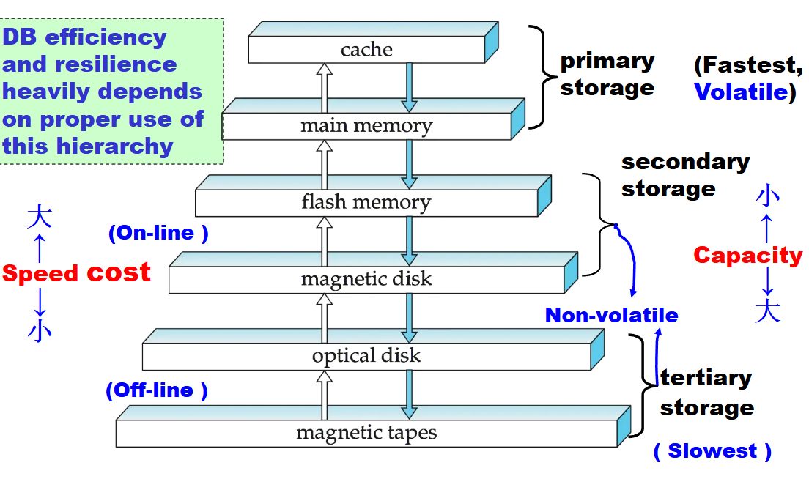

## 磁盘结构

磁盘的结构由读写头和盘片组成。

读写头非常靠近盘片表面，可以将盘片旋转到不同的位置，从而读写不同位置的数据。

盘片由多个磁道组成，典型硬盘每个盘片有超过 5 万至 10 万个磁道；每个磁道由多个扇区组成，每磁道典型扇区数：内圈 500 到 1000 个，外圈 1000 到 2000 个。

扇区是能够读写的最小数据单元，扇区大小通常为 512 字节。

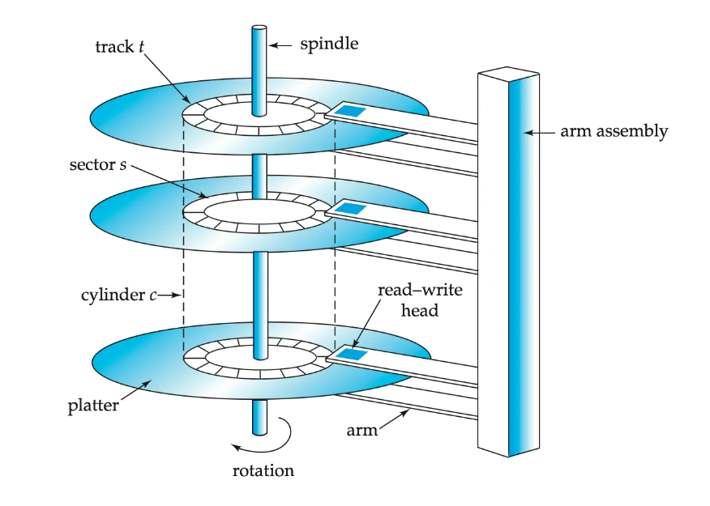

### 磁盘控制器

磁盘控制器是计算机系统与磁盘驱动器硬件之间的接口。  

它接收读或写扇区的高级命令，启动诸如将磁盘臂移动到正确磁道以及实际读取或写入数据等操作。  

磁盘控制器计算并为每个扇区附加校验和，以验证数据被正确读回。如果数据损坏，存储的校验和与重新计算的校验和极大概率不匹配。

一般磁盘控制器会通过写入后读回扇区来确保写入成功（“写后读”机制）。

磁盘控制器还可以执行坏扇区的重映射（将该扇区从逻辑上映射到预留的物理扇区，并且重映射被记录在磁盘或其他非易失性存储器中）。

多个磁盘通过控制器连接到计算机系统。控制器的功能（校验和、坏扇区重映射）通常由单个磁盘执行；从而减少控制器的负载。

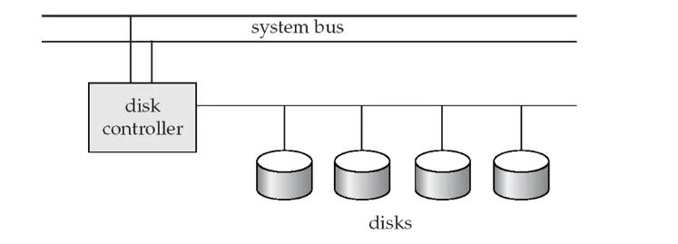

磁盘的接口有很多标准，如ATA（AT 适配器）、SATA（串行 ATA）、SCSI（小型计算机系统接口）、SAS（串行连接 SCSI），每种标准都有若干变体（不同的速度和能力）。

### 磁盘的性能

磁盘的性能主要与访问时间和数据传输速率有关。

访问时间：从发出读或写请求到数据传输开始所花费的时间 （= 寻道时间 + 旋转等待时间）。

寻道时间：将磁臂重新定位到正确磁道所需的时间（典型磁盘为 4 到 10 毫秒）。

旋转等待时间：待访问的扇区旋转到磁头下方所需的时间（典型磁盘为 4 到 11 毫秒（5400 到 15000 转/分钟）），平均等待时间是最坏情况等待时间的 1/2。

数据传输率是指磁盘每秒钟传输的字节数。最大速率为每秒 25 到 100 MB，内圈磁道较低。

多个磁盘可能共享一个控制器，因此控制器的处理速率也很重要。

数据以块为单位在磁盘和主存之间传输，大小范围从512字节到几千字节。块越小，磁盘传输次数越多；块越大，因块未填满而浪费的空间越多。当今典型的块大小范围为4到16千字节。

目前对磁盘上的数据的访问模式有两种：顺序访问和随机访问。

顺序访问：连续的请求访问的是连续的磁盘块，仅第一个块需要磁盘寻道。

随机访问：连续的请求访问的是磁盘上任意位置的块，每次访问都需要一次寻道，传输速率低，因为大量时间浪费在寻道上。

每秒I/O操作数（IOPS）是衡量磁盘性能的重要指标，它指磁盘每秒能支持的随机块读取次数。当前一代磁记录磁盘的IOPS为50到200。

平均故障时间（MTTF）：磁盘预计无任何故障连续运行的平均时间。（通常为3到5年），MTTF随磁盘老化而降低。

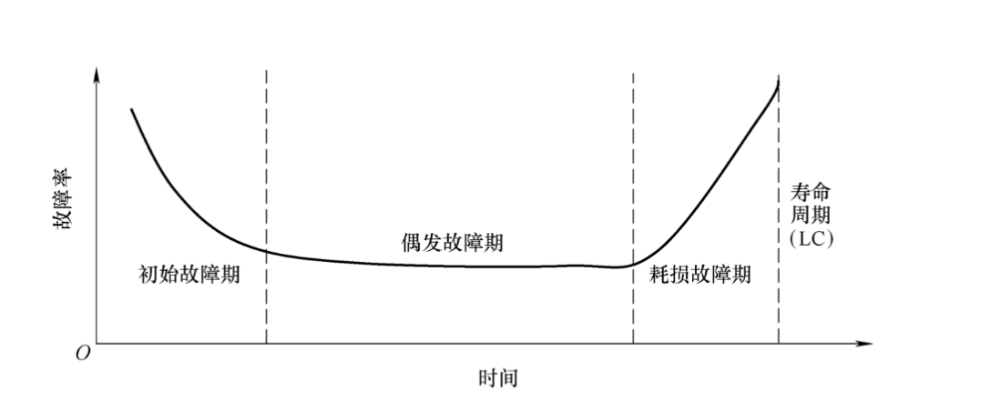

### 磁盘的性能优化

我们可以对磁盘的块访问进行优化，以下是一些常见的优化方式：

- 缓冲：使用内存中的缓冲区来缓存磁盘块
- 预读（预取）：从一个磁道中读取额外的块，预期这些块很快会被请求（空间局部性）。
- 磁盘臂调度算法：对待处理的磁道访问请求进行排序，以最小化磁盘臂的移动。
    - 电梯算法：将磁盘臂沿一个方向移动（从外圈磁道到内圈磁道或反之），处理该方向上的下一个请求，直到该方向上没有更多请求，然后反转方向并重复。
- 文件组织：通过按数据访问方式来组织数据块，以优化块的访问时间。（例如：将相关信息存储在同一个柱面或相邻的柱面上。）
    - 文件随着时间推移可能会变得碎片化，如当文件中有数据插入或删除时，顺序访问一个碎片化的文件会导致磁盘臂移动增加，某些系统提供了用于对文件系统进行去碎片化的实用工具，以加快文件访问速度。
- 非易失性写缓冲区：通过将块立即写入非易失性RAM缓冲区来加速磁盘写入。非易失性RAM即电池供电的RAM或闪存，即使断电，数据也是安全的，并在恢复供电后写入磁盘。
    - 数据在写入非易失性写缓冲区后，控制器会在磁盘没有其他请求或某个请求已等待一段时间时，才将数据写入磁盘。
    - 一些需要数据安全存储后才能继续执行的数据库操作，无需等待数据写入磁盘即可继续执行。
    - 利用缓冲区，我们还可以重新排序写入操作，以最小化磁盘臂移动。

- 日志磁盘：专门用于顺序写入块更新日志的磁盘，使用方式与非易失性RAM完全相同。
    - 由于文件系统通常会重新排序写入磁盘的操作以提高性能。有日志的文件系统可以将数据按安全顺序写入非易失性RAM或日志磁盘。而无日志情况下对写入数据进行重排序可能会导致文件系统的数据损坏。

## 文件记录

数据库以文件的集合形式存储。每个文件是一个记录的序列。每条记录是一个字段的序列。

有两种记录的类型：定长记录和变长记录。

### 定长记录
每个记录的长度相同。

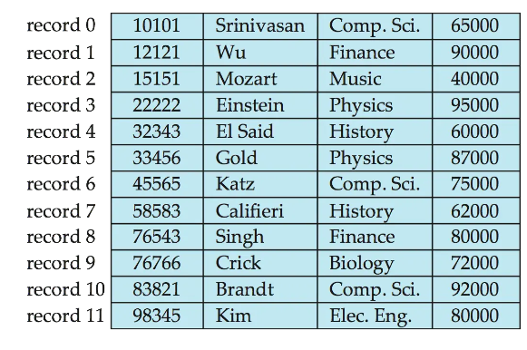

优点：方法简单：将记录 $i$ 存储在从字节 $n * (i - 1)$ 开始的位置，其中 $n$是每条记录的大小。

在删除时可能会比较麻烦，如删除记录$i$：

- 方法1：将记录 $i + 1, \ldots, n$  移动到$i, \ldots, n - 1$
- 方法2：将记录 $n$ 移动到 $i$
- 方法3：不移动记录，而是将所有空闲记录链接成一个空闲链表（将第一条已删除记录的地址存储在文件头部（还有其它信息），使用这条记录存储第二条已删除记录的地址，依此类推。这样提升了空间利用率。）

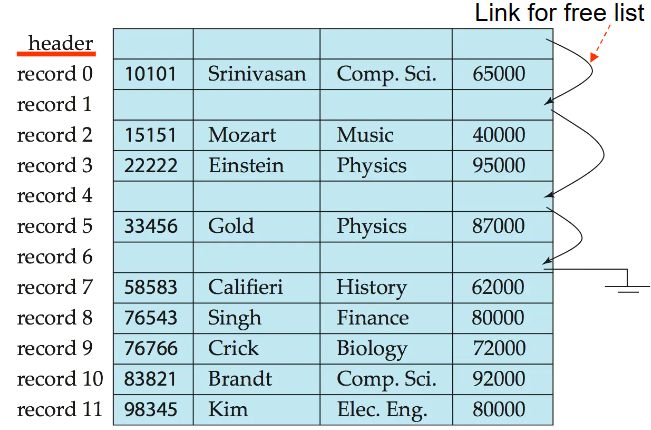

### 变长记录

数据库系统中出现变长记录的方式有以下几种：

- 在文件中存储多种记录类型
- 记录类型允许一个或多个字段具有可变长度，例如字符串（varchar）
- 记录类型允许重复字段（在某些较旧的数据模型中使用）

属性是按顺序存储。变长属性的存储分为两部分，一部分是一个固定大小的（偏移量，长度）的标签，一部分是实际数据。标签通常和定长属性一起按顺序存储，而实际数据的存储则在所有定长属性和标签之后。

空值由空值位图（Null bitmap）表示。如下空值位图有0000四个bit，表示四个属性是否有空值。

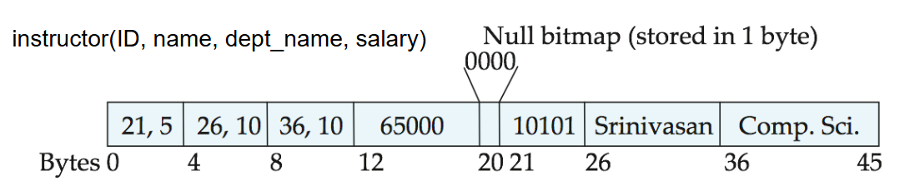

#### 带槽位页结构
带槽位页结构是一种存储变长记录的文件组织形式。

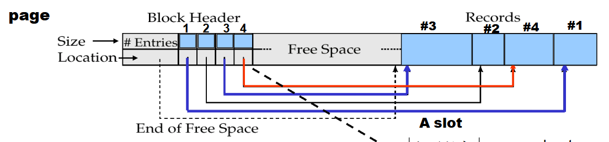

带槽位页的头部记录当前页的条目数量，页中的空闲空间末尾，以及一些对应记录的槽位，槽位中存储每条记录的位置（指针），以及每条记录的大小。

带槽位页可以使记录可以在页内移动，以保持它们连续且之间没有空穴（页内碎片），在移动后需要更新槽位。

带槽位页中存储的记录的指针不用直接指向记录本身，而指向头部中该记录的条目（槽位）即可。（间接指针）

## 文件组织

文件中记录的组织方式有很多种，如Heap、Sequential、B+-tree、Hashing等。

### Heap文件组织

在堆文件组织中，记录可以放置在文件中有空闲空间的任何位置，记录一旦分配通常不会移动。

在堆文件组织中，能够高效地找到文件内的空闲空间非常重要。我们一般使用空闲空间图的形式来进行映射。

在空闲空间图中，每个块对应一个条目的数组。每个条目占几个比特到一个字节，记录该块中空闲空间的比例。

在下面的例子中，每个块用3个比特表示，数值除以8表示该块的空闲比例。

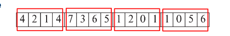

可以存在第二级空闲空间映射，在下面的例子中，每个条目存储第一级空闲空间映射中连续4个条目的最大值。

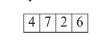

### 顺序文件组织

文件中的记录按某个搜索键排序，适用于需要顺序处理整个文件的应用程序。

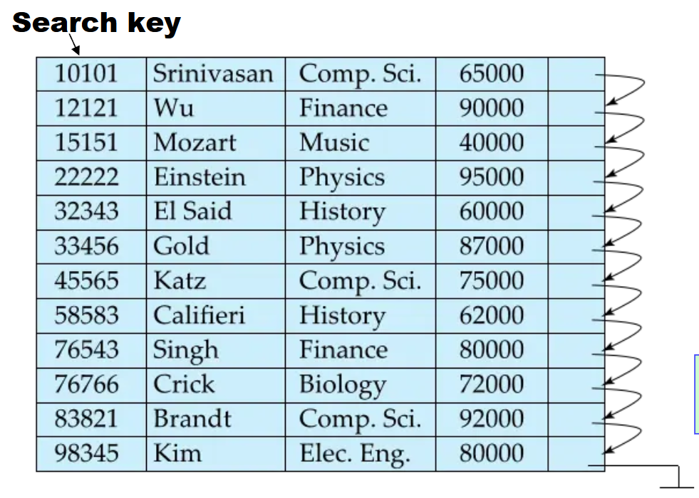

删除记录时，我们使用指针链。

插入时，如果有空闲空间，则插入其中；如果没有空闲空间，则将记录插入溢出块中。无论哪种情况，都必须更新指针链。

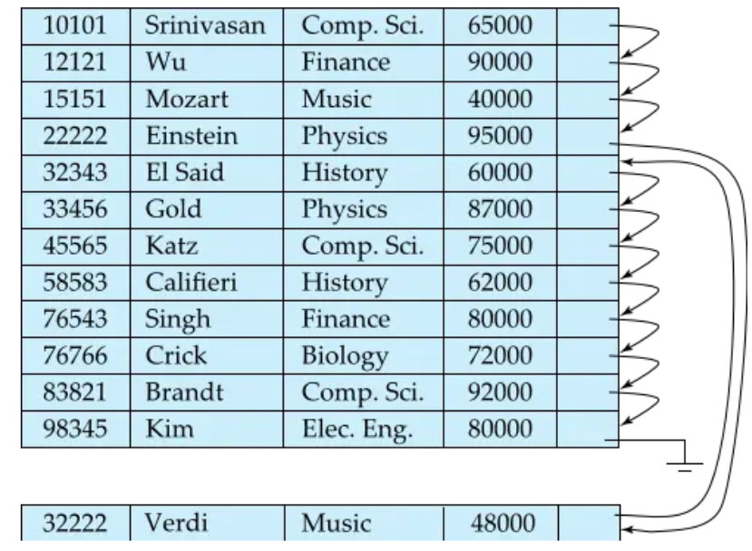

对于顺序文件组织，我们需要定期对文件重新组织，以恢复顺序排列。

### 多表聚簇文件组织

多表聚簇文件组织是一种将多个表聚集在一起的存储方式。

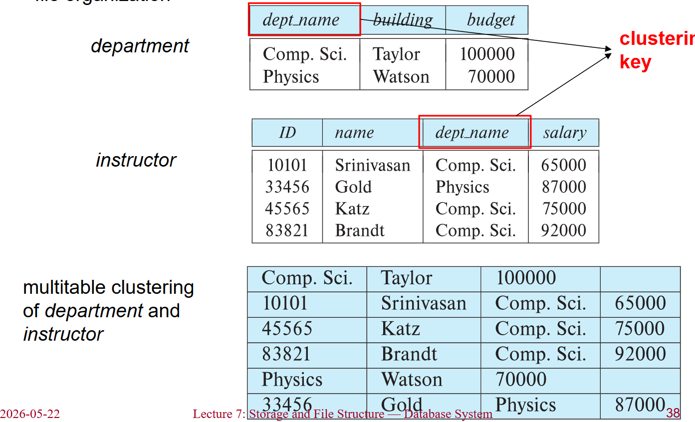

可以添加指针链来链接特定关系的记录。

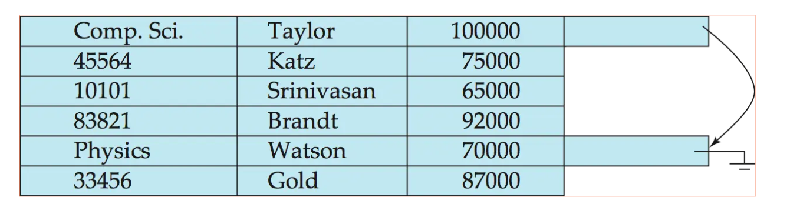

### 表分区

我们可以将一个关系中的记录划分成更小的关系，分别存储。

通过对表进行分区，可以降低某些操作的开销，如空闲空间管理；还可以允许将不同分区存储在不同的存储设备上。

## 数据字典存储

数据字典（也称为系统目录）存储元数据，即关于数据的数据，例如：

- 关于关系的信息：关系的名称、每个关系的属性名称和类型、视图的名称和定义、完整性约束等等
- 用户和账户信息：包括密码、权限、角色等
- 统计和描述性数据：如每个关系中的元组数
- 物理文件组织信息：关系的存储方式（顺序/哈希/...）、关系的物理位置。
- 关于索引的信息（见下一章）

## 存储访问

数据库文件在逻辑上被划分为固定长度的存储单元，即块（block）。块是数据库系统中存储分配和数据传输的单位。

缓冲区：即主存中用于存放磁盘块副本的部分。

数据库系统力求最小化磁盘与内存之间的块传输次数。减少磁盘访问次数的方法即在主存中保留尽可能多的块——即使用缓冲区。但缓冲区大小是有限的，因此需要合理地分配缓冲区。

缓冲区管理器：负责在主存中分配缓冲区空间的子系统。

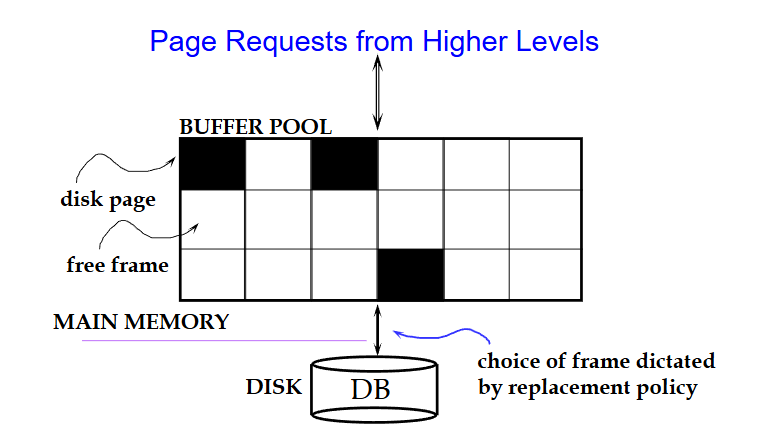

应用程序在需要从磁盘读取块时，会调用缓冲区管理器：
- 如果块已经在缓冲区中，则将块在主存中的地址返回给请求程序
- 如果块不在缓冲区中：
    - 缓冲区管理器在缓冲区中为该块分配空间，替换（丢弃）一些旧页；如果没有空闲空间，则腾出空间给新块。
    - 被丢弃的块仅当自上次写入或从磁盘读取以来被修改过时，才写回磁盘。
    - 在缓冲区中分配好空间后，缓冲区管理器将块从磁盘读入缓冲区，并将块在主存中的地址传递给请求者。

在选择替换的块时，缓冲区管理器首先应该确定能被替换的块。有些不允许写回磁盘的内存块（例如当前块正在被使用时）我们称其为Pinned block。

若有些页被多次请求（被多个事务使用），我们可以使用钉计数（pin count），只有当钉计数=0时，页才可作为替换候选。

块置换算法有很多，如：

- LRU策略（最近最少使用策略）：替换最近最少使用的块。
- MRU策略（最近最常用策略）：系统必须钉住当前正在处理的块。在该块的最后一个元组处理完毕后，该块被解钉，并成为最近最常用的块。

