# 索引和哈希

## 索引的定义

一个索引文件由如下形式的记录（称为索引项）组成：

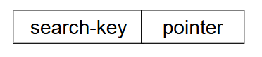

查找键（search key）用于在文件中查找记录的属性或属性集。

索引文件通常比原文件小得多。

索引文件中索引记录如何组织，取决于索引类型。索引类型有两种：

- 顺序索引：查找键（索引项）按排序顺序存储
- 散列索引：查找键（索引项）使用“散列函数”均匀分布到“桶”中

索引有很多评估度量标准：

- 能够高效支持的访问类型，如：属性具有指定值的记录，或属性值落在指定范围内的记录。
- 访问/插入/删除时间
- 空间开销

时间效率和空间效率是衡量索引技术最主要的指标，也是数据库系统组织和管理技术关注的焦点之一。

## 顺序索引

在顺序索引中，索引项按查找键值的排序顺序存储，例如图书馆中的作者目录。

顺序排序文件：文件中的记录（数据文件）按照某个查找键排序。

### 主索引和辅助索引

主索引（primary index）：如果我们在数据文件上建立一个索引，并且这个索引的查找键恰好等于数据文件自己物理排序所依据的那个键，那么这个索引就叫做主索引。

主索引也称为聚集索引（clustered index），主索引的查找键通常（但不一定）是主码。

索引顺序文件：带有主索引的顺序排序文件。

辅助索引（secondary index）：其查找键指定的顺序与文件的顺序排序不同的索引。也称为非聚集索引。

### 稠密索引和稀疏索引

顺序索引又有两种类型：稠密索引和稀疏索引。

稠密索引：对于文件中的每一个查找键值，都会出现一个索引项。

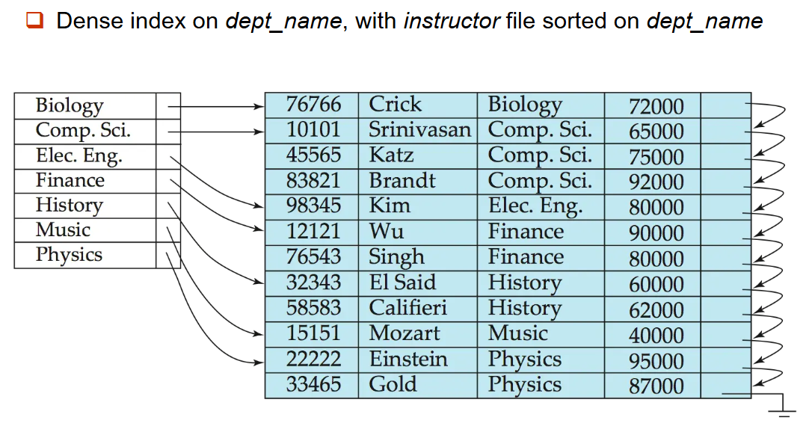

稀疏索引:仅对部分查找键值包含索引项。（通常，每个数据块对应一个索引项，一个块包含若干条有序的数据记录），仅当数据文件记录按查找键顺序排序时才适用。

如果要定位查找键值为 $K$ 的记录：

- 找到索引记录中最大的查找键值$<K$
- 从该索引项指向的记录开始，顺序扫描文件

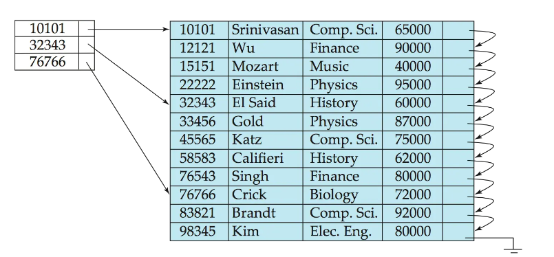

与稠密索引相比，稀疏索引空间更小，插入和删除的维护开销更少。但定位记录通常比稠密索引慢。

稀疏索引只能用于顺序文件，而稠密索引可以用于顺序和非顺序文件，如构成索引无序文件。

在辅助索引中，索引记录指向一个桶，该桶包含指向具有该特定查找键值的所有实际记录的指针。辅助索引必须是稠密的。

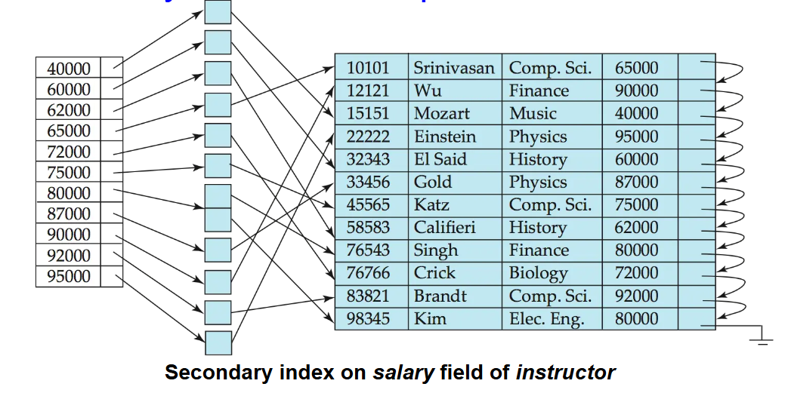

使用主索引的顺序扫描是高效的，但使用辅助索引的顺序扫描代价高昂。

### 多级索引

如果主索引太大而无法放入内存，访问就会变得昂贵。  
为了减少对索引记录的磁盘访问次数，将磁盘上的主索引视为一个顺序文件，并在此基础上构建一个稀疏索引。（把内层索引文件看作顺序数据文件一样，在其上建立外层的稀疏索引），从而构建一个多级索引。

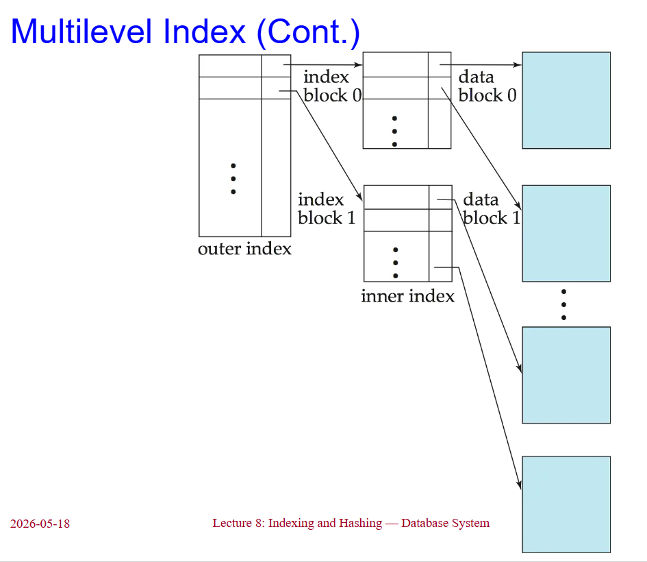

### 索引删除

步骤1：系统在数据文件中找到该记录，然后删除该记录。  
步骤2：更新索引文件。

对于稠密索引：

- 如果被删除的记录是拥有其特定查找键值的唯一记录，则从索引文件中删除相应的索引项。（单记录，即查找键具有唯一性）

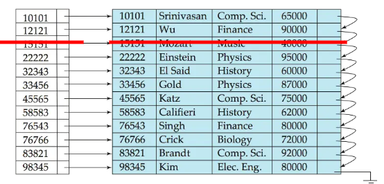

- 否则（多条记录，即查找键不具有唯一性），如果索引项中有多个指针指向具有相同查找键值的所有记录，则从索引项中删除指向被删除记录的指针。（对应辅助索引的情况）

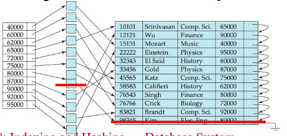

- 否则（对应主索引），如果被删除的记录是指向的第一个记录，则将指针改为指向下一条记录。

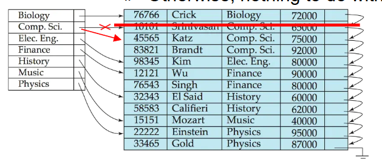

- 否则，不对索引项做任何操作。

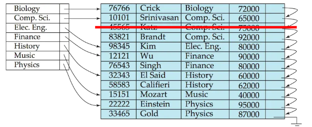

对于稀疏索引：

- 如果被删除记录的查找键值在索引中没有出现，则无需对索引做任何操作。

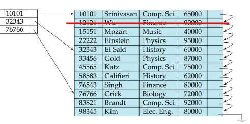

- 否则，如果索引文件中存在该查找键的索引项，则通过将该条目替换为数据文件中下一个查找键值（按查找键顺序）来删除它。
- 如果下一个查找键值已经有一个索引项，则直接删除该索引项，而不进行替换。

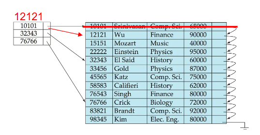

对于多级索引：由底层逐级向上层扩展，每一层的处理过程与上述单层索引情况下类似。

### 索引插入

对于稠密索引：

- 如果索引中不存在该查找键值，则插入一条包含该查找键值的索引项。
- 否则，如果是多指针的情况，则在索引项中添加一个指向新记录的指针。
- 否则，不对索引项做任何操作。

对于稀疏索引：

- 如果创建了新块，则将该新块中出现的第一个查找键值插入索引。
- 如果新记录是其所在块中查找键值最小的记录，则更新索引项。
- 否则，不对索引做任何修改。

## B+树索引

索引顺序文件有缺点。随着文件增长，性能会下降，因为会产生许多溢出块。所以需要对整个文件进行周期性重组。

B⁺树索引是索引顺序文件的一种替代方案。它在 面对插入和删除操作时，能够通过微小的局部变更自动重组自身。无需重组整个文件即可维持性能。

但B⁺树索引需要额外的插入和删除开销以及空间开销。

### B+树的定义（可见——高级数据结构与算法分析）
一棵 B⁺树是满足以下性质的根树：

- 从根到所有叶子的路径长度相同（平衡树）
- 每个非根非叶的节点有介于 $\lceil n/2 \rceil$ 和 $n$ 个孩子。
- 每个叶子节点有介于$\lceil (n-1)/2 \rceil$ 和 $n-1$ 个值。
- 如果根不是叶子，则它至少有 2 个孩子。
- 如果根是叶子（即树中没有其他节点），它可以有 $0$ 到 $(n-1)$ 个值。

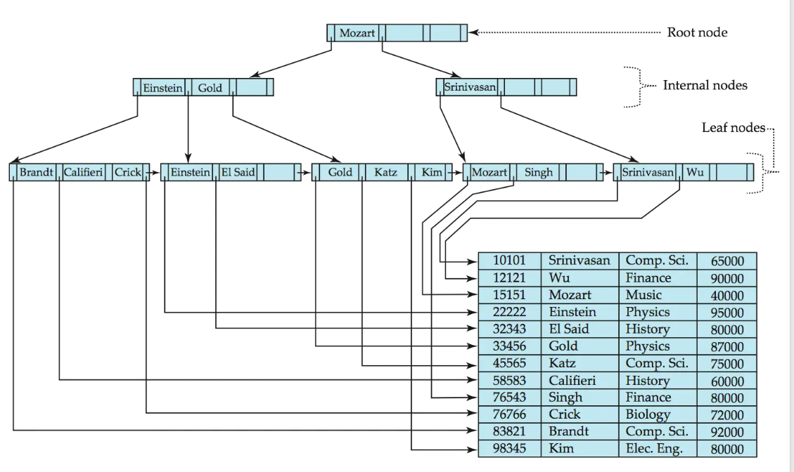

典型叶节点的结构如下：

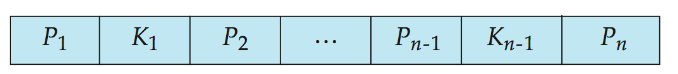

- $K_i$为搜索键值
- $P_i$为指向子节点的指针（对于非叶节点）或指向记录/记录桶的指针（对于叶节点）
- 通常，一个节点对应一个块
- 节点中的搜索键是有序的：$K_1 < K_2 < K_3 < \dots < K_{n-1}$

- 对于 $i = 1, 2, \ldots, n-1$ ，指针 $P_i$ 要么指向搜索键值为 $K_i$  的文件记录，要么指向一个记录指针桶，桶中每个记录都具有搜索键值 $K_i$。只有当搜索键不构成主键时，才需要桶结构。
- 如果 $L_i, L_j$  是叶节点且 $i < j$ ，则 $L_i$ 中的所有搜索键值都小于 $L_j$ 中的搜索键值。（叶节点间的搜索键不重叠，且所有左节点中的搜索键值一定小于右节点中的搜索键值）
- $P_n$ 按搜索键顺序指向下一个叶节点，这便于对文件进行顺序处理。

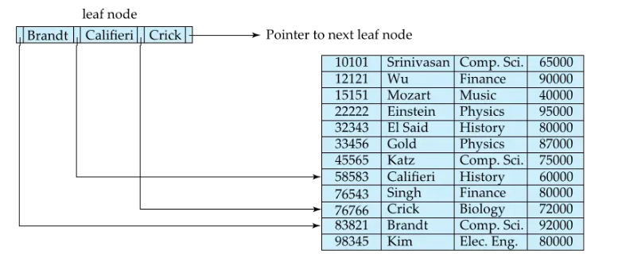

对于一个非叶节点：

- 拥有介于 $\lceil (n/2) \rceil$  和 $n$  之间的指针（子树）。
- 非叶节点在叶节点上形成多级稀疏索引。对于具有 $m$ 个指针的非叶节点：
    - $P_1$ 所指子树中的所有搜索键值均小于 $K_1$。
    - 对于 $2 \leq i \leq n-1$， $P_i$ 所指子树中的所有搜索键值均大于或等于 $K_{i-1}$ 且小于 $K_i$ 。
    - $P_n$ 所指子树中的所有搜索键值均大于或等于 $K_{n-1}$。

以下是一个B+树的例子：

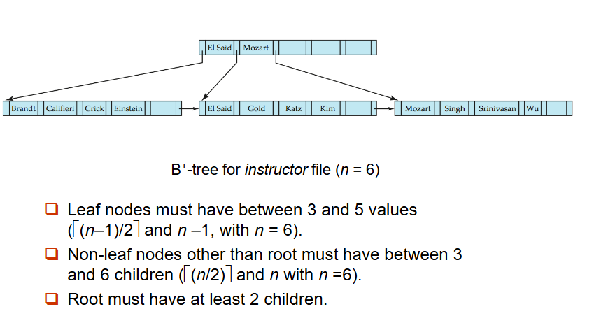

由于节点间的连接是通过指针完成的，“逻辑上”相邻的块不必在“物理上”相邻。

B+树的非叶节点层构成了多层的稀疏索引。

B+树的层级数量相对较少（与主文件大小呈对数关系），因此搜索可以高效执行。对主文件的插入和删除操作也能高效处理，因为索引可以在对数时间内完成重构（如下文所述）。

以下是B+树的查找操作：

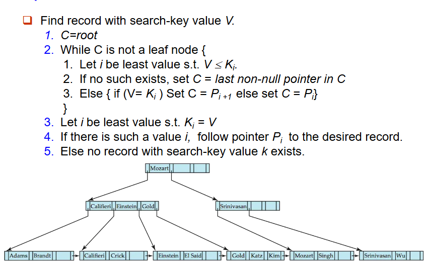

当存在重复搜索键时，我们可以对上述查找操作进行修改。

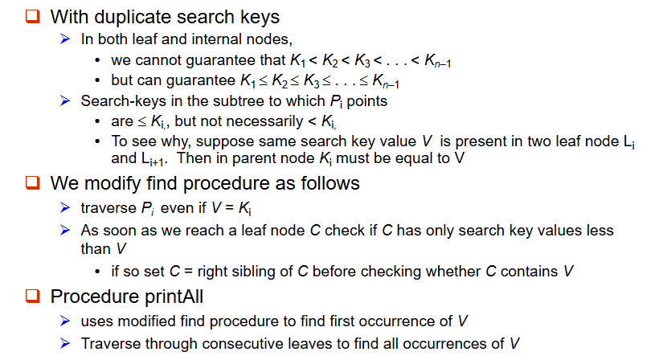

以下是B+树的插入操作：

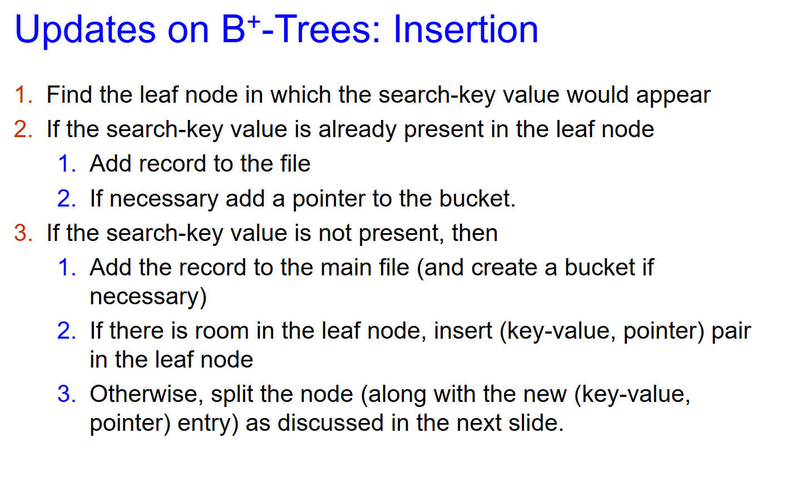

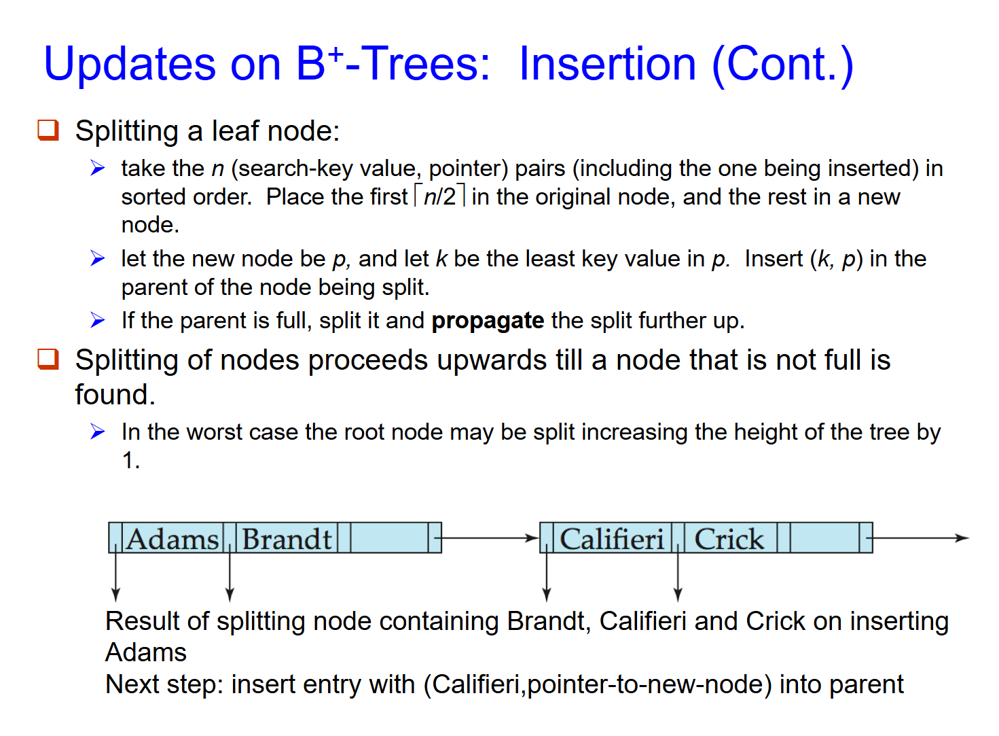

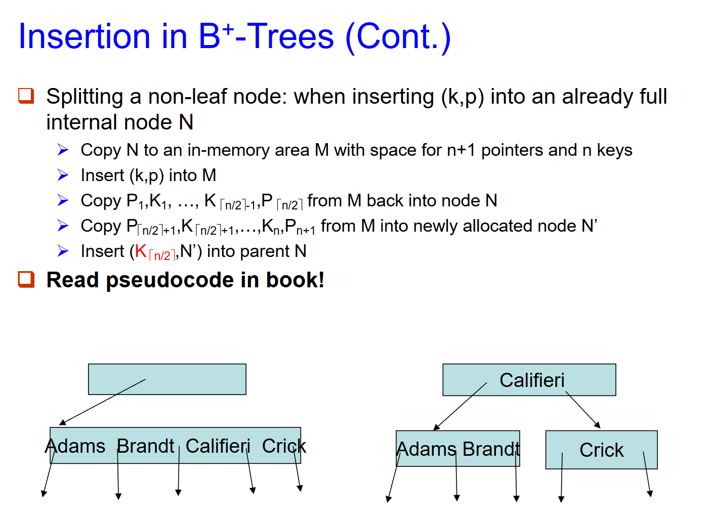

以下是一个插入的例子：

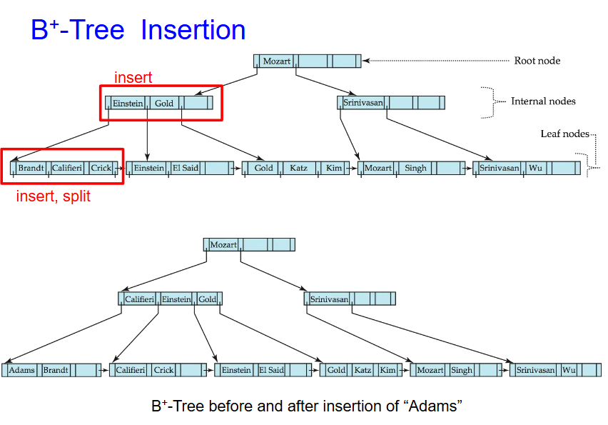

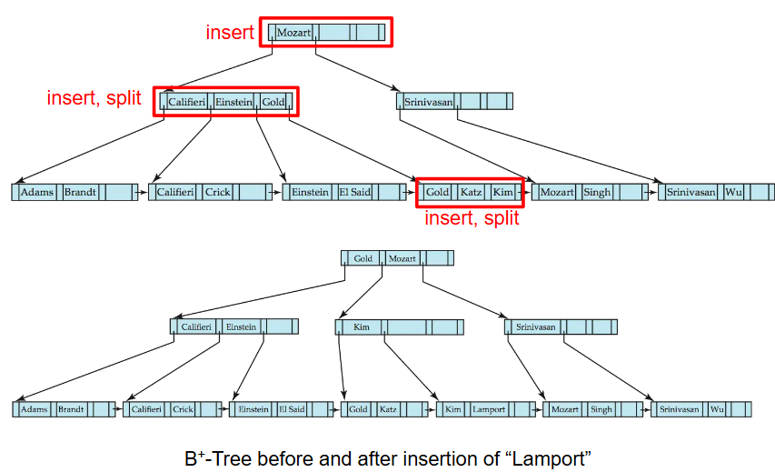

以下是B+树的删除操作：

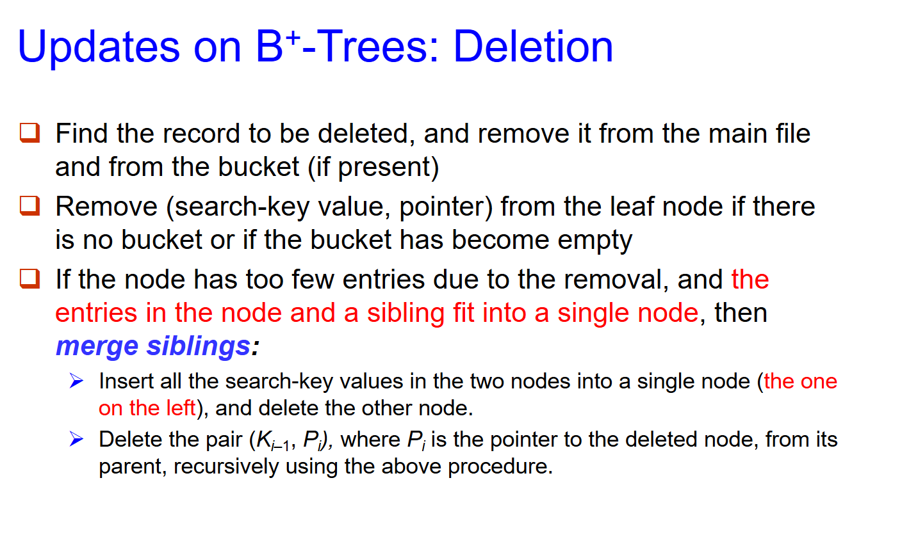

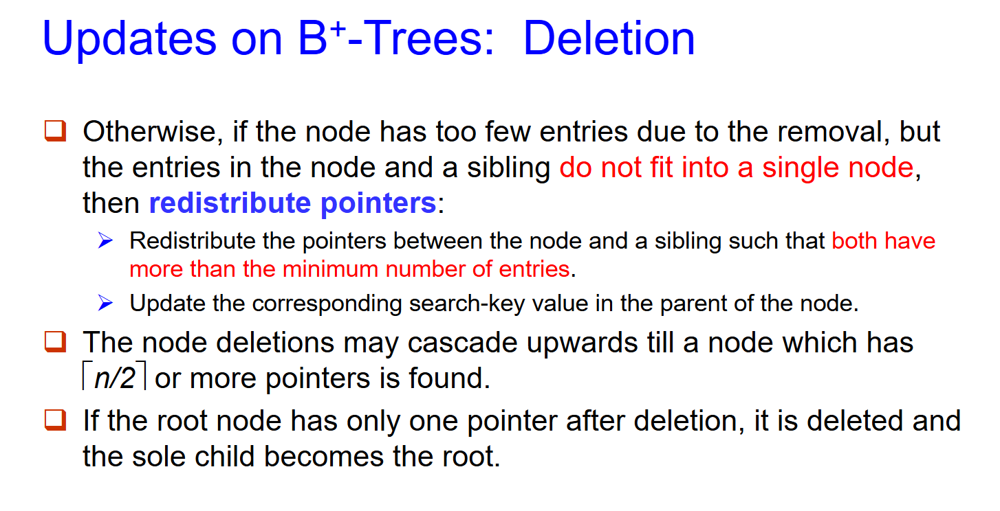

以下是删除的三种情况：

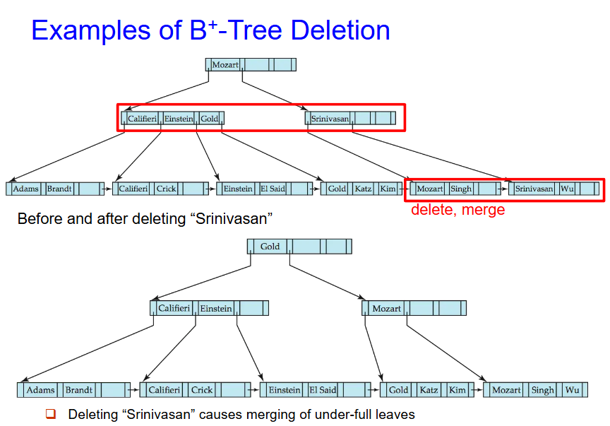

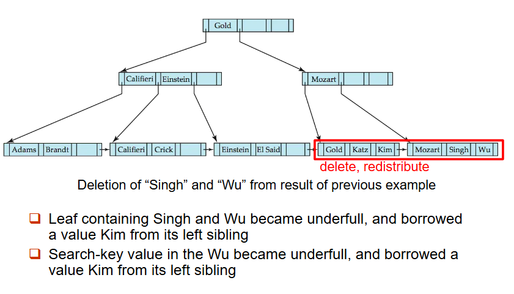

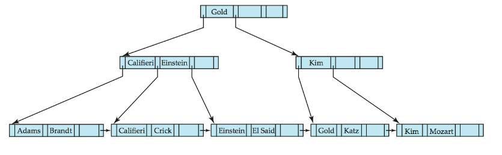

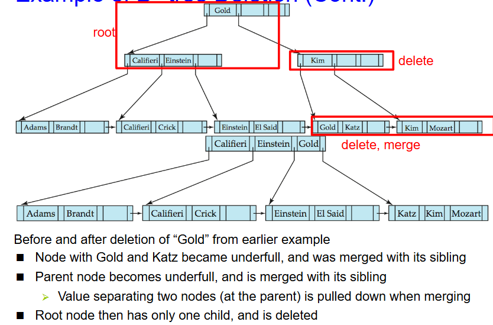

对于搜索键不唯一的情况，我们有几种方案：

- 每个键关联一个桶，桶放在单独的块中。
- 每个键关联一个元组指针列表。这种方法的好处是空间开销低，查询无额外成本，缺点是处理长列表需要额外代码，且如果搜索键上有大量重复值，删除一个元组可能代价高昂。
- 通过添加记录标识符使搜索键唯一。这种方法虽然会引入键的额外存储开销，但插入/删除的代码更简单，所以被广泛使用。

### B+树文件组织

B+树数据结构可以用于文件的组织。

在B+树文件组织中的叶子节点存储记录，而不是指针，这使得即使在插入、删除或更新操作后，也能帮助保持数据记录的聚簇性。

插入和删除的处理方式与B+树索引中的条目插入和删除相同。

由于记录比指针占用更多空间，为了提高空间利用率，我们可以在分裂和合并过程中引入更多兄弟节点进行重分配。

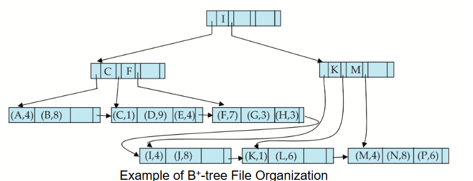

## *B树索引

B树类似于B+树，但B树允许搜索键值仅出现一次；消除了搜索键的冗余存储。

非叶节点中的搜索键在B树的其他任何地方都不会再出现；必须为非叶节点中的每个搜索键包含一个额外的指针字段。所有节点在B树中都是广义的叶节点。

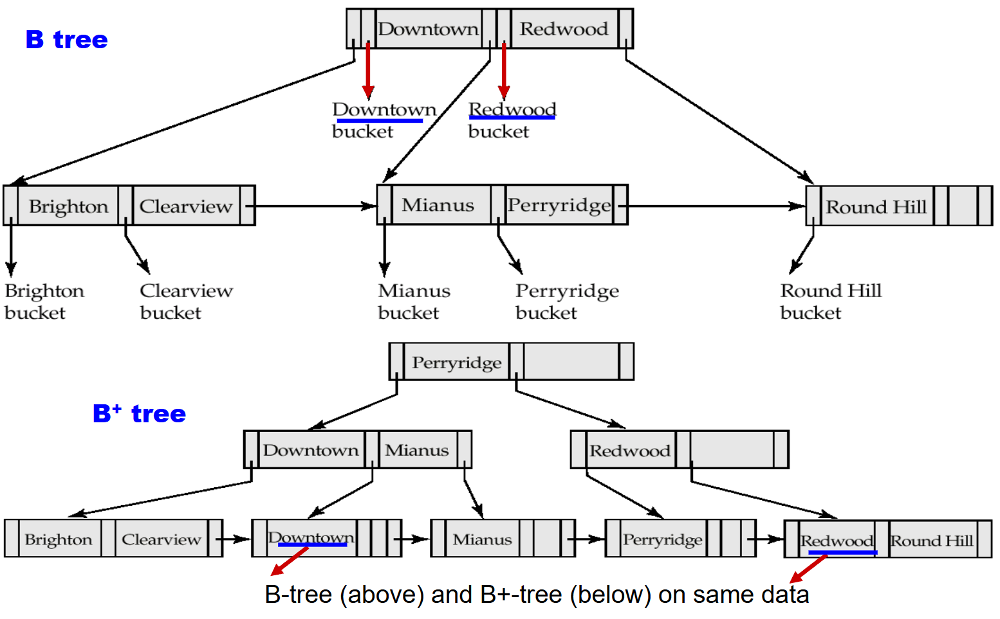

与相应的B+树相比，可能使用更少的树节点（因为B+树有重复键）。且有时可以在到达叶子节点之前就找到搜索键值。

当然能够提前找到的搜索键值只占很小一部分。由于非叶子节点更大，因此扇出减少。这使得B树通常比相应的B+树深度更大。且B树的插入和删除操作比B+树更复杂，实现比B+树更困难。

## 写优化索引

### 日志结构合并（LSM）树

- 目前仅考虑插入和查询操作
- 记录首先插入到内存中的树（$L_0$ 树）
- 当内存中的树写满时，记录被移动到磁盘（$L_1$树）
    - 通过将现有的 $L_1$树与来自 $L_0$ 树的记录合并，采用自底向上构建的方式生成$B^+$ 树

- 当 $L_1$ 树超过某个阈值时，将其合并到 $L_2$ 树
  - 依此类推，可扩展到更多层级
  - $L_{i+1}$ 树的大小阈值是 $L_i$ 树大小阈值的 $k$ 倍

!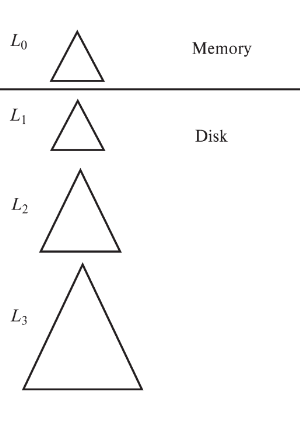

LSM树的优点:

- 插入操作仅使用顺序 I/O 完成
- 叶子节点是满的，避免了空间浪费
- 与普通 B⁺ 树相比，每条记录插入所需的 I/O 操作数量更少（在一定大小范围内）

LSM树的缺点:

- 查询需要搜索多棵树
- 每一层的全部内容会被多次复制

阶梯合并索引是LSM 树的一种变体，每一层包含多棵树。与 LSM 树相比，降低了写入成本，但查询代价更高。

### 缓冲树

缓冲树是LSM 树的替代方案，它的核心思想是B⁺ 树的每个内部节点都带有一个缓冲区来存储插入操作。当缓冲区满时，将插入操作下移到更低层。

缓冲树使用较大的缓冲区时，每次可向低层移动大量记录。使每条记录的平均 I/O 开销相应降低。

缓冲树的优点：

- 查询开销更小
- 可用于任何树形索引结构

缓冲树的缺点：

- 相比 LSM 树，随机 I/O 更多

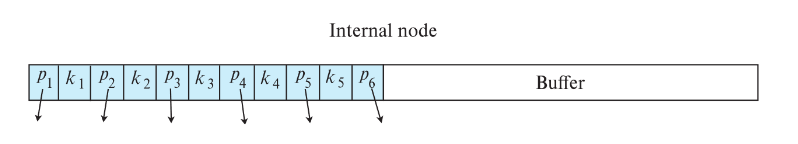

## *静态哈希

桶（bucket）是包含一个或多个记录（record）的存储单元（一个桶通常是一个磁盘块）。

在哈希文件组织中，我们通过哈希函数根据记录的搜索键值直接获得其所属的桶。

哈希函数 $h$ 是一个从所有搜索键值集合 $K$到所有桶地址集合 $B$ 的函数。哈希函数用于定位记录，以便进行访问、插入和删除操作。

不同搜索键值的记录可能被映射到同一个桶中；因此，要定位某条记录，必须顺序地搜索整个桶。

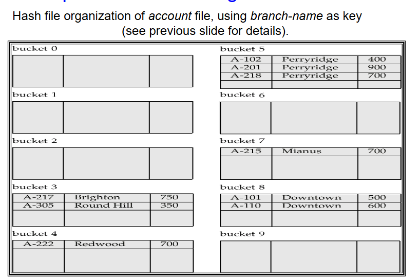

最差的哈希函数会将所有搜索键值映射到同一个桶中；这使得访问时间与文件中的搜索键值数量成正比。

理想的哈希函数是均匀的，即每个桶被分配到的搜索键值数量（来自所有可能值的集合）相同。理想的哈希函数是随机的，因此无论文件中搜索键值的实际分布如何，每个桶都会被分配相同数量的记录。

典型的哈希函数对搜索键的内部二进制表示进行计算。例如，对于一个字符串类型的搜索键，可以将字符串中所有字符的二进制表示相加，然后返回该和除以桶数所得的余数。

桶溢出可能由以下原因导致：

- 桶的数量不足
- 记录分布不均衡。这可能是由两个原因造成的：多条记录具有相同的搜索键值或所选哈希函数产生的键值分布不均匀。

虽然可以降低桶溢出的概率，但无法完全消除；溢出的处理方法是使用溢出桶。给定桶的各个溢出桶通过链表连接起来，形成一个溢出链。

上述方案称为闭哈希。另一种称为开哈希的替代方案不使用溢出桶，但不适用于数据库应用。

哈希不仅可用于文件组织，还可用于创建索引结构。哈希索引将搜索键及其关联的记录指针组织成哈希文件结构。

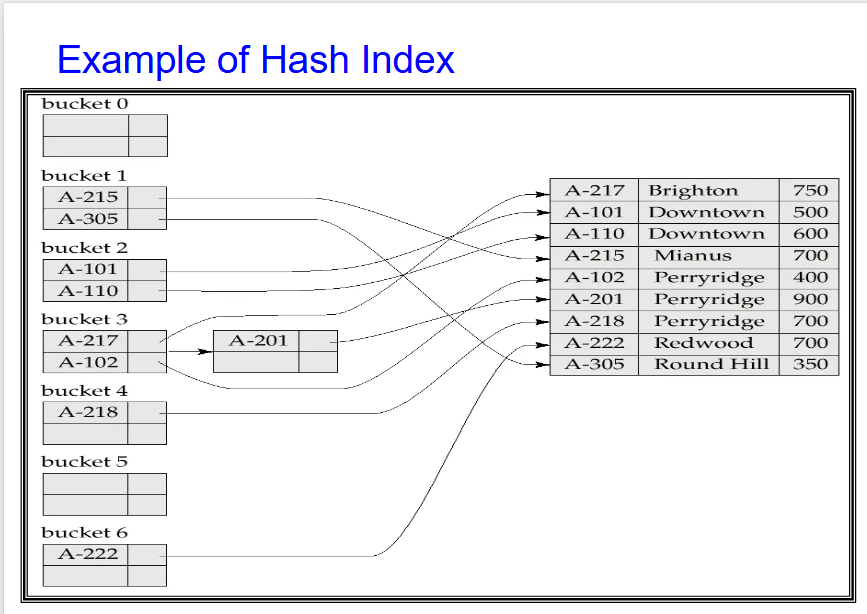

在静态哈希中，函数 $h$ 将搜索键值映射到一组固定的 $B$ 个桶地址。
  
静态哈希的缺点是：

- 数据库会随着时间增长。如果初始桶数量太少，性能会因溢出过多而下降。
- 如果预先估计了未来某个时间点的文件大小并据此分配桶数量，则初始阶段会浪费大量空间。
- 如果数据库缩小，同样会浪费空间。

一个可选方案是使用新的哈希函数定期重新组织文件，但这一成本非常高。

通过采用允许动态修改桶数量的技术，可以避免这些问题。

## *动态哈希

动态哈希适用于大小动态变化的数据库。它允许在运行时动态调整桶数量和修改哈希函数，以适应数据库的大小变化。

可扩展哈希是动态哈希的一种形式，它的基本思想如下：

由于哈希函数生成的值范围很大，通常为32位整数，我们用哈希函数的一个前缀来索引桶地址表。令该前缀的长度为 $i$ 位，$0 \leq i \leq 32$。桶地址表的大小 $=2^i$。初始时$i = 0$，$i$ 的值随着数据库大小的增长和缩小而增减。  

桶地址表中的多个条目可能指向同一个桶。因此，实际的桶数量 $< 2^i$。由于桶的合并与分裂，桶的数量也会动态变化。

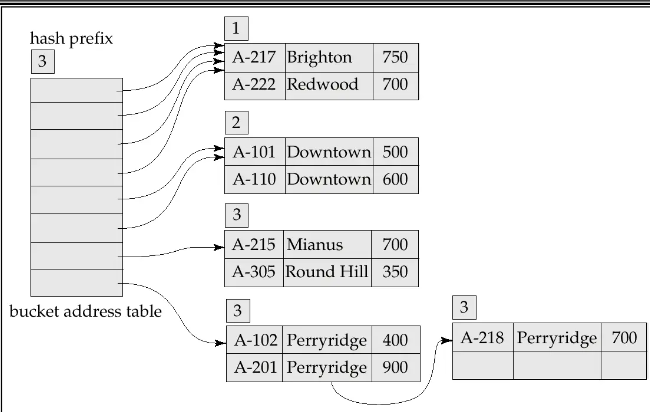

## SQL中的索引

创建索引：`create index <索引名> on <表名> (<属性列表>)`

例如：`create index b-index on branch(branch-name)`

使用 `create unique index` 来间接指定并强制执行“搜索键”是“候选键”的条件。（如果 SQL 支持唯一完整性约束，则实际上并不需要这样做。）

例如：`create unique index uni-acnt-index on account(account-number)`

删除索引：`drop index <索引名>`