# 查询处理

查询处理的步骤有三步：

- 解析与翻译（Parsing and Translation）
- 优化（Optimization）
- 执行（Evaluation）

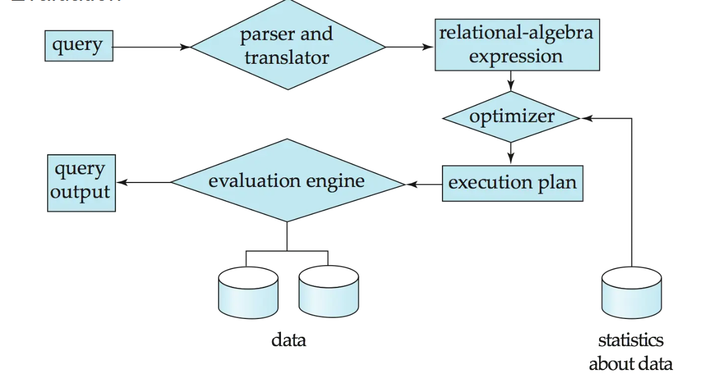

在解析时解析器检查语法，验证关系是否存在。翻译是指将查询转换为内部形式——扩展关系代数（ERA）表达式。

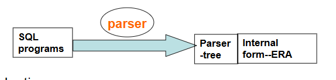

对于一个给定的 SQL 查询，可能存在多个等价的关系代数表达式。

例如：`Select balance from account where balance > 2500;`

- $\sigma_{balance>2500}(\Pi_{balance}(account))$
- $\Pi_{balance}(\sigma_{balance>2500}(account))$

而每个关系代数操作可以通过几种不同算法中的任一种来执行。

例如，针对上面的 (b)，如何执行 $σ$ 操作，是使用线性扫描还是索引？

相应地，一个关系代数表达式可以有多种求值方式。

指定了详细求值策略的带注释的表达式称为执行计划。

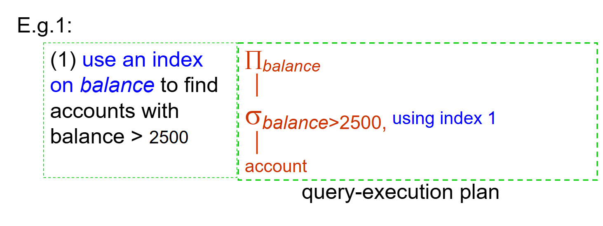

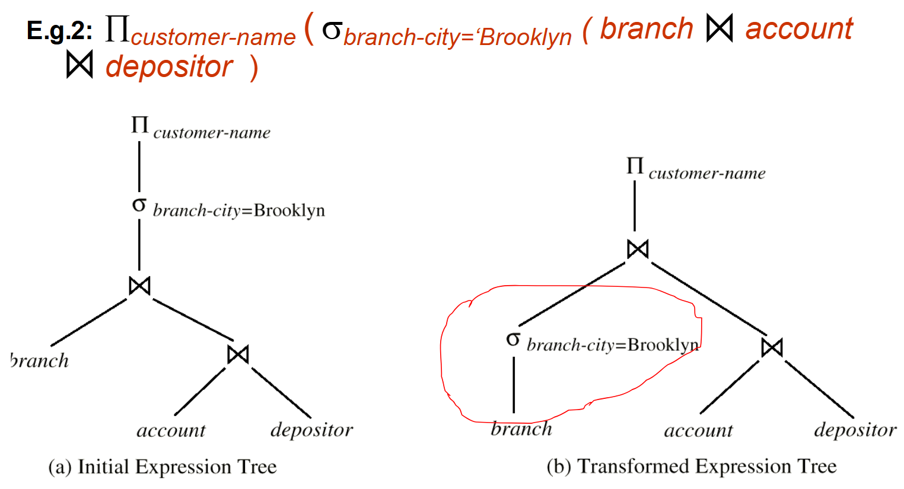

在得到表达式的在所有等价的求值计划中，选择成本最低的一个。

成本考虑两个因素：

- 成本取决于执行所用的算法。
- 成本还利用数据库目录中的统计信息进行估算。

## 查询成本的度量

成本通常指回答查询所花费的总时间。

影响时间成本的因素很多：磁盘访问 + CPU + 网络通信

通常磁盘访问是主要成本，且相对容易估算。估算时考虑以下因素：

- 执行的寻道操作次数
- 读取的块数 × 平均块读取成本
- 写入的块数 × 平均块写入成本

> 写入一个块的成本通常高于读取一个块的成本。

为简单起见，我们仅使用磁盘块传输次数和寻道次数作为成本度量：
  - $t_T$ – 传输一个块的时间（≈ 0.1 毫秒）
  - $t_S$– 一次寻道的时间（≈ 4 毫秒）
  - $b$次块传输加上$S$次寻道的成本

$$
b \times t_T + S \times t_S
$$

在我们的成本公式中，不包含将最终结果写回磁盘的成本。

成本取决于主存中缓冲区的大小，内存越多，磁盘访问需求越少。但可供缓冲区使用的实际内存量取决于其他并发的操作系统进程，在实际执行前很难确定。我们通常采用最坏情况下的估算，假设操作仅能使用所需的最小内存量，同时也采用最佳情况下的估算。

## 选择操作及其成本

### 基础算法

线性搜索（A1）：扫描每个文件块并测试所有记录是否满足选择条件。

- 成本估算 = $b_r$ 次块传输 + 1 次寻道
  - $b_r$ 表示关系 $r$ 的记录所占用的块数
- 如果选择条件是针对某个键属性，找到记录后可以停止
    - $cost = (b_r / 2)$ 次块传输 + 1 次寻道
-  线性搜索可以应用于任何情况，无论选择条件是什么，文件中记录的排序如何，或者是否存在索引。

二分搜索（A2）：适用于在文件已排序的属性上进行等值比较的选择操作。

- 假设关系的块是连续存储的  
- 成本 = $\lceil \log_2(b_r) \rceil$ 次块传输 + $\lceil \log_2(b_r) \rceil$ 次寻道 —— 通过在块上进行二分查找定位第一个元组的成本。（总时间成本$= \lceil \log_2(b_r) \rceil \times (t_s + t_\tau)$）  
- 如果选择条件不是针对键属性，则需要加上包含满足选择条件的记录的块数。
    - 块传输次数 = $\lceil \log_2(b_r) \rceil + \lceil \text{sc}(A, r) / f_r \rceil -1$，其中 $\text{sc}(A, r)$ 是满足选择条件的记录数，$f_r$是每个块中的记录数。

### 使用索引的搜索算法

选择条件必须基于索引的搜索键。

主索引是键属性上的等值比较。检索满足相应等值条件的单条记录。（A3）

- $cost = (h_i + 1) \times (t_T + t_S)$ ，其中 $h_i$为索引树高

主索引是非键属性上的等值比较。检索多条记录。（A4）

- 这些记录一般位于连续的块中。设 $b =$ 包含匹配记录的块数（$=\lceil \text{sc}(A, r) / f_r \rceil$）。则$cost = h_i \times (t_T + t_S) + t_S + t_T \times b$。

二级索引，针对非键属性的等值查询（A5）

- 如果搜索键是候选键，则检索单条记录，$cost = (h_i + 1) \times (t_T + t_S)$.
- 如果搜索键不是候选键，则检索多条记录，这n 条匹配记录中的每一条都可能位于不同的块上，$cost = (h_i + n) \times (t_T + t_S)$。

### 涉及比较操作的选择

比较符：>、>=、<、<=、<>，与等值比较的不同之处在于选择范围更大。 

我们可以通过以下方式实现形如 $\sigma_{A \leq v}(r)$  或 $\sigma_{A \geq v}(r)$ 的选择：

- 线性文件扫描；  
- 二分查找（如A2）；  
- 按如下方式使用索引：  

A6（主索引，比较）：

- 对于 $\sigma_{A \geq v}(r)$，使用索引找到第一个满足 $A \geq v$ 的元组，然后从该位置开始顺序扫描关系。  
- 对于 $\sigma_{A \leq v}(r)$，直接顺序扫描关系，直到遇到第一个 $A > v$ 的元组为止；不使用索引。  

A7（辅助索引，比较）：

- 对于 $\sigma_{A \geq v}(r)$，使用索引找到第一个满足 $\geq v$ 的索引项，然后从该位置开始顺序扫描索引，以获取指向记录的指针。  
- 对于 $\sigma_{A \leq v}(r)$，直接顺序扫描索引的叶子页面，获取指向记录的指针，直到遇到第一个 $A > v$ 的索引项为止。  
- 无论哪种情况，都需要根据指针取出记录。
  - 每条记录需要一次I/O  
  - 线性文件扫描可能更节省开销

### 复杂选择的实现

复杂选择可以是多个条件的合取：$\sigma_{\theta_1\land \theta_2 \land \cdots \land \theta_n}(r)$

A8（使用单个索引的合取选择）：

- 从 $\theta_i$ 中选择一个条件组合，并采用 A1 到 A7 中能使 $\sigma_{\theta_i}(r)$ 代价最小的算法。（第一步从 $n$ 个条件 $\theta_1, \ldots, \theta_n$ 中选择代价最小的 $\theta$ 先执行，返回元组放内存，然后第二步对这些元组施行其他 $\theta_i$.）

- 将元组取入内存缓冲区后，再测试其他条件。

A9（使用复合索引的合取选择）：

- 如果可用，则使用合适的复合（多键）索引。

A10（通过标识符交集实现合取选择）：

- 需要使用带有记录指针的索引。
- 对每个条件使用相应的索引，然后对所有得到的记录指针集合求交集。
- 随后从文件中取出这些记录。
- 如果某些条件没有合适的索引，则在内存中应用测试。

也可以是多个条件的析取：$\sigma_{01} \lor \sigma_{02} \lor \ldots \lor \sigma_n(r)$

A10（通过标识符并集实现析取选择）：

- 适用于所有条件都有可用索引的情况。（否则使用线性扫描。）
- 对每个条件使用相应的索引，并对所有得到的记录指针集合求并集。
- 然后从文件中取出这些记录。

若选择条件伟某个键属性的否定：$\sigma_{-\theta}(r)$，我们一般对文件使用线性扫描。如果满足$-\theta$的记录非常少，并且对 $\theta$ 有可用的索引，我们也可以使用索引找到满足条件的记录，然后从文件中取出。

## 排序算法及其成本

我们对数据进行排序，可能是为了满足查询的需要，也可能是为了提高查询性能（例如，排序能够快速实现连接操作）。

我们可以在关系上建立索引，然后利用索引按排序顺序读取关系。但这只是逻辑上的排序，并不会在物理上对关系进行排序，并且可能导致每个元组都需要一次磁盘块访问。

对于能够装入内存的关系，可以使用快速排序等技术进行排序。对于无法装入内存的关系，外部排序归并算法是常用的排序方法。

外部排序归并算法见高级数据结构与算法分析，一下是一个具体的例子：

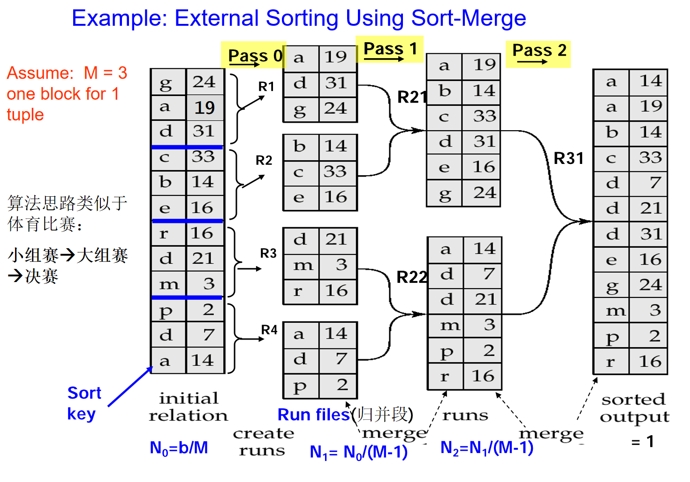

代价分析：

- 所需的归并遍数总计：$\lceil \log_{M-1}(b_r/M) \rceil$。
- 初始 run 创建以及每一遍归并中的块传输次数均为 \(2b_r\)。
- 对于最后一遍，不计入写代价
- 由于操作的结果可能直接传给父操作而不写回磁盘，因此所有操作的最后一遍写代价均忽略不计
- 因此外部排序的块传输总次数为：$b_r(2\lceil \log_{M-1}(b_r/M) \rceil + 1)$。

- 在 run 生成阶段：每个 run 需要一次读寻道和一次写寻道，因此总寻道次数为：$2 \lceil b_r / M \rceil$ 

- 在归并阶段：缓冲区大小：$b_b$（每次读写 $b_b$  个块）  
- 每一遍归并需要 $2 \lceil b_r / b_b \rceil$ 次寻道。最后一遍除外，因为它不需要写操作。

- 综上，总寻道次数为：$2 \lceil b_r / M \rceil + \lceil b_r / b_b \rceil (2 \lceil \log_{M-1}(b_r / M) \rceil - 1)$  连接操作及其成本

实现连接有几种不同算法：嵌套循环连接、块嵌套循环连接、索引嵌套循环连接、归并连接、哈希连接。

### 嵌套循环连接

嵌套循环连接是连接操作的最简单实现方式。它通过在两个关系上嵌套循环来生成连接结果。

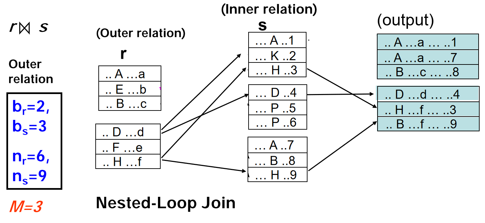

以下是嵌套循环连接的步骤：

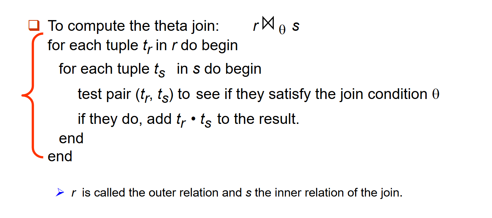

该算法不需要索引，并且可以用于任何类型的连接条件。但由于需要检查两个关系中的每一对元组，因此代价很高。

在最坏情况下，如果内存只够容纳每个关系的一个块，估计的代价为$n_r * b_s + b_r$ 次块传输，外加 $n_r + b_r$次磁盘寻道。

如果较小的关系能够完全装入内存，则将其作为内关关系。在最佳情况下的代价为$b_r + b_s$ 次块传输外加 $2$ 次寻道。

块嵌套循环连接是嵌套循环连接的优化版本。它以块为单位在两个关系上嵌套循环。

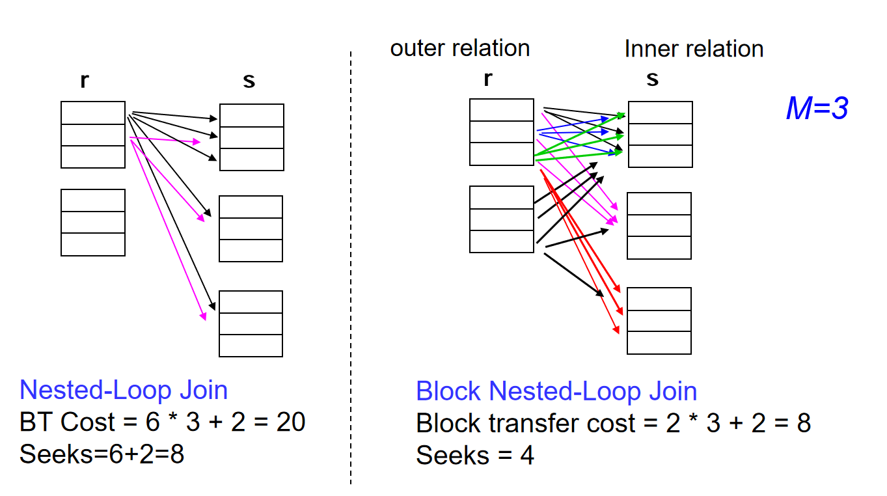

伪代码如下：

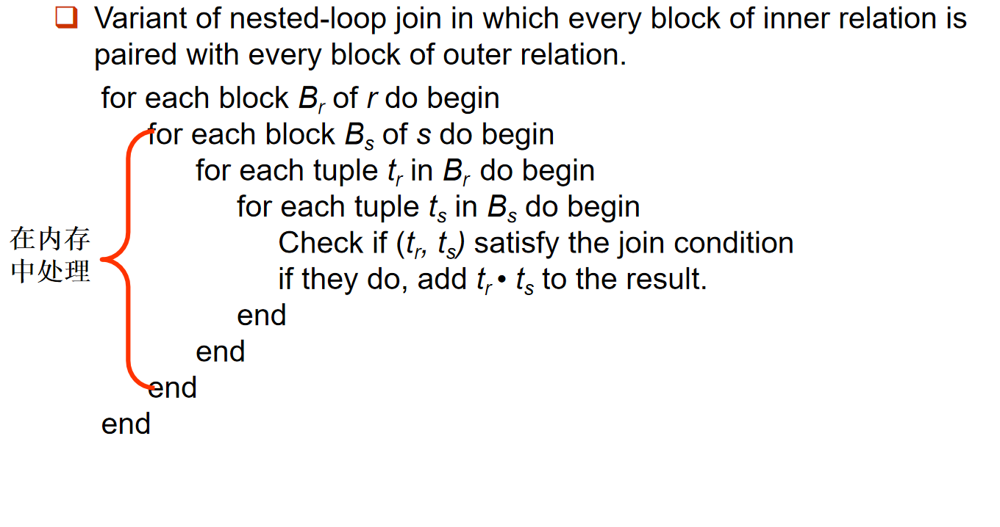

最坏情况：块传输成本 $= b_r * b_s + b_r$，（假设内存中只有 3 个块）加上 $2 * b_r$ 次寻道。此时尽量让块数较少的关系作为外层关系。

最好情况：$b_r + b_s$ 次块访问，（所有 $b_s$ 块始终在内存中）加上 2 次寻道。此时尽量让让块数较少的关系作为内层关系。

对嵌套循环和块嵌套循环算法的改进：

- 在块嵌套循环中，使用 $M - 2$ 个磁盘块作为外层关系的缓冲单元，其中 $M =$ 内存块总数；剩余的两个块用于缓冲内层关系和输出。
- 成本 $= \frac{b_r}{(M-2)} * b_s + b_r$次块传输 $+ \frac{2}{b_r / (M-2)}$ 次寻道

其他改进方法：

- 如果等值连接属性是内层关系的键，则在首次匹配时停止内层循环（提前终止）
- 交替地向前和向后扫描内层循环，以利用缓冲区中剩余的块（当使用 LRU 替换策略时）
- 如果内层关系上有索引，则使用索引

### 索引嵌套循环连接

如果满足以下条件，可以用索引查找替代文件扫描：

- 连接是等值连接自然连接
- 在内层关系的连接属性上存在索引

对于外层关系  $r$ 中的每个元组 $t_r$ ，使用索引在内层关系 $s$ 中查找满足连接条件的元组。

最坏情况：缓冲区只能容纳 $r$ 的一个页面，并且对于 $r$ 中的每个元组，我们都要在 $s$ 上执行一次索引查找。

连接的成本：$b_r (t_r + t_s) + n_r * c$

- 其中 $c$ 是遍历索引并获取与 $r$ 的一个元组匹配的所有 $s$ 元组的成本
- $c$  可以估计为使用连接条件在 $s$ 上执行一次选择操作的成本。

如果 $r$ 和 $s$ 的连接属性上都存在索引，则选择元组数较少的关系作为外层关系。

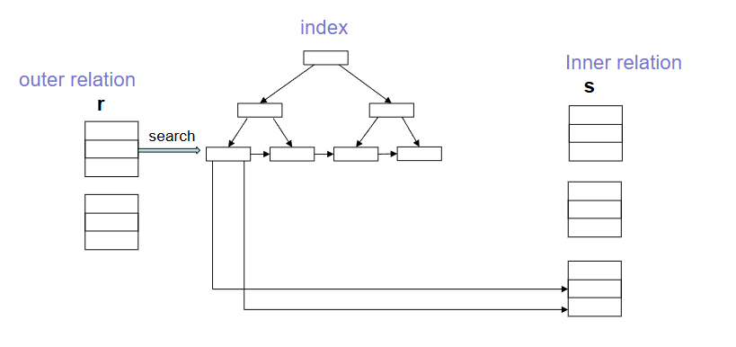

### 排序归并连接

排序归并连接是连接操作的另一种实现方式。它将两个关系按连接属性排序。然后合并已排序的关系以进行连接。

排序归并连接仅可用于等值连接和自然连接。

每个块只需读取一次（假设对于连接属性的任意给定值，所有元组都能放入内存）  

因此合并连接的成本为（假设 $r$ 和 $s$ 在内存中各分配 $b_b$ 个块）：$b_r + b_s$ 次块传输$+ (\lceil b_r / b_b \rceil + \lceil b_s / b_b \rceil)$ 次寻道。如果关系未排序，还需加上排序的成本。  

混合归并连接：如果一个关系已排序，另一个关系在连接属性上有二级 B⁺ 树索引，我们可以将已排序的关系与 B⁺ 树的叶条目进行合并。将结果按未排序关系的元组地址进行排序。按物理地址顺序扫描未排序的关系，并与上一步的结果合并，将地址替换为实际的元组。

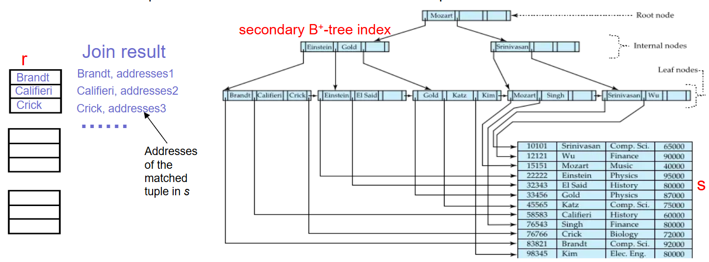

### 哈希连接

哈希连接也只适用于等值连接和自然连接。它使用哈希函数h将两个关系的元组划分到不同分区。

h 将连接属性的值映射到$\{0, 1, ..., n \}$，其中连接属性表示自然连接中$r$ 和$s$ 的公共属性。

- $r_0, r_1, \ldots, r_n$ 表示 $r$ 元组的分区。每个元组 $t_r \in r$放入分区 $r_i$，其中 $i = h(t_r[\text{连接属性}])$ 。
-  $s_0, s_1, \ldots, s_n$ 表示 $s$ 元组的分区。每个元组 $t_s \in s$ 放入分区 $s_i$，其中 $i = h(t_s[\text{连接属性}])$。

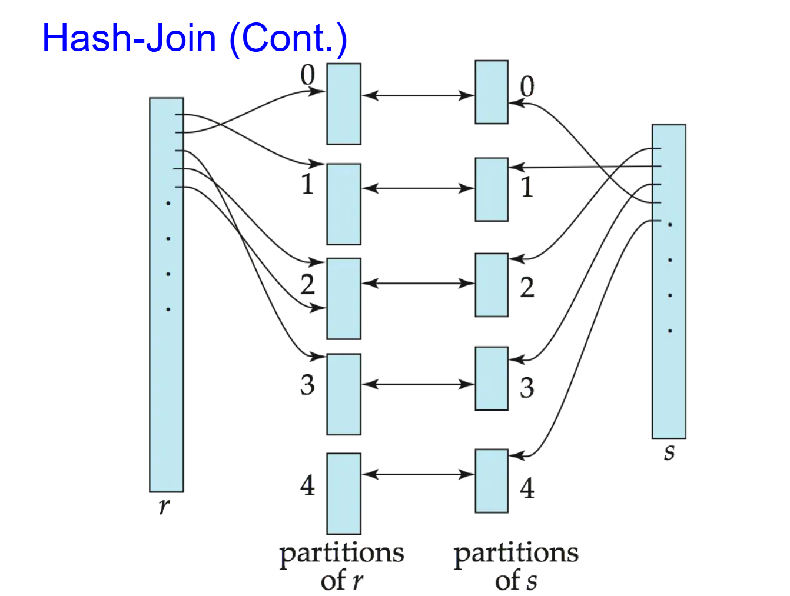

计算 $r$ 和 $s$ 的哈希连接步骤如下：

1. 使用哈希函数 $h$ 对关系 $s$ 进行分区。在分区一个关系时，为每个分区保留一个内存块作为输出缓冲区。

2. 类似地对 $r$ 进行分区。

3. 对每个分区 $i$：  
(a) 将 $s_i$ 加载到内存中，并使用连接属性在其上构建一个内存中的哈希索引。该哈希索引使用的哈希函数与之前的 $h$ 不同。  
(b) 从磁盘中逐一读取 $r_i$ 中的元组。对于每个元组 $t_i$，使用内存中的哈希索引定位 $s_i$ 中与之匹配的每个元组 $t_s$。输出它们属性的拼接结果。

关系 $s$ 称为构建输入，关系 $r$ 称为探测输入。

在选择 $n$ 和哈希函数 $h$时，我们需要使得每个 $s_i$ 都能放入内存。通常 $n$ 取 $\lceil b_s / M \rceil * f$，其中 $f$ 是“修正因子”，通常约为 1.2。探测关系分区 $r_i$ 不需要放入内存。

如果分区数 $n$ 大于内存页数 $M$，则需要递归分区。

- 不采用 $n$ 路分区，而是对 $s$ 使用 $M-1$ 个分区。
- 使用不同的哈希函数对 $M-1$ 个分区进一步分区。
- 对 $r$ 使用相同的分区方法。

若 $M > \sqrt{b_s}$，则关系不需要递归分区。

如果不需要递归分区：哈希连接的成本为：$3(b_r + b_s) + 4 * n_h$次块传输 $+ 2(\lceil b_r / b_b \rceil + \lceil b_s / b_b \rceil)$次寻道

如果需要递归分区：  

- 对构建关系进行分区所需的趟数为$s$是 $\lceil \log_{M-1}(b_s) - 1 \rceil$ 
- 最好选择较小的关系作为构建关系。  
- 总成本估计为：$2(b_r + b_s) \lceil \log_{M-1}(b_s) - 1 \rceil + b_r + b_s$次块传输$+ 2(\lceil b_r / b_b \rceil + \lceil b_s / b_b \rceil) \lceil \log_{M-1}(b_s) - 1 \rceil$次寻道

- 如果整个构建输入都能放入主存，则不需要分区  
    - 成本估计降至 $b_r + b_s$ —— 最好情况

## *其他操作

**重复消除**：

- 可以通过哈希或排序实现。
- 排序时，重复的元组会相邻，可以删除除一组之外的所有重复元组。
- 优化：在外部排序-合并中，可以在生成 runs 阶段以及中间合并阶段删除重复项。
- 哈希类似——重复项会进入同一个桶中。

**投影**：

- 对每个元组执行投影
- 然后进行重复消除。

**聚合**：

- 聚合可以采用与重复消除类似的方式实现。
- 可以使用排序或哈希将同一分组中的元组聚集在一起，然后在每个分组上应用聚合函数。
- 优化：在生成 runs 阶段和中间合并阶段，通过计算部分聚合值来合并同一分组中的元组
    - 对于 count、min、max、sum：保留该分组中目前已处理的元组的聚合值。合并 count 的部分聚合时，将聚合值相加。
    - 对于 avg，保留 sum 和 count，最后用 sum 除以 count

**集合操作（$\cup$、$\cap$ 和 $-$）**：

- 可以使用排序后的归并连接变体，或者哈希连接的变体。

- 例如，使用哈希实现集合操作：

1. 使用相同的哈希函数对两个关系进行分区，从而创建 $r_1, \ldots, r_n, r_0$ 以及 $s_1, s_2, \ldots, s_n$。

2. 依次处理每个分区 $i$ 如下。使用另一个不同的哈希函数，在 $r_i$ 被加载到内存后，在其上构建一个内存中的哈希索引。

3. (1) $r \cup s$：将 $s_i$ 中尚未存在于哈希索引中的元组添加到哈希索引中。处理完 $s_i$ 后，将哈希索引中的所有元组输出到结果中。

   (2) $r \cap s$：如果 $s_i$ 中的元组已经存在于哈希索引中，则将该元组输出到结果中。

   (3) $r - s$：对于 $s_i$ 中的每个元组，如果它存在于哈希索引中，则将其从索引中删除。处理完 $s_i$ 后，将哈希索引中剩余的元组输出到结果中。

**外连接**：

- 外连接可以通过以下方式计算：
    - 先进行连接，然后添加用空值填充的不参与元组。
    - 或者通过修改连接算法实现。

- 下面是修改归并连接以计算左外连接的过程：
    - 在 $r$ 左外连接 $s$ 中，不参与的元组是 $r - \Pi_R(r \bowtie s)$ 中的那些
    - 修改归并连接计算左外连接：在合并过程中，对于 $r$ 中未能与 $s$ 中任何元组匹配的每个元组 $t_r$，输出用空值填充的 $t_r$。
    - 右外连接和全外连接可以用类似方式计算。

- 下面是修改哈希连接以计算左外连接的过程：
    - 如果 $r$ 是探测关系，则输出未匹配的 $r$ 元组，并用空值填充
    - 如果 $r$ 是构建关系，则在探测过程中记录哪些 $r$ 元组与 $s$ 元组匹配。在处理完 $s$ 后，输出未匹配的 $r$ 元组，并用空值填充。

## *表达式求值

到目前为止：我们已经学习了单个操作的算法。现在考虑多操作。如：

> *Customer-name* ( $\sigma_{\text{balance} < 2500}(\text{account})$ ) $\times$ *depositor*

对整个表达式树进行求值有两种可选方案：

- 实体化：生成表达式的结果，并将结果存储到磁盘。
- 流水线：即使在操作执行过程中，也将其元组传递给父操作。

  
### 实体化

实体化求值：一次计算一个操作，从最底层开始。使用实体化到临时关系中的中间结果来计算下一层操作。

例如，在下图中，计算并存储$\sigma_{\text{balance} < 2500} (\text{account})$

然后将存储的结果取回并与depositor连接，最后在customer-name 上执行投影。

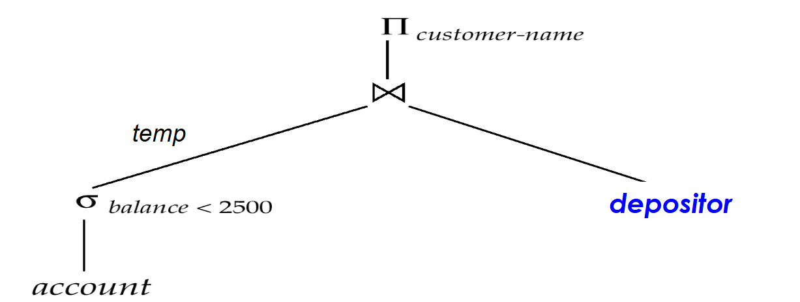

### 流水线

流水线求值：同时计算多个操作，将一个操作的结果直接传递给下一个操作。

例如，在前面的表达式树中，不存储选择的结果，而是直接将元组传递给连接操作。类似地，不存储连接的结果，而是直接将元组传递给投影操作。

## 等价规则

如果两个关系代数表达式在每一个**合法**的数据库实例上生成相同的元组集合，则称这两个表达式是等价的。

- 元组的顺序无关紧要
- 我们不关心它们在违反**完整性约束**的数据库上是否生成不同的结果

在 SQL 中，输入和输出是元组的多重集合。在多重集版本的关系代数中，如果两个表达式在每一个合法的数据库实例上生成相同的元组多重集合，则称这两个表达式是等价的。

以下是一些常见的等价规则：

1. 合取选择操作可以分解为一系列单个选择操作。

$$
\sigma_{\theta_1 \wedge \theta_2}(E) = \sigma_{\theta_1}(\sigma_{\theta_2}(E))
$$

2. 选择操作是可交换的。

$$
\sigma_{\theta_1}(\sigma_{\theta_2}(E)) = \sigma_{\theta_2}(\sigma_{\theta_1}(E))
$$

3. 在一系列投影操作中，只需要最后一个，其他的可以省略。

$$
\Pi_{L_1}(\Pi_{L_2}(\dots(\Pi_{L_n}(E))\dots)) = \Pi_{L_1}(E)
$$

4. 选择可以与笛卡尔积和 theta 连接结合。

$$
\sigma_{\theta}(E_1 \times E_2) = E_1 \bowtie_\theta E_2
$$

$$
E_1 \bowtie_\theta \sigma_{\theta_1}(E_2) = \sigma_{\theta_1 \wedge \theta}(E_1 \bowtie_\theta E_2)
$$

5. Theta-join 操作（以及自然连接）是可交换的。  
   
$$ 
E_1 \bowtie_\theta E_2 = E_2 \bowtie_\theta E_1 
$$

6. 自然连接操作是可结合的：
     
$$
(E_1 \bowtie E_2) \bowtie E_3 = E_1 \bowtie (E_2 \bowtie E_3)
$$

7. Theta 连接按以下方式可结合： 

$$ 
(E_1 \bowtie_{\theta_1} E_2) \bowtie_{\theta_2 \wedge \theta_3} E_3 = E_1 \bowtie_{\theta_1 \wedge \theta_3} (E_2 \bowtie_{\theta_2} E_3) 
$$

其中 $\theta_2$ 仅涉及 $E_2$ 和 $E_3$ 中的属性。

8. 选择操作在以下两个条件下可以下推到 theta 连接操作之上：

(a) 当 $\theta_0$ 中的所有属性仅涉及被连接的一个表达式（$E_1$）时。

$$
\sigma_{\theta_0}(E_1 \bowtie_\theta E_2) = (\sigma_{\theta_0}(E_1)) \bowtie_\theta E_2
$$

   (b) 当 $\theta_1$ 仅涉及 $E_1$ 的属性，且 $\theta_2$ 仅涉及 $E_2$ 的属性时。

$$
   \sigma_{\theta_1 \wedge \theta_2}(E_1 \bowtie_\theta E_2) = (\sigma_{\theta_1}(E_1)) \bowtie_\theta (\sigma_{\theta_2}(E_2))
$$

（选择操作的分配律：先连接后选择 $\Rightarrow$ 先选择后连接）

9. 投影操作在 theta 连接上的分配律如下（投影操作在下面两个条件下对连接运算具有分配律：先连接后投影 $\Rightarrow$ 先投影后连接）：

(a) 如果 $\theta$ 仅涉及 $L_1 \cup L_2$ 中的属性：

$$
\Pi_{L_1 \cup L_2}(E_1 \bowtie_{\theta} E_2) = (\Pi_{L_1}(E_1)) \bowtie_{\theta} (\Pi_{L_2}(E_2))
$$

(b) 考虑连接 $E_1 \bowtie_{\theta} E_2$。

- 令 $L_1$ 和 $L_2$ 分别为来自 $E_1$ 和 $E_2$ 的属性集合。
- 令 $L_3$ 为 $E_1$ 中参与连接条件 $\theta$ 但不属于 $L_1 \cup L_2$ 的属性，
- 令 $L_4$ 为 $E_2$ 中参与连接条件 $\theta$ 但不属于 $L_1 \cup L_2$ 的属性。（先连接后投影 $\Rightarrow$ 先投影后连接，再投影）

$$
\Pi_{L_1 \cup L_2}(E_1 \bowtie_{\theta} E_2) = \Pi_{L_1 \cup L_2}((\Pi_{L_1 \cup L_3}(E_1)) \bowtie_{\theta} (\Pi_{L_2 \cup L_4}(E_2)))
$$

10.  集合操作并和交是可交换的  
$$
E_1 \cup E_2 = E_2 \cup E_1
$$ 

$$
E_1 \cap E_2 = E_2 \cap E_1
$$  

（集合差是不可交换的）。

11.  集合并和交是可结合的。 
 
$$
(E_1 \cup E_2) \cup E_3 = E_1 \cup (E_2 \cup E_3)
$$

$$
(E_1 \cap E_2) \cap E_3 = E_1 \cap (E_2 \cap E_3)
$$

12.   选择操作在 $\cup$、$\cap$ 和 $-$ 上具有分配律。  
$$
\sigma_\theta (E_1 - E_2) = \sigma_\theta (E_1) - \sigma_\theta (E_2)
$$  

对 $\cup$ 和 $\cap$ 同理（将 $-$ 替换为 $\cup$ 或 $\cap$）。

此外：  
$$
\sigma_\theta (E_1 - E_2) = \sigma_\theta (E_1) - E_2
$$  

对 $\cap$ 替代 $-$ 同理，但对 $\cup$ 不成立。

13.  投影操作在并上具有分配律  
$$
\Pi_L (E_1 \cup E_2) = (\Pi_L (E_1)) \cup (\Pi_L (E_2))
$$  

以下是优化的一些建议：

在选择和连接操作结合时，我们一般尽可能早地执行选择操作，可以减少需要连接的关系的大小。

对于多个关系的连接，连接的顺序对于减少临时结果的大小很重要。  
对于所有关系 $r_1, r_2$ 和 $r_3$：

$$
(r_1 \bowtie r_2) \bowtie r_3 = r_1 \bowtie (r_2 \bowtie r_3)
$$

如果 $r_2 \bowtie r_3$ 相当大而 $r_1 \bowtie r_2$ 很小，我们选择$(r_1 \bowtie r_2) \bowtie r_3$，这样我们就可以计算并存储一个更小的临时关系。

### 等价表达式的枚举

查询优化器使用等价规则来系统性地生成与给定表达式等价的表达式。

可以用重复的方式来生成所有等价表达式，即对目前已找到的每个等价表达式的每个子表达式，应用所有适用的等价规则。将新生成的表达式添加到等价表达式集合中。直到不再生成新的等价表达式为止。

但上述方法在空间和时间上都非常昂贵。

## 成本估计的统计信息

以下是在成本估计时常用的统计量：

- $n_r$：关系 $r$ 中的元组数量。
- $b_r$：包含 $r$ 的元组的块数。
- $l_r$：$r$ 的一个元组的大小。
- $f_r$：$r$ 的块因子——即一个块中能容纳的 $r$ 的元组数量。
- $V(A, r)$：属性 $A$ 在 $r$ 中出现的不同值数量；等于 $\Pi_A(r)$ 的大小。

如果 $r$ 的元组在文件中物理地存储在一起，那么：

$$
b_r = \left\lfloor \frac{n_r}{f_r} \right\rfloor
$$

### 直方图

直方图和其他统计信息通常基于随机样本计算。直方图用于估计属性的分布。直方图的每个条目表示一个属性值的范围，以及该范围中元组的数量。

统计信息可能会过时。某些数据库需要执行 analyze 命令来更新统计信息，其他数据库会自动重新计算统计信息。

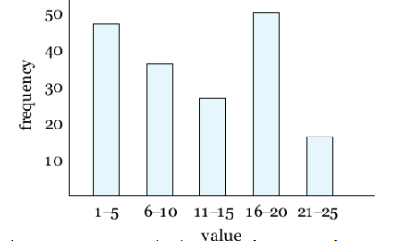

### 关系元组数量的估计

#### 选择大小估计

$\sigma_{A=v}(r)$：

- $n_r / V(A, r)$：将满足该选择条件的记录数
- 键属性上的等值条件：大小估计为 $1$

$\sigma_{A \leq v}(r)$（$\sigma_{A \geq v}(r)$ 的情况对称）

- 令 $c$ 表示满足条件的元组的估计数量。
- 如果目录中提供了 $\min(A, r)$ 和 $\max(A, r)$
    - 若 $v < \min(A, r)$，则 $c = 0$
    - 若 $v \geq \max(A, r)$，则 $c = n_r$
    - 否则 $c = n_r \cdot \frac{v - \min(A, r)}{\max(A, r) - \min(A, r)}$

如果有直方图，可以细化上述估计。

在缺乏统计信息的情况下，我们一般假设 $c = n_r / 2$。

#### 复杂选择的大小估计

条件 $\theta_i$ 的**选择率**是关系 $r$ 中一个元组满足 $\theta_i$ 的概率。

若 $s_i$ 是 $r$ 中满足条件的元组数，则 $\theta_i$ 的选择率为 $s_i / n_r$。

合取：$\sigma_{\theta_1 \land \theta_2 \land \dots \land \theta_n}(r)$。假设独立性，结果中元组的估计数量为：

$$
n_r = \frac{s_1 * s_2 * \dots * s_n}{n_r^n}
$$

析取：$\sigma_{\theta_1 \lor \theta_2 \lor \dots \lor \theta_n}(r)$。估计的元组数量为：

$$ 
n_r = \left( 1 - (1 - \frac{s_1}{n_r}) * (1 - \frac{s_2}{n_r}) * \dots * (1 - \frac{s_n}{n_r}) \right)
$$

否定：$\sigma_{\neg \theta}(r)$。估计的元组数量为：

$$
n_r = \text{size}(\sigma_{\theta}(r))
$$

#### 连接大小的估计

笛卡尔积 $r \times s$ 包含 $n_r \cdot n_s$ 个元组；

每个元组占用 $s_r + s_s$ 字节。

如果 $R \cap S = \emptyset$，则 $r \bowtie s$ 与 $r \times s$ 相同。

如果 $R \cap S$ 是 $R$ 的一个**键**，那么 $s$ 中的一个元组最多与 $r$ 中的一个元组连接。因此，$r \bowtie s$ 中的元组数不大于 $s$ 中的元组数。

如果 $S$ 中的 $R \cap S$ 是 $S$ 中引用 $R$ 的**外键**，则 $r \bowtie s$ 中的元组数恰好等于 $s$ 中的元组数。$R \cap S$ 是引用 $S$ 的外键的情况是对称的。

如果 $R \cap S = \{A\}$ 不是 $R$ 或 $S$ 的键。我们假设 $R$ 中的每个元组 $t$ 在 $R \bowtie S$ 中都产生元组，则 $R \bowtie S$ 中的元组数估计为：

$$
\frac{n_r * n_s}{V(A, s)}
$$

若反过来（以 $R$ 为基准），则估计值为：

$$
\frac{n_r * n_s}{V(A, r)}
$$

这两个估计值中**较小**的那个可能更准确。

如果有直方图，可以进一步改进上述估计。（对两个关系直方图中的每个单元格，使用类似上述的公式进行计算。）

#### 其他操作的大小估计

投影：$\Pi_A(r)$ 的估计大小 = $V(A, r)$

聚合：$_{A}\mathcal{G}_{F}(r)$ 的估计大小 = $V(A, r)$

外连接：

- 左外连接的估计大小 = $r \bowtie s$ 的大小 + $r$ 的大小
- 右外连接的情况对称
- 全外连接的估计大小 = $r \bowtie s$ 的大小 + $r$ 的大小 + $s$ 的大小

集合操作：

- 对于同一关系上选择的并/交：重写并使用选择的大小估计
    - 例如，$\sigma_{\theta_1}(r) \cup \sigma_{\theta_2}(r)$ 可重写为 $\sigma_{\theta_1 \lor \theta_2}(r)$
- 对于不同关系上的操作：
    - $r \cup s$ 的估计大小 = $r$ 的大小 + $s$ 的大小
    - $r \cap s$ 的估计大小 = $\min(r \text{ 的大小}, s \text{ 的大小})$
    - $r - s$ 的估计大小 = $r$ 的大小
    - 这三个估计值可能非常不准确，但提供了大小的上界。

### 不同值数量的估计

#### 选择估计

如果 $\theta$ 强制 $A$ 取一个指定值：$V(A, \sigma_{\theta}(r)) = 1$。  

如果 $\theta$ 强制 $A$ 取一组指定值中的一个：$V(A, \sigma_{\theta}(r)) = \text{指定值的数量}$  

如果选择条件 $\theta$ 的形式为 $A \text{ op } v$，估计 $V(A, \sigma_{\theta}(r)) = V(A, r) * s$。其中 $s$ 是该选择的选择率。

在所有其他情况下：使用近似估计：$\min(V(A, r), n_{\sigma_{\theta}(r)})$

#### 连接估计

如果 $A$ 中的所有属性都来自 $r$，估计 $V(A, r \bowtie s) = \min (V(A, r), n_{r \bowtie s})$

如果 $A$ 包含来自 $r$ 的属性 $A1$ 和来自 $s$ 的属性 $A2$，则估计  

$$ 
V(A, r \bowtie s) = \min (V(A1, r) \cdot V(A2 - A1, s),\; V(A1 - A2, r) \cdot V(A2, s),\; n_{r \bowtie s}) 
$$

#### 投影与聚合估计

不同值数量的估计对于投影来说很简单。在 $\Pi_{A}(r)$ 中与在 $r$ 中是相同的。

对于聚合的分组属性也是如此。对于聚合值：

- 对于 $\min(A)$ 和 $\max(A)$，不同值数量可以估计为 $\min(V(A, r), V(G, r))$，其中 $G$ 表示分组属性
- 对于其他聚合函数，假设所有值都是不同的，并使用 $V(G, r)$

## 求值计划的选择

在选择评估计划时，必须考虑评估技术之间的交互影响，独立地为每个操作选择最便宜的算法，不一定能产生全局最优的算法。例如：归并连接可能比哈希连接更昂贵，但它可能提供排序后的输出，从而降低外层聚合的成本。

实际的查询优化器融合了以下两种主要方法中的元素：

- 搜索所有计划，并以基于成本的方式选择最佳计划。
- 使用启发式方法选择计划。

考虑为 $r_1 \bowtie r_2 \bowtie \ldots \bowtie r_n$ 寻找最佳连接顺序。对于上述表达式，共有 $(2(n-1))!/(n-1)!$ 种不同的连接顺序。当 $n = 7$ 时，数量为 665280。当 $n=10$ 时，数量超过 1760 亿。  
这种情况下，我们无需生成所有连接顺序。而是使用动态规划的方法，对 $\{r_1, r_2, \ldots, r_n\}$ 的任意子集，其最小成本的连接顺序仅计算一次并存储供以后使用。