# 进程
## 进程的概念
- 进程是资源分配和调度的基本单位。通俗来讲，进程就是正在执行的程序。只有当加载到内存时才成为进程。
- 多个进程可以关联到同一程序
- 进程由以下几个部分组成：代码（也称为文本）、数据段、程序计数器、寄存器、堆、栈
## 进程的地址空间
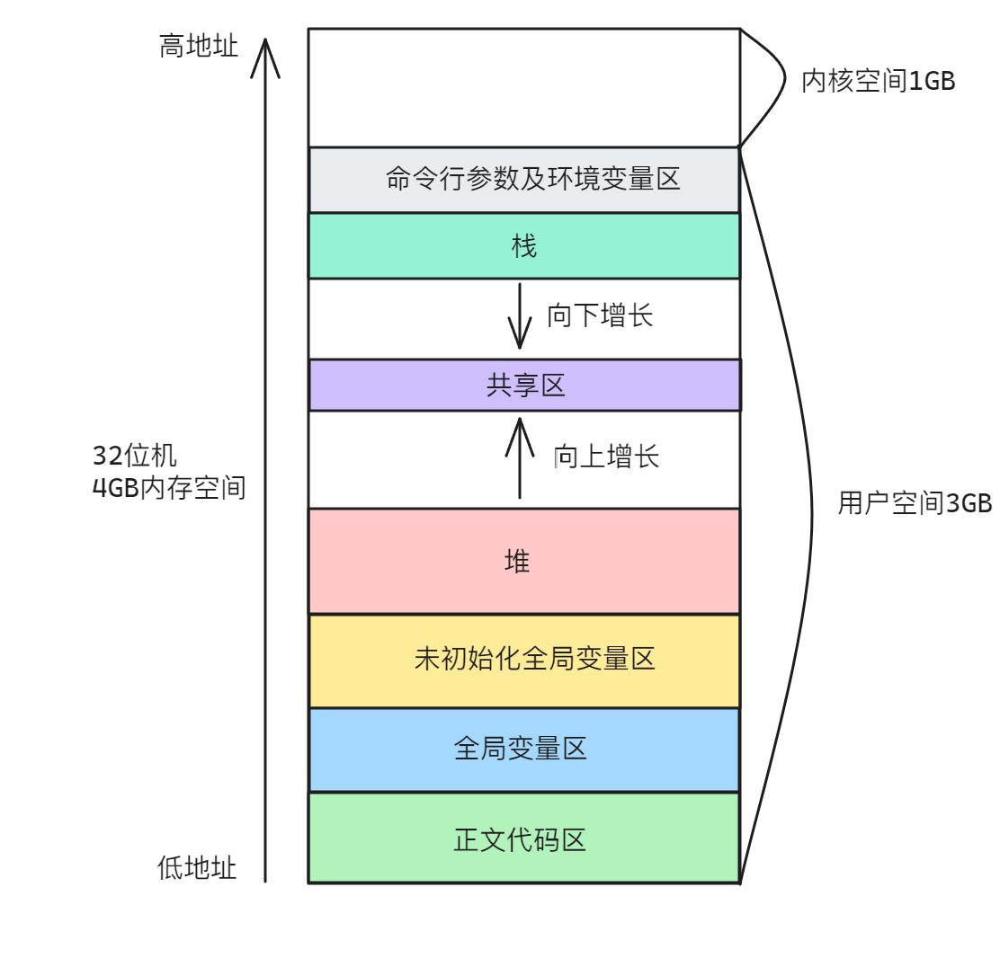
## 栈
- 运行时的栈中的项目被称为活动记录（栈帧），栈帧包含函数/方法调用所需的所有信息，包括函数的参数、局部变量、返回地址、返回值、寄存器的状态等，用于调用和返回。
- 运行时的栈从高地址向低地址增长。
- 栈的大小是有限的，当栈的大小达到系统指定的限制或触及堆区时，栈溢出（stack overflow）错误就会发生。
## 进程控制块
进程控制块（Process Control Block，PCB）是操作系统用来管理进程的重要数据结构。它包含了进程的各种属性，如进程标识符、进程状态、进程优先级、内存分配、打开的文件、使用的资源、进程调度信息等。

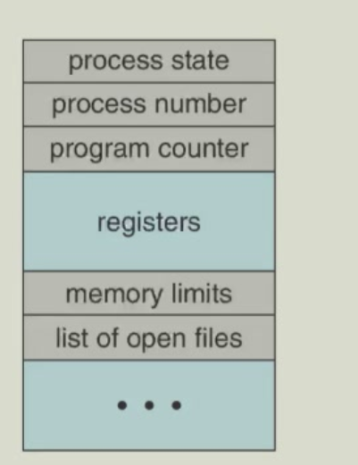

## 进程状态变化
当进程运行时，其状态会发生变化，可以分为以下几种：

- 新建(New)：进程正在创建中
- 运行(Running)：指令正在执行
- 等待(Waiting)：进程正在等待某些事件的发生
- 就绪(Ready)：进程正在等待被分配处理器
- 终止(Terminated)：进程已结束执行

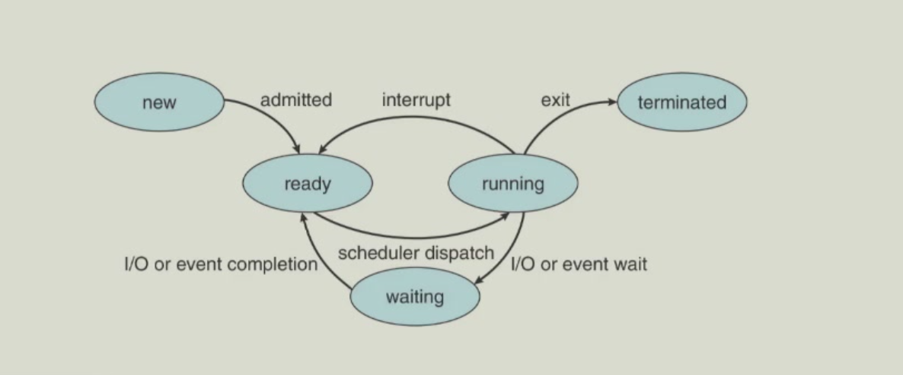

### 进程创建
进程可以创建新进程，此时它将成为父进程，每个进程都有一个进程ID，称为PID。PPID（Parent Process ID）是创建该进程的父进程的PID。  
由于此，我们可以获得一个进程树。

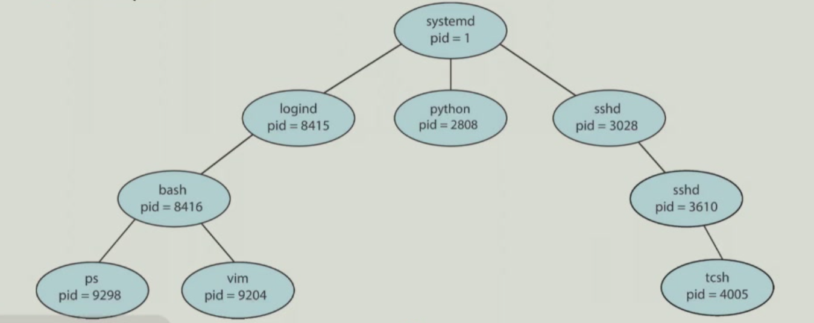

子进程可以继承/共享其父进程的资源，或可以拥有全新的资源。

#### fork()系统调用
fork()系统调用创建一个新的进程，它复制了父进程的地址空间，包括代码段、数据段、堆、栈等。但新进程的PID不同于父进程的PID，且其资源利用率（到目前位置）设置为0。
fork()将子项的PID返回给父进程，将0返回给子进程。

Unix示例：
- fork()函数：调用创建新进程
- execve()函数：调用在fork()之后用于替换子进程内存空间为新程序
- 父进程调用wait()函数等待子进程结束
#### exec()系统调用
exec()系统调用用于替换当前进程的内存空间，并加载新的程序。父空间中的代码段、数据段、堆、栈等都将被新程序替换。
在C语言中，这类函数的标准名称是execl、execle、execv、execvp、execve。
Linux内核有一个名为execve()的系统调用，而前面提到的所有函数都是基于此调用实现的。
直观上来看，在一个C程序中，在execve()函数之后的代码行都不会执行。

### 进程终止
进程通过exit()系统调用来终止自身。进程的所有资源由操作系统解除分配，并释放到系统中。  
一个进程可以导致另一个进程终止：使用"signal"和kill()系统调用。
#### wait()系统调用
wait()系统调用用于父进程等待子进程结束。

- wait()调用阻塞父进程直到子进程终止，返回已完成的子进程的进程ID和子进程的退出代码。
- waitpod()调用会阻塞父进程直到特定进程终止。 

### signal()系统调用
进程可以接受信号，例如：软件终止。它是程序必须以某种方式处理的异步事件。信号有很多用途，包括进程同步等。  
操作系统定义了很多信号，每个信号都有自己的名称和编号。
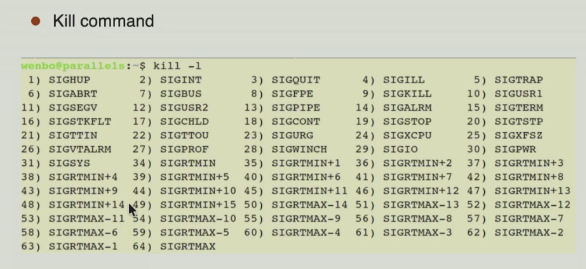
每个信号都会在进程中引发特定行为。例如，SIGINT信号会终止进程。  
但大多数信号可以被忽略，或者通过用户自定义的处理函数来执行某些操作。（像SIGKILL和SIGSTOP这样的信号出于安全考虑不能被忽略或被用户处理）

signal()系统调用允许进程对指定信号进行处理

- signal(SIGINT,SIG_IGN) 忽略SIGINT信号
- signal(SIGINT,SIG_DFL) 设置默认行为
- signal(SIGINT,my_handler) 自定义处理函数（处理函数定义为void my_handler(int signum)）
### 僵尸进程
当一个进程终止但其父进程还没有调用wait()或waitpid()来获取其退出状态时，该进程称为僵尸进程。    
僵尸进程是系统资源的浪费，因此操作系统会自动回收其资源。   
PCB中仍然保留了该进程的信息。  
僵尸进程会持续存在直到父进程调用wait()或waitpid()来获取其退出状态或者父进程终止。  
避免僵尸进程的方法：
- 父进程调用wait()或waitpid()来获取子进程的退出状态。
- 父进程将处理程序关联到SIGCHLD信号，以便在子进程终止时通知父进程。
### 孤儿进程
当父进程终止时，其所有子进程变成孤儿进程。孤儿进程是父进程的资源的浪费。  
孤儿进程将被进程1接管。进程1通过SIGCHLD信号处理程序调用wait()来处理子进程终止，因此孤儿进程不会变成僵尸进程。  
## 进程调度
- 最大化 CPU 利用率，快速将进程切换至 CPU 核心执行
- 进程调度器 负责从就绪进程中选择下一个在 CPU 核心上执行的进程
- 维护进程的调度队列
    - 就绪队列：位于主存中所有已准备就绪、等待执行的进程集合
    - 等待队列：等待某事件（如I/O操作）的进程集合
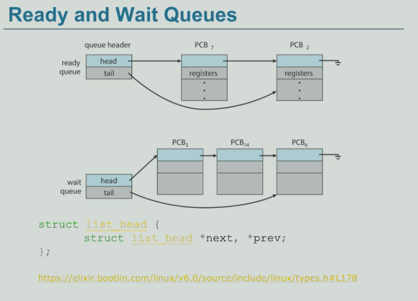
### 上下文切换
进程的状态主要由进程的PC、通用寄存器(GPR)、控制与状态寄存器(CSR)、内存等等组成。  
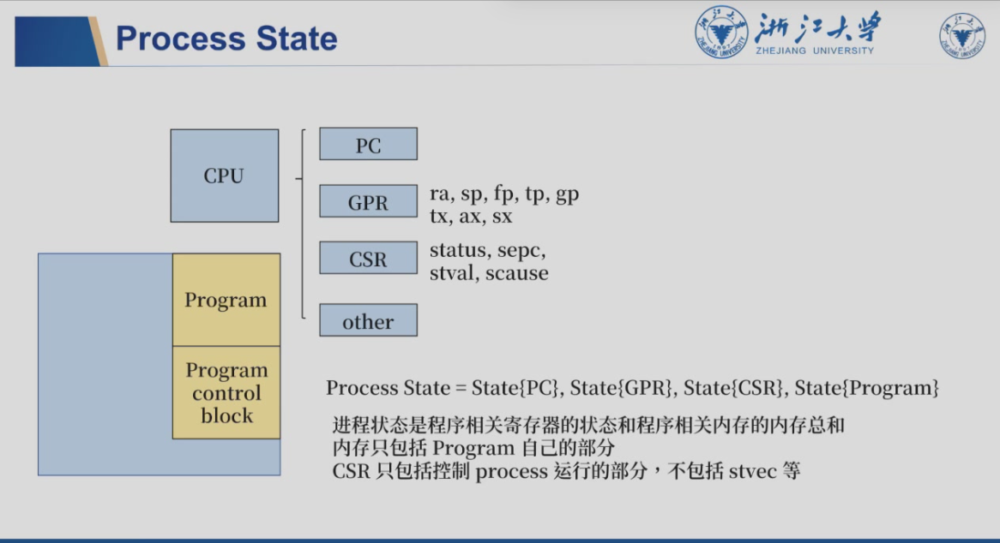
- 当 CPU 切换到另一个进程时，系统必须保存旧进程的状态，并通过上下文切换为新进程加载已保存的状态

- 进程的上下文保存在进程控制块（PCB）中
- 上下文切换时间属于系统开销；切换过程中系统不执行任何有效工作，操作系统和 PCB 越复杂，上下文切换时间越长。

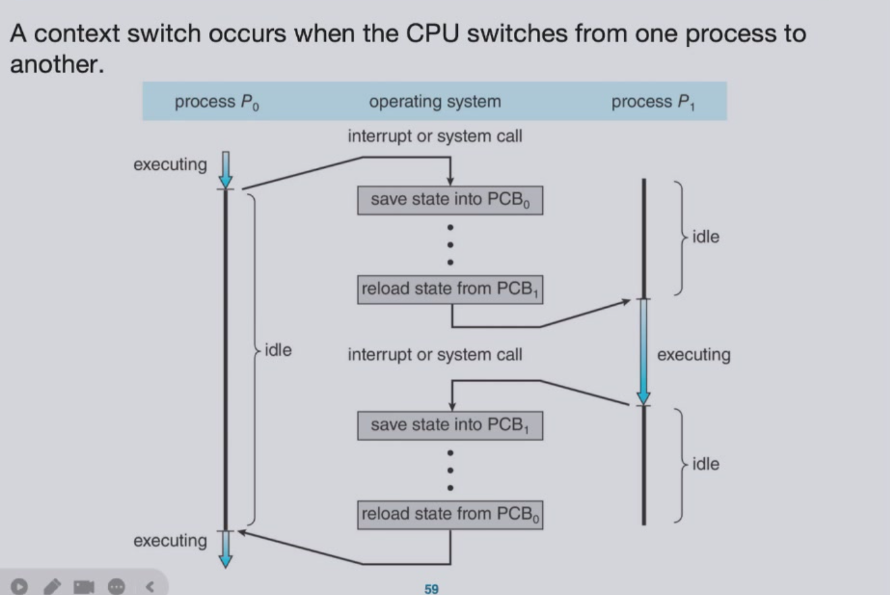

- 上下文切换需要栈的切换和CPU的切换。下面是一个典型的上下文切换过程，上下文切换一定会发生在内核态。

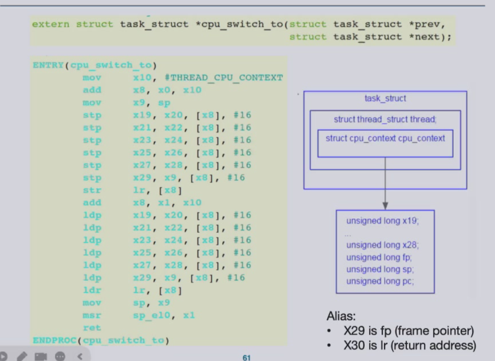
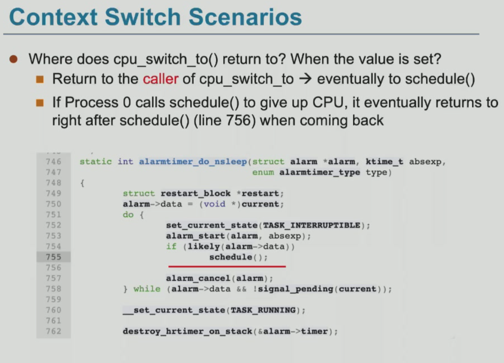

以下是一个描述 ARM 架构下 Linux 内核中任务上下文切换与堆栈结构的示意图：

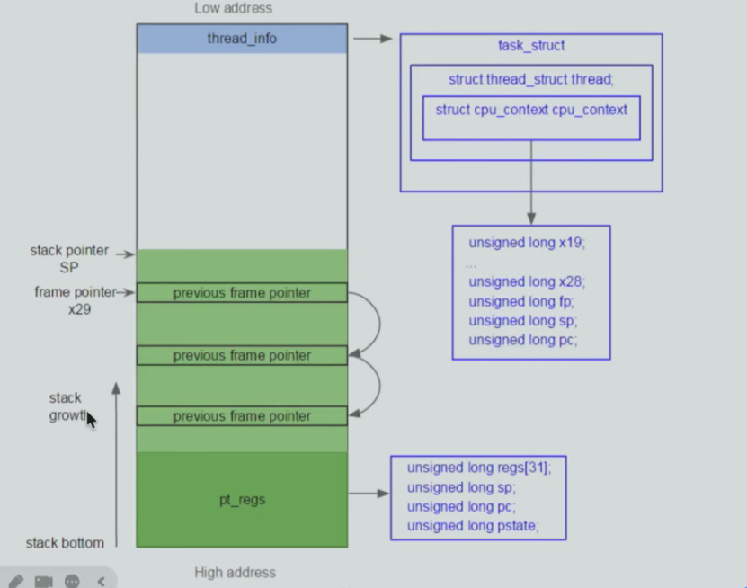
#### 内核线程的上下文切换
上下文在何时何地被保存？

- 时间：在context_switch时，更具体的说，是在cpu_switch时切换。
- 地点：在PCB中，更具体的是在cpu_context中。

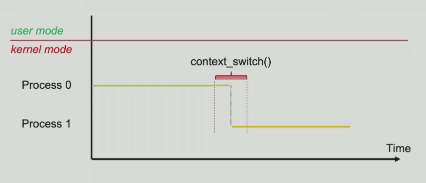
#### 用户线程的上下文切换
由于只有在内核态才能进行进程切换，因此用户线程在进行上下文切换时，需要先进入内核态，然后再切换到另一个进程。
用户上下文（regs）在何时何地被保存？

- 时间：在kernal_entry时
- 地点：在user_context中，更具体的说是在pt_regs中。

内核上下文保存参照内核线程的上下文切换。
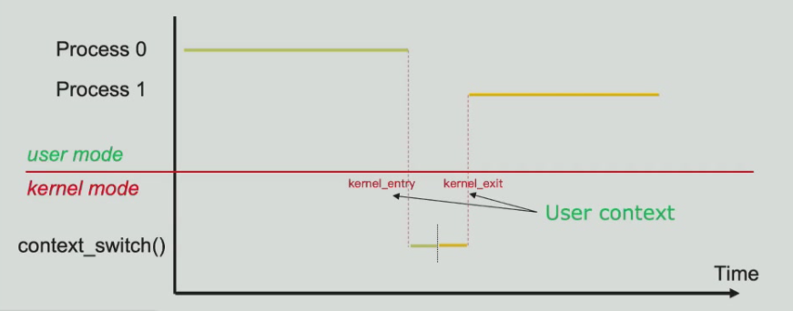
#### fork()函数的具体实现
从操作系统视角来看，在用户态调用 fork()时，最终会触发一个软中断（或系统调用指令），进入内核态。  

内核执行 sys_fork()（或类似函数），为新进程创建一套新的资源（复制父进程的PCB，user的栈等，内核栈不会复制），分配新的PID给子进程。

在准备返回用户态之前，内核会修改两个进程的上下文中的返回值为它们的PID：子进程的PID为0，父进程的PID为子进程的PID。 

然后，父进程和子进程都返回用户态，并继续执行。

这就导致fork()会返回两个值：子进程的PID和父进程的PID。