# CPU 调度

CPU 调度是指操作系统做出的决策，用于确定应该运行哪些就绪的进程/线程以及运行多长时间。

## 调度策略
CPU调度分为两种：

- 非抢占式调度（Non-preemptive scheduling）：进程持有CPU直到它自愿放弃。
- 抢占式调度（Preemptive scheduling）：进程可能被抢占，即使它本可以继续执行。

目前，大部分操作系统都采用抢占式调度。

## 调度目标
调度的目标有很多，其中有些甚至可以说是相互矛盾的。

- 最大化CPU利用率
- 最大化吞吐量
- 最小化周转时间（从进程创建到完成的时间）
- 最小化等待时间（进程在就绪状态的时间）
- 最小化响应时间

## 调度算法
### 先来先服务（FCFS）
先来先服务调度算法（First-Come First-Served，FCFS）是最简单的调度算法。

按照进程到达的顺序，将就绪进程按顺序排队，每次调度时，将队首的进程分配给CPU执行。

### 短作业优先（Shortest Job First，SJF）
按照运行时间最短的进程优先调度。当有新的进程进入就绪队列时，若当前执行的进程的剩余运行时间小于新进程的运行时间，则新进程抢占当前进程的执行。

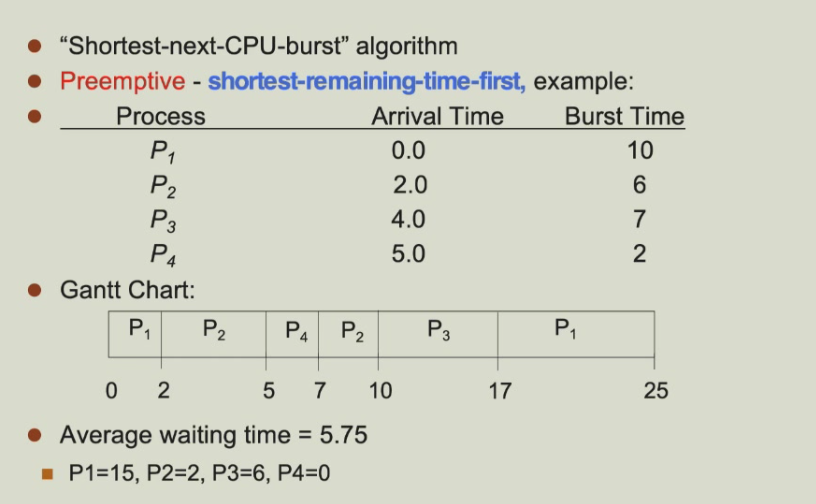

SJF具有最小的平均等待时间。

问题是，我们无法准确得知各进程的执行时间，以下是预测的一种手段：

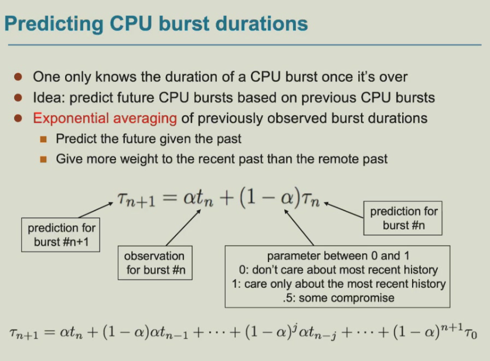
### 轮转调度（Round-robin scheduling，RR）
RR调度定义了一个时间片，每个进程被分配一个时间片，时间片结束后，进程被抢占并进入下一个队列，若进程在时间片内完成，则自动进入下一个进程。

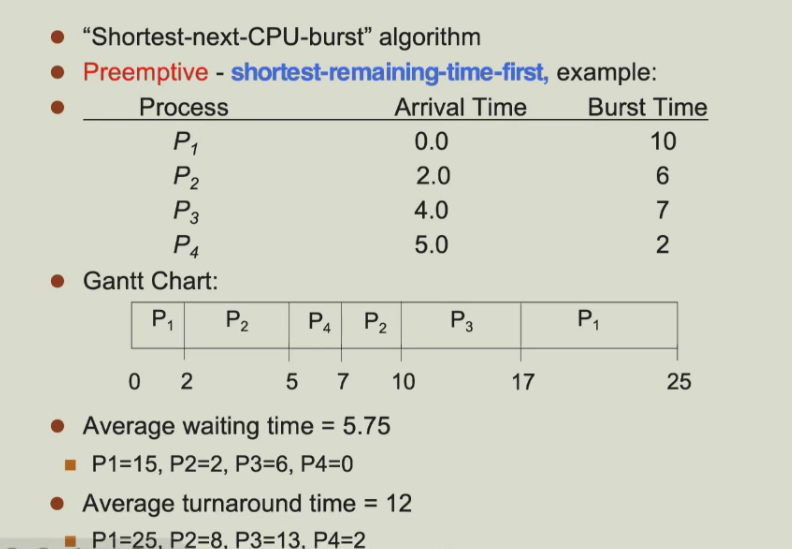

RR调度算法的效率与时间片的大小有关。时间片越小，响应/交互性越好，但系统开销也越大；时间片越大，响应/交互性差，但开销低。（当时间片非常长时，RR调度算法退化为FCFS算法）

### 优先级调度（Priority scheduling）
优先级调度是指根据进程的优先级来确定调度顺序。优先级高的进程排在队列前面，优先级低的进程排在队列后面。

优先级可以是内部的：如SJF算法中，优先级高的进程具有短的执行时间；也可以是外部的：如用户指定的优先级。

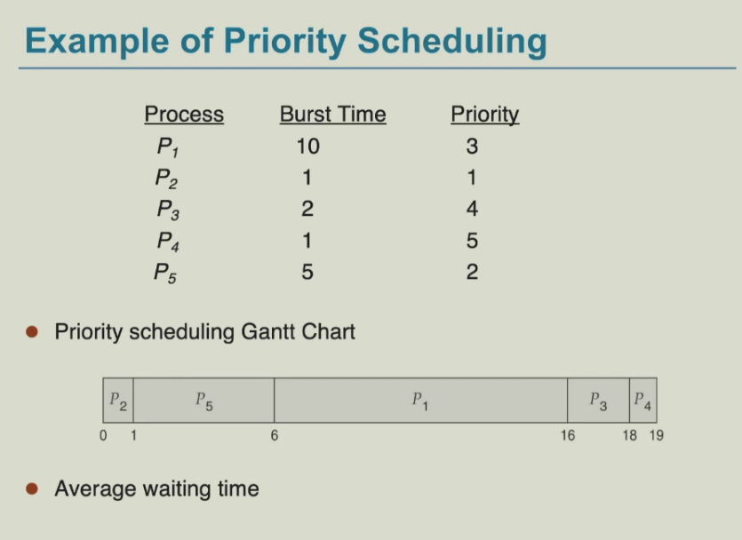

优先级调度也可以和轮转调度结合起来。

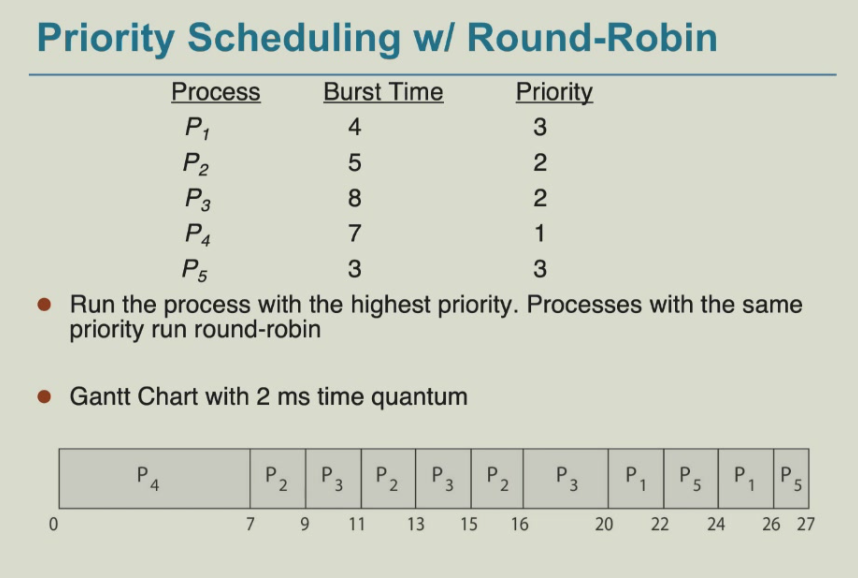

优先级调度的问题是低优先级的进程可能永远得不到执行，因为它们总是被高优先级进程抢占。

### 多级队列调度（Multilevel queue scheduling）
多级队列调度是指将进程划分为多个队列，每个队列有不同的调度策略（例如高级优先队列可采用RR算法，低级优先队列采用FCFS算法）。队列间也需要进行调度（例如高级优先队列的进程抢占低级优先队列的进程或带权重的轮换调度）。

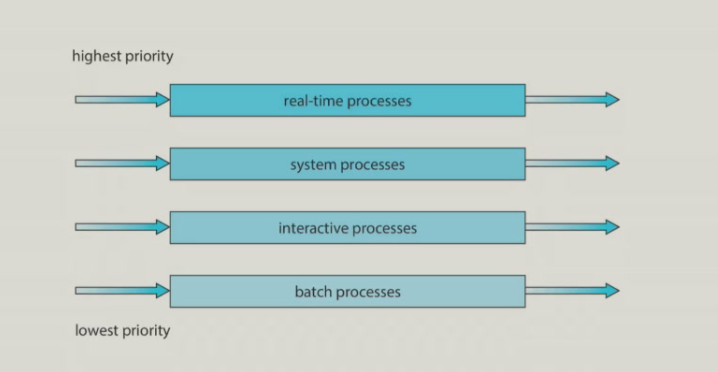

### 多级反馈队列调度（Multilevel feedback queue scheduling）
多级反馈队列调度是指将进程划分为多个队列，每个队列有不同的调度策略，同时还设置了反馈队列。根据进程使用CPU的情况，来调整进程的优先级。

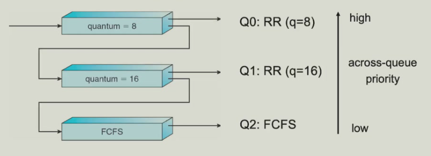

以下是多级反馈队列调度的一种反馈机制：

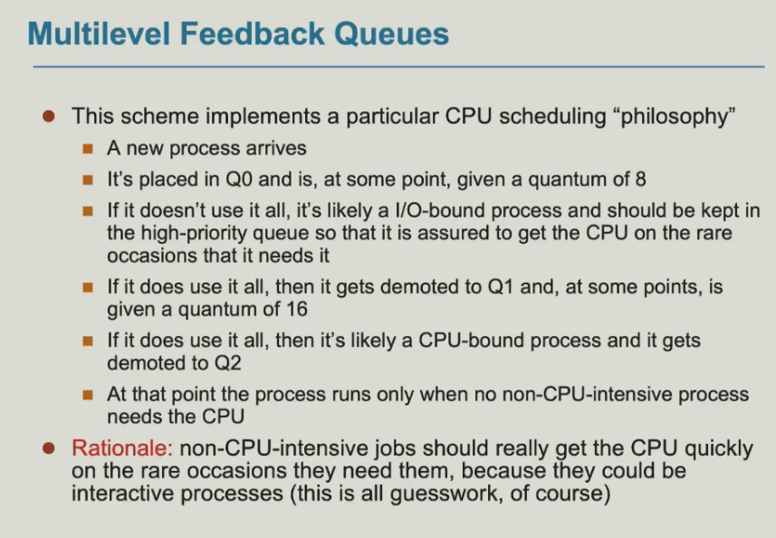
### 多处理器调度
对称多处理器（SMP）是指每个处理器都自行进行调度。
所有线程可能位于一个公共队列中，每个处理器可能有自己的线程私有队列。

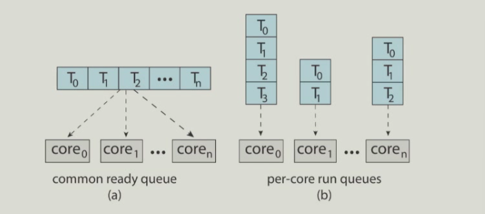

每个核心（处理器）可以有多个线程调度队列，利用内存停滞周期，在内存读取发生时，可以将线程从一个队列移动到另一个队列，推进另一个线程的执行。

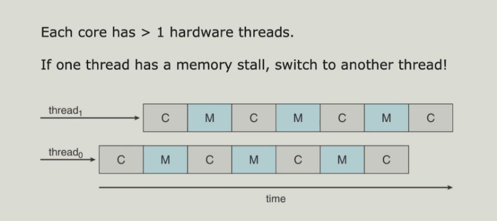

多线程多核系统有两级调度：操作系统决定在逻辑CPU上运行哪个软件线程，每个核心如何决定在物理核心上运行哪个硬件进程。

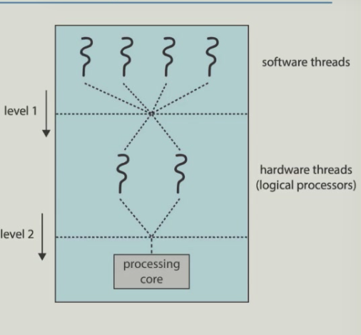

若为对称多处理器（SMP），需保证所有CPU负载均衡以提高效率（使工作负载均匀分布）。

- 推送迁移：周期性检查每个处理器的负载，若发现过载则将任务从过载CPU推送到空闲CPU。
- 拉取迁移：空闲处理器从繁忙处理器拉取任务，以提高处理器的利用率。

## Linux 中的系统调度
Linux中用Nice 值来设置进程的优先级，越小优先级越高。nice 值可以通过 `nice` 命令设置。
以下是Linux0.11版本的调度策略：
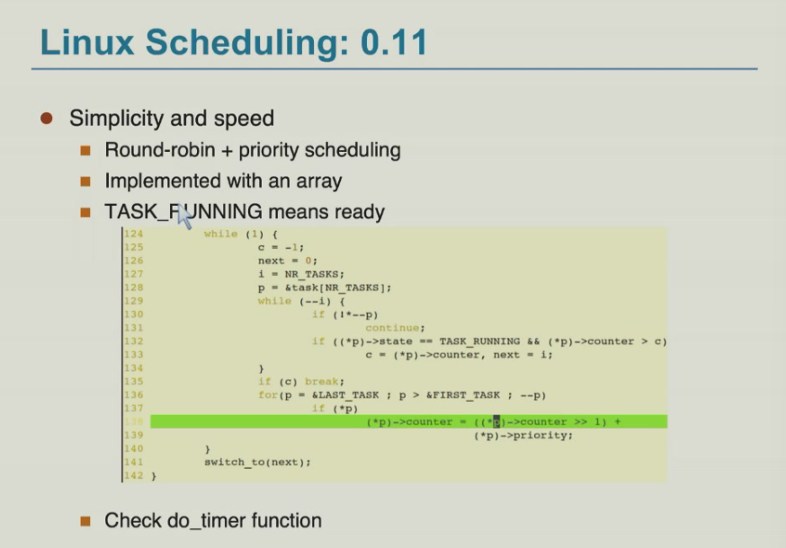
