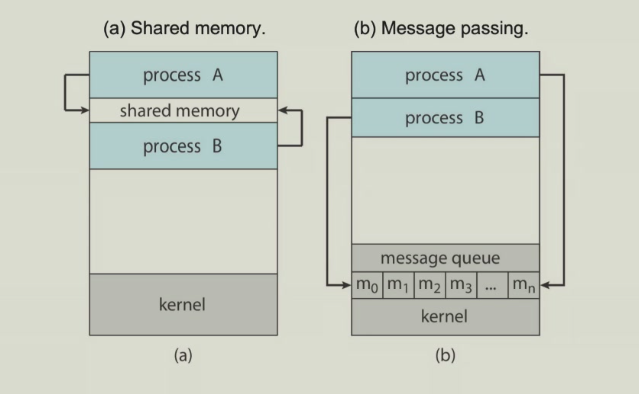

# 进程间通信
进程间通信(Inter-Process Communication,IPC)指的是在操作系统中，不同进程之间进行数据交换、信息传递和协调工作的技术机制。
## 通信模型
大多数操作系统都实现了信息传递（Message-passing）和共享内存（Shared memory）两种通信模型。

### 信息传递模型
- 适用于交换少量数据
- 在操作系统中易于实现
- 对用户来说有时较为繁琐，因为代码中穿插着大量`send()`和`receive()`操作。
### 共享内存模型
- 开销较低
- 对用户更方便
- 在操作系统中实现困难

## 管道（Pipe）
### Ordinary Pipe
- 一个进程写，一个进程读
- 一般是父子进程间单向通信
- 进程外无法访问
### Named Pipe
- 两个进程之间双向通信
- 通过文件系统
- 有名管道是一种特殊类型的文件，它允许无关的进程之间进行通信
- 与无名管道不同，有名管道有一个路径名与之关联，以mkfifo()创建