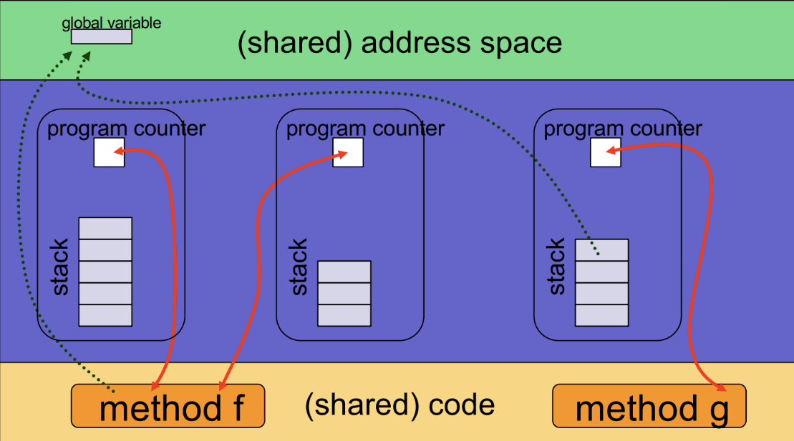
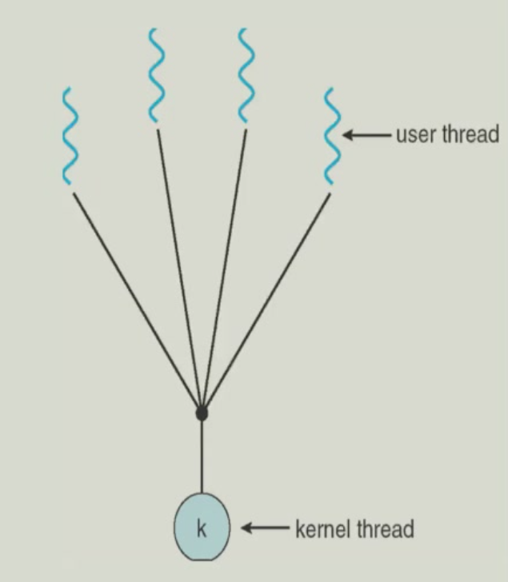
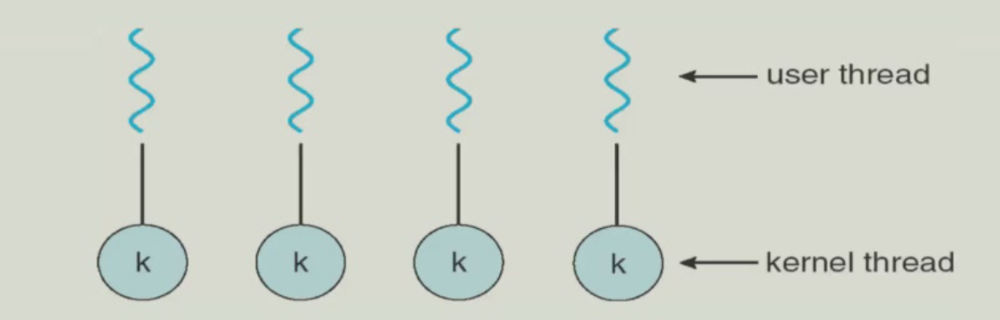
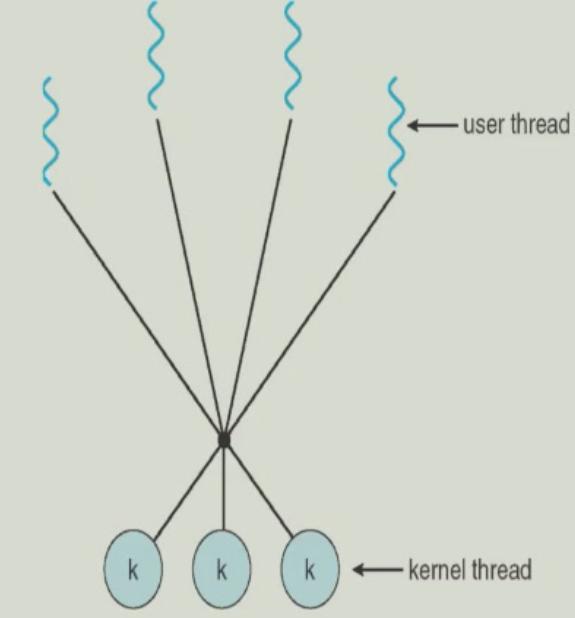
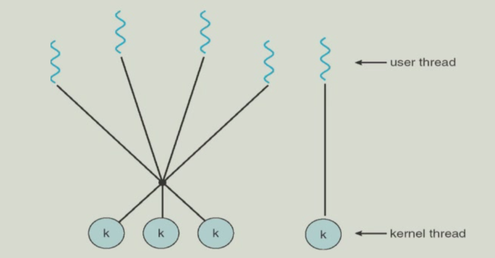
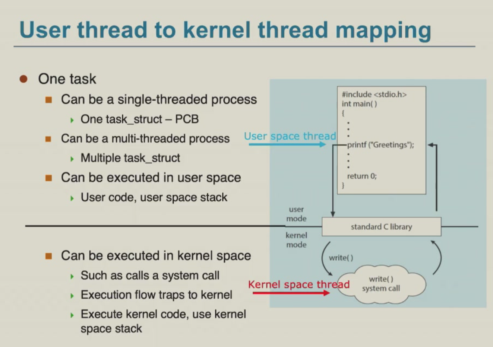

# 线程（Thread）
## 线程的概念
线程是操作系统能够进行运算调度的最小单位，它被包含在进程之中，是进程中的执行单元。一个进程可以由多个线程组成，每条线程并行执行不同的任务。每个线程有自己的 Stack， PC和register set，但是共享 data section，heap(dynamic allocated memory) 和 code section。

进程按线程个数分为：

- 单线程进程（Single-threaded Process）：一个进程只有一个线程，通常是执行一个任务。
- 多线程进程（Multi-threaded Process）：一个进程可以有多个线程，每个线程执行不同的任务。

## 线程的优势
- Economical：创建线程比创建进程开销更少（Code Section、Data Section、Heap 已经被加载），线程之间的上下文切换（Context Switch）也很方便。
- Resource Sharing：线程本身就是共享资源的。不用IPC（Inter-Process Communication）来通信，而是直接访问共享资源。
- Responsiveness：线程间可以并行执行，提高程序的响应速度。
- Scalability：同时运行多个线程可以更有效地利用机器资源。

## 线程的缺点
- 隔离性差：一个线程崩溃会导致整个进程崩溃，且很难知道是哪个线程出了问题。

## 线程模型
### Many-to-one 模型
- 多个User Thread映射到一个Kernel Thread
- 无法很好利用多核架构
- 一个User Thread阻塞会导致整个进程阻塞

### One-to-one 模型
- 一个User Thread映射到一个Kernel Thread
- 创建新线程需要内核的工作，开销大。

### Many-to-many 模型
- 多个User Thread映射到多个Kernel Thread
- 如果一个User Thread阻塞，Kernel 创造出一个新的 Kernel Thread，避免整个进程阻塞

### Two-level 模型
- 高级线程（User Thread）映射到低级线程（Kernel Thread）
- 高级线程创建低级线程，并管理它们

## 用户线程到内核线程的映射
一个 Task 可以在 User Mode 下执行线程，此时使用 User Code & User Stack，也可以在 Kernel Mode 下执行（例如调用个 Syscall），使用 Kernel Code & Kernel Stack

