# 同步
## 竞态条件（Race Condition）
当多个进程（或线程）并发地访问和操作同一数据，且执行结果依赖于访问发生的特定顺序时，这种情况称之为竞态条件。  
如下图是一个例子:

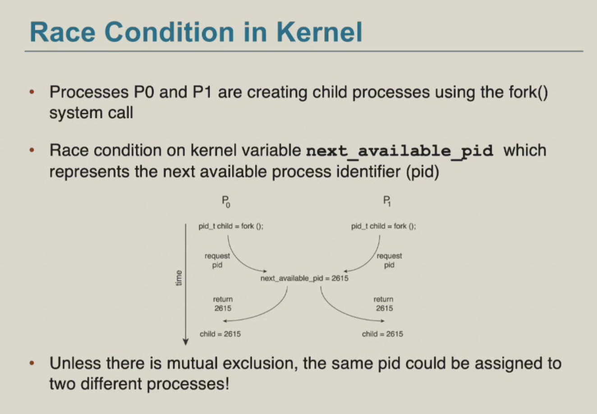
## 临界区
在竞态条件发生时，临界区（Critical Section）保证被多个进程共享的资源，在同一时刻只能被一个进程访问。  

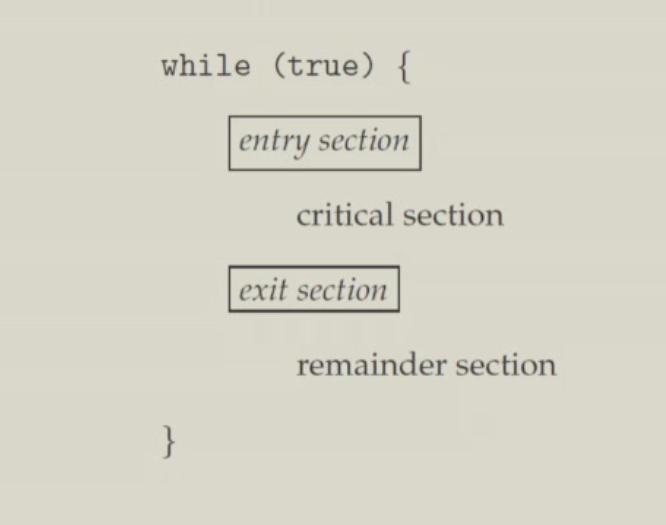

临界区需要满足以下三个条件：

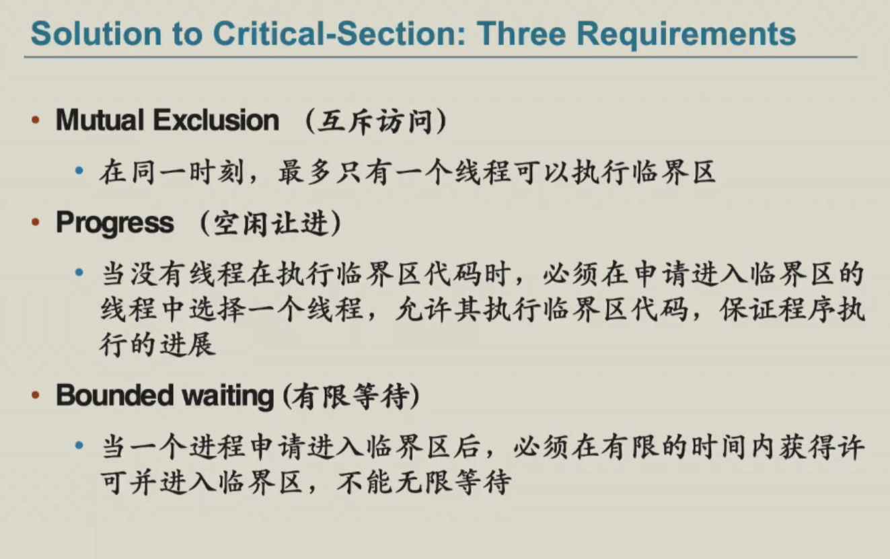
### Peterson's Solution
- 两个线程的 Mutual Exclusion（只适用于两个线程）
- 假设 Load 和 Store 是原子操作（不可被中断）
- 两个进程共享下面这两个变量作为属性：                     
    - flag[2]: 进程是否准备好进入临界区
    - int turn: 轮到哪个进程进入临界区


Peterson 是有缺陷的，一是只适用两个线程，二是可能会导致处理器或编译器对操作指令进行重排序，这可能在多线程里会导致非预期的结果。

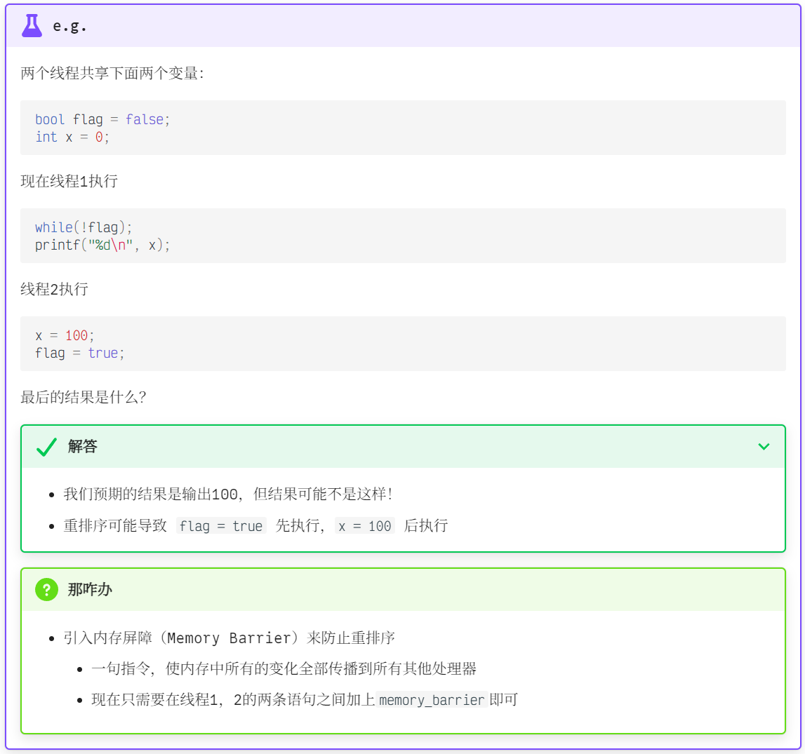

以下是添加Memory Barrier后的实现：

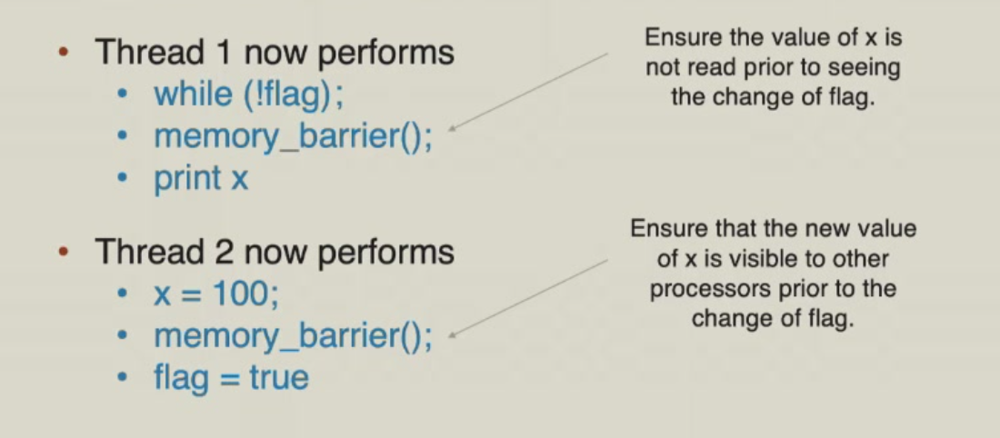


### 硬件支持
我们有硬件的指令来支持同步。这些硬件指令具有原子性。
#### Test-and-Set

``` 
bool test_set (bool *target)
{
    bool rv = *target;
    *target = TRUE;
    return rv:
}

// 实现一个 lock(shared variable)
do {
    while (test_set(&lock)); // 如果一个线程先把 lock 设置为 TRUE，那么其他线程到这一行就等待住了
    // Critical Section
    lock = FALSE;
    // Remainder Section
} while (TRUE);
```
Test-and-Set满足Mutual Exclusion和Progress，但不满足Bounded Waiting。
#### Compare-and-Swap
```
int compare_and_swap(int *value, int expected, int new_value)
{
    int temp = *value;
    if (*value == expected)
        *value = new_value;
    return temp;
}

// 还是实现一个线程共享的 lock
do {
    while (compare_and_swap(&lock, 0, 1) != 0);
    // Critical Section
    lock = 0;
    // Remainder Section
} while (TRUE);
```
### 互斥锁(Mutex Lock)
互斥锁是一种同步机制，用于控制对共享资源的访问。通过对锁的获取与释放来保护临界区。互斥锁的acquire()和release()操作必须是原子操作，通常可以通过硬件原子指令（如Compare-and-Swap）实现。

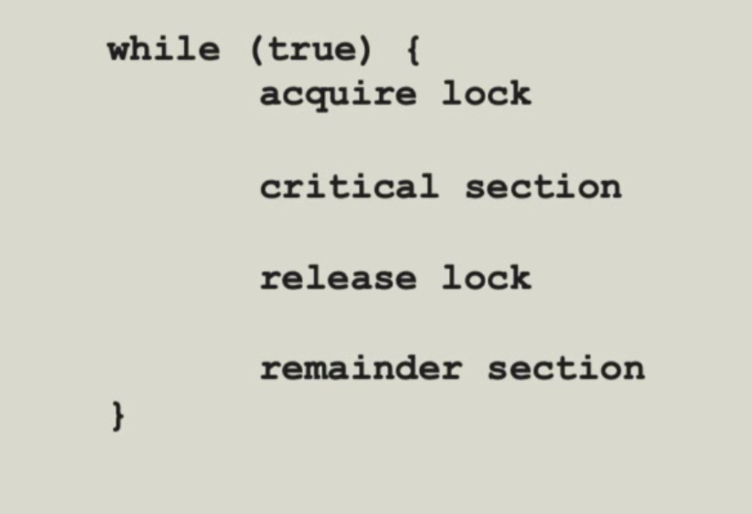

互斥锁有一个缺点是，当一个线程持有锁时，其他线程只能等待，不能抢占，即会有忙等待（Busy waiting），因此这种锁被称为自旋锁（Spin Lock）。其他线程在忙等待时，会导致CPU资源的浪费，以下是一个例子。

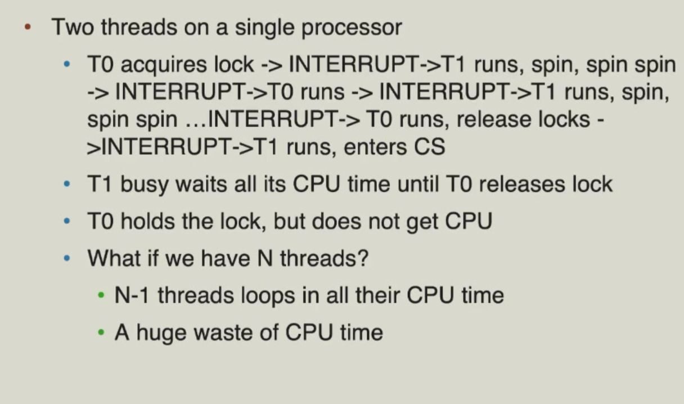

### Semaphore
为了解决忙等待问题，我们需要一种机制使得忙等待线程被挂起，让它让出cpu，从运行状态转为睡眠状态，直到有其他线程释放了锁。

我们可以通过队列（Queue）来实现这个机制。当锁被占用时，新来的线程被加入到队列中，然后被阻塞。当锁被释放时，队列中的线程被唤醒，并被分配到cpu上运行。

Semaphore包含一个S（整数变量），只能通过两个原子操作访问：wait()和signal()。以下是一种简单实现。

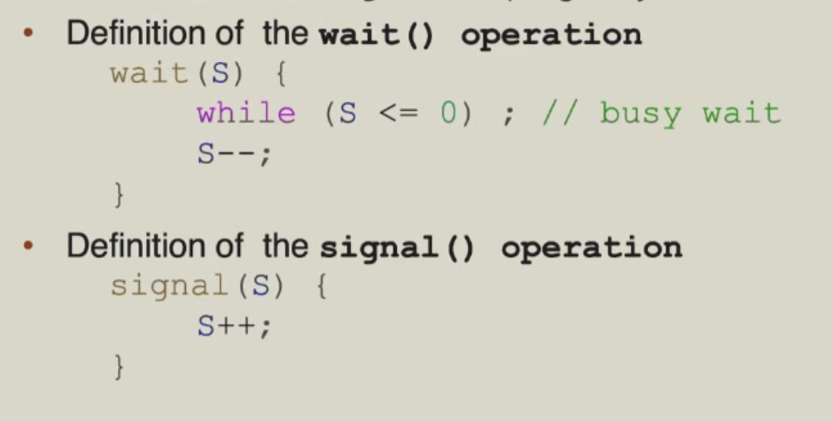

我们来考虑一种情况，需要保证线程$P_1$中的$S_1$在线程$P_2$中的$S_2$之前发生，我们初始化信号量`sem`为0。
```
P1:
    S1;
    signal(sem);

P2:
    wait(sem);
    S2;
```

当然每个semaphore都关联一个等待队列，当一个线程调用wait()时，它会被加入到等待队列中，并被阻塞。当一个线程调用signal()时，它会从等待队列中被唤醒，并被分配到cpu上运行。一个等待队列的实现如下：
```
typedef struct {
    int value;
    struct list_head wait_queue;
} semaphore;
```
以下是关联等待队列的signal()和wait()函数
```
wait(semaphore *S){
    S->value--;
    if(S->value < 0){
        add this process to S->wait_queue;
       }
}
signal(semaphore *S){
    S->value++;
    if(S->value <= 0){
        remove a proc.P from S->wait_queue;
        wakeup(P);
    }
}
```
### 信号量与互斥锁的比较
- 互斥锁的优点是无阻塞，缺点是在忙等待时浪费cpu资源。适用于短临界区（与contact switch比较）。
- 信号量的优点是没有忙等待，缺点是上下文切换耗时长。适用于长临界区。


## 典型问题
### 有界缓冲区问题
- 两类进程：生产者和消费者共享n个缓冲区。  
    - 生产者生成数据，并将其放入缓冲区。  
    - 消费者从缓冲区中取出数据并进行消费。  

- 问题的核心在于确保：  
    - 生产者不会在缓冲区已满时尝试向其中添加数据。  
    - 消费者不会在缓冲区为空时尝试从中取出数据。  
  该问题也称为生产者-消费者问题。  

- 解决方法：  
  - 设有 N 个缓冲区，每个可存放一个数据项。  
  - 信号量 mutex 初始化为 1。  
  - 信号量 full-slots 初始化为 0。  
  - 信号量 empty-slots 初始化为 N。

- 生产者进程：
```
do {
//produce an item
wait(empty-slots); // wait until there is an empty slot
wait(mutex); // wait until the buffer is not full
// add the item to the buffer
signal(mutex); // signal that the buffer is not full
signal(full-slots); // signal that there is a full slot
} while (TRUE);
```

- 消费者进程：
```
do {
//consume an item
wait(full-slots); // wait until there is a full slot
wait(mutex); // wait until the buffer is not empty
// remove the item from the buffer
signal(mutex); // signal that the buffer is not empty
signal(empty-slots); // signal that there is an empty slot
} while (TRUE);
```

### 读者-写者问题

- 一个数据集被多个并发进程共享：
    - 读者：仅读取数据集，不进行任何更新操作。
    - 写者：既可以读取也可以写入数据。

- 读者-写者问题的要求：
    - 允许多个读者同时读取数据集（**共享访问**）。
    - 同一时间只允许一个写者访问共享数据（**独占访问**）。

- 解决方案：
    - 信号量 mutex 初始化为 1。
    - 信号量 write 初始化为 1。
    - 整型变量 readcount 初始化为 0。

- 写者进程：
```
do {
    wait(write); // wait until there is no writer and no reader    
    // write the data
    signal(write); // signal that there is no writer
} while (TRUE);
```
- 读者进程：
```
do {
    wait(mutex); // mutex protect the readcount
    readcount++; // increment the read count
    if (readcount == 1) {
        wait(write); // wait until there is no writer
    }
    signal(mutex); // signal that the readcount is not being written
    // read the data
    wait(mutex); // wait until no readers is changing the readcount
    readcount--; // decrement the read count
    if (readcount == 0) {
        signal(write); // signal that there is no writer
    }
    signal(mutex); // signal that no readers is changing the readcount
} while (TRUE);
```

- 读者-写者问题有两种变体（基于不同的优先级策略）：
    - **读者优先**
      - 除非有写者正在更新数据，否则不会让读者等待。
      - 如果已有读者持有数据，新读者可直接继续读取。
      - 写者可能因一直无法获得写入机会而饥饿。
    - **写者优先**
      - 一旦写者准备就绪，它将尽快执行写入。
      - 如果已有读者持有数据，新读者必须等待被挂起的写者完成。
- 上面的代码实现的是读者优先的策略。
#### 哲学家进餐问题
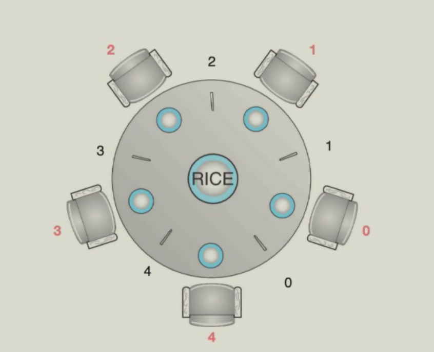

- 哲学家一生都在思考与进食，他们围坐在一张圆桌旁，但彼此不互动  

- 他们偶尔会尝试拿起两根筷子（一次一根）来进食  
    - 每两位相邻的哲学家之间放有一根筷子  
    - 需要同时持有两根筷子才能进食，用餐完毕后放下两根筷子  

- 哲学家就餐问题代表了**多资源同步**问题  
- “哲学家”的进程（假设有5个哲学家）
```
Philosopher i :
 do {
    wait(chopsticks[i]);
    wait(chopsticks[(i+1)%5]);
    // eat
    signal(chopsticks[i]);
    signal(chopsticks[(i+1)%5]);
    think
 } while (TRUE);
```
- 如果哲学家们同时拿起自己左手边的筷子，所有的筷子都被占用，导致死锁。
- 解决方法：奇数编号的哲学家先拿起左手边的筷子，偶数编号的哲学家先拿起右手边的筷子，这样就不会发生死锁。

## 死锁 (Deadlock)  
死锁情况是指一组被阻塞的进程，其中每个进程都持有一个资源，并等待获取该组中另一个进程所持有的资源。

以下是一个死锁的例子：

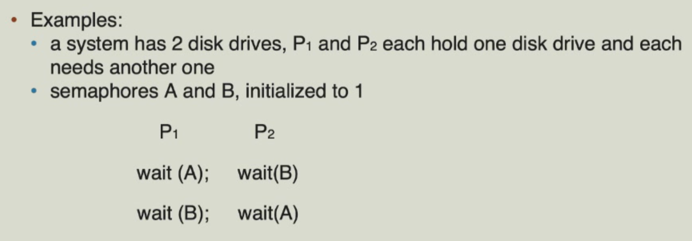


如果线程1获取了first_mutex，而线程2获取了 second_mutex，则可能发生死锁。随后，线程1等待 second_mutex，而线程2等待 first_mutex。这种情况可以用资源分配图来说明：
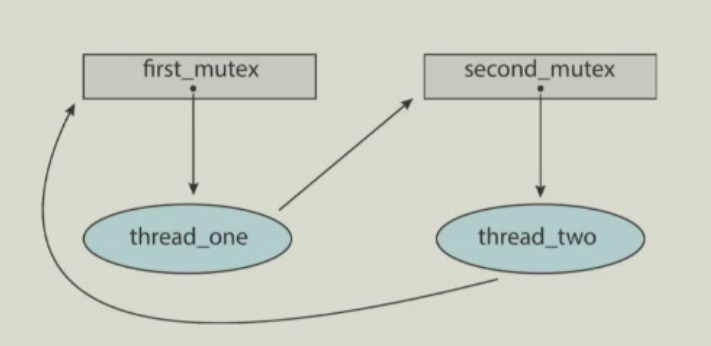

### 死锁发生的四个条件
- 互斥（Mutual Exclusion）：一个资源一次只能被一个进程使用。

- 持有并等待（Hold and Wait）：一个进程持有至少一个资源，并等待获取其他进程持有的额外资源。

- 非抢占（No Preemption）：资源只能由持有它的进程在完成任务后自愿释放。

- 循环等待（Circular Wait）：存在一个等待进程的集合 $\{P_0, P_1, \ldots, P_n\}$，其中：
    - $P_0$正在等待一个被 $P_1$ 持有的资源。
    - $P_1$ 正在等待一个被 $P_2$ 持有的资源。
    - $P_{n-1}$ 正在等待一个被$P_n$ 持有的资源。
    - $P_n$ 正在等待一个被 $P_0$持有的资源。

### 资源分配图
资源分配图的节点分为两种类型：

- $P = \{P_1, P_2, \ldots, P_n\}$，系统中所有进程的集合
- $R = \{R_1, R_2, \ldots, R_m\}$，系统中所有资源类型的集合

图也有两种类型的边：

- 请求边：有向边 $P_i \rightarrow R_j$
- 分配边：有向边 $R_j \rightarrow P_i$

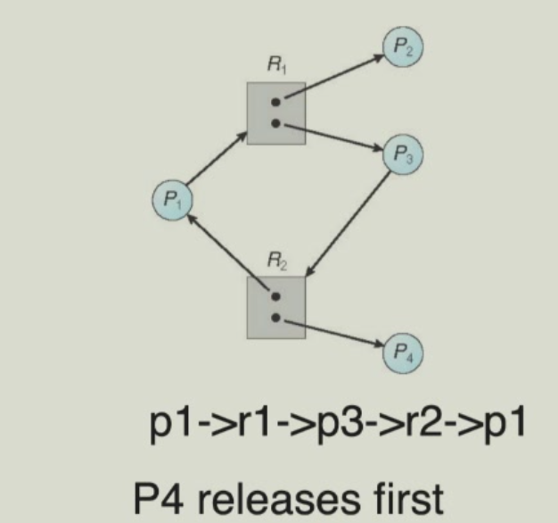

如上图就是一个资源分配图，其中：$p1-R1-p3-R2-p1$形成了一个环，但它并不会导致死锁，因为$R1$和$R2$都有两个可分配的实例资源，可见环的存在并不一定导致死锁。

如果资源分配图中不存在环，则就不会发生死锁。如果存在环，若涉及到的资源只有一个实例，则会发生死锁；若涉及到的资源有多个实例，则有可能会发生死锁。

### 死锁的处理策略
#### Deadlock Prevention
通过破坏死锁的四个条件中的一个或几个，来防止死锁发生。

- Prevent Hold and Wait:一个进程要么在执行前一次性 Request 所有资源，要么不持有任何资源。这会导致资源利用率降低，可能会导致 Starvation。
- Prevent No Preemption:如果进程请求的资源不可用，则释放其当前持有的所有资源，被抢占的资源会添加到其等待资源列表中，仅当进程能够获得所有等待的资源时，才会重新启动。  
- Prevent Circular Wait：对所有资源类型编号，要求每个进程按编号递增顺序请求资源。在动态获取锁的情形下不适用。

#### Deadlock Avoidance
让每个进程声明其可能需要的资源最大数量，使用死锁避免算法确保永远不会出现循环等待条件。

当进程请求一个可用资源时，系统必须判断立即分配是否会使系统处于安全状态（Safe State）：

- 系统中存在一个包含所有进程的序列 $P1, P2, ..., Pn$

- 对于每个 $Pi$，$Pi$ 仍可请求的资源能够由当前可用资源 + 所有前序进程所持有的资源满足

安全状态可以保证无死锁。不安全状态可能会导致死锁。

如果 $Pi$ 所需的资源无法立即获得，它需要等待直到所有前序进程执行完毕，之后$Pi$便可获得所需资源。

Deadlock Avoidance即是确保系统不会进入不安全状态，从而避免死锁。

Banker's Algorithm是一种死锁避免算法，它是基于资源分配图来实现的。（具体算法请参考：浙江大学 计算机系统2 卢立 2025-12-26第1-2节）以下只给出一个典例。

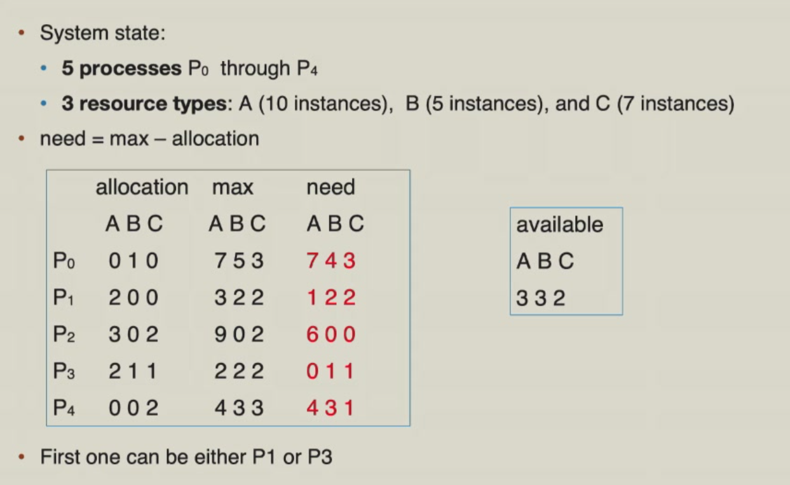
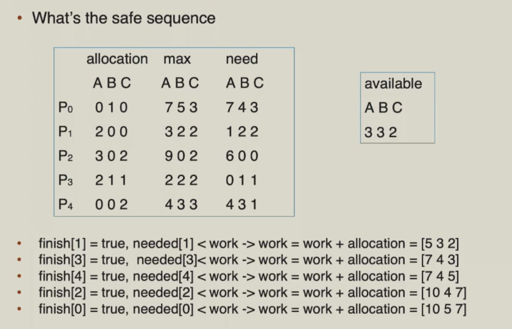

#### Deadlock Detection

若资源只有单实例，则可以将资源分配图中所有资源节点变为边，之后图只有进程节点，称为Wait-for Graph。然后检测这个图中有没有环即可。

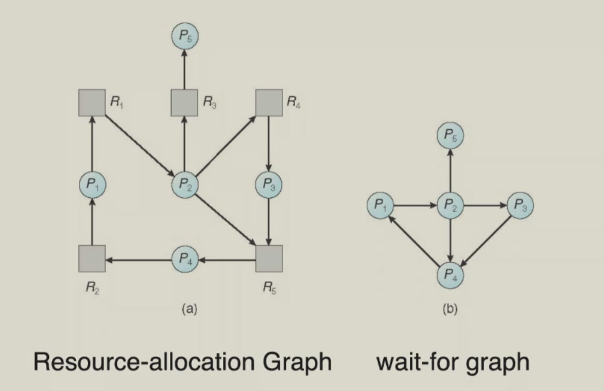

若资源有多个实例，则利用 Banker's Algorithm，鉴定一下当前能不能进入 Safe State，不能就说明可能有死锁。

#### Deadlock Recovery

Process Termination：一种解决方案是终止死锁进程。我们可以一次终止所有死锁进程，或一次终止一个进程，直到死锁循环被消除。终止进程的顺序有很多种选择，如按进程的优先级、进程已运行的时间、进程已使用的资源等来排序。

Resource Preemption：另一种解决方案是抢占资源。当进程申请资源失败时，选择一个进程，释放资源，回滚到某个 Checkpoint，重新开始执行。但这样容易导致Starvation。
