# MIMD

MIMD 是 Multiple Instruction, Multiple Data（多指令流多数据流）的缩写，是一种并行计算架构。

## MIMD架构

MIMD架构主要有两种：多处理器系统和多计算机系统。

多处理器系统基于共享内存来实现。即系统中只有一个统一的地址空间，所有处理器共享该地址空间。统一的地址空间并不意味着物理上只有一块内存。共享地址空间可以通过物理上共享的内存实现，也可以通过分布式内存在软硬件支持下实现。

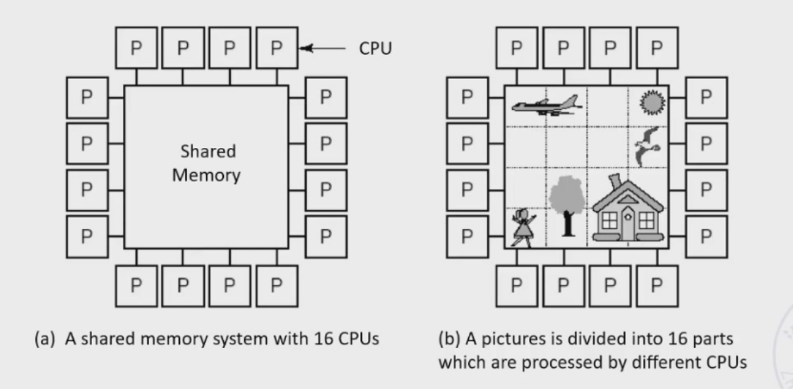

多计算机系统则是基于消息传递来实现。每个处理器拥有自己的内存，该内存只能由该处理器自身访问，其他处理器无法直接访问。这类内存称为本地内存或私有内存。当处理器 A 需要向处理器 B 发送数据时，A 以消息的形式将数据发送给 B。

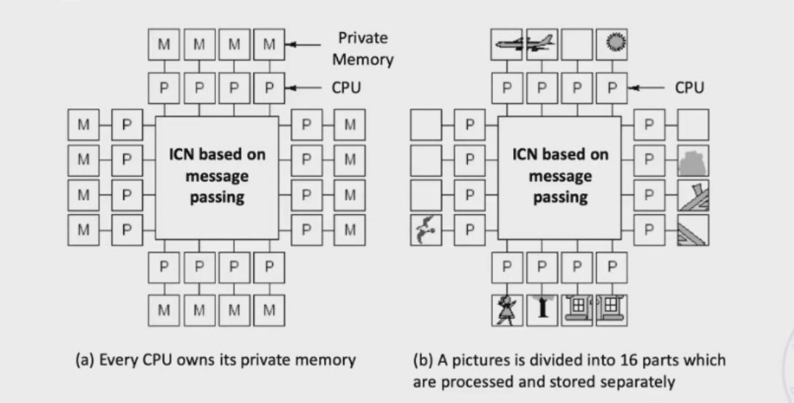

多处理器系统有不同的内存访问模型：统一内存访问（UMA）、非统一内存访问（NUMA）和仅高速缓存内存访问（COMA）

在 UMA 系统中，物理内存由所有处理器统一共享。所有处理器访问任何内存字所需的时间相同。每个处理器可配备私有高速缓存或私有存储器。

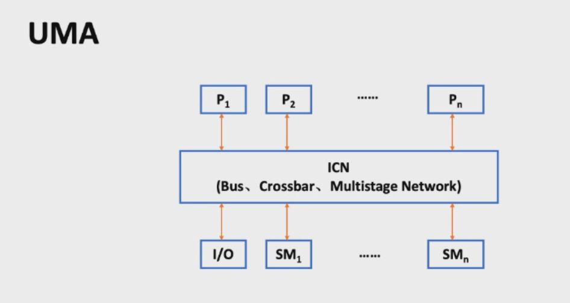

以下是一个基于总线的 UMA 系统的示例：

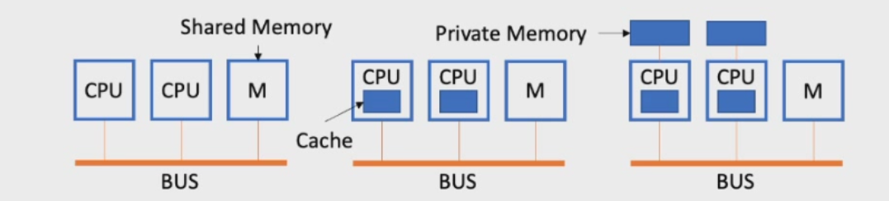

非统一内存访问（NUMA）系统中，物理内存由多个处理器共享，但每个处理器的内存访问速度不同。

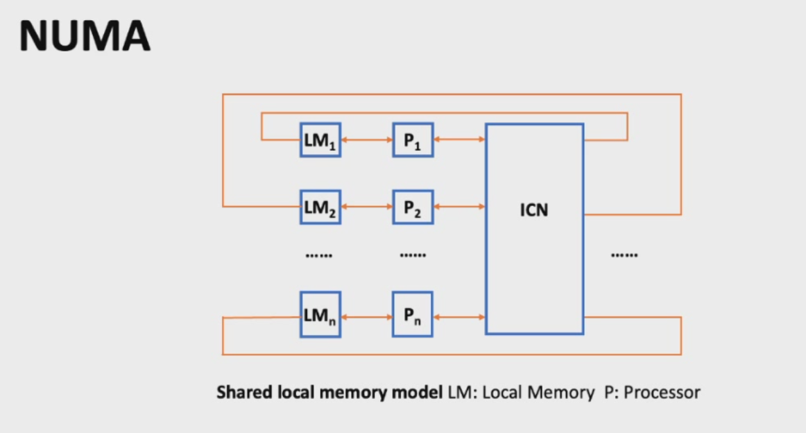

在NUMA 系统中，所有 CPU 共享统一的地址空间。使用加载（LOAD）和存储（STORE）指令访问远程内存，访问远程内存比访问本地内存速度慢。NUMA 系统中的处理器可以使用**高速缓存**。

不带高速缓存的 NUMA 系统称为 NC‑NUMA 多处理器系统。如果使用高速缓存，则该系统称为 CC‑NUMA 多处理器系统。

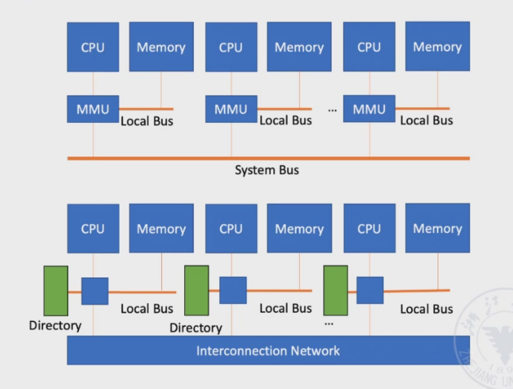

UMA 也称为对称（共享内存）多处理器（SMP）或集中式共享内存多处理器。NUMA 称为分布式共享内存多处理器（DSP）。

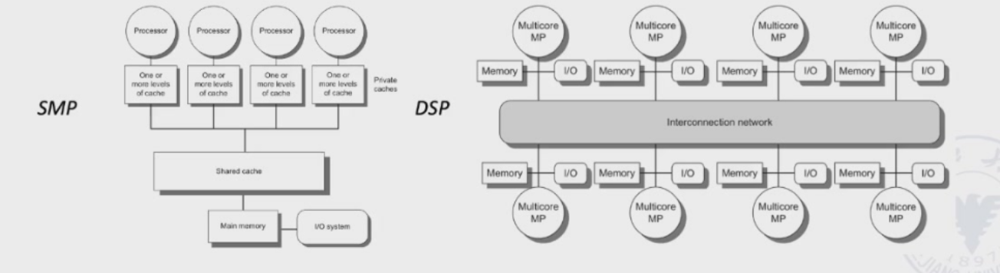

COMA 是 NUMA 的一种特殊情况。每个处理器节点中不存在存储层次结构，所有高速缓存共同构成一个统一的地址空间。

使用分布式缓存目录进行远程缓存访问。使用 COMA 时，数据在开始时可以任意分配，因为它最终会在运行时被移动到使用它的位置。

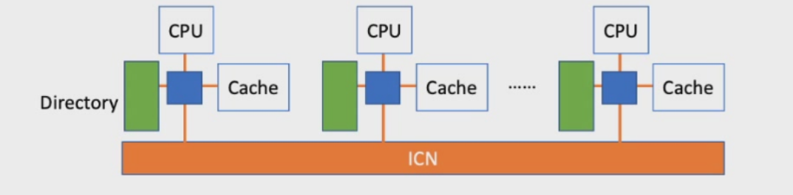

多计算机系统也可进一步划分为大规模并行处理器（MPP）和工作站集群（COW）。

MPP 系统是由数百个处理器组成的大规模并行计算机系统。过去主要用于科学计算、工程模拟等面向计算的场合，但目前也已广泛应用于商业和网络应用领域。它的开发难度大、价格高昂、市场有限，是国家综合实力的象征。

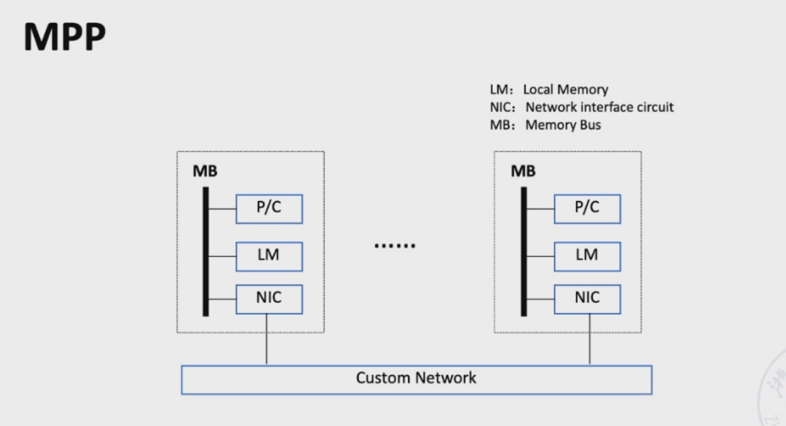

COW 系统由大量 PC 或工作站通过商用网络互联而成。COW 可以完全使用市售组件组装而成。这些商用组件可以大批量生产，因此可以获得较高的性价比。主流的 COW 主要有两种类型：集中式和分散式。

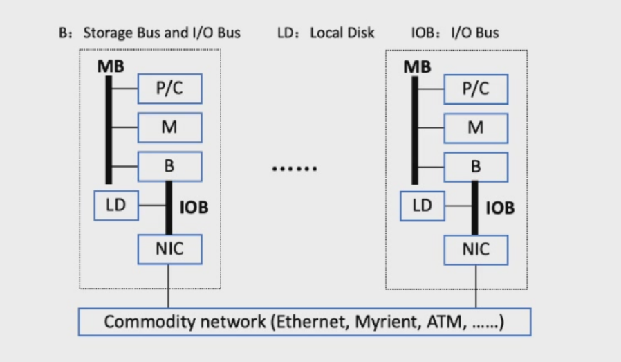

## 多处理器的挑战

多处理器的实现有许多障碍。第一个障碍与程序中可用的有限并行性有关。

以下是阿姆达尔定律（Amdahl’s Law）来分析的一个例子。

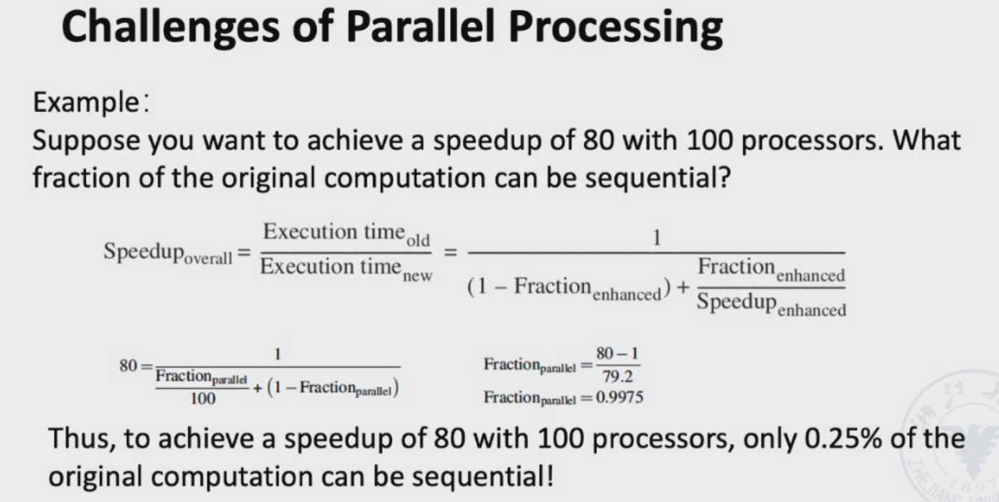

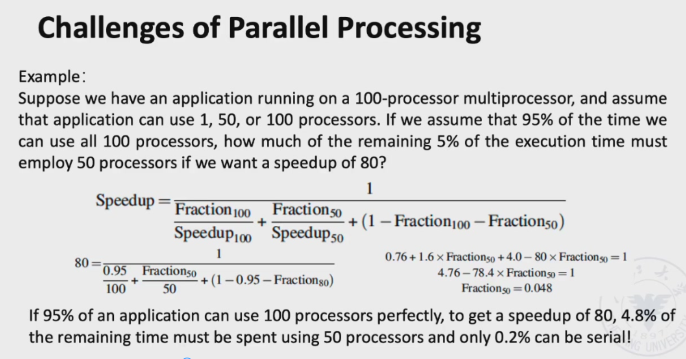

第二个障碍源于通信成本相对较高。

以下是一个例子：

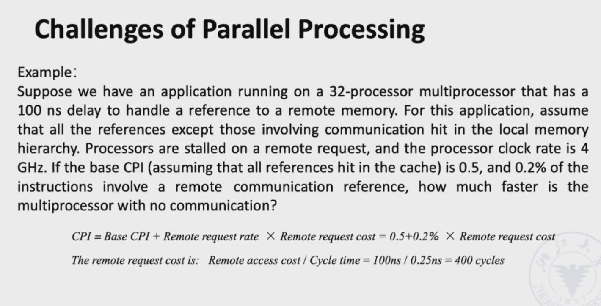

## 缓存一致性

在现代并行计算机中，处理器通常配有缓存。内存数据在整个系统中可能存在多份副本，这就导致了缓存一致性问题。

缓存一致性协议：由缓存、CPU 和内存共同实现的一组规则，用于防止同一数据的多个不同版本出现在多个缓存中，这些规则构成了缓存一致性协议。

正确的一致性保证：程序员无法通过分析加载和存储的结果来判断系统中是否存在缓存以及缓存的位置。这是因为正确的一致性确保了缓存不会引发新的或不同的功能性行为。

主流的缓存一致性协议有两种：总线监听协议和基于目录的协议。

### 总线监听协议

在总线监听协议中，所有处理器都监听总线。当某个处理器修改了私有缓存中的数据时，它会在总线上广播无效信息或更新后的数据，以使其他副本失效或进行更新。UMA 系统通常使用总线监听协议。

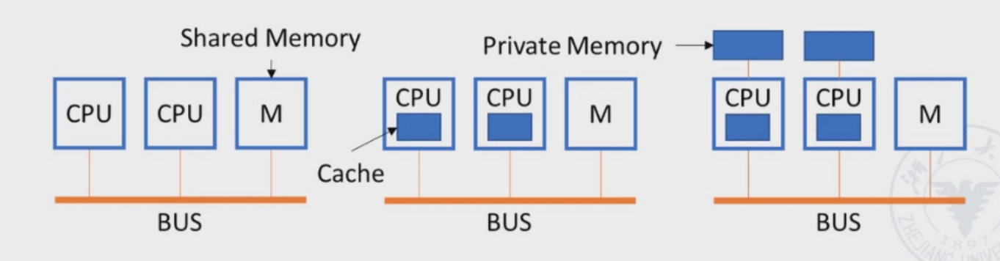

我们知道cache的写入有两种方式：Write-through 和 Write-back。Write-through 是在写入缓存行中的数据时，同时修改对应内存中的内容，使内存中的数据在任何时刻都保持最新。Write-back 是写操作不直接写入内存。相反，当缓存行被修改时，缓存中的某个位会被置位，以表明缓存行中的数据是正确的，但内存中的数据已过时。当然，该缓存行最终会被写回内存，但这可能是在多次写操作之后才会发生。

监听缓存在执行读写操作时，根据该协议可能出现的四种情况：

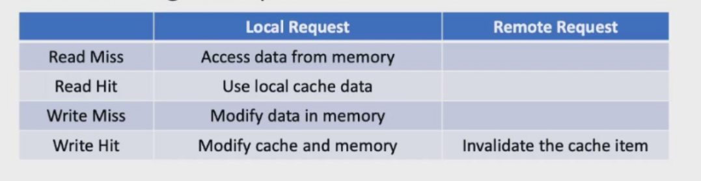

write-through缓存一致性基本协议有多种变体：

- 对于远程写命中，是采用更新策略（Update Strategy）还是失效策略（Invalidate Strategy），我们一般用后者。
- 当缓存写缺失时，是否将相应的字传入缓存，即是否采用写分配策略（Write-allocate Policy）

Write-back缓存一致性协议的一个典型是MSI协议。它定义了三种cache状态：Invaild、Shared、Modified。

共享（Shared）表示私有缓存中的该块可能被共享。已修改（Modified）表示该块已在私有缓存中被更新，意味着该块是独占的。

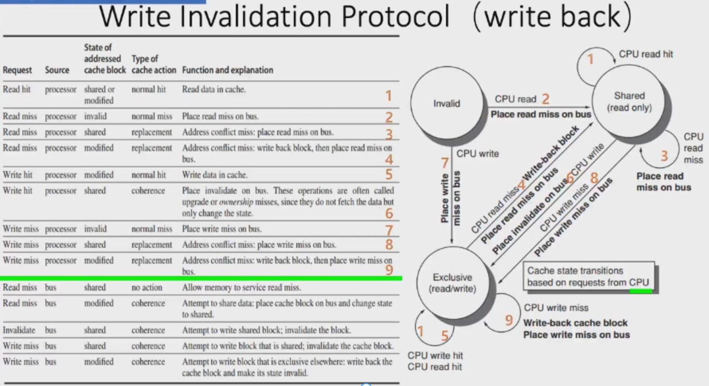

以下是一个基于SBI协议的示例：

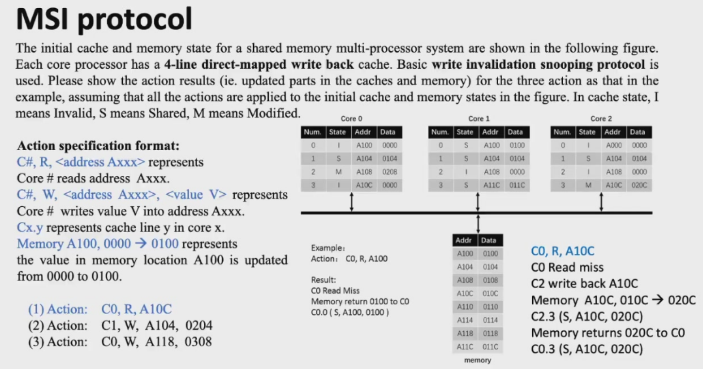

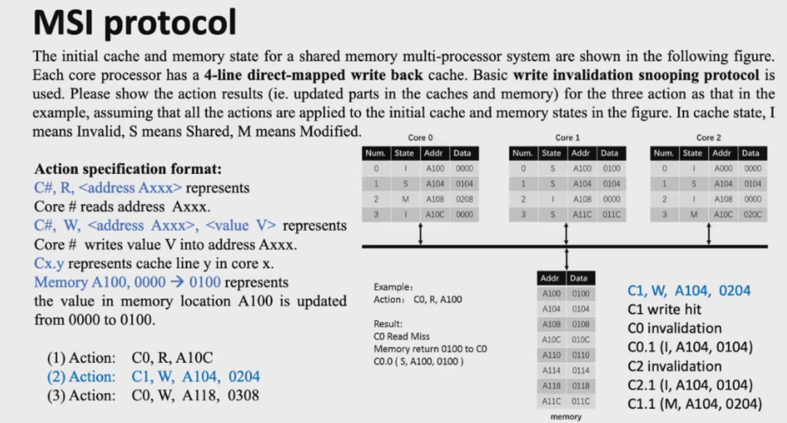

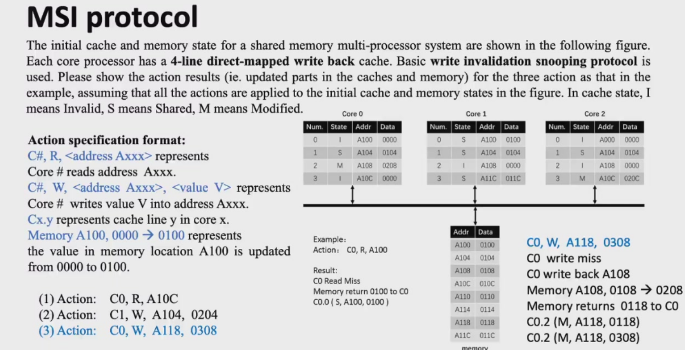

MESI：MESI相较于MSI协议添加了一个状态：独占（Exclusive），表示缓存块仅驻留在单个缓存中，且是干净的（即与内存一致）。

- 独占 → 被其他处理器读取 → 共享（Shared）
- 独占 → 写入 → 已修改（Modified）

MESI 协议中，从独占状态转换到已修改状态是静默完成的，无需在总线上广播。

以下是MESI 协议的转换图：

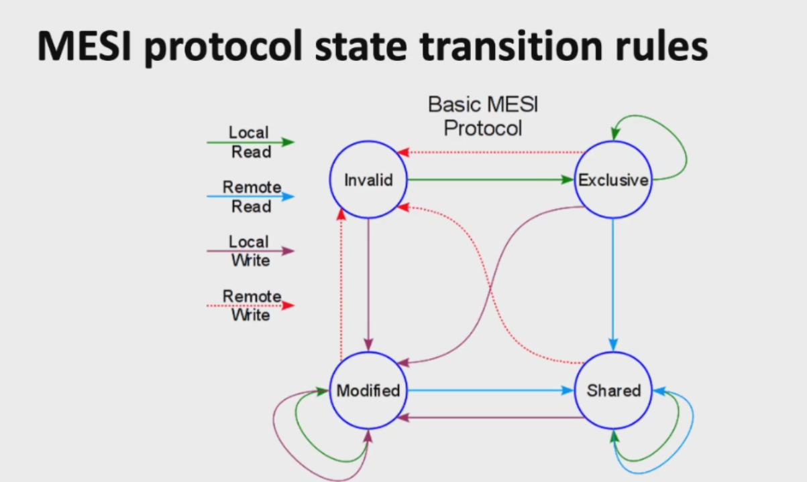

以下是一个基于MESI协议的示例：

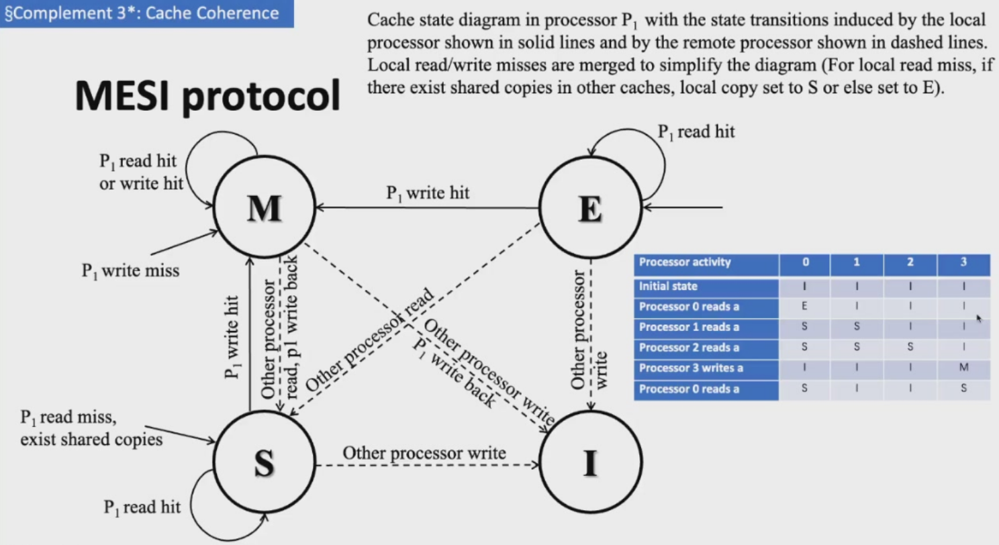

MOESI:在MESI协议的基础上，又增加了一个状态：拥有（Owned），表示该缓存块由该缓存拥有，且内存中的内容已过时。已修改（Modified）→ 已拥有（Owned）时不将共享块写回内存。此处不再赘述。

### 基于目录的协议

目录协议使用一个目录来记录系统中哪些处理器的缓存中存有特定存储块的副本。当某个处理器想要写入一个共享块时，它会通过目录以“点对点”方式向那些拥有该块副本的处理器发送无效信号，从而使所有其他副本失效。NUMA 系统通常使用目录协议。

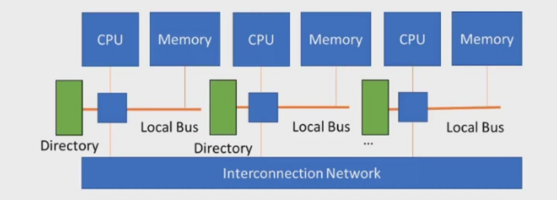

基于目录的协议也类似与MSI协议，它为每个存储块维护状态：

- 共享（Shared）
- 无效（Invalid）
- 已修改（Modified）

但不同的是，基于目录的协议使用目录来维护各块的状态，并发送无效化消息。

以下是基于目录的系统中单个缓存块的状态转换图。（本地处理器的请求以黑色显示，来自本地目录的请求以灰色显示。）

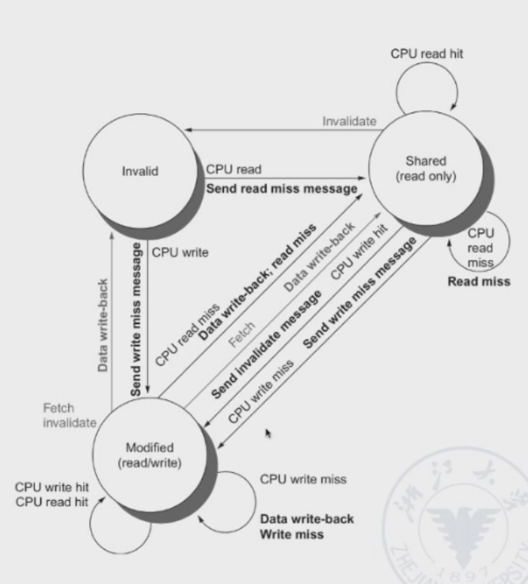

目录的状态转换图与单个缓存的状态转换图具有相同的状态和结构。

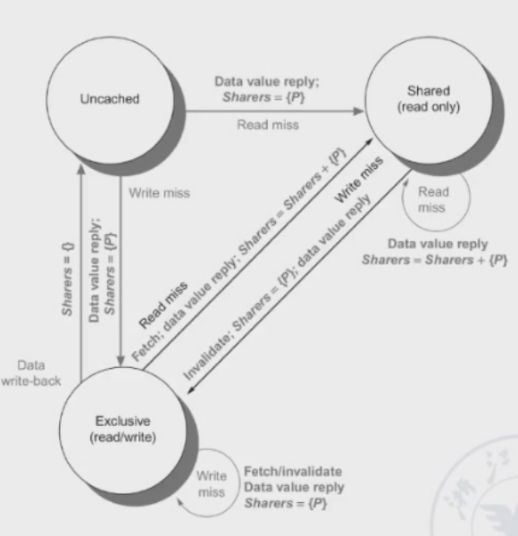

