# Instruction-Level Parallelism(ISP)
## 指令依赖
指令依赖关系是指一个指令需要依赖于另一个指令的执行结果才能执行。指令依赖关系的存在会影响指令的执行顺序。
### Data Dependences
```
FLD F0, 0(R1)
FADD.D F4, F0, F2
```

此时，ADD.D指令所得值依赖于FLD指令的执行结果。
### Name Dependences
Name Dependences主要分为两种：

```
FDIV.D F2, F6, F4
FADD.D F6, F0, F12
FSUB.D F8, F6, F14
```

DIV和ADD之间的依赖关系被称为反向依赖关系。

```
FDIV.D F2, F0, F4
FADD.D F6, F0, F12
FSUB.D F2, F6, F14
```

DIB和SUB之间的依赖关系被称为输出依赖关系。

这两种依赖我们都可以通过修改命名的方式来解决：

```
Change F6 as S:
FDIV.D F2, F6, F4
FADD.D S, F0, F12
FSUB.D F8, S, F14
```
```
Change F2 as T:
FDIV.D F2, F0, F4
FADD.D F6, F0, F12
FSUB.D T, F6, F14
```
### Control Dependences

## Hazards
Hazard是指指令执行过程中可能出现的一些问题。Hazard的种类很多，包括数据相关的Hazard、控制相关的Hazard、结构相关的Hazard等。

### Structure Hazards
结构相关的Hazard产生原因一般是是指令执行过程中所需资源正忙。
### Data Harzards
数据相关的Hazzard是下一条指令需要等待前一条指令完成其数据读写。  
Data Hazards主要分为三种：RAW(Read After Write)、WAR(Write after read)、WAW(Write after Write)。  
我们可以通过数据前递、代码重排和stall来避免Data Hazards发生。
### Control Hazards
控制相关的Hazzard主要是与跳转指令相关。下一条指令的有效性取决于分支的结果。由于在流水线中，指令跳转的判断在EXE阶段，下一条读入指令已经流入ID阶段，可能是无效的。  
我们可以用Stall来解决，但会导致效率降低。

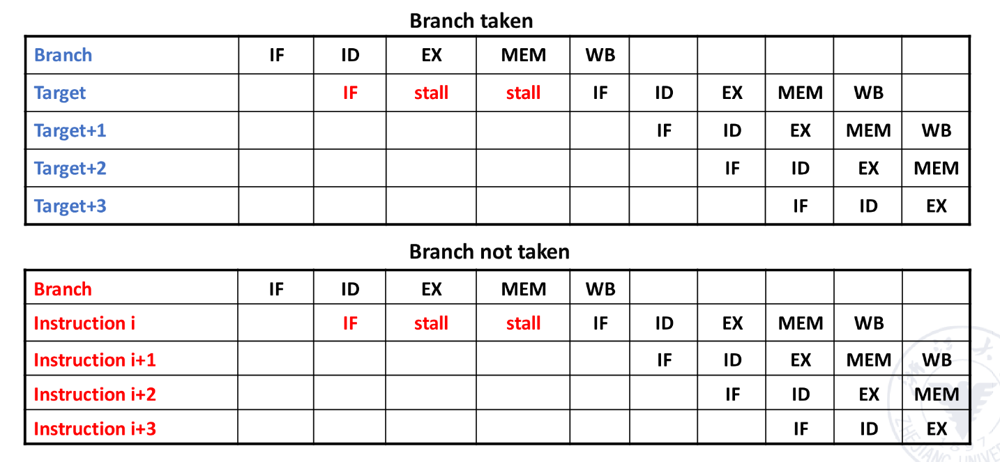

我们也可以插入Bubble来避免读取错误指令。

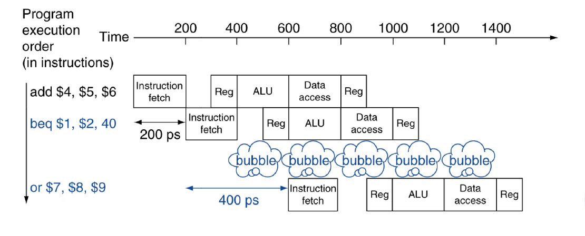

在现代计算机中，我们主要用分支预测的方式来解决Cotrol Hazzard，只在预测失误时才 Stall。

## 分支预测
分支预测分为两种：静态分支预测和动态分支预测。

### 静态分支预测
- 静态分支预测基于典型的分支行为。
- 全部预测为 untaken or taken。
- 示例：对循环和if语句的预测（预测回溯分支的taken，预测前向分支的untaken）
- Delay Slot：在分支指令后的几条指令，不管分支是否发生，都会执行。


### 动态分支预测
动态分支预测基于历史记录。预测未来分支的taken或untaken。

动态分支预测基于分支预测缓冲区来进行，又叫分支历史表（Branch History Table，BHT）。它以近期分支指令的地址作为索引，存储历史分支结果（taken or untaken），通过历史分支结果来预测未来分支的结果。

当预测状态由一位二进制数表示时，BHT的更新逻辑如下。

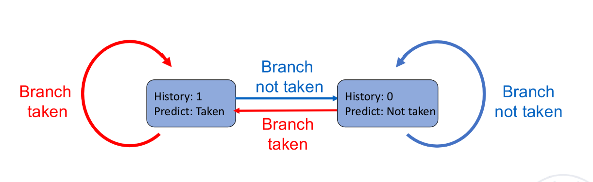

这种预测方式对分支指令结果的变换十分敏感，如多层嵌套的循环就会导致多次预测错误。为了提高预测结果的准确率，我们可以增加预测状态的位数。

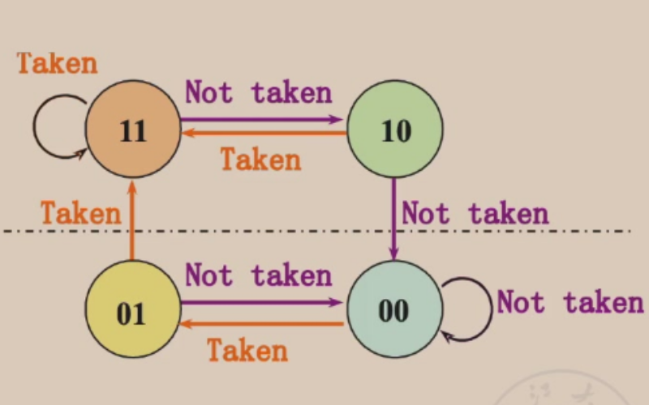

除了预测是否跳转之外，我们还需要一个缓冲区来存储分支指令的跳转地址，即分支目标缓冲区（Branch Target Buffer，BTB）。当分支指令执行时，根据其地址从BTB中取出目标地址，并将其写入PC。如果分支指令的预测结果与实际结果不符，则需要将BTB的值更新为实际跳转地址。

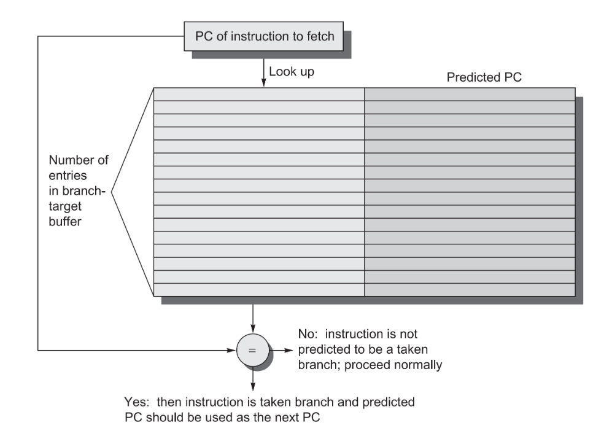

由于在EXE阶段我们才能判断分支指令的跳转结果，而在IF阶段，动态分支预测已经完成并更新PC。因此在分支预测错误时，需要将PC的值更新为实际跳转的地址，并通过Flush信号清空IF阶段和ID阶段以及相应的寄存器中的错误指令。

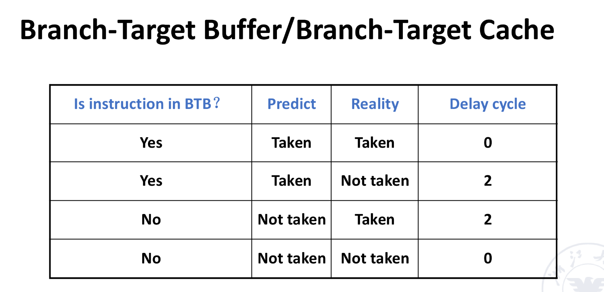

## 动态调度
简单流水线技术的一个主要局限性在于，它采用按序发射和执行的方式。如果流水线中某条指令发生停顿，则后续指令都无法继续执行。

动态调度是指在指令执行过程中，根据当前的资源情况，动态调整指令的执行顺序，来提高资源的利用率。

由于指令之间有相互依赖关系，因此我们在指令乱序执行的过程中，需要检测指令之间是否有冲突的发生，并进行调度。

动态调度的算法主要有两种：记分牌算法（Scoreboard algorithm）和Tomasulo 算法。

### 记分牌算法

为了实现乱序执行，我们将简单五级流水线中的译码（ID）阶段拆分为两个阶段：

- 发射（IS）：指令译码，检查**结构冒险**。（按序发射）
- 读操作数（RO）：等待**数据冒险**消除，然后读取操作数。（乱序执行）

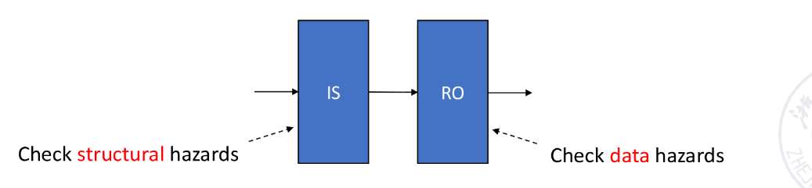

以下是记分牌算法的硬件结构

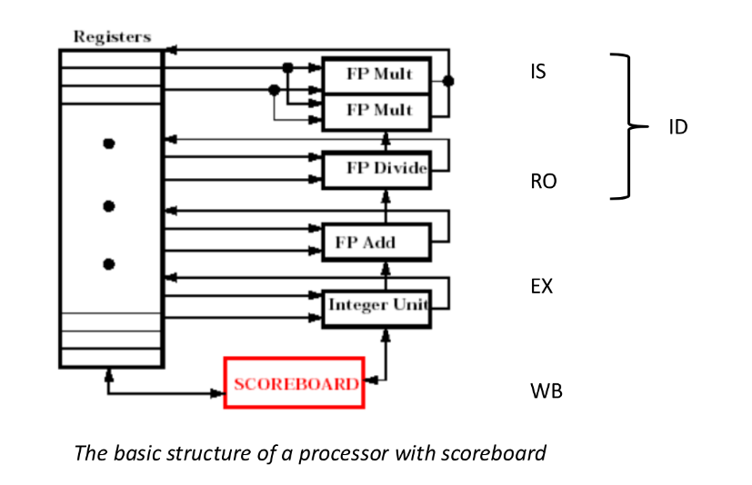

其中，Scoreboard是指令之间的依赖关系图，它用来记录每一个时钟周期指令之间的依赖关系。

Scoreboard分为三张表。

- Instruction Status：各条指令处于IS/RO/EX/WB中的哪个阶段。
- Fuctional Unit Status：每个功能单元（Functional Unit）的状态，有九个状态。
    - Busy：功能单元是否被占用。
    - Op：功能单元正在执行的操作
    - Fi：目的寄存器。
    - Fj，Fk：源寄存器。
    - Qi，Qk：源操作数从哪个功能单元来（如果源寄存器没准备好部件该向哪里要数据）。
    - Rj, Rk: 目的操作数是否准备好并且未被读取。（当其值为no且对应的Q为null时，表明操作数以及读取，当其值为yes且对应的Q为null时，表明操作数未准备好）。
- Register Status：寄存器正准备被哪个功能部件写入。

以下是一个例子：

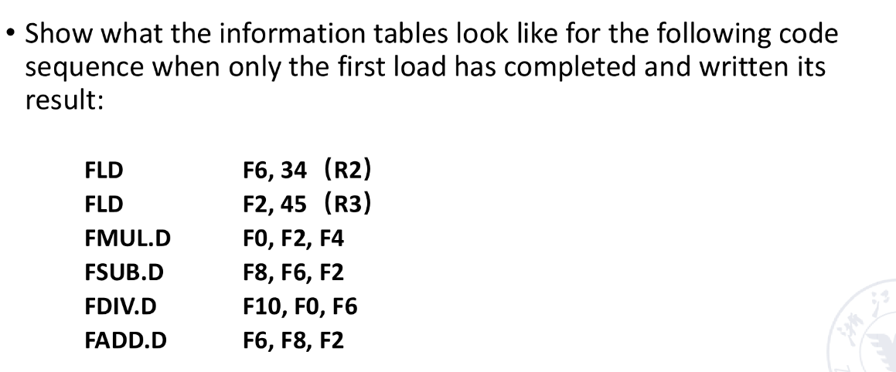

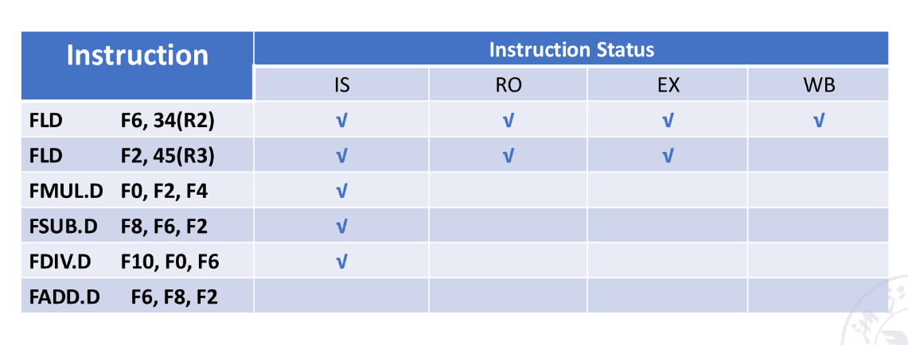

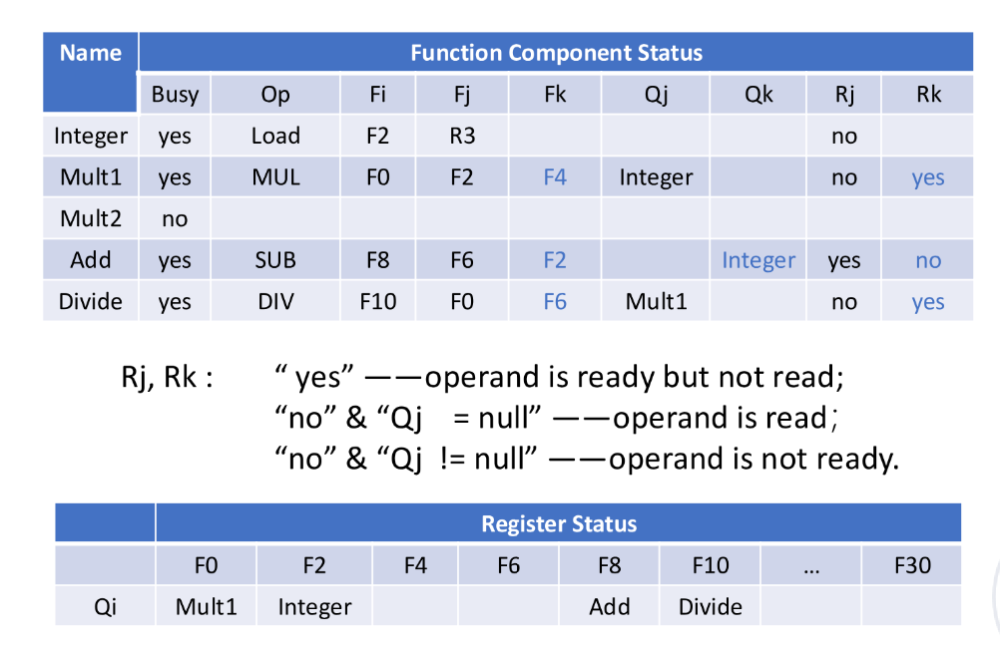

判断一条指令能否乱序执行的要点如下：

- 一条指令能否发射，一看是否有功能部件空闲可用，这个信息包含在功能状态中；二看指令要写的寄存器是否正要被别的指令写，这个信息包含在寄存器状态中，观察这个信息是为了解决 WAW 冒险。
- 一条指令能否读数，要看记分牌是否提示源寄存器不可读，如果不可读，就说明该寄存器将要被别的前序指令改写，现在的指令要等待前序指令写回，观察这个信息是为了解决 RAW 冒险。
- 一条指令一旦读数完成，就必然可以进行运算，运算可以是多周期的，在第一个周期结束时应该改写功能状态，表明自己不再需要读寄存器。
- 一条指令能否写回，要看是否有指令需要读即将被改写的这个寄存器，具体一点来说，就是要观察标记 Yes 的 Rj、Rk 对应的寄存器里是否有当前指令的目的寄存器，如果有，就说明有指令需要读取寄存器的旧值，这样一来我们就要等指令读完旧值之后再写回，观察这个信息是为了解决 WAR 冒险。


以下是一个练习：

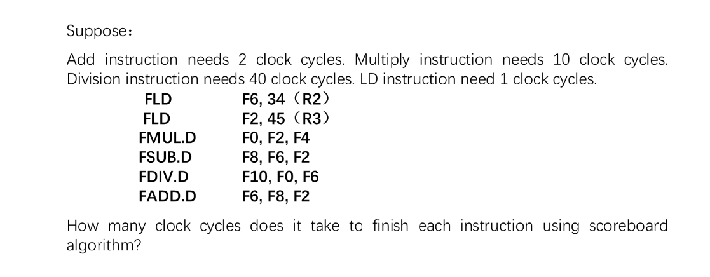

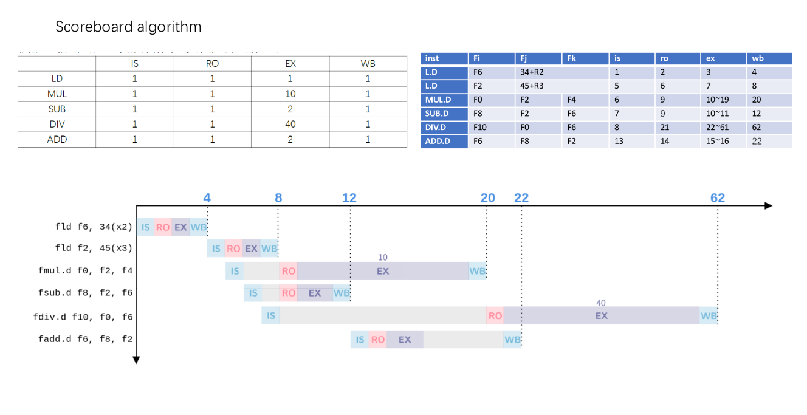

### Tomasulo 算法

考虑以下指令的命名依赖。

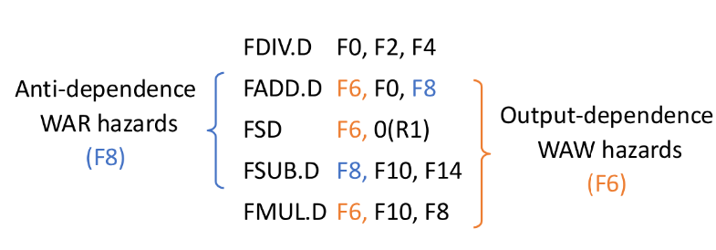

这些依赖都可以通过寄存器重命名来消除。

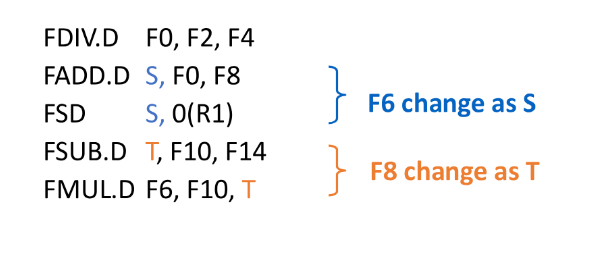

Tomasulo 算法根据记分牌算法进行改进，它跟踪指令操作数的就绪状态，以最大程度减少 RAW 冒险；同时，在硬件中引入寄存器重命名，以最大程度减少 WAW 和 WAR 冒险。

以下是Tomasulo 算法的硬件结构。

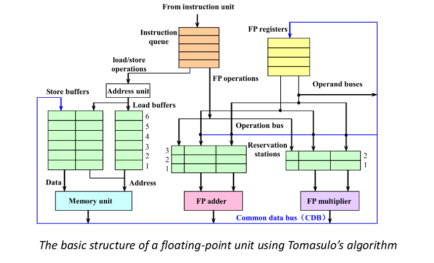

Tomasulo算法的调度分为三个步骤：发射、执行、写回。

- 发射（IS）：从指令队列（FIFO）头部取下一条指令。
    - 如果存在一个匹配且空闲的保留站，则将指令发射到该保留站，同时如果操作数当前已在寄存器中，则一并传入操作数值。
    - 如果没有空闲的保留站，则发生了结构冒险，指令将停顿，直到某个保留站或缓冲区被释放。
    - 如果操作数不在寄存器中，则记录下将会产生这些操作数的功能部件。（这一步实现了寄存器重命名，消除了原本存在于寄存器中的 WAR 和 WAW 冒险。）

- 执行（EX）：选择相应的功能部件进行运算。
    - 当所有操作数就绪时，即可在对应的功能部件上执行该操作。
    - 加载（Load）和存储（Store）指令需要两步执行过程：当基址寄存器就绪时，计算有效地址。然后将有效地址存入加载缓冲区或存储缓冲区。

- 写回（WB）：将结果写回到相应的寄存器与保留站。
    - 当结果就绪时，将其写入公共数据总线（CDB），并通过总线将结果发送至寄存器以及所有保留站（包括存储缓冲区）。
    - 存储指令被暂存在存储缓冲区中，直到待存储的数据和存储地址均就绪后，一旦存储器单元空闲，便立即写入结果。

以下是一个例子：

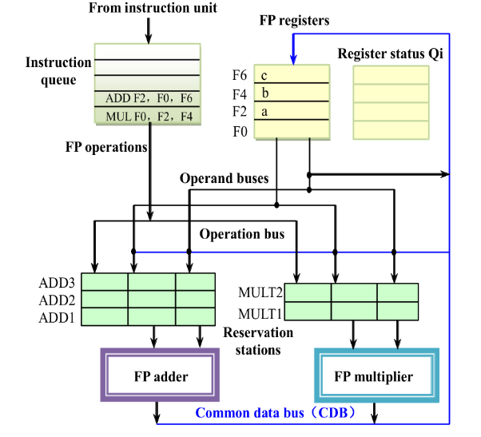

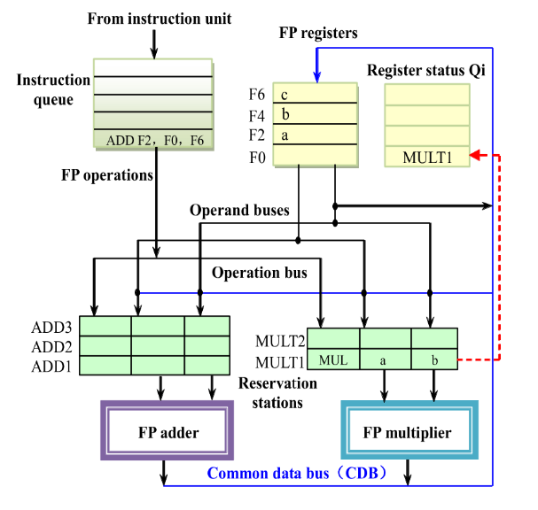

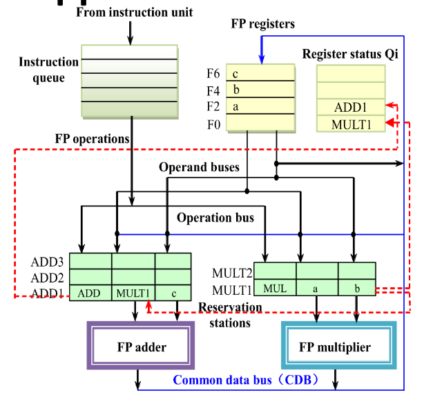

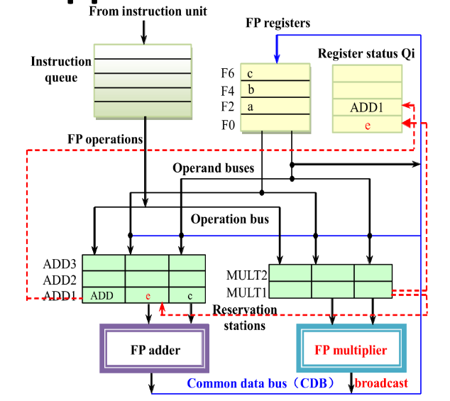

Tomasulo 方法涉及三张表。

- 指令状态表：该表仅用于帮助理解算法，并非实际硬件的一部分。
- 保留站表：保留站记录每条已发射指令的状态。
- 寄存器状态表（Qi 字段）：记录应将该寄存器结果写入的保留站编号。


每个保留站包含七个字段：

- Op：对源操作数执行的操作。
- Qj、Qk：将产生对应源操作数的保留站编号。
- Vj、Vk：源操作数的值。
- Busy：指示该保留站及其配套功能部件是否被占用。
- A：用于存放加载或存储指令的内存地址计算信息。

以下是一个例子：

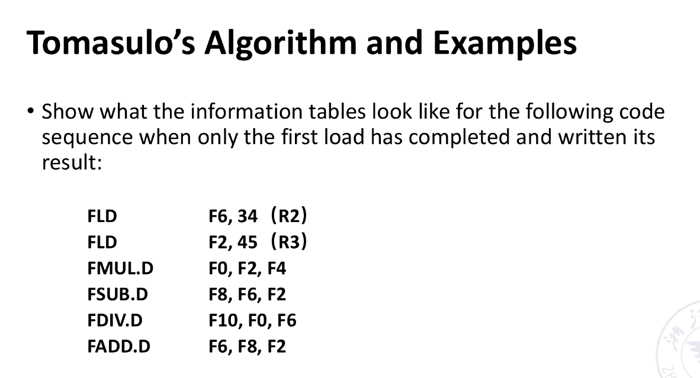

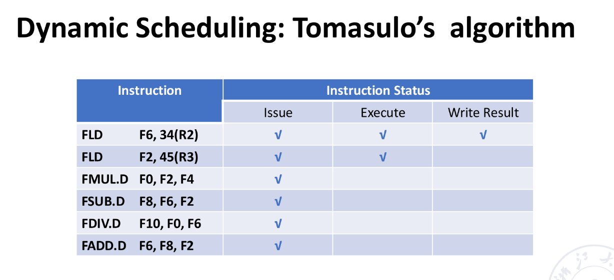

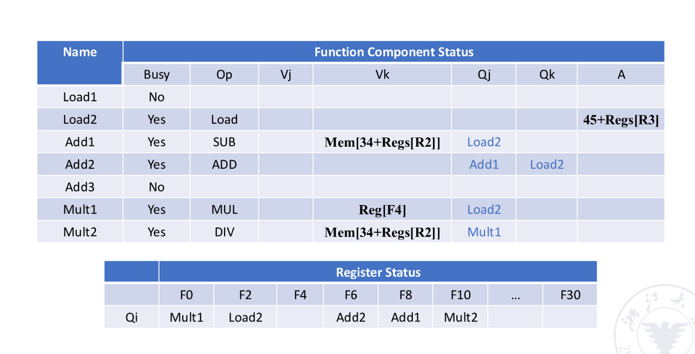

Tomasulo 算法虽然通过引入寄存器重命名消除了 WAW 和 WAR 冒险，但它也有很多缺点，包括：

- 结构复杂性高。
- 其性能受限于公共数据总线。
- 加载和存储指令在访问不同地址时可以安全地乱序执行。如果加载和存储访问同一地址，则可能出现以下情况：
    - 在程序顺序中加载指令位于存储指令之前，互换两者会导致写后读（WAR）冒险；
    - 在程序顺序中存储指令位于加载指令之前，互换两者会导致读后写（RAW）冒险；
    - 互换两条访问同一地址的存储指令会导致写后写（WAW）冒险。

以下是一个练习：

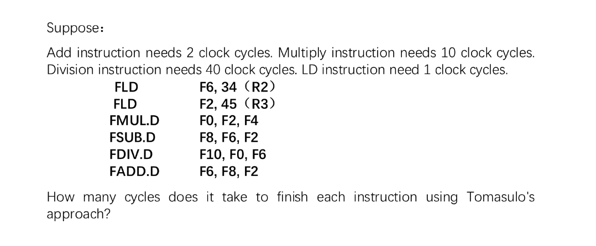

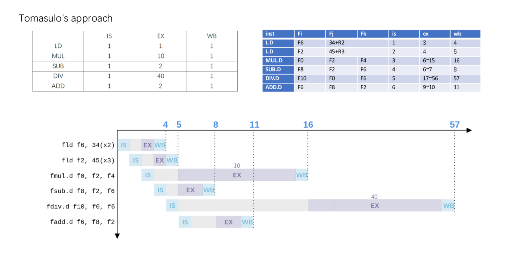

### 硬件前瞻算法

在乱序执行的过程中，按顺序进入CPU的程序可能会由于执行速度的不同而导致指令完成的顺序不同，我们可以通过一个缓冲区来记录指令的执行顺序，并在指令执行完成后，将其结果写入相应的寄存器。

这个缓冲区叫做重排序缓冲区（Reorder Buffer，ROB）。它用于存放未提交指令结果的缓存，包含 3 个字段：指令类型、目的地址、值。
  
当指令执行阶段完成后，并不直接写回寄存器，而是将其结果放入 ROB 中，等待提交阶段。

提交阶段的任务是将 ROB 中的指令结果按输入顺序写入相应的寄存器，并将 ROB 中相应的指令标记为完成。

通过这种方式，当预测失败时，可以轻松恢复推测执行的指令；或者当发生异常时，可以轻松恢复状态

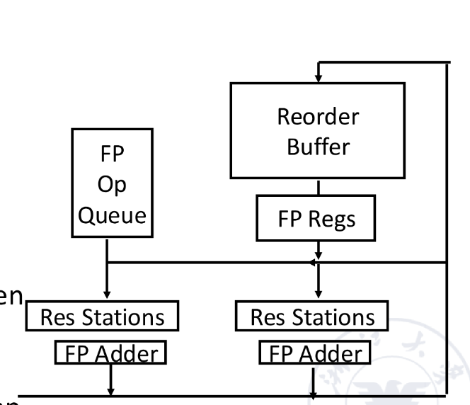

以下是加入重排序缓冲区的 Tomasulo 算法的硬件结构。

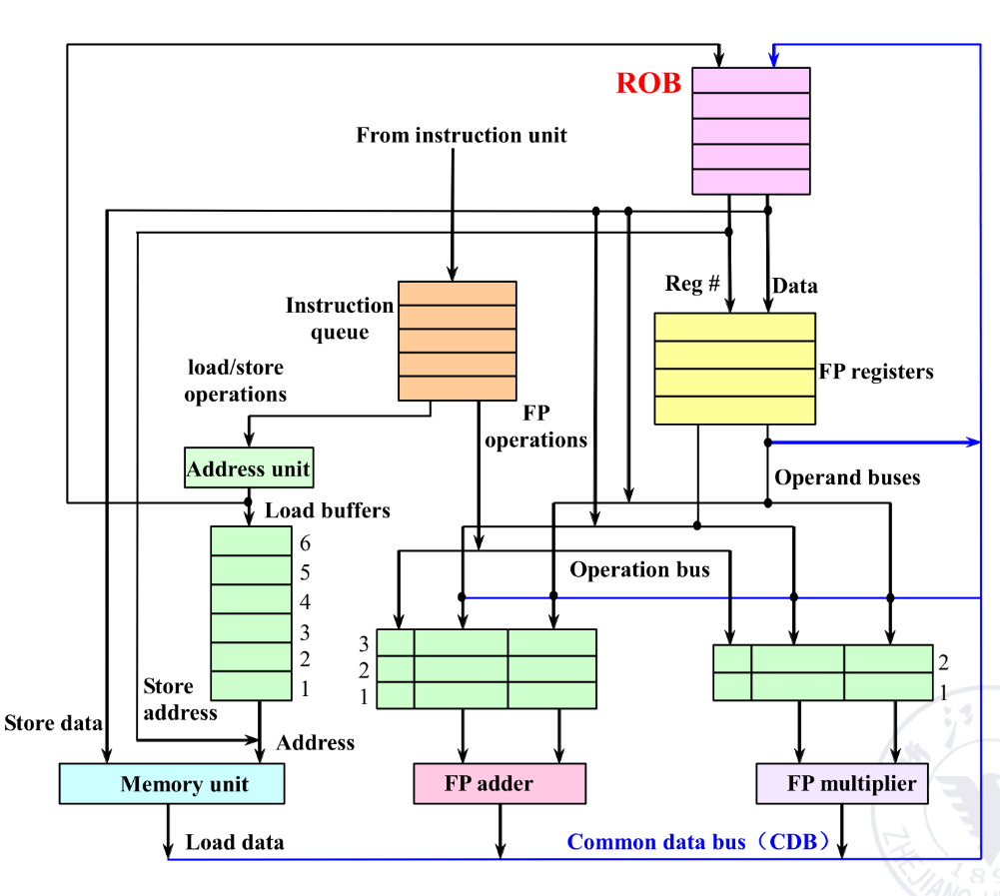

相应的保留栈状态表也有所不同。我们可以添加一列Dest用来标识这条指令在重排序缓冲区中的编号，同时用重排序缓冲区（ROB）的编号替换保留站（RS）的编号。

以下是一个例子：

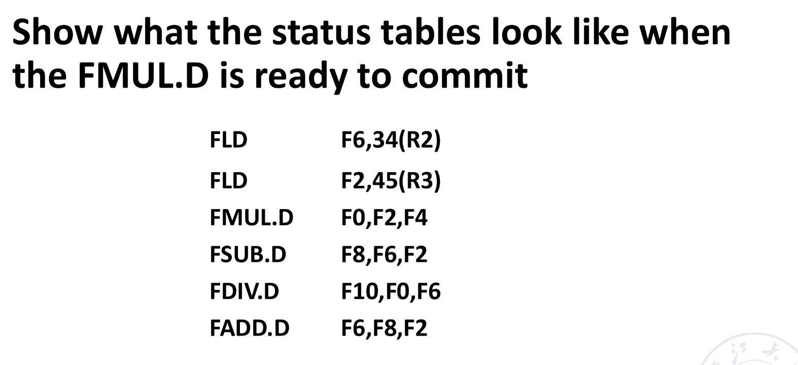

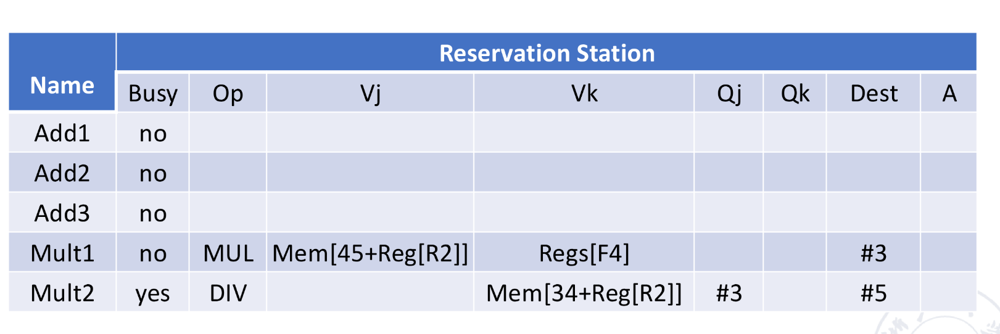

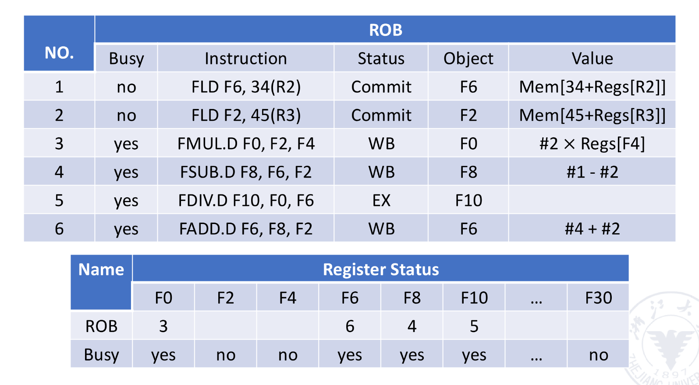

以下是一个练习：

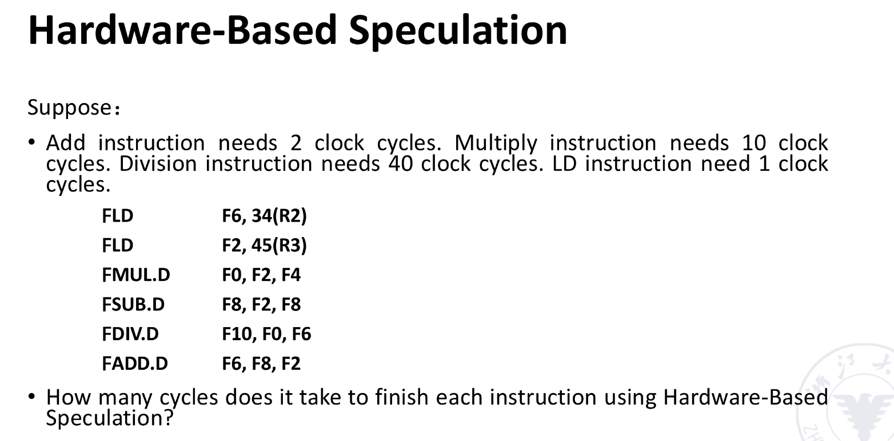

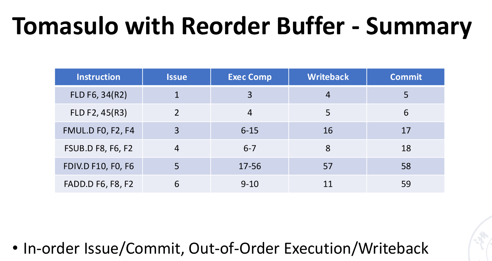

