# 内存
## 内存分区
在很早之前的计算机系统中，物理内存中只加载一个程序，运行直至结束。但当程序所需内存超过物理内存时，就无法有效解决。因此，我们需要将程序分解成多个步骤分而治之。

当有多个进程同时存在于物理内存中时，我们需要将物理内存划分为多个块来存储程序和数据（即分区）。

分区有几个基本需求：

- Protection：防止进程相互破坏
- Fast execution：内存访问不能因保护机制而变慢
- Fast context switch：建立地址映射不能耗时过长

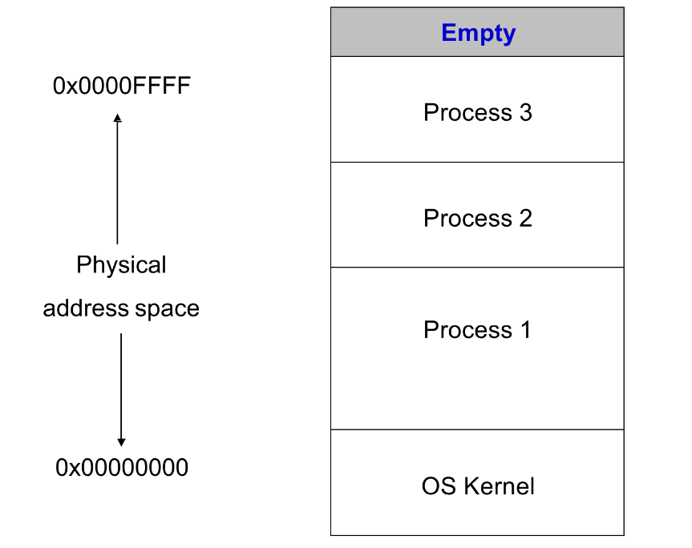

我们将所有地址相对于分区的起始位置进行重定位，逐块地映射到物理内存中。

## 逻辑地址

如果进程直接访问其物理地址，一旦进程开始运行，分区就很难在内存中移动了。这会导致内存碎片，使得内存利用率下降。

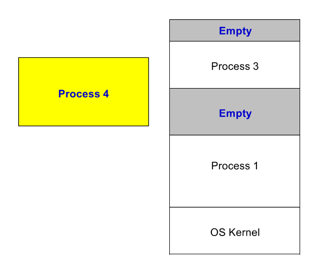

为了解决内存浪费问题，我们引入逻辑地址。

逻辑地址由进程使用，用于替代物理地址，在运行时会转换为物理地址。

我们将逻辑地址定义为**分区内的偏移量**。

为了在进程中使用逻辑地址。我们需要基址寄存器和界限寄存器。基质寄存器存放分区的起始地址，界限寄存器存放分区的大小。

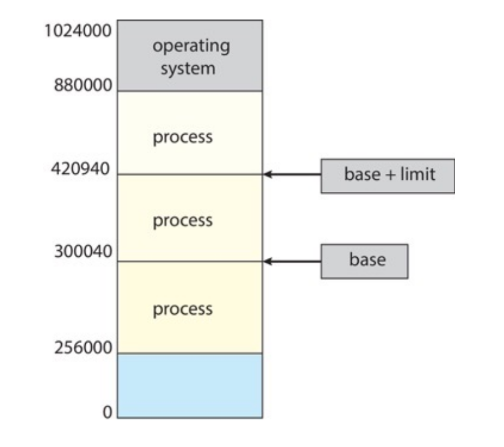

CPU 必须检查在用户态下产生的每一次内存访问，确保其位于该用户的基址和界限之间。在检查之后，将逻辑地址与基址相加，就可以得到物理地址。

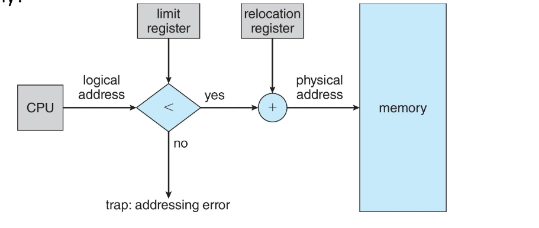

注意：加载基址寄存器和界限寄存器的指令是特权指令，防止用户随意修改。

使用逻辑地址有很多优点，如：

以下是图片中英文内容的对应中文翻译：
- 由界限寄存器可以提供内置保护
- 执行速度快，每条指令中以硬件速度完成地址加法与界限检查。
- 上下文切换快，只需改变基址和界限寄存器即可。
- 加载时不需要对程序地址进行重定位（所有地址都相对于零）
- 分区可以随时暂停和移动

这样我们就可以解决内存碎片的问题。

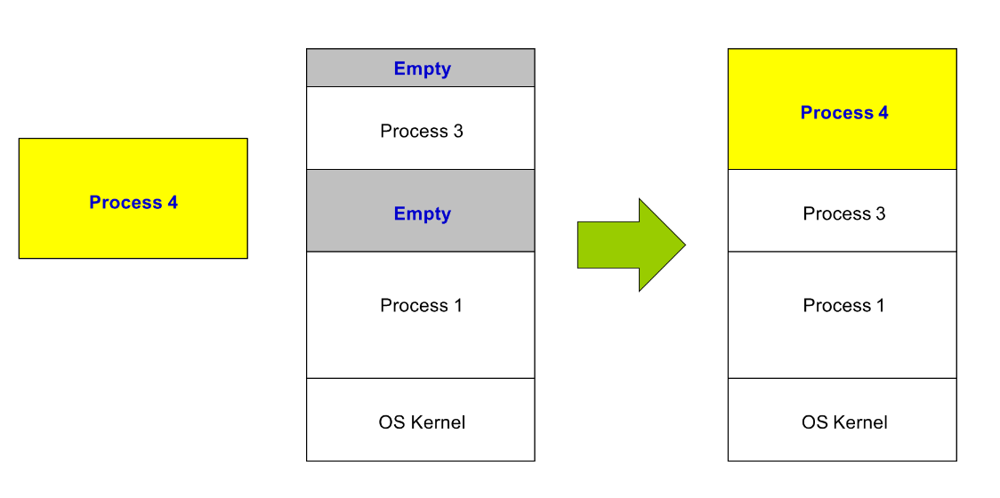

## 内存分配
对于每个分区的内存分配，有两种分配方式：固定分区和可变分区。

### 固定分区

固定分区即是将内存划分为大小相等的若干块（操作系统所在区域除外）

固定分区的优点是实现策略简单，缺点是容易产生内部碎片
（分区中未使用的内存无法被其他进程利用）。

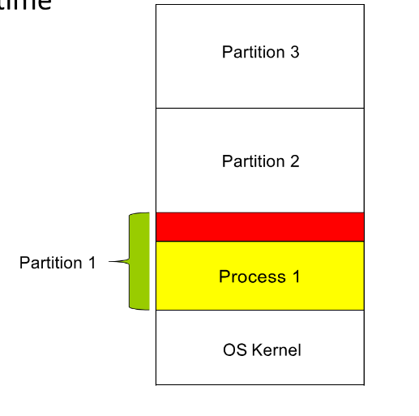

### 可变分区

内存根据进程的需要动态地划分为分区。

这会引入更复杂的管理问题，它需要数据结构来跟踪空闲和已用内存。

当一个进程到达时，会从一个足够大的空洞（可用内存区）中为其分配内存；进程退出时释放其分区，相邻的空闲分区合并。

操作系统维护已分配的分区和空闲分区（空洞）的列表，并通过分配算法来确定内存分配。

常见的分配算法有以下几种：

- `first-fit`：从第一个足够大的块中分配  
- `best-fit`：从足够大的最小空洞中分配，产生最小的剩余空洞  
- `worst-fit`：从最大的空洞中分配，产生最大的剩余空洞  

first-fit和best-fit通常比worst-fit表现更好。

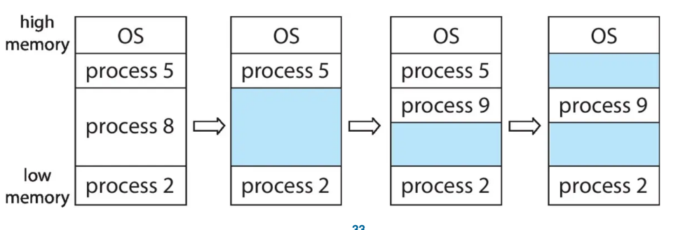

可变分区的优点是可以更好地利用内存,缺点是实现较为复杂，且会产生外部碎片问题。

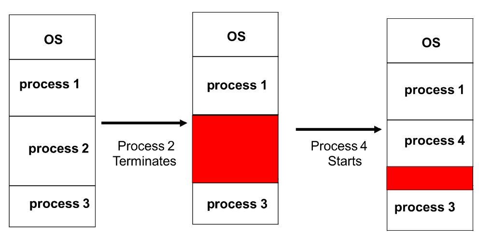

外部碎片是已分配内存块之间无法使用的内存。这些碎片空闲内存空间的总量大于某个请求所需的大小，但由于空闲内存不连续，该请求无法被满足。

外部碎片可以通过**紧缩**（compaction）来减少。即重新排列内存内容，将所有空闲内存集中到一个大的连续块中。这需要程序在运行时具备可重定位能力，且该操作存在性能开销，还需要选择合适的执行时机。

## Segmentation（分段）

对于一个程序，其代码段、数据段、栈段、堆段等都有自己对应的内存空间。我们也可以将内存分为段，来分别存储这些部分，并为每个段存储它们的基址寄存器和界限寄存器。

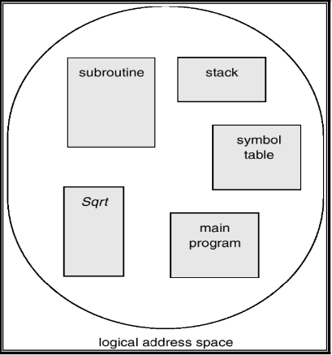

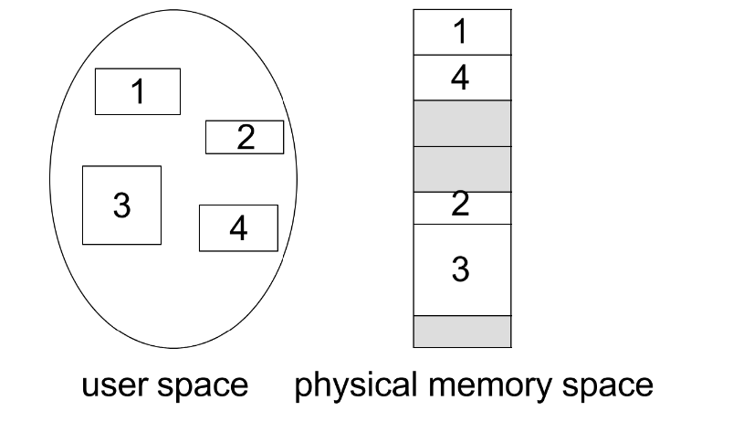

程序所用的逻辑地址由一对值组成：`<段号, 偏移量>`，偏移量是段内的地址偏移。

我们构建了一个段表，来记录每个段的基址和界限。通过段号就可以从段表中找到对应的段基址和界限。

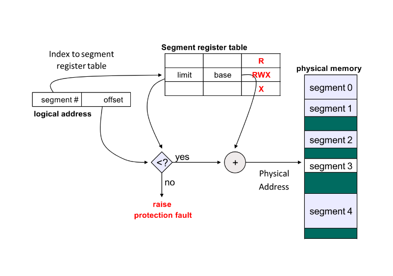

当然Segmentation也有外部碎片问题。

## 地址绑定
在程序生命周期的不同阶段，地址以不同方式表示

- 源代码中的地址通常是符号型的（例如变量名）
- 编译器将符号绑定到可重定位地址。例如，“从本模块开头算起的第14个字节”
- 链接器（或加载器）将可重定位地址绑定到绝对地址。例如 0x0e74014

每次绑定将一个地址空间映射到另一个地址空间。

指令和数据的地址绑定到内存地址可以发生在三个不同的阶段：
- 编译时：如果内存位置事先已知，则可以生成绝对代码；如果起始位置发生变化，必须重新编译代码
- 加载时：如果在编译时内存位置未知，则必须生成可重定位代码
- 执行时：如果进程在执行期间可以从一个内存段移动到另一个内存段，则绑定会延迟到运行时

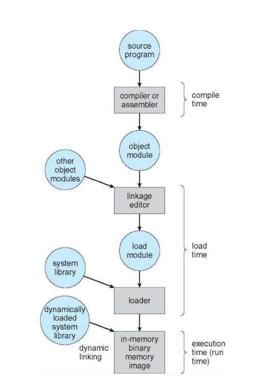

## MMU（Memory Management Unit）

MMU（Memory Management Unit）是一种硬件设备，它负责将逻辑地址转换为物理地址。

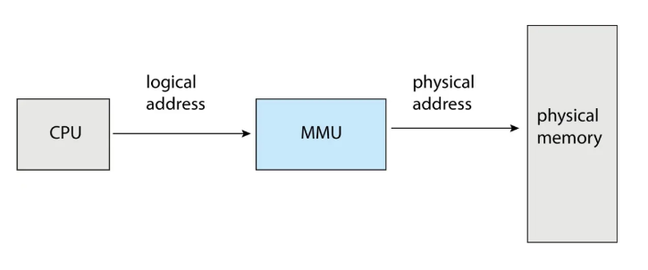

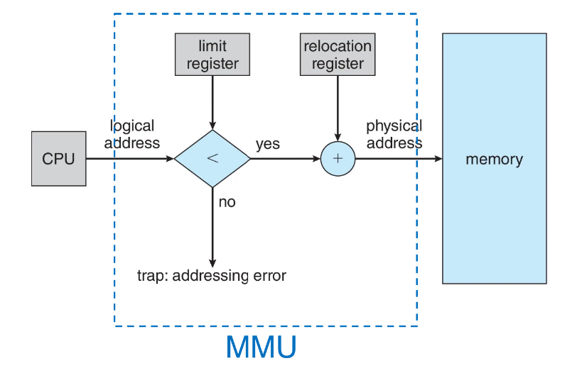

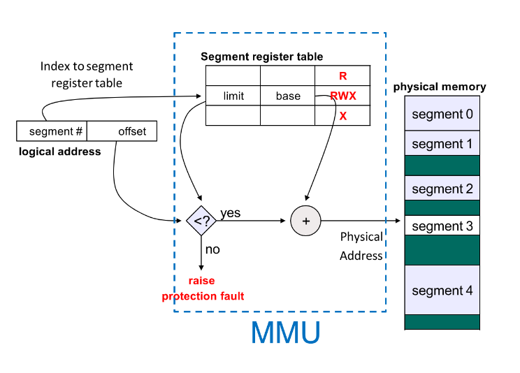

## Paging（分页）
Paging和前面所讲的分区策略不同，分区策略需要物理上连续分配内存，而分页策略不需要。

分页策略将物理地址划分为大小固定的块，称为帧（frame）（大小为2的幂次，通常为4KB），同时将逻辑地址划分为相同大小的块，称为页（page）。

操作系统跟踪所有空闲帧。要运行一个大小为N页的程序，需要找到N个空闲帧并加载程序，同时建立映射以将逻辑地址转换为物理地址。

分页不会产生外部碎片，但有内部碎片。

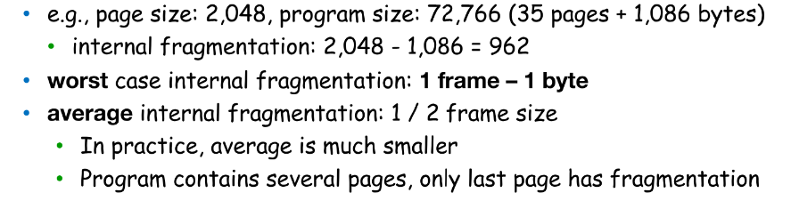

page大小不能过大或过小，小尺寸意味着更少的内部碎片，但页表条目更多；大尺寸意味着更多的内部碎片，但页表条目更少。page大小通常为 4KB，也可以是 64KB，block可以是 2MB 或 1GB（64 位系统）。

### 页表

记录逻辑地址转换为物理地址的映射关系，称为页表（page table）。

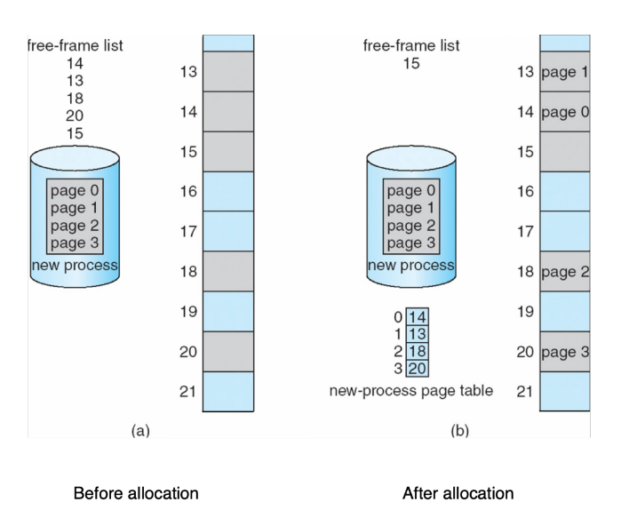

页表将page number当作index，存储映射后的frame number。

在这里的逻辑地址又被重新划分为两部分：

- 页号（page number）
    - 用作页表的索引
    - 页表项中包含对应的frame number
- 页内偏移（page offset）
    - 在page/frame内的偏移量
    - 与frame number结合得到物理地址

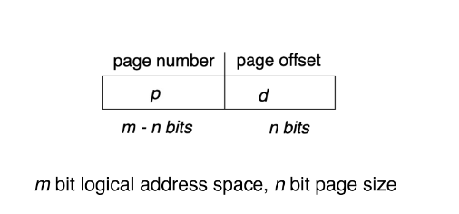

以下是关于paging的mmu：

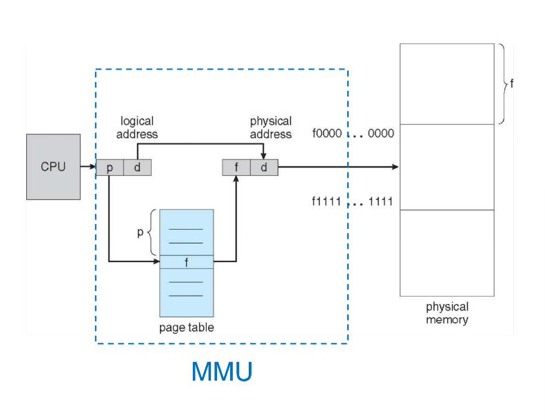

页表的实现方式有很多种：

最简单的实现方式是页表位于一组专用寄存器中

- 优点：非常高效——访问寄存器的速度快
- 缺点：
    - 寄存器数量有限 → 页表规模非常小
    - 上下文切换时需要保存和恢复这些寄存器的内容

第二种则是将页表保存在主存中。

- 优点：页表可以很大，可以容纳更多的映射关系
- 缺点：
    - 访问主存的速度慢，每条数据/指令访问都需要两次内存访问，一次用于访问页表，一次用于访问数据/指令

我们可以用TLB（Translation Look-aside Buffer）即转译后备缓冲区来缓解这个问题。

- TLB是一组小的缓存，有 64 到 1024 个条目，用于存储最近使用的页表项。
- 当发生页表项的访问时，TLB会检查是否有最近使用的项，如果有，则直接使用该项，否则，需要访问主存中的页表。
- TLB的大小可以根据系统的大小和性能进行调整。
- TLB 通常使用一种称为“相联存储器”的快速查找硬件缓存，这是一种支持并行查找的存储器。

每个进程都有自己的页表，切换进程时需要切换页表，则TLB 必须与页表保持一致。

- 方案一：每次上下文切换时清空 TLB
- 方案二：为 TLB 条目添加地址空间标识符（ASID），用于唯一标识一个进程

部分 TLB 条目可以被进程共享，并固定在 TLB 中。例如，内核的 TLB 条目。

以下是加入TLB的MMU：

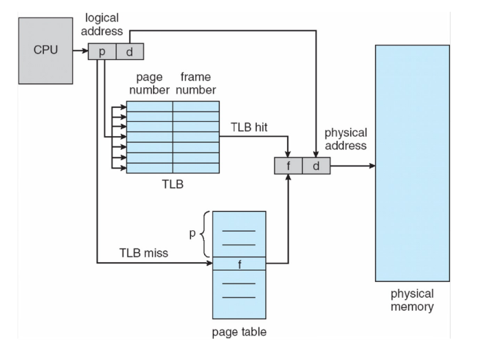

以下是有关TLB的EAT（有效访问时间）的计算：

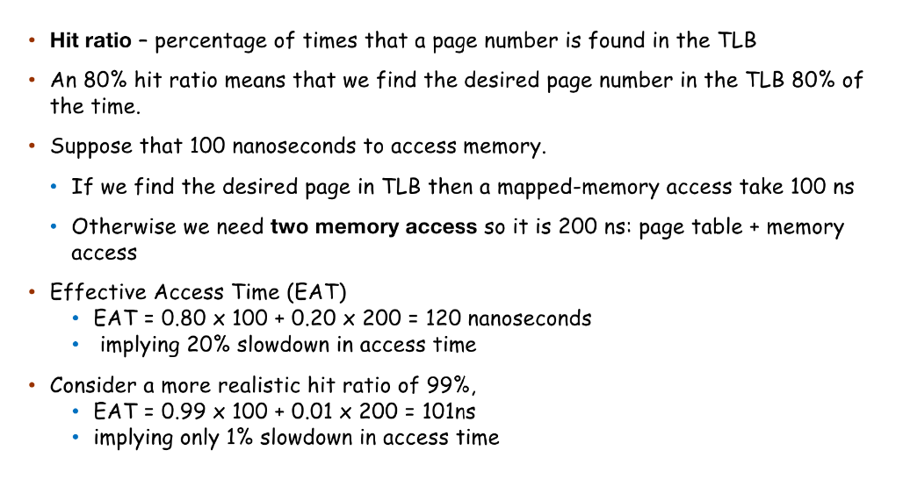

我们可以通过为每个帧设置保护位来实现内存保护，每个页表条目都有一存在位（也称为有效位），它表示该页对应一个有效的物理帧，因此可以访问。每个页表条目也包含一些保护位，如：**内核/用户**、**读/写**、**可执行？**、**内核可执行？**

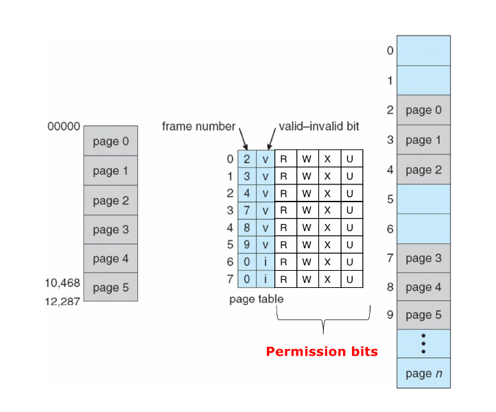

>这里涉及到两种现代处理器增强安全性的内存保护机制：XN和PXN。  
>
>1. XN（Execute Never）—— 永不执行
>
>- 作用：将内存区域明确划分为代码区（可执行）和数据区（不可执行）。如果一个内存页被标记为 XN，那么 CPU 将禁止从该页取指执行指令，只能将其作为数据读写。
>
>- 例如，在 x86 页表条目中有一个 `NX` 位；ARM 页表描述符中有 `XN` 位。
>
>2. PXN（Privileged Execute Never）—— 特权模式下永不执行
>
>- 作用：对内核（特权级）进行额外的限制。如果一个内存页被标记为 PXN = 1，那么当 CPU 处于内核模式（例如 ARM 的 EL1 异常级别）时，不能从该页取指执行指令。
>
>- 它可以防止内核直接执行用户空间的代码。用户空间内存通常设置 PXN = 1，这样即使内核被欺骗跳转到用户提供的地址（比如通过漏洞修改了函数指针），也无法执行那里的指令。

### 共享内存

分页使得进程之间可以共享内存。例如，同一程序的所有进程共享一份代码副本。当然，每个进程也可以拥有自己的私有代码和数据。

共享内存可用于进程间通信。

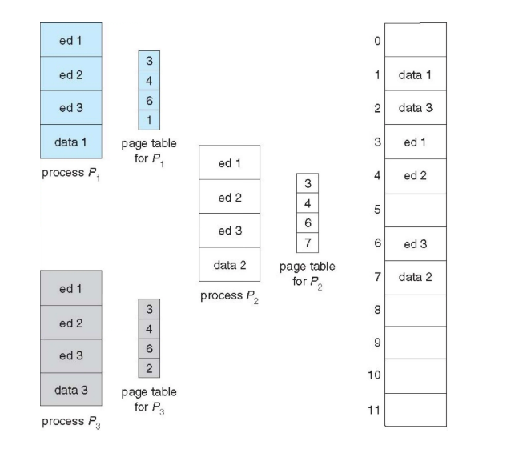

### 分层页表
单级页表会消耗大量内存来存储页表。  
例如：32 位逻辑地址空间，4KB 页面大小，页表将有 100 万个条目（$2^{32} / 2^{12}$），每个条目 4 字节 → 仅页表就占用 4 MB 内存。每个进程还都需要自己的页表，且页表必须在物理上连续存放，这会导致大量的内存浪费。

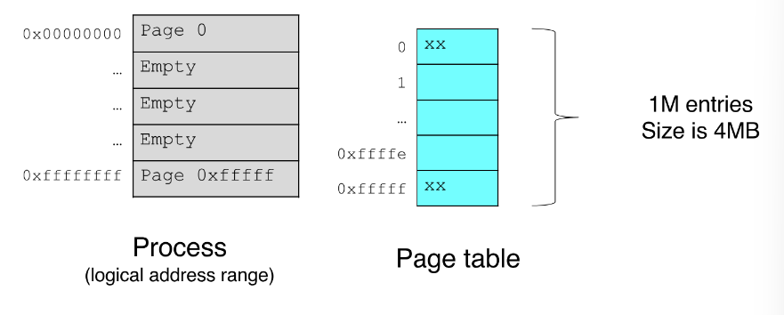
        
我们k可以将页表分解成多个页。页面大小为 4KB，每个页可容纳 1K（1024）个条目，可以将页表分解成 1K 个页。

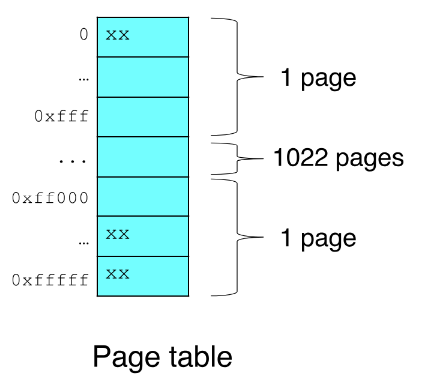

这些页可由 1K 个条目索引，我们可以将这1K个条目索引（总大小为4KB）再放入另一个页中，这样就能将页表分解成两级。

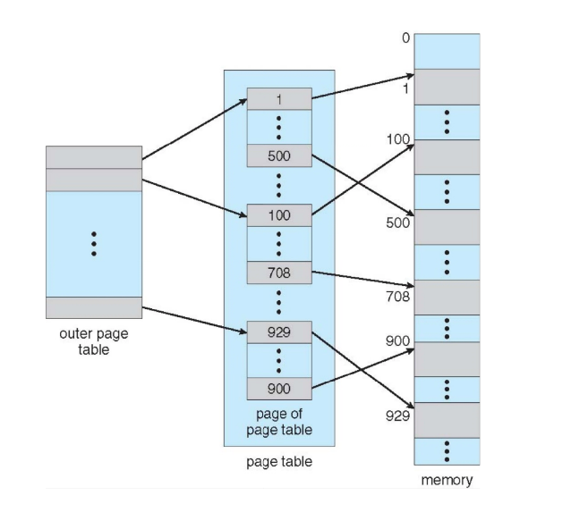

second level page table，每个页表项指向4KB的物理内存。top kevel page table每个页表项指向 1K的条目，则指向1K个4KB的物理内存，即4MB的物理内存。

这样我们就可以重新定义一个逻辑地址：

- 页目录号（第一级页表）
- 页表号（第二级页表）
- 页内偏移

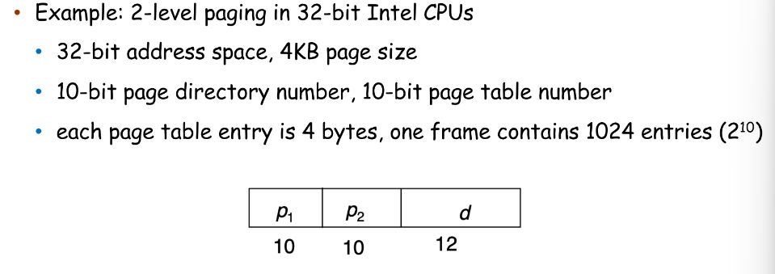

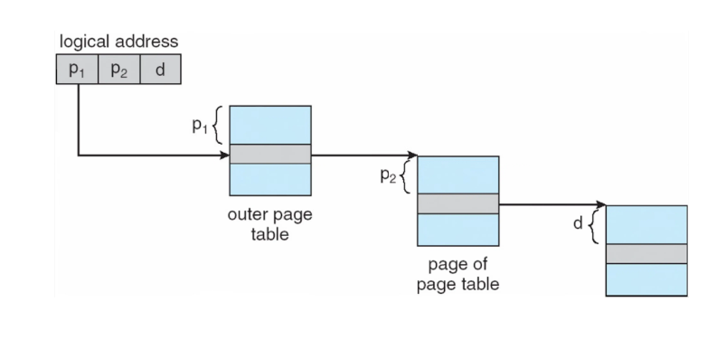

64位逻辑地址空间需要更多级的分页。一种解决方案是增加页表的级数。例如三级分页：第一级页表大小为 $2^{32}$ 字节。（甚至可以到五级分页，分页从底层到高层分别被称为PTE，PMD，PGD，PUD，P4D）

我们通常不支持完整的64位虚拟地址空间。在AMD-64中支持48位，在ARM64中支持39位、48位。

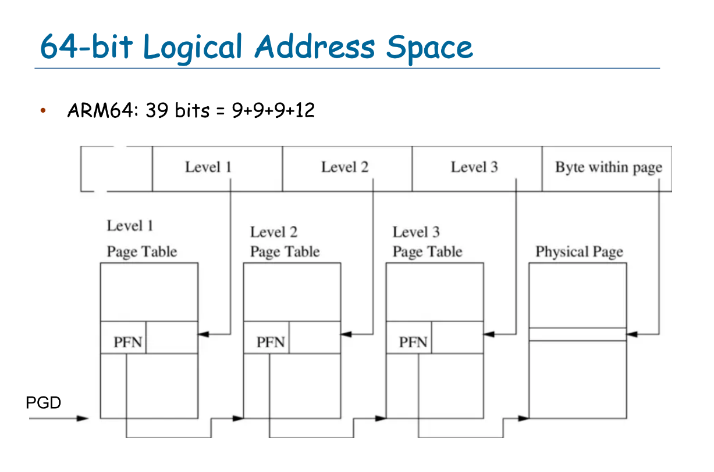

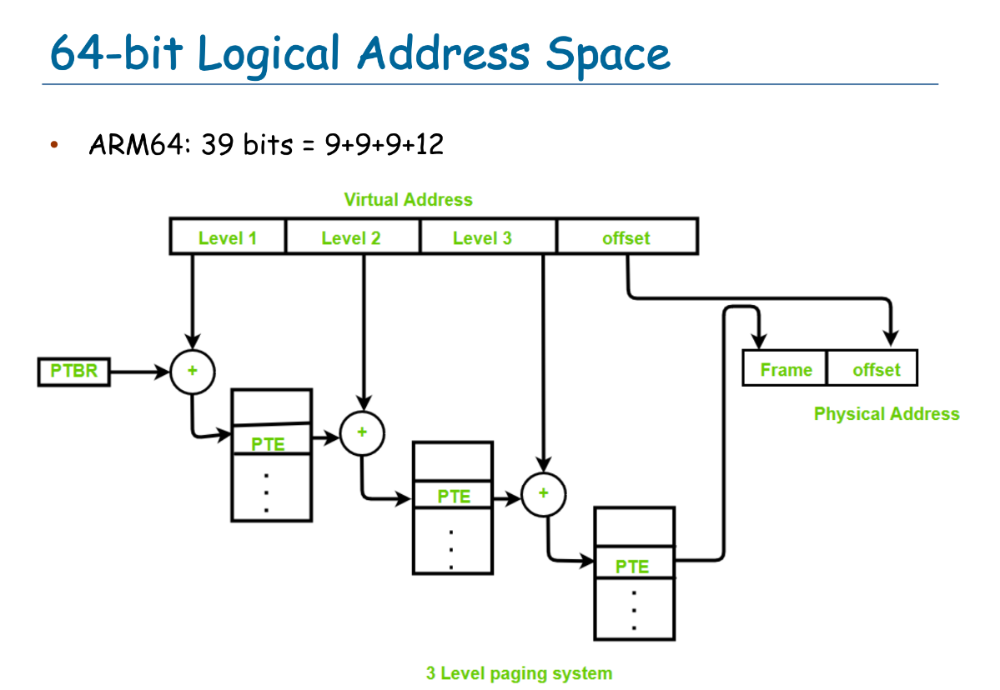

### 哈希页表

在哈希页表中，虚拟页号通过哈希函数映射到帧号。

- 页表项是一个哈希到相同位置的元素链
- 每个元素包含：虚拟页号、帧号，以及指向下一个元素的指针（用于解决冲突）
      - 在该链中比较虚拟页号以查找匹配项
      - 若找到匹配，则返回对应的帧号

哈希页表可用于大于 32 位的地址空间。

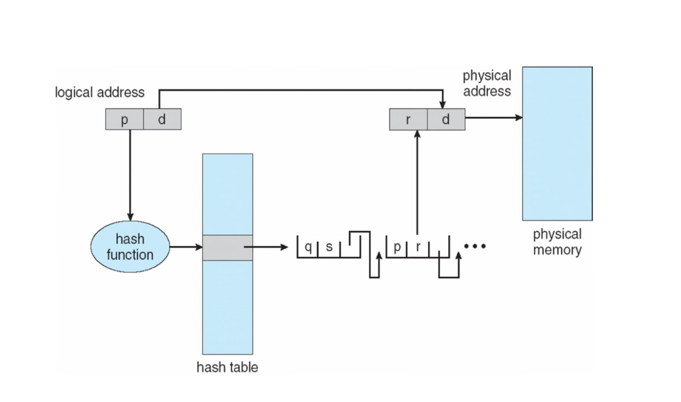

哈希页表的优点是结构简单、节省内存空间。缺点是容易导致冲突，且哈希函数计算慢，时间开销大。

### 倒置页表

由于一般来讲，物理地址空间要远小于逻辑地址空间，于是产生了倒置页表的思想。

倒置页表（Inverted Page Table）的主要逻辑是：以物理内存中的每个物理帧（页框）为单位建立条目，而非以虚拟页为单位。每个条目记录当前占用该物理帧的进程标识和该进程的虚拟页号。进行地址转换时，根据（进程ID，虚拟页号）在倒置页表中查找匹配项，找到后即可得到物理帧号。

这种设计的核心优点：
- 页表大小固定（等于物理帧总数），不随虚拟地址空间增大而膨胀，节省内存。

主要缺点：
- 地址转换需搜索整个表。时间开销大。
- 难以支持共享内存，因为一个物理帧只能被一个进程的一个虚拟页映射。

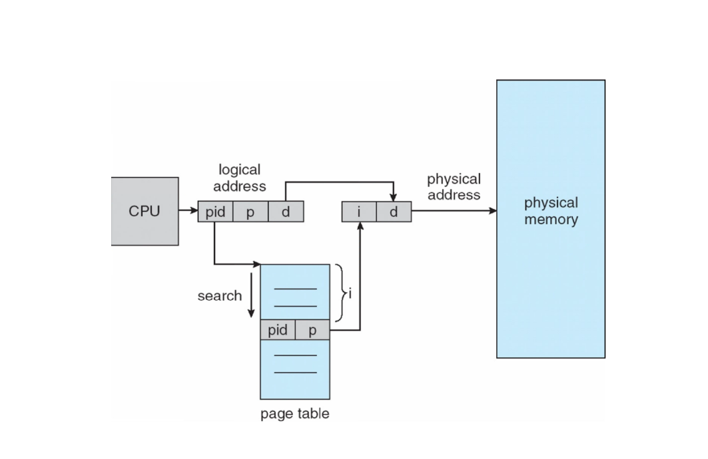

### Paging相关计算

#### Page table size
- 32 位系统，内存为 4 GB(2^32 bit)，假设 Page Size 为 4 KB  
- 4 GB / 4 KB = 1 M entries  
    - Offset 位数 = $\log_2(4KB/1B) = 12$  bits  
    - Index 位数 = $\log_2(4KB/4B(32bitsAddr)) = 10$  bits  

- 每个 entry (一行) 占 4 bytes (32 bits)  
- 则 pgtdl 的大小为 1 M * 4 B = 4 MB  

#### virtual address format
如果页面大小为 64KB，32 位下的虚拟地址格式是什么？64 位下的虚拟地址格式是什么？（39 位 VA、48 位 VA）

32 位：

- 偏移量 = $\log_2(64KB/1B) = 16$ 位
- 页索引 = $\log_2(64KB/4B) = 14$ 位
- 其它位 = $32 - 16 - 14 = 2$  位

64 位：

- 偏移量 = $\log_2(64KB/1B) = 16$ 位
- 页索引 = $\log_2(64KB/8B) = 13$  位
- 对于 39 位 VA
    - 其它位 =$39 - 16 - 13 = 10$ 位
- 对于 48 位 VA
    - 其它位 = $48 - 16 - 13 = 19$ 位

## Swapping（交换）
Swapping（交换）是指当物理内存不足时，将暂时不运行的进程整体移出物理内存，保存到磁盘上的交换空间（backing store），从而腾出内存给其他进程。当该进程需要继续执行时，再将其换回物理内存。

物理内存容量有限，当多个进程总需求超过内存大小时，交换可以让内存“看起来更大”，实现内存超载。

如果下一个要放到 CPU 上执行的进程不在内存中，就需要换出一个进程并换入目标进程，此时上下文切换时间可能变得非常高。如果减少交换的内存大小（通过了解进程实际使用的内存量），可以缩短这一时间。

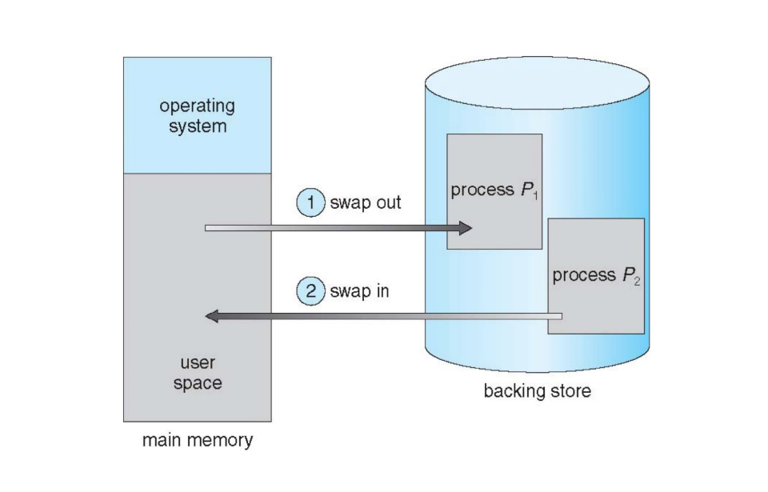

为了优化，我们也可以以页为单位进行交换，而不是以进程为单位。

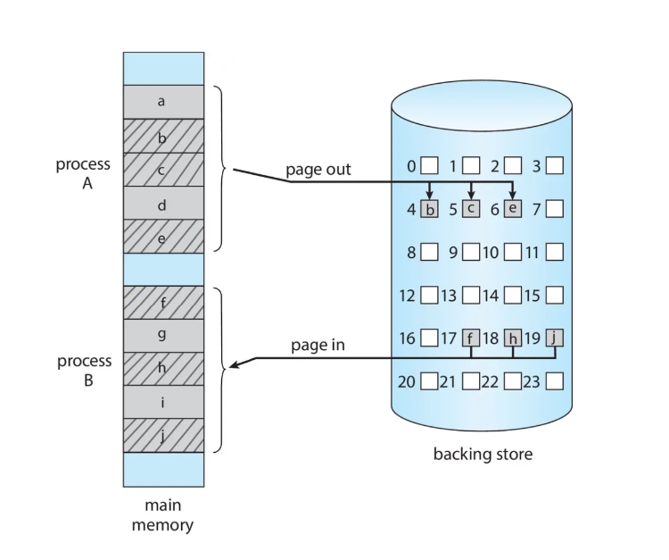

## 虚拟内存
虚拟内存（Virtual Memory）是指通过软件实现的一种技术，使得一个进程认为它拥有连续的可用的内存（一个连续完整的地址空间），而实际上，它通常是被分隔成多个物理内存碎片，分布在多个物理存储器上。

虚拟内存的逻辑地址空间可以远大于物理地址空间。但是虚拟内存仅仅是地址范围，所有存储都实际依托于物理内存。

利用虚拟内存，我们允许多个进程共享内存，使得更多程序能够并发运行，提高进程间通信（IPC）性能。

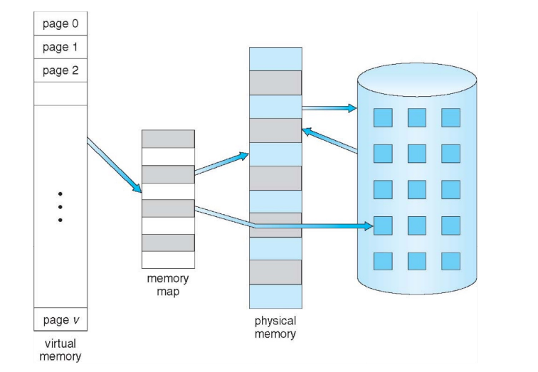

我们通常将虚拟地址空间设计为：栈从最大逻辑地址开始并“向下”增长，而堆则“向上”增长。

这能最大化地址空间的使用。在堆或栈增长到某个新页之前，无需分配物理内存。

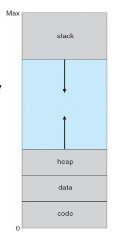

每一段内存都对应不同的VMA（虚拟内存区域）。VMA 包含了虚拟地址范围、权限、映射的文件、映射的偏移量等信息。

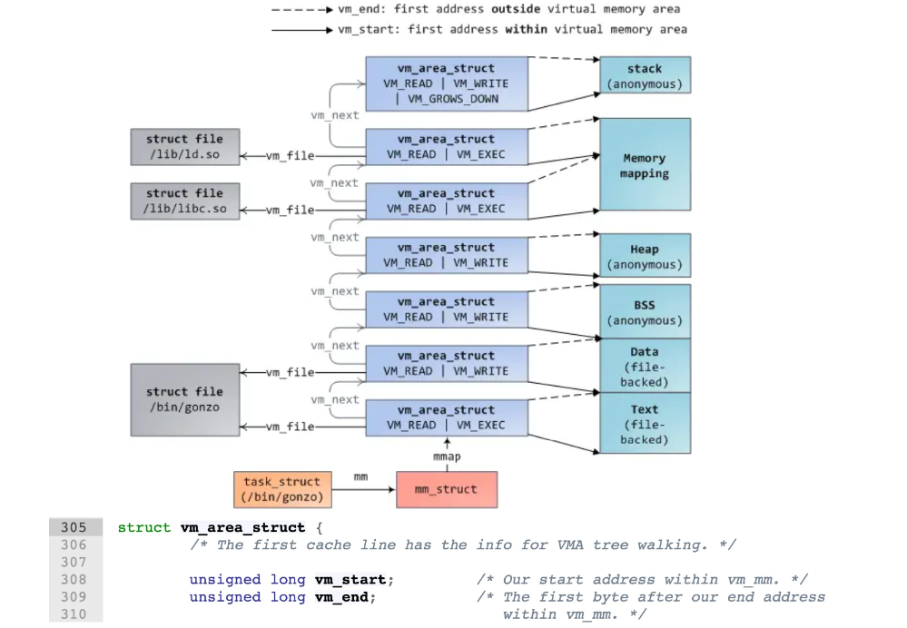

## Demand Paging（按需分页）

按需分页仅在需要时才会去访问页。若页无效，则终止操作；若页有效但不在内存中，则将其调入内存（此处的内存指的是物理内存）。

在得到虚拟地址时，操作系统首先会查看每一个VMA，若该地址在某个VMA中，但在物理内存中没有映射，则触发page fault。若该地址不在任何VMA中，则触发segmentation fault。（查找地址在哪个VMA的过程在Linux中利用了红黑树的结构）

下面举一个例子：

用户进程增加堆的大小，此时在虚拟内存中，堆的页数增加，但新的页并没有映射到物理内存上。此时用户程序在访问新的堆页时，会发生page fault。而内核接收到page fault后，会将一块物理内存分配给用户进程，创建PTE，恢复执行。

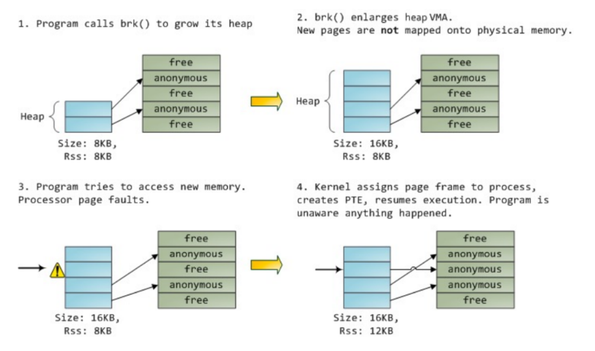

每个页表项都有一个有效–无效（存在）位。MMU通过这个位判断物理帧是否被映射。  
$\nu$表示帧已映射，$i$ 表示帧未映射。  
初始时，所有表项的有效–无效位均设置为 $i$。  
在地址转换过程中，如果该表项无效，则MMU会触发page fault。  

Pure demand paging（纯粹按需分页）：即在进程开始运行时，内存中没有任何帧，即完全不预先分配物理内存，而是在需要时才分配。

这会导致代码段和数据段的page fault，与heap和stack的page fault相比，它们不是将任意的可用的物理内存映射到进程的虚拟地址空间，若对应的页不在物理内存中，则需要访问磁盘，将对应的页调入内存，从而建立映射关系。

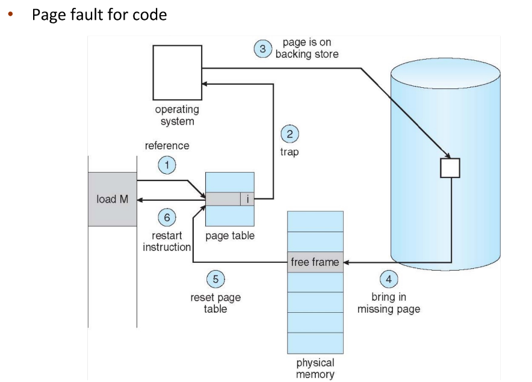

在与磁盘交互时，我们有两种方式：
- 惰性交换（Lazy swapping）：除非页面确实需要，否则绝不将其换入内存

- 预分页（Prepaging）：在进程引用页面之前，预先将其所需的部分或全部页面调入内存。 

预分页可以减少执行过程中的缺页次数，但如果预分页的页面未被使用，则会浪费 I/O 和内存。

以下是按需分页的Worse Case：

- 1.陷入操作系统
- 2.保存用户寄存器及进程状态
- 3.判断该中断是否为缺页错误
    - 检查所访问的页面是否合法
- 4.寻找一个空闲帧
- 5.确定页面在磁盘上的位置，发起从磁盘到空闲帧的读取操作：
    - 在设备队列中等待，直到读取请求被处理
    - 等待设备的寻道时间及/或延迟时间
    - 开始将页面数据传输到空闲帧
- 6.在等待期间，将 CPU 分配给其他进程
- 7.接收到来自磁盘 I/O 子系统的中断（I/O 完成）
    - 判断该中断来自磁盘
    - 将发生缺页错误的进程标记为就绪
- 8.等待 CPU 再次被分配给该进程
    - 保存其他进程的寄存器及进程状态
    - 上下文切换至发生缺页错误的进程
- 9.更正页表，映射新帧
- 10.返回用户态：恢复用户寄存器、进程状态和新页表，然后重新执行被中断的指令

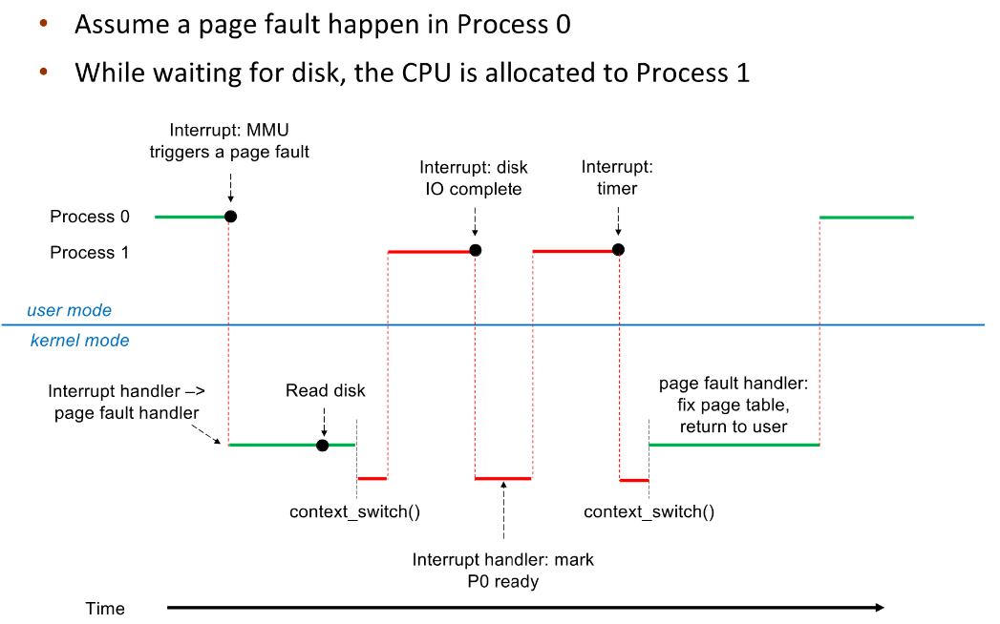

如果是heap和stack的page fault，则上述步骤只需要保留1,2,3,4,9,10步。

由于我们引入了page fault，我们需要重新计算EAT（有效访问时间）。

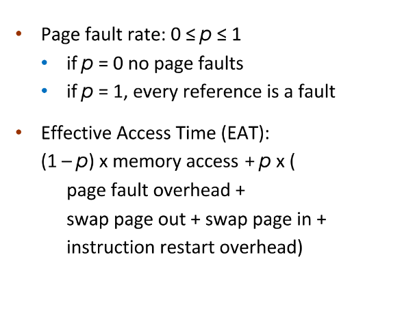

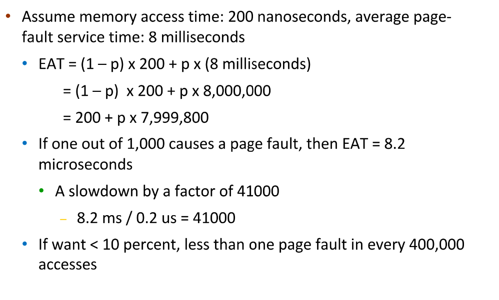

由于访问磁盘会导致大量的时间开销，因此在进程加载时，我们可以将整个进程映像从磁盘复制到交换空间（backing store），以减少时间开销。

>page fault有两种：Major page fault和Minor page fault。  
>
>Major page fault：引用的页面不在内存中，需要从磁盘加载。  
>
>Minor page fault：映射不存在，但该页已在内存中。  
### 写时复制（Copy-on-Write）
写时复制（Copy-on-write, COW）允许父进程和子进程初始时共享内存中的相同页面。只要没有进程修改该页面，页面就保持共享状态。

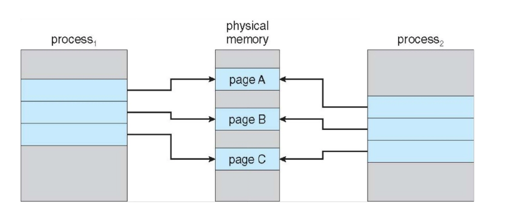

如果任一进程修改了一个共享页面，此时才会复制该页面  

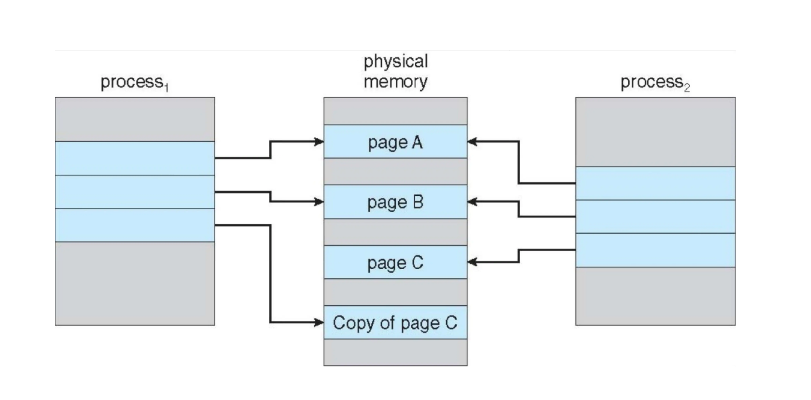

COW 实现了更高效的进程创建。如调用fork 时无需复制父进程的内存，只有被修改的内存才会在之后被复制。 

## Page Replacement（页置换）

当物理内存不足时，需要从内存中踢出一些页，以腾出空间。页面置换实现了逻辑内存与物理内存的彻底分离——可以在较小的物理内存上提供较大的虚拟内存。

页面置换算法有以下几种：

### 最佳置换算法（Optimal）
选择被访问次数最少的页面置换。这是理想的算法，但无法实现。

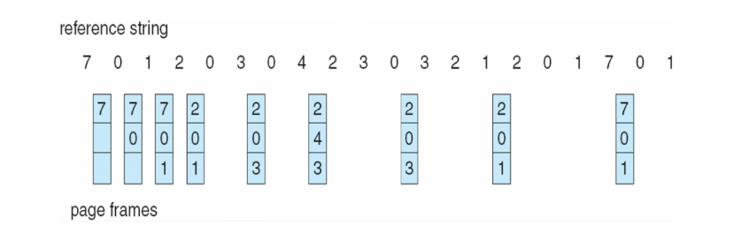

### 先进先出置换算法（FIFO）
选择最先进入内存的页面置换。

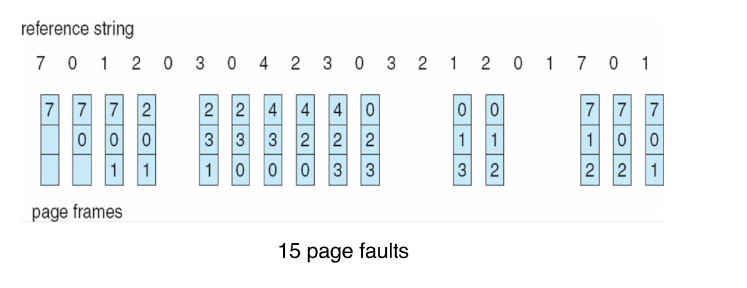

对于 FIFO 算法，增加内存帧可能会导致更多的缺页次数（Belady 异常）。

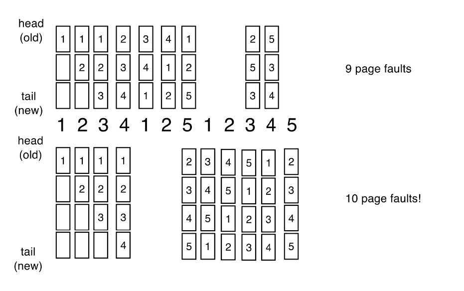

### 最近最久未使用置换算法（LRU）

选择最近一段时间内最久未被访问的页面置换。通常是性能良好且常用的算法。

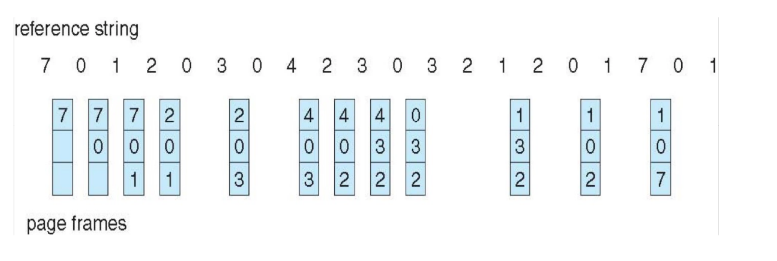

LRU 算法有两种常见实现：
- 栈式实现：维护一个页号栈（使用双链表），当页面被引用时，将其移动到栈顶。这种方法每次更新的开销较大，但无需搜索替换目标。
- 基于计数器的实现：每个页表项都有一个计数器，每次页面被引用时，将时钟的值复制到计数器中，当需要替换页面时，搜索计数器值最小的页面。可以依托最小堆来搜索。

但上述基于计数器和基于栈的 LRU 实现具有较高的性能开销。于是我们引入使用引用位的LRU实现。  
  
为每个页面关联一个引用位，初始设置为0。当页面被引用时，将该位设置为 1（由硬件完成），在置换时替换任何引用位为 0 的页面（如果存在的话）。然而，我们并不知道页面的使用顺序。

以下是一个实现：

- 假设每个页面有一个 8 位的字节  
- 在一个时间间隔（例如 100ms）内，将位右移 1 位，如果页面被使用则将高位设为 1，然后丢弃低位  
- 00000000 => 表示在最近的 8 个时间间隔内从未被使用  
- 11111111 => 表示在所有的 8 个时间间隔内都被使用  

### 第二次机会置换算法（Second-chance）
通过引用位，我们可以实现 Second-chance 算法。如果要替换的页面引用位为0，则置换该页面；否则，将引用位设置为 0，将页面保存在内存中，继续搜索下一个页面。

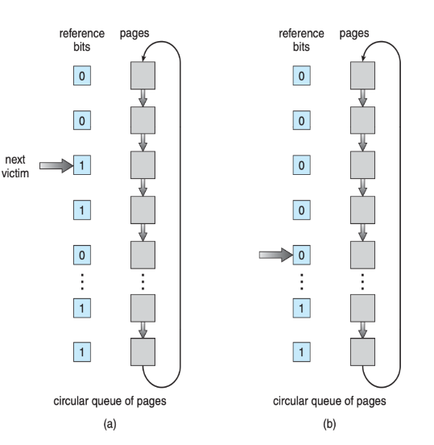

通过引用位和修改位（如果可用）协同工作可以改进算法，我们采用有序对 (引用, 修改)：

- (0, 0) 既未被近期使用也未被修改：最适合置换的页
- (0, 1) 未被近期使用但已被修改：稍差一些，置换前需要写回
- (1, 0) 被近期使用但是干净的：可能很快会被再次使用
- (1, 1) 被近期使用且已被修改：可能很快会被再次使用，且置换前需要写回

### 其他页置换算法
我们需要记录每个页面的被访问次数，来实现LFU和MFU算法。

最不常用（LFU）：置换计数器值最小的页面    

最常用（MFU）：置换计数器值最大的页面。依据是：计数器值最小的页面很可能是刚刚调入、尚未被使用的页面。

LFU 和 MFU 这两种算法并不常见。

### Page Buffering（页缓冲）

操作系统始终维护一个空闲帧池。需要时就能直接获得帧，而无需在缺页时临时寻找。

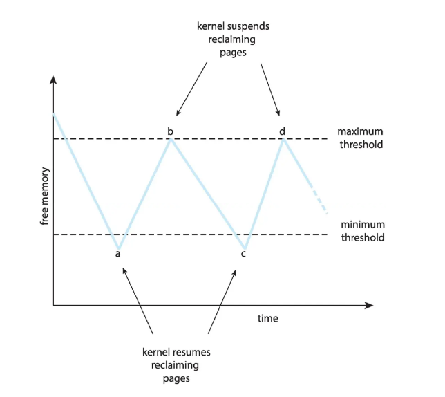

同时，对于修改的页，可以维护一个修改页列表。当磁盘空闲时，将这些页写入磁盘，这样该页被置换时就无需再写回后备存储。

还可以保留空闲帧的内容不变，并记录其中存放的是哪个页面（这相当于一种缓存），如果在被重新使用之前又被访问到，就无需再次从磁盘加载内容。

有些应用程序可能会保留用到的页在内存中用于自身的工作，而操作系统也在内存中保留页面的副本作为 I/O 缓冲区，这会导致双重缓冲，浪费内存。操作系统可以让应用程序直接访问磁盘，从而不再介入应用的工作路径（原始磁盘模式）。

## 帧的分配与替换
每个进程根据指令语义需要最少数量的帧，以便运行。因此，我们可以对进程进行内存分配。主要方案有两种：

- 平均分配：每个进程分配相同数量的帧，但不能超过系统总体可用帧数。
- 按比例分配：根据进程的大小进行分配，会随着多道程序度、进程大小的变化而动态调整。

在帧替换时，也有两种方案：

- 全局置换：进程从所有帧的集合中选择一个置换帧；一个进程可以取走另一个进程的帧。这种情况会导致进程的执行时间可能波动很大（取决于其他进程），但吞吐量更高，因此更常见。
- 局部置换：每个进程仅从分配给自己的帧集合中进行置换，这种方案使每个进程的性能更稳定，但可能导致内存利用率不足。

### 页面回收

页面回收一种实现全局页面置换策略的方法，所有内存请求都通过空闲帧列表来满足。不是等到空闲帧列表降为零才开始选择要置换的页面，而是当列表低于某个阈值时触发页面置换（Page buffering），该策略试图确保始终有足够的空闲内存来满足新的请求。

在页面回收时，我们需要杀死某些进程，杀死进程时需要根据它们的OOM 分数（内存不足分数）来选择杀死哪些进程。OOM 分数即在可用内存不足时，该进程被终止的可能性高低。

### 非一致性内存访问（Non-coherent memory access）

到目前为止，我们假设所有内存访问速度相同。但实际上，许多系统是 NUMA 架构，即对内存的访问速度是不同的。

为了提升性能，我们需要将内存分配在尽量“靠近”线程所调度运行的 CPU 的位置。

### Thrashing（抖动）

如果一个进程没有被分配“足够”的页（帧），缺页率可能会很高，缺页调入页面，同时置换掉某现有帧，但很快又需要被置换出去的那个帧，导致进程忙于不断地换入换出页面，称为 thrashing。

thrashing会导致CPU 利用率低，而内核认为需要提高多道程序度以最大化 CPU 利用率，系统加入更多进程，导致thrashing现象更加严重，CPU 利用率进一步下降。

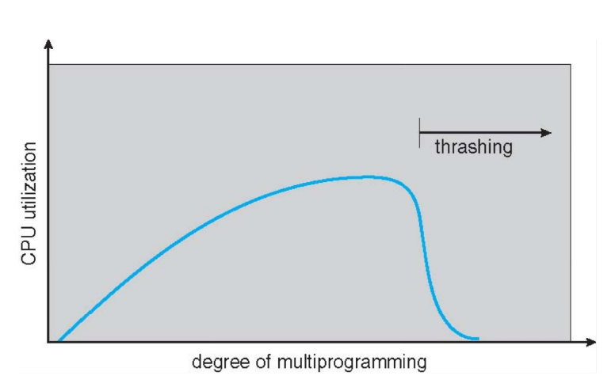

进程的内存访问具有高度局部性，即进程在某一段时间内访问的页面集中在一小部分，进程可以从一个局部区迁移到另一个局部区，局部区之间可能重叠。当总内存大小 < 所有局部区的总大小时，就会发生thrashing 现象。

我们可以通过使用局部页面置换来限制抖动的影响，一个进程开始抖动不会影响其他进程。

第二个方案是通过计算进程需要的帧来合理分配内存。

我们引入工作集窗口（Δ）：固定数量的页面引用次数。

- 若 Δ 太小 ➡ 将无法包含整个局部区  
- 若 Δ 太大 ➡ 将包含多个局部区  
- 若 Δ = $∞$ ➡ 将包含整个程序  

进程 $p_i$ 的工作集（$WSS_i$）：最近 Δ 引用中被访问过的页面总数（随时间变化）  

总工作集大小： $D = \sum WSS_i$ 

- 对总局部区大小的近似  
- 若 $D > m$ ➡ 可能发生抖动  

避免抖动的方法：若 $D > m$，则挂起或换出某些进程。

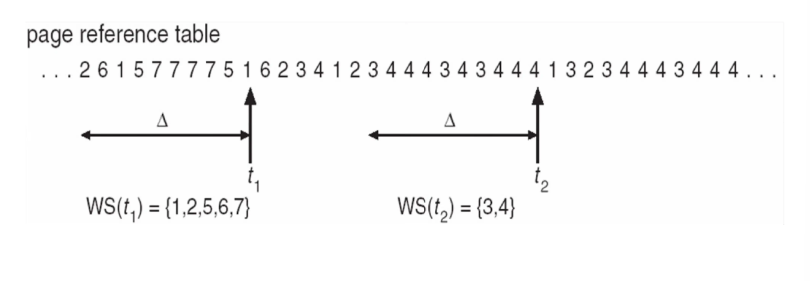

假设没有发生抖动，进程的工作集与其缺页率之间存在直接关系。工作集会随着时间变化，缺页率也会随时间出现波峰与波谷。这显示了进程内存访问的局部性。

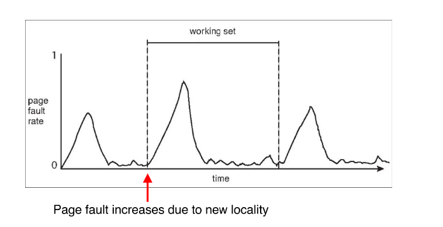

我们也可以通过缺页率来合理分配进程的内存，我们建立一个“可接受”的缺页频率（PFF）阈值。如果实际缺页率太低，进程减少内存帧；如果实际缺页率太高，进程增加内存帧。

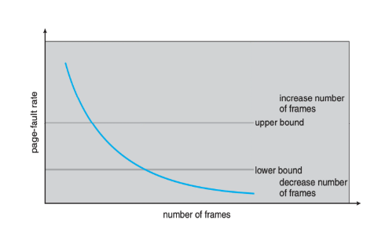

### 内核内存分配

内核内存分配与用户内存的处理方式不同，它通常从空闲内存池中分配，且需要立即满足请求，因此不会有 Page Faults。

### I/O interlock
I/O 互锁：页面有时必须被锁定在内存中。

如用于从设备复制文件的页面必须被锁定，以防止被页面置换算法选中换出

## Windows XP的内存管理
Windows XP采用带群集调页的demand paging策略，群集调页会调入缺页页面周围的页面（利用局部性原理）。

Windows XP会为进程分配工作集的最小值和最大值。

- wsmin：保证进程拥有的最小页面数
- wsmax：进程最多可以分配的页面数上限

当系统空闲内存量低于阈值时，它会自动进行工作集修剪，从从页面数超过wsmin 的进程中移除页面，以恢复空闲内存量。

## Linux的内存管理

（见:浙江大学 计算机系统Ⅲ 常瑞,申文博,吴磊 2026-05-06第9-10节）

### Linux Buddy System

Linux使用$2$的幂次分配器进行内存分配，即内存以$2$的幂次大小的单位进行分配，将请求向上取整到最接近的分配单位。

假设只有 256KB 的块可用，内核请求 21KB

- 将块分割成两个 128KB 的块（$a_L$ 和 $a_R$）
- 进一步将一个 128KB 的块分割成两个 64KB 的块（$b_L$ 和 $b_R$）
- 再将一个 64KB 的块分割成两个 32KB 的块（$c_L$ 和$c_R$）
- 将其中一个块分配给请求

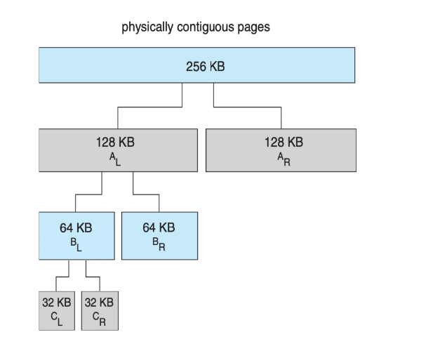

Buddy System的优点是可以快速将未使用的块合并成更大的块，缺点是会产生内部碎片（21KB 的请求，分配 32KB 的块）

### Linux的slab分配器

Linux的slab分配器是一种基于对象（object）的内存分配器。

Slab 分配器中的缓存由一个或多个 slab 组成，一个 slab 包含一个或多个页面，划分为大小相同的对象。

内核为每种唯一的内核数据结构使用一个缓存。创建缓存时，分配一个 slab，并将该 slab 划分为空闲对象，数据结构的对象从 slab 中的空闲对象分配，如果一个 slab 中的对象全部被使用，则下一个对象来自一个新的（空的）slab。

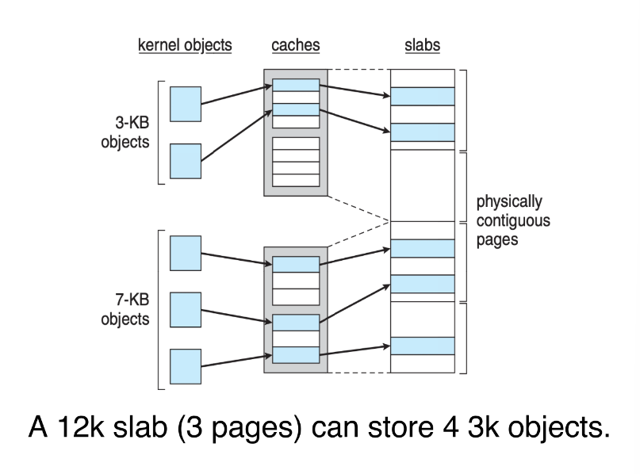

优点：无碎片且内存分配快速，某些对象字段可能可以复用，无需重新初始化。