# 大容量存储结构

## 磁盘
### 磁盘结构

磁盘驱动器被寻址为一维的逻辑块数组（LBA），逻辑块是最小的传输单元，它按顺序映射到磁盘的扇区。

映射顺序为：首先遍历该磁道，然后遍历该柱面内的其余磁道，最后遍历从最外侧到最内侧的其余柱面。

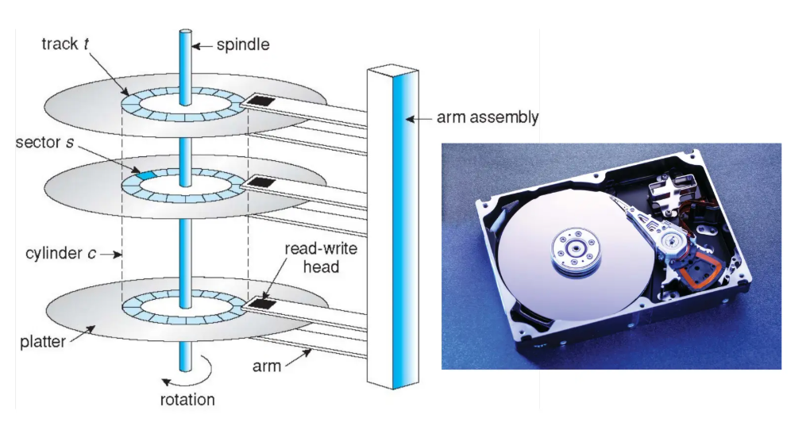

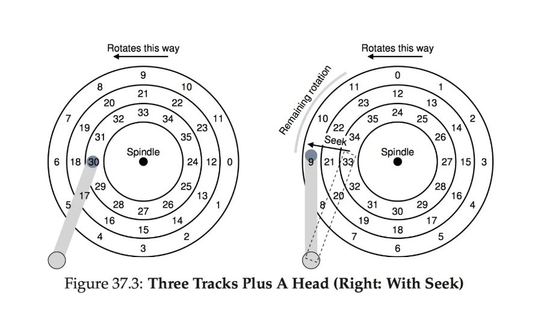

定位时间是指将磁盘臂移动到目标扇区所需的时间，定位时间包括寻道时间和旋转延迟  

- 寻道时间：将磁头移动到目标柱面  
- 旋转延迟：等待目标扇区旋转到磁头下方  

定位时间也称为随机访问时间。

传输速率是指数据在硬盘与计算机之间流动的速率，理论值 6 Gb/秒，实际有效值约 1 Gb/秒。 
  
平均 I/O 时间：平均访问时间（=平均寻道时间 + 平均延迟）+ （传输数据量 / 传输速率） + 控制器开销。其中主要的时间开销在平均访问时间上。

### 磁盘调度

磁盘调度用于选择下一个要服务的待处理磁盘请求。磁盘 I/O 请求的并发来源包括操作系统、系统/用户进程，每个请求提供 I/O 模式、磁盘和内存地址以及扇区数。

过去，操作系统负责队列管理和磁盘驱动器磁头调度，现在，这些功能内置于存储设备、控制器的固件中，只需提供 LBA（逻辑块寻址），由设备处理请求排序。

磁盘调度通常试图最小化寻道时间，这就需要磁盘调度算法来安排磁盘请求的服务顺序。

#### 先来先服务（FCFS）

先来先服务（FCFS）算法是最简单的磁盘调度算法，它按请求到达的顺序进行服务。

优点：

- 每个请求都有公平的机会
- 没有无限期推迟

缺点：

- 不尝试优化寻道时间
- 可能无法提供最佳的服务

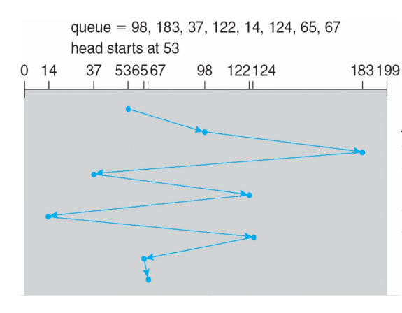

#### 最短寻道时间优先（SSTF）

选择距离当前磁头位置寻道时间最短的请求  

SSTF 调度是 SJF（最短作业优先）调度的一种形式，但与 SJF 不同，SSTF 未必是最优的。

优点：  

- 平均响应时间降低  
- 吞吐量提高  

缺点：  

- 需要预先计算寻道时间，存在额外开销  
- 如果某个请求相对于新到达的请求具有更长的寻道时间，可能导致该请求饥饿  
- 响应时间方差较大，因为 SSTF 只偏好部分请求

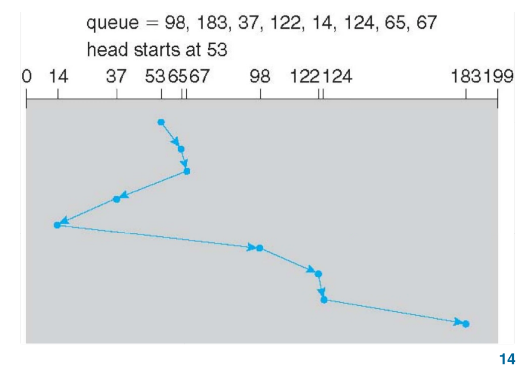

#### 扫描算法（SCAN）

磁盘臂从磁盘的一端开始，向另一端移动，在移动过程中服务请求，直到到达另一端。然后，磁头移动方向反转并继续服务。

优点：

- 高吞吐量  
- 响应时间方差小  
- 平均响应时间适中  

缺点：

- 对磁盘臂刚刚访问过的位置的请求，等待时间较长

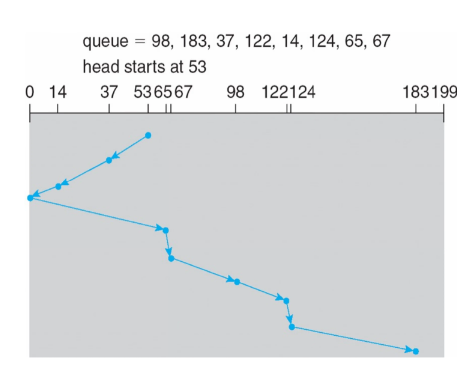

#### 循环扫描算法（C-SCAN）

循环扫描算法旨在提供更均匀的等待时间

磁头从一端向另一端移动，在移动过程中服务请求

当磁头到达末端时，立即返回起点，返回途中不服务任何请求。

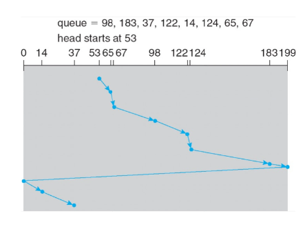

#### LOOK/C-LOOK

SCAN 和 C-SCAN 会将磁头从一端移动到另一端，即使中间没有 I/O 请求

实际实现中，磁头只移动到每个方向上的最后一个请求为止

它避免了因不必要地遍历到磁盘末端而导致的额外延迟。

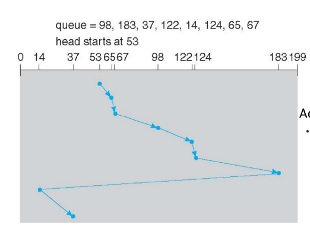

#### 磁盘调度算法选择

磁盘调度性能取决于请求的数量和类型
  
- SSTF 较为常见，是默认算法的合理选择
- LOOK 和 C-Look 在 I/O 负载较重的系统中性能更优

### 磁盘管理

在用磁盘时，我们首先要对其进行物理格式化，即将磁盘划分为扇区，以便控制器进行读写，每个扇区可包含头部信息、数据以及纠错码（ECC），数据部分通常为 512 字节，但也可以选择其他大小 。

在物理格式化后，我们要对磁盘进行分区，将磁盘划分为若干柱面组，每个组作为一个逻辑磁盘。

然后进行逻辑格式化，对每个分区进行格式化，在其上创建文件系统。文件系统可以进一步将块组合成簇以提高性能，磁盘 I/O 以块为单位进行，文件 I/O 以簇为单位进行。

根分区包含操作系统，它在启动时挂载，其他分区可以存放其他操作系统、其他文件系统，或者是裸分区，其他分区可以自动挂载或手动挂载。

在挂载时会检查文件系统的一致性，检查所有元数据是否正确。如果不正确，则修复并再次检查；  
如果正确，则添加到挂载表中，允许访问。

启动块可以指向启动卷或一组启动引导块，这些块包含足够代码，知道如何从文件系统加载内核。负责初始化系统。

磁盘上可以有交换空间（swap space），当 DRAM 不足以容纳所有进程时，用于将整个进程（交换）或分页（请求分页）从 DRAM 移动到辅助存储。操作系统能提供交换空间管理。交换空间可以设置多个，可以放在独立分区中，也可以放在文件系统内的一个文件中（便于添加）。

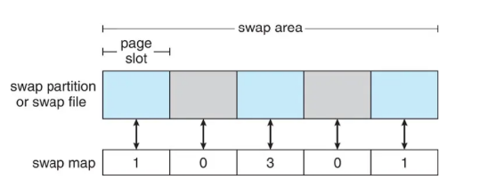

磁盘可以通过以下方式连接到计算机：

- 主机连接存储（host-attached storage）
- 网络连接存储（network-attached storage）
- 存储区域网络（storage area network）

#### 主机连接存储
磁盘可通过 I/O 总线 直接连接到计算机。有两种常见的总线接口：SCSI（小型计算机系统接口）和IDE（集成驱动电子设备）接口。

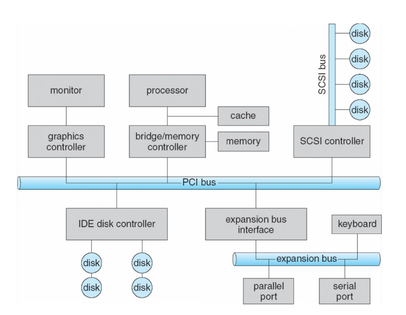

#### 网络连接存储

网络连接存储（NAS）是指将磁盘通过网络连接到计算机，并提供网络文件共享服务。通常通过远程过程调用（RPC）实现。客户端可以远程挂载服务器上的文件系统，并通过网络访问文件。常见的协议有 NFS、CIFS 和 iSCSI。NAS一般在 IP 网络上基于 TCP 或 UDP 运行。

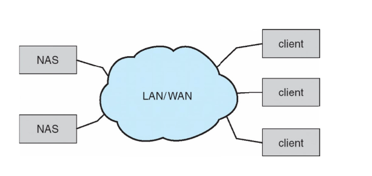

SAN 是一个连接服务器和存储单元的专用网络，它使用高速互连和高效协议，光纤通道（InfiniBand）是最常见的 SAN 互连方式。

多个主机和存储阵列可以连接到同一个 SAN，这样一个服务器集群可以共享同一存储，且存储可以动态分配给主机。

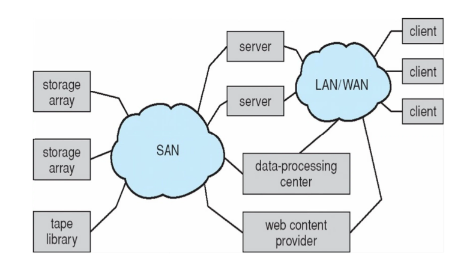

### RAID

由于磁盘不可靠、速度慢，但价格便宜的特性，使得磁盘阵列（RAID）应运而生。

RAID，即独立磁盘冗余阵列，它由多个磁盘组成，利用冗余来提高速度和可靠性。

RAID 主要用了以下几个技术：

- 数据镜像：在多个磁盘上保存相同的数据。
- 数据条带化：将数据拆分到多个磁盘上，以实现并行读取。
- 纠错码（ECC）- 奇偶校验位：保存能够因某个磁盘故障而重建丢失数据的信息。

这些技术可以随意组合使用，它们的组合被称为“RAID级别”，常见的 RAID 级别有 0，1，1+0，5，5+0，6，6+0。

RAID 0：将数据均匀分布在两块或更多磁盘上，使用固定的条带大小，不使用奇偶校验位，不使用镜像，无冗余。适用于高性能场景。

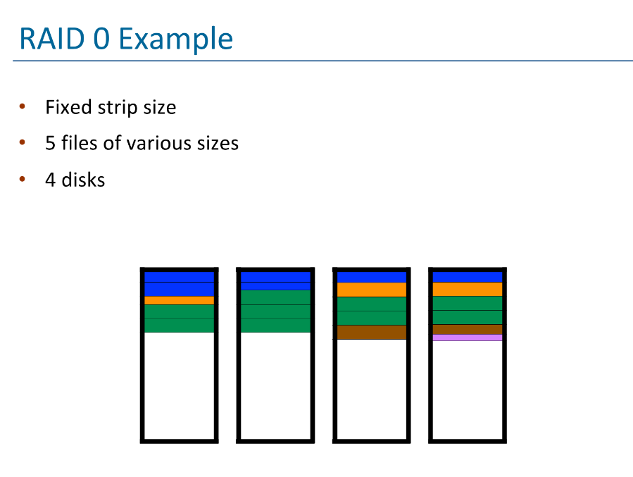

RAID 1：在一组数据的两块磁盘上保存完全相同的副本（即镜像），每个写入的字节都写入两块磁盘，使用的磁盘数量是 RAID 0 的两倍。这种方式可靠性得到保证，除非发生（极不可能的）同时故障。RAID 1 可以通过从寻道时间最短的磁盘读取来提升性能，即磁头臂最接近目标柱面的那个磁盘。

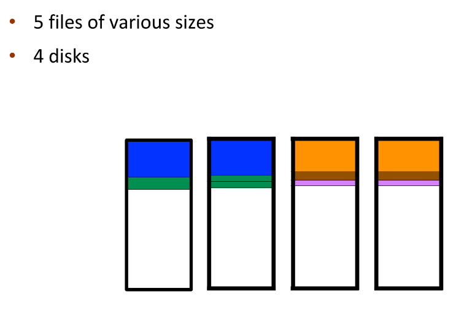

RAID 2：在比特级别对数据进行条带化，使用汉明码进行纠错。汉明码即每4位数据使用3位奇偶校验纠错，最多可使用7块磁盘。RAID 2 由于以bit为单位，效率极低，所以没有被广泛使用。

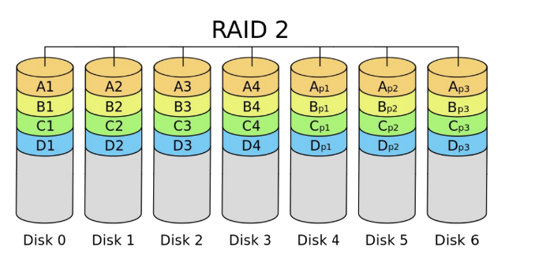

RAID 3：RAID 3使用了位交错奇偶校验。数据条带化分布在多个磁盘上，同时有一个专用的奇偶校验盘，用于存储所有数据盘的奇偶校验信息。每次写入都会涉及所有磁盘，每个磁盘存储一个比特，同时计算并存储奇偶校验位，用于数据恢复。

RAID 3由于也和RAID 2一样以bit为单位，所以一般不单独使用。

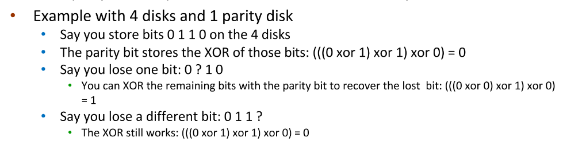

RAID 4：基本与 RAID 3 类似，但使用条带（块）级别进行交错。

RAID 5：类似 RAID 4，但奇偶校验信息分布到所有磁盘上，而不是只有一个专用的奇偶校验盘。 

RAID 6：在 RAID 5 的基础上增加了一个额外的奇偶校验块。它采用块级条带化，并带有两个奇偶校验块。

RAID 只能检测/恢复磁盘故障，它不能防止或检测数据损坏或其他错误 

## 非易失性存储设备

如果类似于磁盘驱动器，则称为固态硬盘（SSD）

其他形式包括 USB 驱动器（U盘、闪存盘）、DRAM 磁盘替代品、主板贴装器件以及主存储设备

以下是相较于磁盘的一些特点：

- 可能比 HDD 更可靠
- 每 MB 价格更昂贵
- 可能寿命较短——需要谨慎管理
- 容量较小，但速度更快
- 总线可能成为瓶颈 
- 没有移动部件，因此没有寻道时间或旋转延迟，先来先服务（FCFS）即可表现良好。

它以“页”为单位进行读写（类似于扇区），但不能原地覆盖，必须先擦除，而擦除以更大的“块”为单位进行。

SSD只能进行有限次数的擦写，之后会损坏———约 10 万次。

由于无法覆盖写入，页面中会混杂有效数据和无效数据。为了跟踪哪些逻辑块是有效的，控制器维护一个闪存转换层（FTL）表，该表记录每个逻辑块的状态。而控制器也通过实现垃圾回收以释放无效页面所占用的空间；控制器通过分配预留空间为垃圾回收提供工作区域，它将有效数据复制到预留空间区域，然后擦除该块以供后续使用。

每个存储单元都有使用寿命限制，因此需要均匀写入所有存储单元。

## 磁带

磁带是早期的一种二级存储设备，现在主要用于备份。

它的优点是容量大，一般200GB 到 1.5 TB，且存储在磁带上的数据相对持久；但缺点是访问时间慢，尤其是随机访问，它的寻道时间远高于磁盘。

