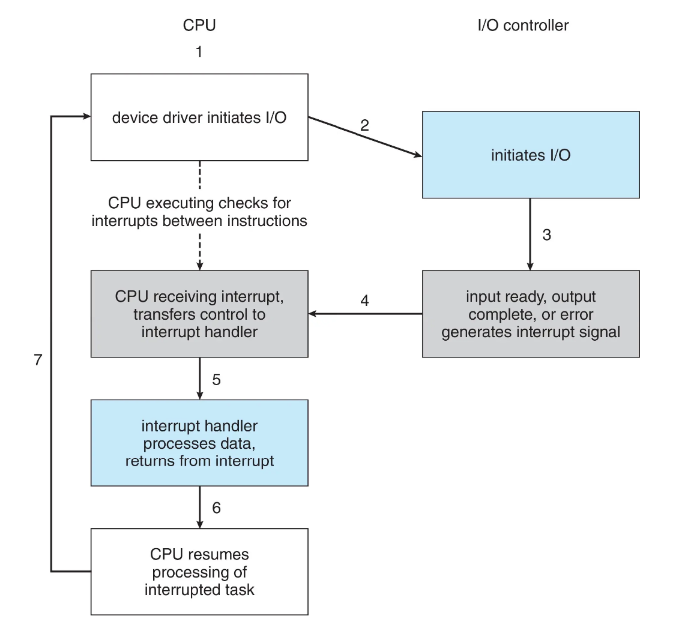
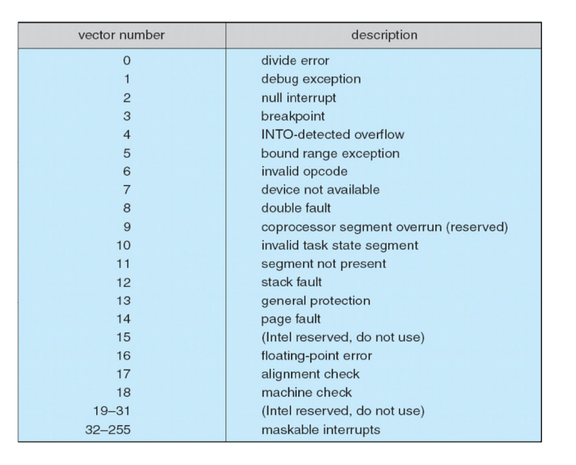
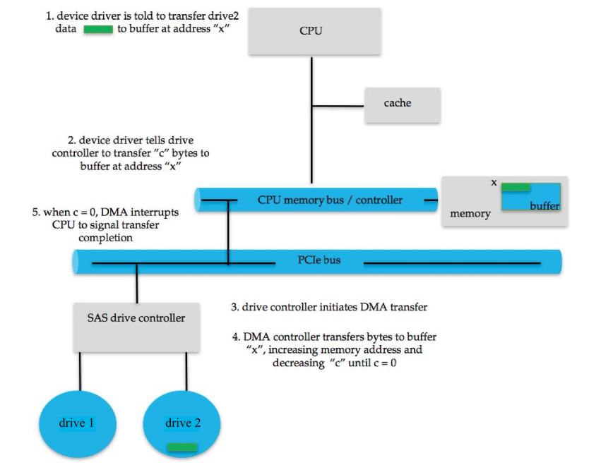
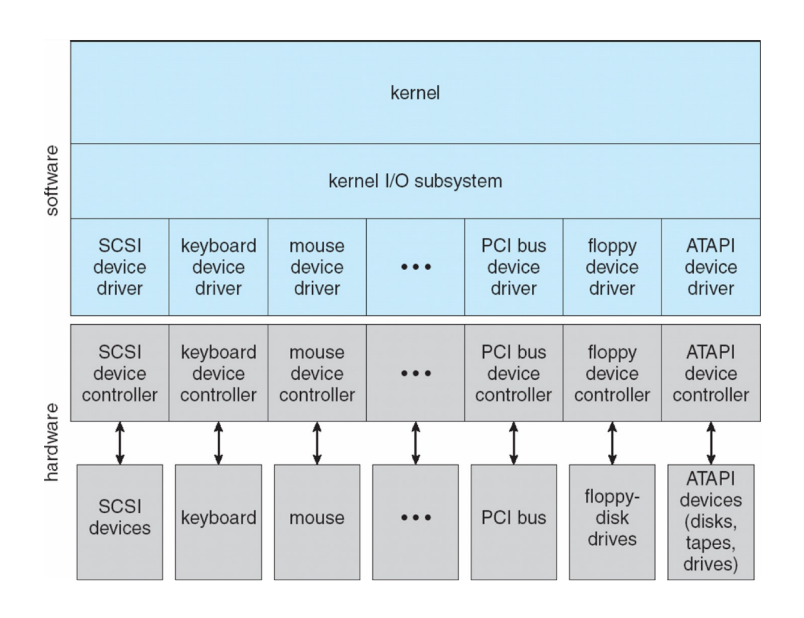
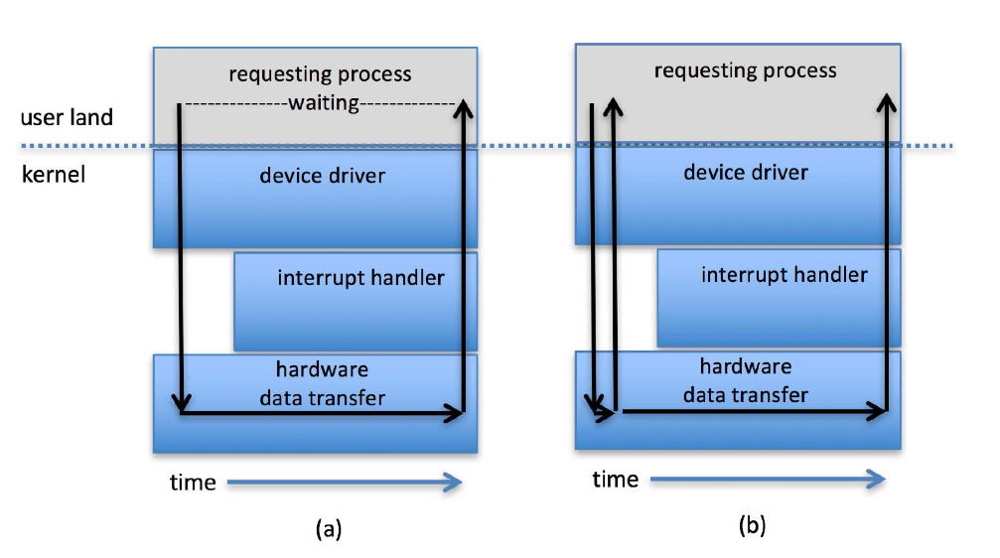
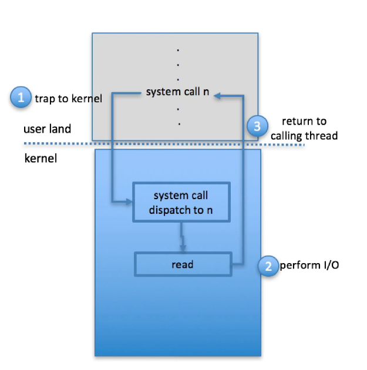
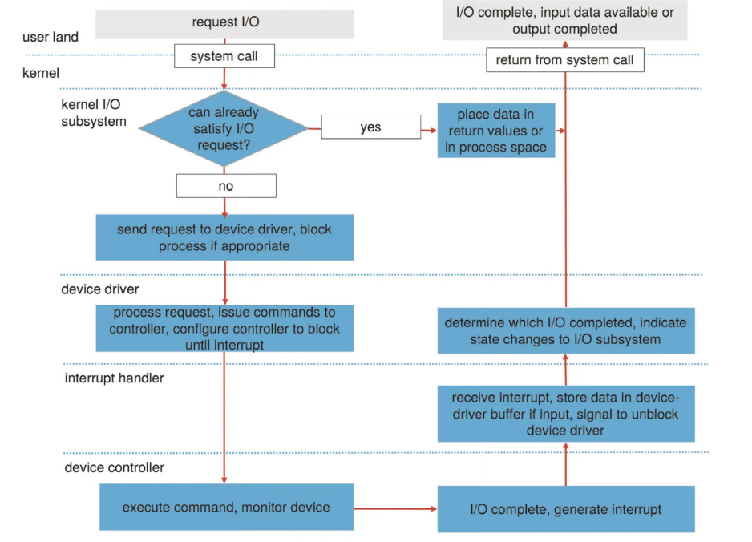

# I/O设备管理

I/O 管理是操作系统设计和运行的一个重要组成部分，是计算机与用户及其他系统交互的方式。

## I/O 硬件
I/O 设备种类极其丰富，如存储设备、通信设备、人机交互设备。

以下是I/O 设备的信号与计算机交互的一些概念：

- 总线：组件（包括 CPU）之间的互连
- 端口：设备的连接点
- 控制器：控制设备的组件，可集成在设备中，或为单独的电路板，通常包含处理器、微代码、私有内存、总线控制器等。

某些 CPU 架构具有专用的 I/O 指令。如x86架构下：in、out、ins、outs。

设备通常提供用于数据和控制设备 I/O 的寄存器，设备驱动程序将命令和数据（的指针）放入寄存器。  
寄存器包括数据输入/数据输出、状态、控制（或命令）寄存器，通常为 1-4 字节，或 FIFO 缓冲区。

对于一些小寄存器，我们可以用in/out 这类专门的 I/O 指令来访问。

我们也可以将数据和命令寄存器映射到内存地址空间，用于访问（大容量）设备上内存（如图形设备）。

### I/O 访问

I/O 访问可采用轮询或中断方式。

#### 轮询

对于每个 I/O 操作，设备控制器发送命令（命令寄存器），然后读取状态寄存器，直到其指示命令已执行完成。

若设备忙（状态寄存器），则忙等待，设备忙时无法接受任何命令。设备快时是合理的；设备慢时效率低下。

#### 中断

由于轮询需要忙等待，对 CPU 资源的利用效率低下。为了避免忙等待，我们引入中断的方法。

设备驱动程序（操作系统的一部分）向控制器（在设备上）发送命令，然后返回。当命令执行完毕时，设备会中断处理器，操作系统通过处理中断来获取结果。

但基于中断的 I/O 在开始和结束时都需要上下文切换。 如果中断频率极高，上下文切换会浪费 大量的 CPU 时间，这时就可以改用轮询。

以下是一个中断向量表（Intel）：

中断也用于处理异常，如访问违例时的protection error、内存访问错误时的page fault、用于系统调用的软件中断等。

### DMA controller

DMA（直接内存访问）是一种高速数据传输方式，它直接在 I/O 设备和内存之间传输数据，而无需 CPU 介入。

DMA需要在设备或系统中配有 DMA 控制器，操作系统向 DMA 控制器发出命令，命令包括：操作类型、数据的内存地址、字节数等，通常是将命令的指针写入命令寄存器。传输完成后，设备通过中断 CPU 来通知完成。

## I/O 接口

I/O 系统调用将设备行为封装在通用类别中。

每个操作系统都有自己的 I/O 子系统和设备驱动框架，设备驱动层对内核隐藏了 I/O 控制器之间的差异，并提供统一的接口。

在 Linux 中，设备可以作为文件来访问；使用 ioctl来向设备驱动程序发送命令。

## I/O 设备特征

I/O设备在多个方面有所不同:

- 以字符流或块进行输入/输出
- 同步或异步
- 顺序访问或随机访问
- 可共享或专用
- 操作速度
- 读写、只读或只写

从广义上讲，操作系统可将 I/O 设备分组为

- 块 I/O
- 字符 I/O（流）
- 内存映射文件访问
- 网络套接字

块设备以数据块为单位访问数据，例如磁盘驱动器等，具体的命令包括read（读）、write（写）、seek（寻道）。它支持内存映射文件访问，即将文件内容映射到内存，可以快速访问文件中的数据。

字符设备包括键盘、鼠标、串口等，设备类型十分多样。时钟和定时器可以被视为字符设备，它起到非常重要的功能，用于提供当前时间、已用时间、计时器功能等，通常精度约为 1/60 秒，某些操作系统提供更高精度的时钟/定时器。

网络访问的常用接口是socket（套接字）接口， 它将网络协议与具体的网络操作细节分离开。

I/O 设备还可以被分类为同步或异步I/O。

同步I/O又分为阻塞式I/O和非阻塞式I/O。  
阻塞I/O将进程挂起，直到 I/O 完成，它易于使用和理解，但效率可能较低。  
非阻塞 I/O则不会阻塞进程，I/O 调用返回尽可能多的可用数据，进程使用 select 检查数据是否就绪，然后使用 read 或 write 传输数据（这一步是阻塞的）。

异步 I/O即I/O 执行的同时进程继续运行，内核会完成整个 I/O 操作（包括等待数据和将数据从内核拷贝到用户内存），I/O 子系统在 I/O 完成时通过信号或回调通知进程，使用困难，但效率非常高。

## 内核I/O子系统

以下是内核 I/O 子系统的一些功能：

- I/O调度：通过设备队列对 I/O 请求进行排队。
- 缓冲：在设备间传输数据时将数据存储在内存中。
- 缓存：保存数据的副本以便快速访问，有时与缓冲结合使用。
- 假脱机：当设备一次只能处理一个请求时，假脱机是一个保存输出（即设备的输入）的缓冲区。
- 设备预留：提供对设备的独占访问。
- 错误处理：某些操作系统会尝试从错误中恢复，例如，设备不可用、瞬态写入失败等。有时通过重试读或写操作来解决。一些系统具有更高级的错误处理，如跟踪错误频率，停止使用错误频率高的设备等。某些操作系统在 I/O 请求失败时仅返回一个错误号或错误代码，通过系统错误日志保存问题报告。
- 保护I/O设备：将所有 I/O 指令定义为特权指令，将所有 I/O 指令定义为特权指令。内存映射 I/O 和 I/O 端口也必须受到保护。

以下是通过系统调用访问 I/O 设备的过程：

内核有一些数据结构用于维护 I/O 组件的状态信息，例如打开文件表、网络连接、字符设备状态等。许多数据结构用于跟踪缓冲区、内存分配、“脏”块，有时非常复杂。

某些操作系统使用消息传递来实现 I/O，例如 Windows，带有 I/O 信息的消息从用户模式传递到内核中，消息在流经设备驱动并返回进程的过程中被修改。

以下是user发送I/O请求的处理过程：

I/O 是系统性能的一个主要因素，因此，优化 I/O 子系统的性能至关重要。以下是提高性能的方法：

- 减少上下文切换的次数
- 减少数据复制
- 通过使用大容量传输、智能控制器、轮询来减少中断
- 使用 DMA（直接内存访问）
- 使用更智能的硬件设备
- 平衡 CPU、内存、总线和 I/O 的性能以实现最高吞吐量
- 将用户态进程/守护进程移至内核线程