# 文件系统

## 文件
文件是用于存储信息的连续逻辑空间，如数据库、音频、视频、网页等等。

文件有很多信息：

- 名称 – 唯一以人可读形式保存的信息
- 标识符 – 在文件系统内标识文件的唯一标签（编号）
- 类型 – 对于支持不同类型的系统是必需的
- 位置 – 指向文件在设备上位置的指针
- 大小 – 文件的当前大小
- 保护 – 控制谁可以进行读、写、执行操作
- 时间、日期和用户标识 – 用于保护、安全和使用监控的数据

文件的相关信息保存在目录结构中，目录结构维护在磁盘上。

在Linux系统中，可以通过file命令来查看文件的类型，通过stat命令来查看文件的详细信息。

### 文件操作
操作系统提供文件操作用于：

- 创建：
    - 需要在文件系统中找到空间
    - 必须在目录中分配一个目录项
- 打开：大多数操作需要先打开文件
    - 返回一个句柄供其他操作使用
- 读/写：需要维护一个指针
- 在文件内重新定位 – 寻址（seek）
- 关闭
- 删除
    - 释放文件空间
    - 硬链接：维护一个计数器 – 直到最后一个链接被删除才真正删除文件
- 截断：清空文件但保留其属性

其他操作可以基于这些操作实现。如复制就是创建以及读/写操作的集合。

管理打开文件需要若干数据：

- 打开文件表：跟踪已打开的文件
- 文件指针：指向上一次读/写位置的指针，每个打开文件的进程独立拥有
- 文件打开计数：文件被打开的次数计数器 – 当最后一个进程关闭该文件时，允许从打开文件表中删除对应数据
- 文件的磁盘位置：数据访问信息的缓存
- 访问权限：每个进程的访问模式信息

某些文件系统提供文件锁来协调对文件的访问。

两种锁类型
  - 共享锁 - 多个进程可以同时获取该锁
  - 独占锁 - 只有一个进程可以获取该锁

两种锁机制
  - 强制锁：根据已持有的锁和请求的锁来决定是否拒绝访问
  - 建议锁：进程可以查看锁的状态并自行决定如何处理

### 文件类型

文件有不同的类型：

- 数据文件：字符文件、二进制文件以及应用程序特定格式的文件。
- 程序文件
- 特殊文件：proc 文件系统 – 使用文件系统接口来检索系统信息。

文件的具体类型可以作为文件名的一部分（文件扩展名），也可以作为文件的魔数（在文件开头（或固定偏移位置）存放的一小段特定字节序列，用于唯一标识文件格式）。

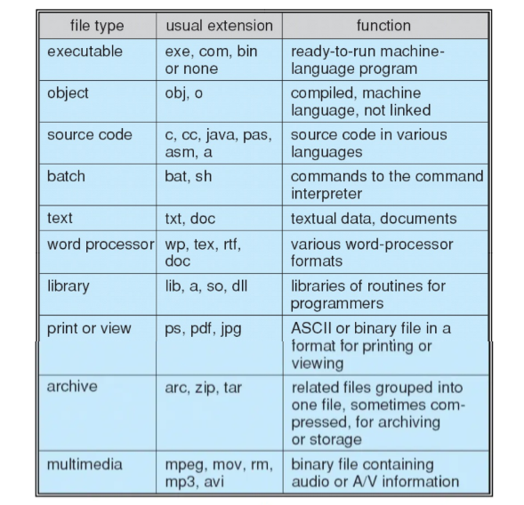

### 文件结构
文件可以有不同的结构，由操作系统或程序决定。

- 无结构：字节流或字流，例如 Linux 转储文件。
- 简单记录结构：记录行，固定长度或可变长度，例如数据库。
- 复杂结构，例如Word 文档、可重定位程序文件。

通常由用户程序负责识别文件结构。

### 文件访问

文件访问有不同的方式，最常见的两种是顺序访问和直接访问。

顺序访问即一组元素按照预定顺序进行访问，对于某些介质类型（如磁带），这是唯一的访问模式。

直接访问是以（大致）相等的时间访问序列中任意位置上的元素，且该时间与序列大小无关。有时也称为随机访问。

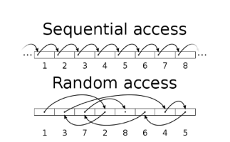

文件访问还有许多其他方法，如文件的索引指向数据块，要查找文件中的某条记录，先搜索索引，然后使用指针访问数据块。可以使用多层索引。

## 目录结构

磁盘可以细分为分区，不同的分区可以有不同的文件系统，包含文件系统的分区称为卷（Volume），每个卷在卷的目录表中跟踪文件系统信息。

当然磁盘或分区可以裸使用（不带文件系统），如数据库等应用程序更倾向于使用裸磁盘。

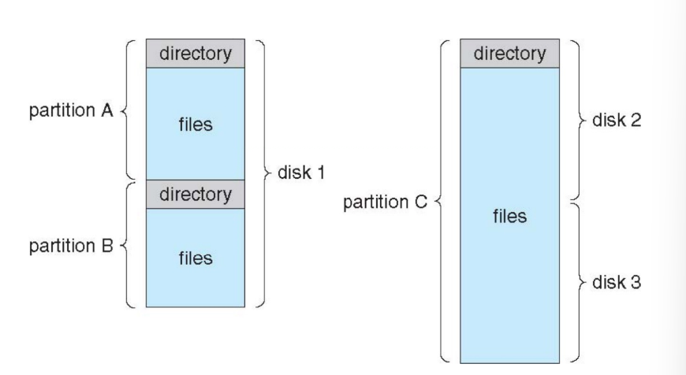

目录是包含所有文件信息的节点的集合。

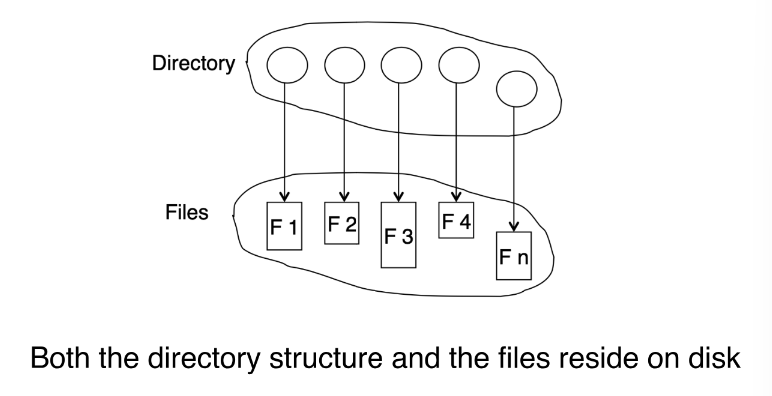

以下是一些常见的对目录执行的操作：

- 创建文件：需要创建新文件并将其添加到目录中
- 删除文件：从目录中移除文件
- 列出目录：列出目录中的所有文件
- 搜索文件：模式匹配
- 遍历文件系统：访问目录内的每个目录和文件

在实现目录时，我们需要考虑查找的效率，以快速定位文件；我们还需要考虑命名问题，来更好的组织目录结构。

以下是一些常见的目录实现：

1.单级目录：所有用户共享一个目录。存在命名问题和分组问题（如两个用户可能想对不同的文件使用相同的文件名）。

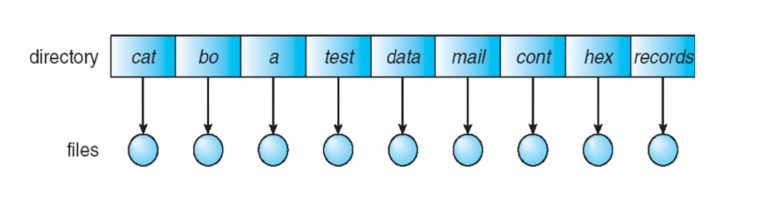

2.二级目录：每个用户有自己的用户文件目录（UFD），这些 UFD 位于主文件目录（MFD）中。这样可以提高搜索效率，也可以解决命名问题。

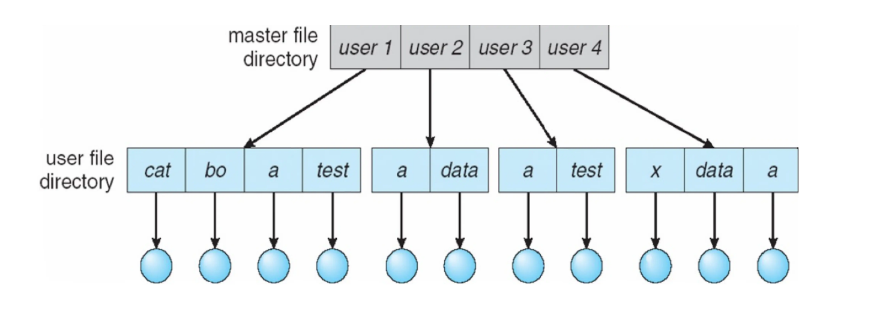

3.树型目录：每个用户有自己的用户文件目录，这些目录组织成树状结构。这种结构的搜索效率高，可以对文件进行分组，命名也方便。  

在树形目录中，文件可以使用绝对路径或相对路径来访问。

- 绝对路径：`/home/user/file`
- 相对路径：相对于当前目录（pwd）的路径。

树形目录中：

- 创建新文件：`touch <filename>`
- 删除文件：`rm <filename>`
- 创建新子目录:`mkdir <dirname>`

在删除目录时，如果目录为空，则容易处理；如果目录不为空，则要么不允许删除，要么删除相关的所有文件和子目录。

树型结构中不允许共享文件/目录。

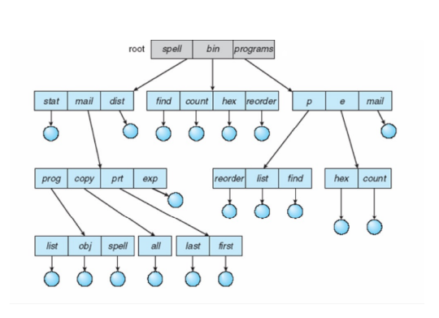

4.无环图目录：将目录组织成无环图结构，它允许多个目录指向同一个文件。这种结构可以实现别名。

但无环图目录会引入悬空指针问题（如下图如果删除文件 /dict/all，那么 /dict/w/list 和 /spell/words/list 就会变成悬空指针）

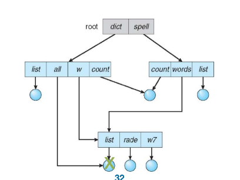

可以通过反向指针的方式解决悬空指针问题，反向指针记录指向该实体的所有指针，或者或者记录指向它的链接数，仅当计数器为零时才（物理）删除它。

无环图目录支持共享文件。这涉及到文件系统中用于创建文件别名或引用的两种机制：硬链接（Hard Link）和软链接（Soft Link）（见后文）。

5.一般图目录：允许任意链接。

一般图目录的问题是可能会在目录结构中产生循环。解决方案有两种：一是允许循环，但使用垃圾回收来回收磁盘空间；二是每次添加新链接时，使用循环检测算法来确保不会形成循环。

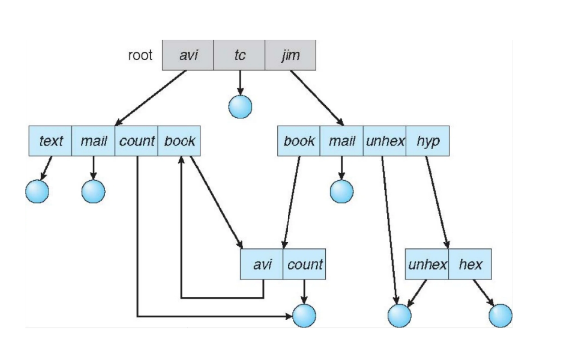

## 文件系统挂载

文件系统必须先挂载才能被访问。

- 文件系统必须先挂载才能被访问
- 被挂载的文件系统所在的位置称为挂载点
- 已挂载的文件系统会使挂载点处的原目录不可见

>在操作系统（如 Linux、Unix）中，挂载点原本是一个普通目录，这个目录里可能已经有一些文件或子目录。当你把另一个文件系统挂载到这个目录上时，原先目录里的内容就会被“遮住”——暂时看不见、也无法直接访问。你通过这个挂载点路径看到和访问的，会变成新挂载的文件系统的根目录内容。只有卸载（umount）这个文件系统后，原来的目录内容才会重新显现出来。

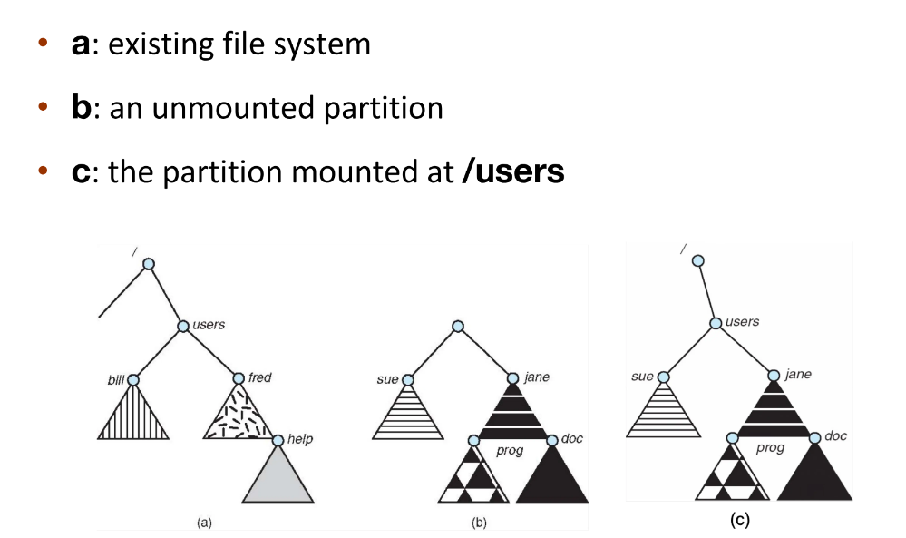

## 文件共享

在多用户系统中，文件共享是很有必要的。

共享必须通过保护机制来实现：

- 用户 ID 用于标识用户，允许按用户进行保护。
- 组 ID 允许用户属于某个组，从而赋予组访问权限。

在分布式系统中，文件可以通过网络进行共享，如网络文件系统（NFS）是一种常见的分布式文件共享方法。

## 文件保护

文件所有者/创建者应能够控制：

- 可以对文件进行哪些操作（读、写、执行、删除、列出）
- 可以由谁来进行这些操作

为了实现上述功能，我们可以为每个文件和目录分配一个访问控制列表（ACL），记录哪些用户或组对某个文件或目录拥有哪些类型的访问权限。

以下是windows的文件访问控制：

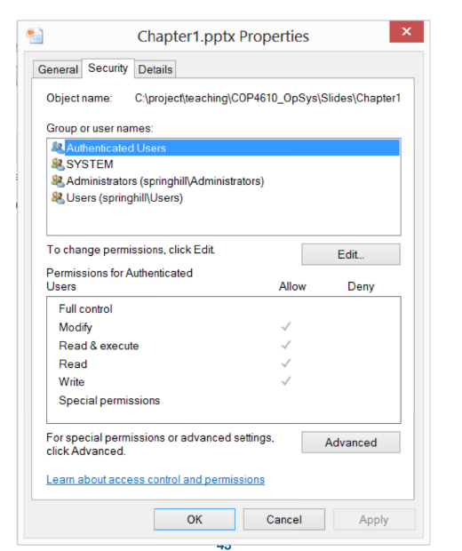

在Unix的文件访问控制中，分为三种访问模式：读、写、执行（编码为三个比特位）；分为三类用户：所有者、组、其他用户。

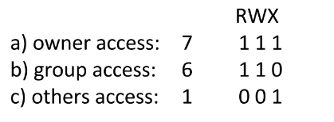

若要向用户授予访问权限，可创建一个组并更改其访问模式。

以下是Unix文件目录列表示例：

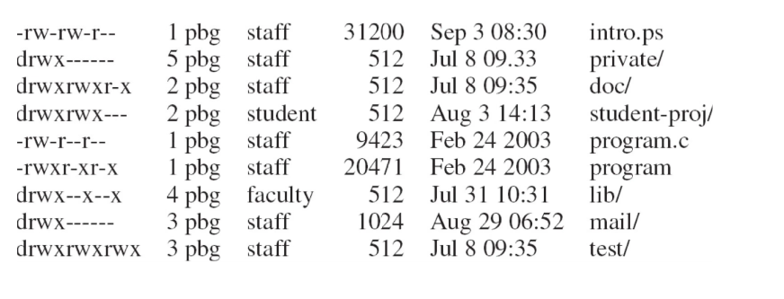

## 文件系统结构

文件系统位于辅助存储设备（磁盘）上，通常按层次实现和组织。

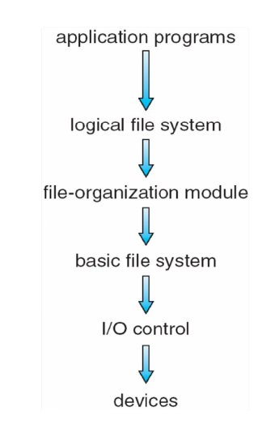

逻辑文件系统（logic file system）：维护文件系统所需的所有元数据（即，除文件内容之外的所有信息）；存储目录结构；存储一种数据结构，用于记录文件描述信息（文件控制块 - FCB）。

文件组织模块（file-organization module）：了解逻辑文件块（从 0 到 N）以及对应的物理文件块：负责执行转换；同时管理空闲空间。

基本文件系统（basic file system）：分配/维护包含文件系统、目录和数据块的各种缓冲区（缓存），用于提高性能。

I/O 控制（I/O control）：设备驱动程序和中断处理程序。

这种分层文件系统有助于降低复杂性和冗余，但会增加开销并可能降低性能。

常见的文件系统包括Windows的FAT、FAT32 和 NTFS，UNIX的UFS等等，大多数操作系统支持多种文件系统。

## 文件系统数据结构

文件系统包含多种数据结构，按存储位置分为磁盘上的结构和内存中的结构。

磁盘上的结构有：

- 可选引导控制块：存储操作系统的卷的第一个块
- 卷控制块：包含卷中的块数、块大小、空闲块计数、空闲块指针、空闲 FCB 计数、FCB 指针。
- 目录：与 ID 关联的文件名、FCB 指针。
- 每个文件的文件控制块（file control block,FCB）

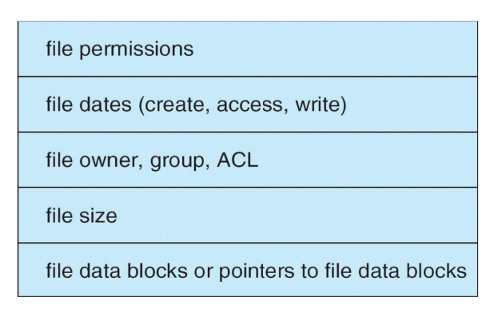

以下是在UNIX系统中FCB（inode）的布局：

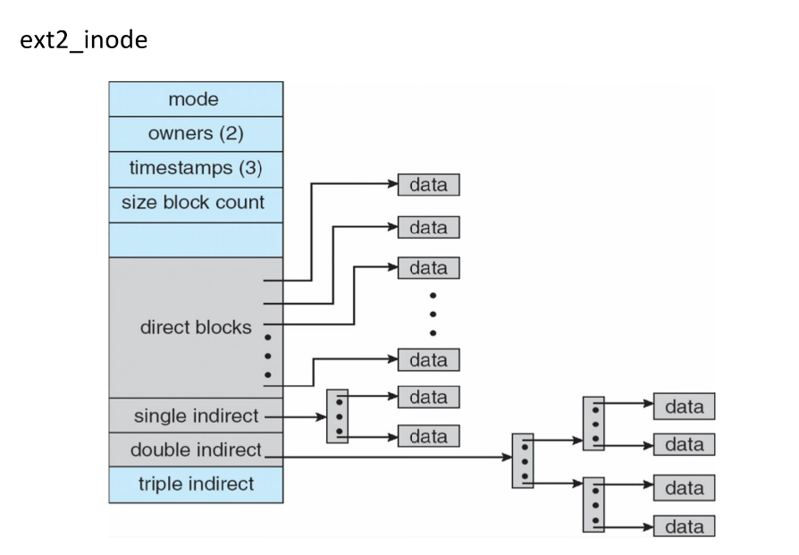

内存中的结构有：

- 挂载表，每个已挂载卷对应一个条目
- 目录缓存，用于快速路径转换（性能优化）
- 全局打开文件表
- 每个进程的打开文件表
- 用于“传输中”磁盘块的各种缓冲区（性能优化）77

## 文件系统的操作

### 创建文件

创建文件的过程一般为：

- 应用程序进程请求创建一个新文件
- 逻辑文件系统分配一个新的 FCB（即 inode 结构）
- 相应的目录用新文件名和 FCB 进行更新

### 打开文件

在打开文件时，我们首先搜索系统范围的打开文件表，查看该文件当前是否正在使用。

如果正在使用，则创建一个每进程打开文件表条目，指向已有的系统范围打开文件表。

如果未使用，则在目录中搜索该文件名；找到后，将 FCB 从磁盘加载到内存，并放入系统范围的打开文件表中。

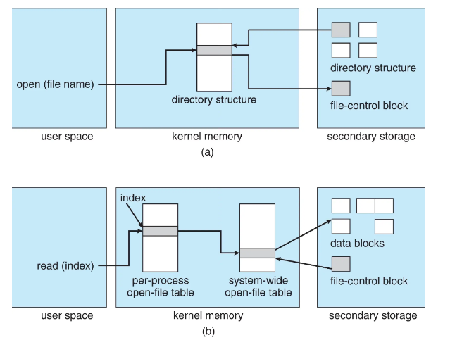

open()的具体操作如下：

- 在进程级打开文件表中创建一个条目，包含指向系统级打开文件表中条目的指针，以及其他字段，如指向文件当前位置的指针和文件打开时的访问模式。
- 增加系统级打开文件表中的打开计数。
- 返回指向进程级打开文件表中条目的指针。
- 后续所有操作都通过该指针执行。
- 进程关闭文件 → 进程级打开文件表中的条目被移除；打开计数递减。
- 所有进程都关闭文件 → 将内存中的目录信息写回磁盘，并从内存中移除系统级打开文件表。

在Unix系统中，系统级打开文件表中包含文件、目录、设备和网络连接的 inode（索引节点）。

## 挂载文件系统

- 启动块：一系列连续的块，其中包含引导加载程序的内存映像，用于定位并挂载根分区；该分区包含内核；引导加载程序定位、加载并启动内核执行。

- 内存中的挂载表：外部文件系统必须挂载到设备上，挂载表记录了挂载点、已挂载文件系统的类型，以及通往目标文件系统的访问路径。在Unix中，内存中的挂载表包含一个指向该设备上文件系统**超级块**的指针。

## 虚拟文件系统

虚拟文件系统（VFS）是一种抽象层，它为各种文件系统提供统一的接口，让操作系统可以处理不同的文件系统。

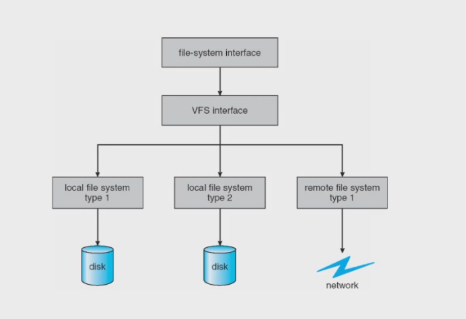

VFS 提供了一种面向对象的方式来实现文件系统，操作系统为文件系统定义了一个通用接口，所有文件系统都实现该接口。系统调用基于这个通用接口实现。这使得同一个系统调用 API 可以用于不同类型的文件系统。

VFS 将文件系统的通用操作与实现细节分离，具体实现可以是多种文件系统类型之一，也可以是网络文件系统。

Linux 定义了四种VFS 对象类型：

- **超级块（superblock）**：定义文件系统的类型、大小、状态及其他元数据
- **索引节点（inode）**：包含关于**文件**的元数据（位置、访问模式、所有者等）
- **目录项（dentry）**：将名称与索引节点关联，并描述目录结构
- **文件（file）**：文件的实际数据

## 目录实现

目录是一种特殊的文件，它存储从文件名到 inode 的映射。

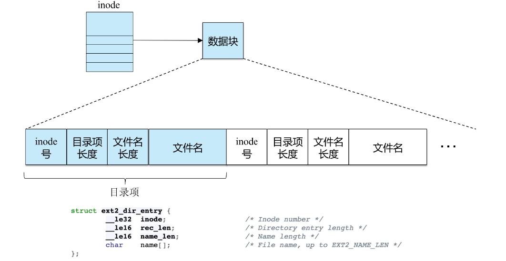

以下是目录项的一个实现：

- inode 编号，名称；
- rec_len：目录项的长度，为4的倍数（目的是为了能够重用该条目）
- name_len：名称的长度

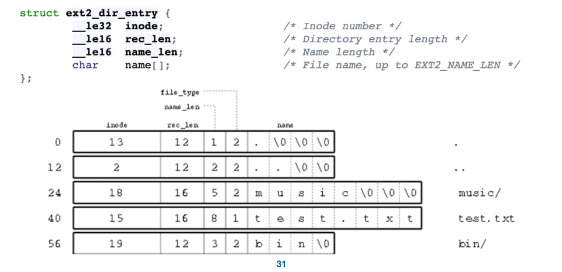

我们通过目录搜索有两种方式：

- 文件名的线性列表，附带指向文件元数据的指针
    - 编程简单，但搜索耗时（例如线性搜索）
    - 可以通过链表按字母顺序维护文件，或使用 B+ 树

- 哈希表：线性列表配合哈希数据结构以减少搜索时间
    - 可能发生冲突：两个或多个文件名哈希到同一个位置

在Unix中目录被视为包含特殊数据的文件；在Windows中目录与文件不同，它们需要一套单独的系统调用来创建、操作等。

## 磁盘块分配

文件需要分配磁盘块来存储数据，不同的分配策略具有不同的复杂度和性能。有多种分配策略，如连续分配、链式分配、索引分配等等。

### 连续分配
每个文件占用一组连续的磁盘块。目录中记录每个文件的起始块地址和所占块数。

优点：顺序访问时磁盘头移动少，从而缩短寻道时间。

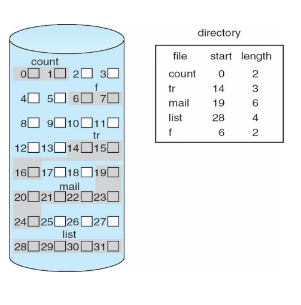

连续分配有很多缺点：

- 可能难以找到空闲空间
- 造成外部碎片
- 文件增长困难

### 链接分配

每个块包含指向下一个块的指针，文件结束处为空指针，块可以分散在磁盘的任何位置（无外部碎片，无需压缩）。

缺点是定位一个文件块可能需要多次 I/O 和磁盘寻道；在512 字节中有 4 字节用于指针，会浪费部分空间。

改进方法是将块聚类，例如 4 个块为一组。但这样会产生内部碎片。

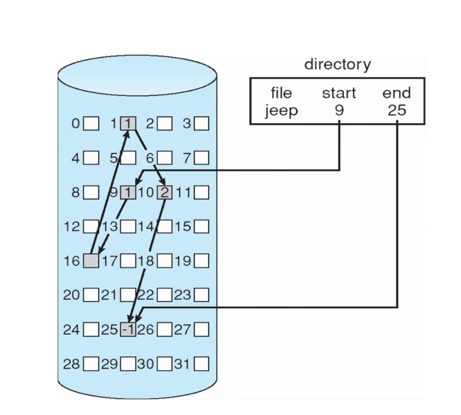

FAT（文件分配表）就采用链接分配方式。

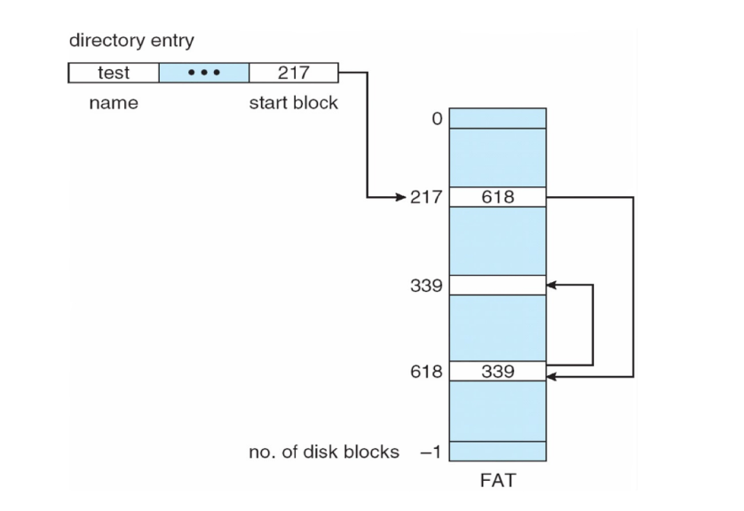

### 索引分配

每个文件拥有自己的索引块，其中包含指向其数据块的指针。索引表提供对文件数据块的随机/直接访问。

索引分配不会产生外部碎片，但有索引块的开销。它允许文件中有空洞。

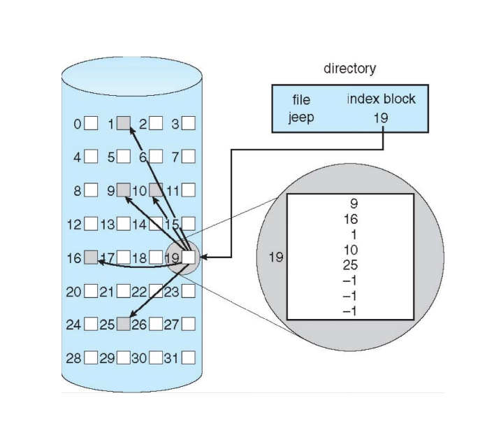

索引分配支持链接索引块（将索引块链接起来以支持超大文件），多级索引块（例如二级索引）。

在UNIX的FCB中的inode（索引节点）中，前12个指针直接指向数据块，后面的3个指针间接指向数据块。

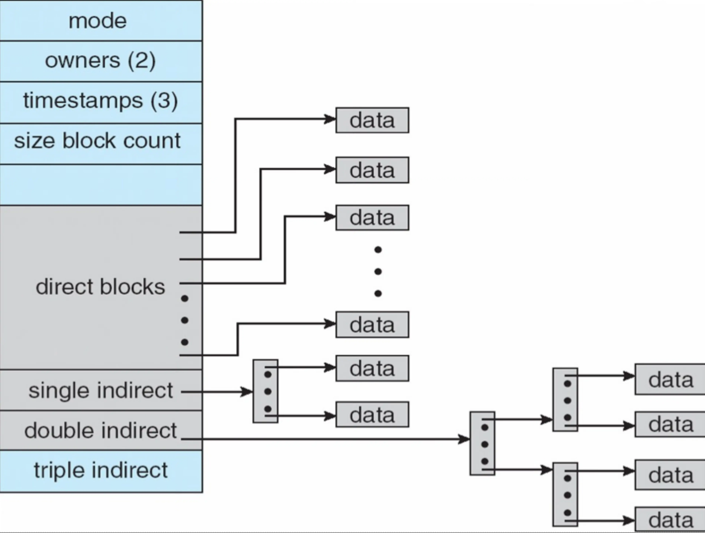

以下是一个inode能指向的数据的最大大小：

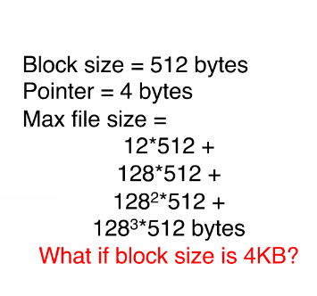

### 分配的选择

最佳分配方法取决于文件访问类型：

- 连续分配非常适合顺序访问和随机访问
- 链接分配适合顺序访问，但不适合随机访问
- 索引分配（组合方案）更复杂
    - 访问单个块可能需要先读取 2 个索引块，再读取数据块
    - 聚类（clustering）有助于提高吞吐量、减少 CPU 开销

## 空闲空间管理

文件系统需要维护空闲空间列表，用于跟踪可用的块/簇，并及时回收已删除文件的空间。

### 位图空闲空间管理

为每个块使用一个比特位，跟踪其分配状态。

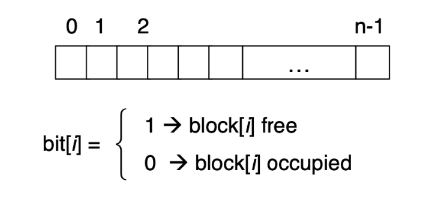

位图空闲空间管理相对容易找到连续的空闲块。

但位图需要额外的存储空间。

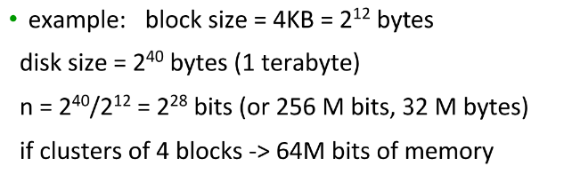

### 链表空闲空间管理

将空闲块保存在链表中。

这种方法不浪费空间，直接使用空闲块中的内存来存放指针，且通常无需遍历整个链表，直接返回第一个块即可。

但链表空闲空间管理不容易获得连续的空闲空间。

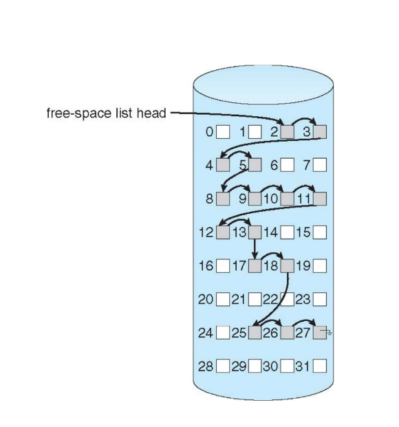

简单的空闲块链表效率较低，分配一个空闲块需要额外的一次磁盘 I/O（磁盘 I/O 极其缓慢），分配多个空闲块需要遍历链表。

我们可以用分组和计数的方法对链表进行优化。

分组：使用索引对空闲块进行分组。在第一个空闲块中存储 n-1 个空闲块的地址，再加上一个指向下一个索引块的指针，这使得在分配多个空闲块时无需遍历链表。

计数：使用簇的链表（起始块 + 连续块数量），这使得空间通常以连续方式被分配和释放。在链表节点中，保存第一个空闲块的地址及其后面连续空闲块的数量。

## 文件系统性能

文件系统的效率和性能取决于：

- 磁盘分配与目录算法
- 文件目录条目中所保存数据的类型
- 元数据结构的预分配或按需分配
- 数据结构的大小是固定还是可变

为了提高文件系统性能：

- 让数据和元数据彼此靠近
- 使用缓存：在主存中划出专门区域存放常用块
- 使用异步写入，可以被缓冲/缓存，因此更快（同步写入无法缓存，必须在返回前将数据写入磁盘）
- 自由滞后与预读：用于优化顺序访问的技术——从缓冲区中移除前一个页面，提前读取多个页面
- 读取通常比写入慢（写入可以先写到缓存中）

## 页面缓存

操作系统具有不同层次的缓存：

- 页面缓存用于缓存内存映射 I/O（MMIO）的页面，例如内存映射文件
- 文件系统使用缓冲区（磁盘）缓存来处理磁盘 I/O（内存映射 I/O 可能会在系统中被缓存两次）
- 统一缓冲区缓存使用同一个页面缓存来同时缓存内存映射页面和磁盘 I/O，以避免双重缓存。

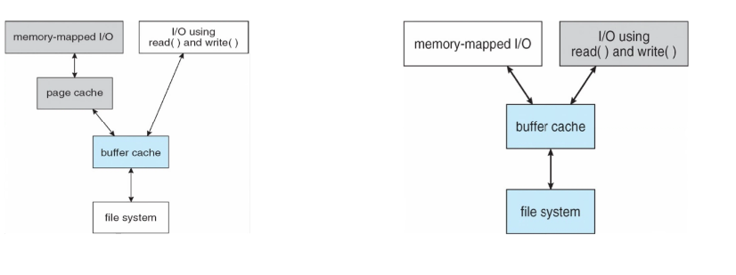

## 日志结构文件系统

文件系统需要一致性检查以确保一致性，即将目录中的数据与磁盘上的某些元数据进行比较以检查一致性。

日志结构文件系（LSFS）通常用于数据的一致性检查和恢复。

在 LSFS 中，更新的元数据按顺序写入一个循环日志。一旦更改写入日志，即视为已提交，系统调用即可返回。

与此同时，日志条目会在文件系统上回放以实际执行更新，日志是循环的，但尚未回放的条目不会被覆盖，当一个事务回放完成后，会从日志中移除。

系统崩溃后，只需回放日志中现存的事务即可。

## 补充

### 文件描述符

文件描述符（File Descriptor，简称 fd） 是 Unix/Linux 系统中内核用于访问文件或 I/O 资源的一个非负整数。它是对打开的文件、管道、套接字、设备等的抽象引用。

每个进程在启动时都会有一个文件描述符表，由内核维护。当进程打开一个文件（或创建管道、socket 等），内核会在该表中分配一个空闲的整数，并返回给进程。进程后续对该文件的所有操作（读、写、关闭等）都通过这个整数进行。

每个 Unix 进程默认有三个标准描述符：

它们通常在进程启动时由 shell 打开，默认指向终端。可以通过重定向修改。

文件描述符是进程私有的。两个进程即使有相同的数值（如 3），也指向各自不同的打开文件。

### 硬链接和软链接

一个文件在一个或多个目录中可能有多个名称。这种多个名称称为链接。

硬链接是一个与文件关联的目录项。每个硬链接都直接指向底层的 inode（索引节点），该 inode 存储了文件的实际元数据（权限、大小、数据块位置等）和引用计数。

如目录中的文件名“.” 是指向该目录自身的硬链接， 文件名“..” 是指向父目录的硬链接。

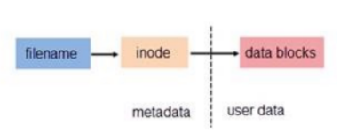

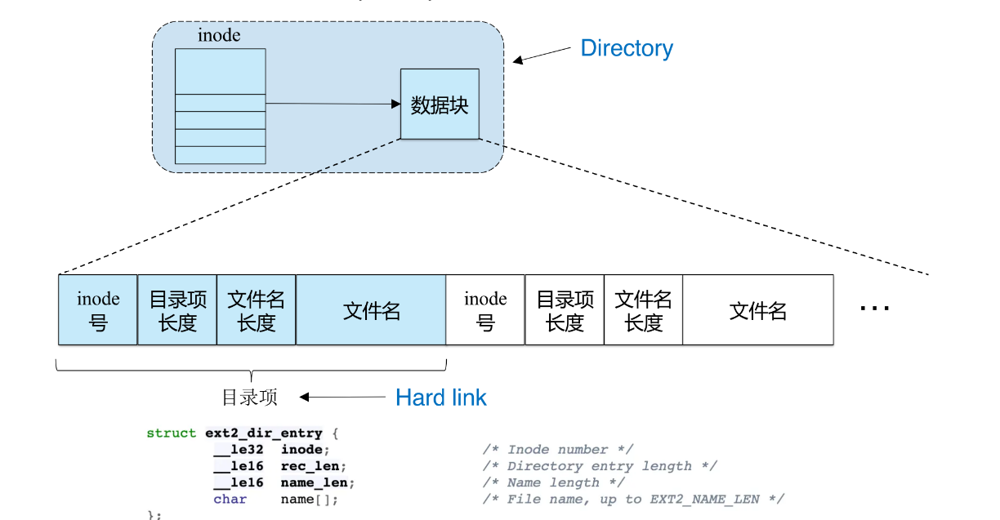

软链接是一个特殊的文件，有自己的 inode 和文件数据（存储路径字符串）,其内容存储的是另一个文件的路径名（可以是相对路径或绝对路径）。它类似于 Windows 的快捷方式。

与硬链接不同，软链接可以指向目录，并且可以跨越文件系统边界。

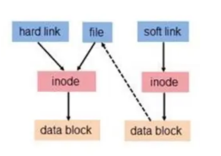

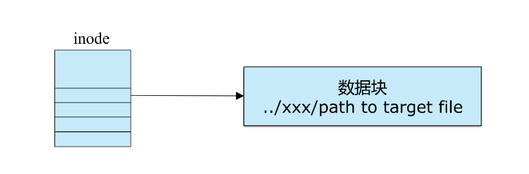

link() 系统调用：该系统调用接受两个参数，一个旧路径名和一个新路径名。如果旧路径名指向一个文件，系统会创建一个硬链接指向该文件，并将新路径名指向该硬链接。

在创建文件时，系统会自动创建一个硬链接指向该文件，并将该链接放入目录中。

删除文件实际上就是删除该文件的硬链接，即执行 unlink() 操作，unlink() 会从文件系统中删除一个名称。如果该名称是文件的最后一个链接，并且没有进程打开该文件，则文件会被删除，其占用的空间将被释放以供重用。

inode中会存放该文件的引用计数，它表示有多少个硬链接指向该文件。当引用计数为 0 时，文件将被删除。

软连接不会影响文件的引用计数，删除目标文件时，软链接仍然存在，但链接失效。

### 文件系统组织

以下是一个文件系统组织的例子：

假设我们有64个块，每个块大小为4KB，总大小为256KB。

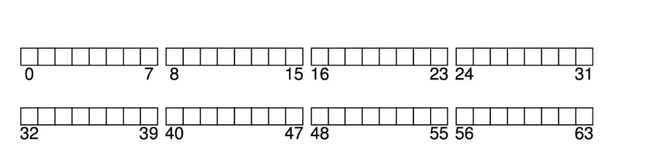

我们首先保留一些块存储文件的data。例如用56个块。

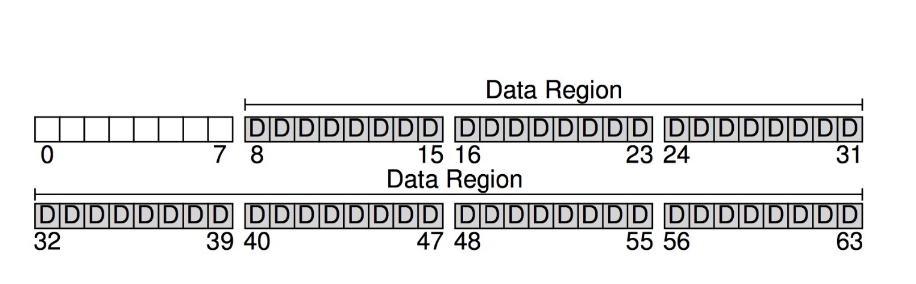

我们再用5个块存储文件的inodes。假设inode的大小为256bytes，那么5个块可以存储80个inode，则整个文件系统最多存储80个文件。

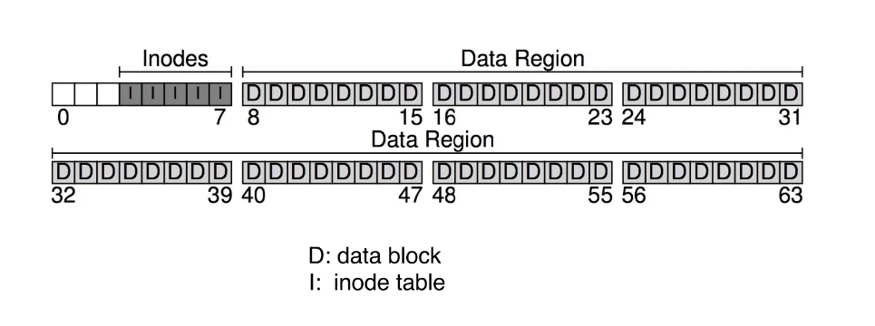

假设我们用bitmap来管理空闲块。那么我们只需要保留2个块来存储inode的bitmap和data region的bitmap。

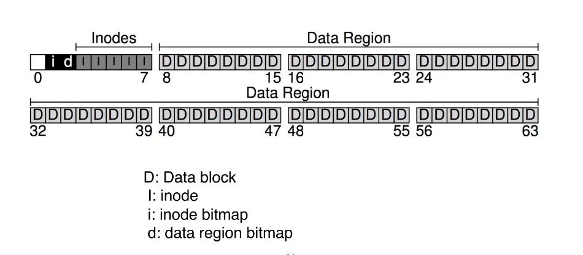

剩余一个超级块，包含该文件系统的信息：inode/数据块的数量、inode 表的起始位置、数据区域的起始位置，以及一个魔数。

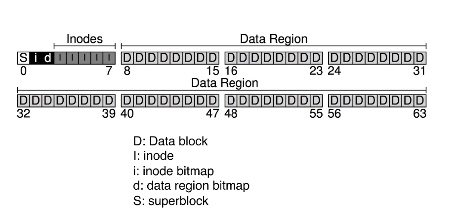

如上，我们就可以进行一些计算，如计算inode的地址。每个 inode 通过一个编号（inumber）来标识。

则要读取第 32 号 inode，对应地址为：
4K（超级块）+ 8K（bitmap）+ 32 * sizeof(inode) = 4K+8K+8K = 20K

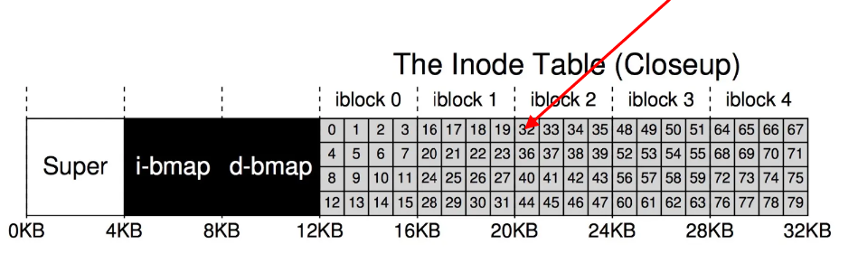    

### 读写文件的流程

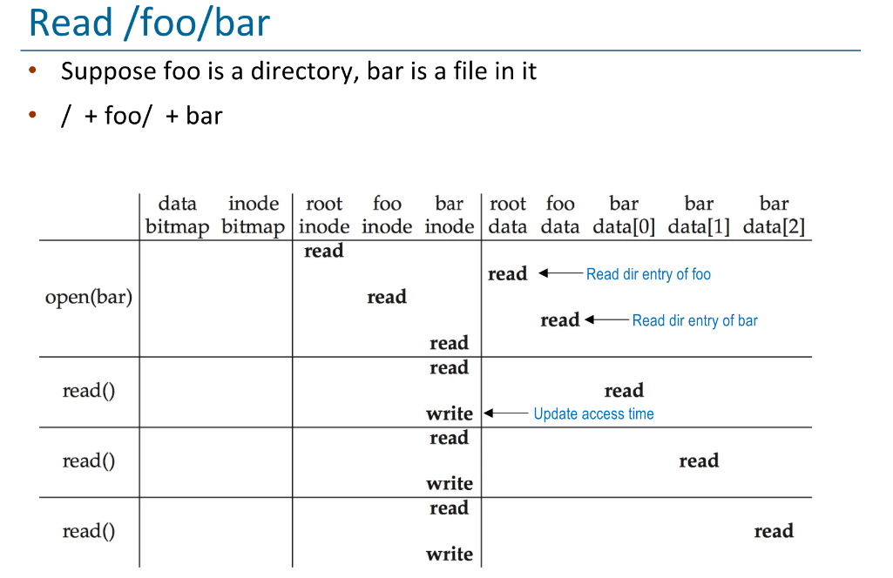

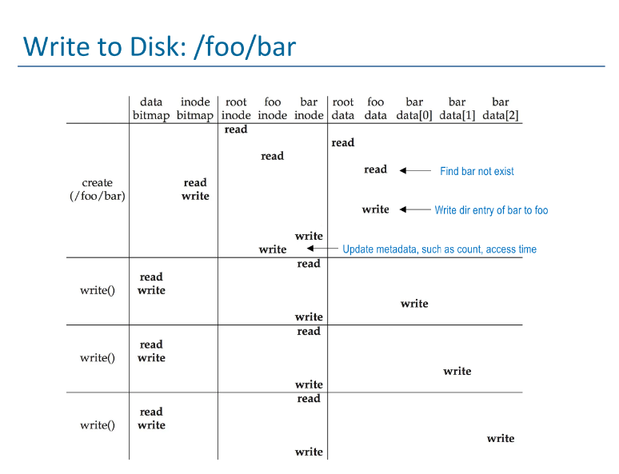