# 系统安全

## 计算机安全概述

计算机安全是指为保护信息和财产免遭盗窃、损坏或自然灾害而采用的规定和策略。同时允许信息和财产对其预期用户保持可访问且高效可用。保护计算机免受入侵者（例如黑客）和恶意软件（例如病毒）的侵害。

网络安全则是指为防止和监控对计算机网络及网络可访问资源的未授权访问、滥用、篡改或拒绝服务而采用的规定和策略。

系统安全指的是为计算机系统资源提供保护系统，这些资源包括：CPU、内存、磁盘、软件程序，以及存储在计算机系统中的数据/信息（这一点最为重要）。

因此，计算机系统必须防止用户的未授权访问，以及对系统的恶意访问，包括病毒、蠕虫等……

## 系统安全评估标准

### 可信计算机系统评估标准（TCSEC）

TCSEC由美国国防部于1983年发布，制定了系统安全评估标准。它将系统安全分为四个等级：A、B、C、D。

- A级：验证保护
- B级：强制保护
- C级：自主保护
- D级：最小保护

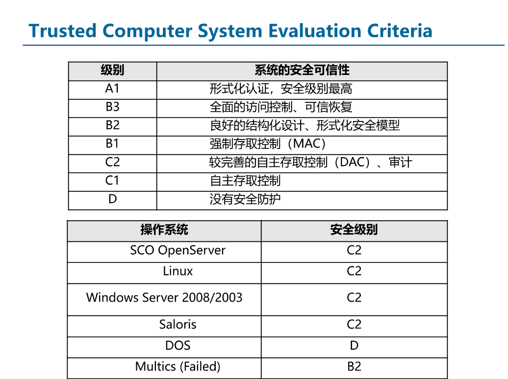

### 信息技术安全评估标准（ITSEC）

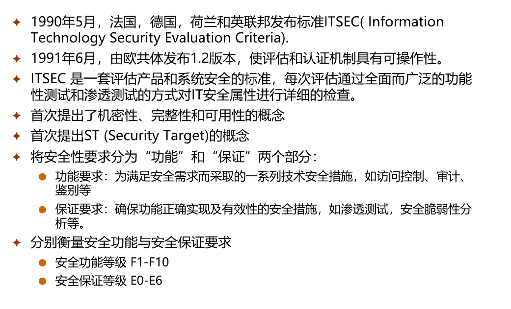

### 通用准则（CC）

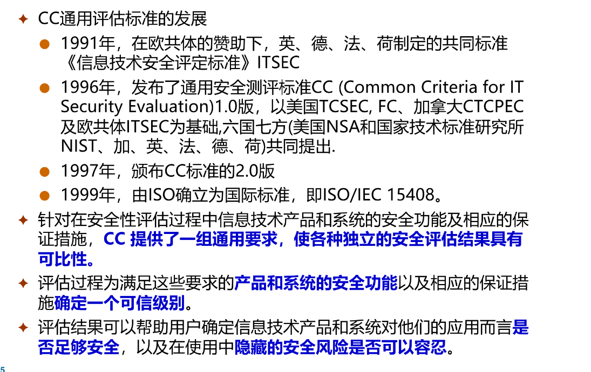

### GB17859

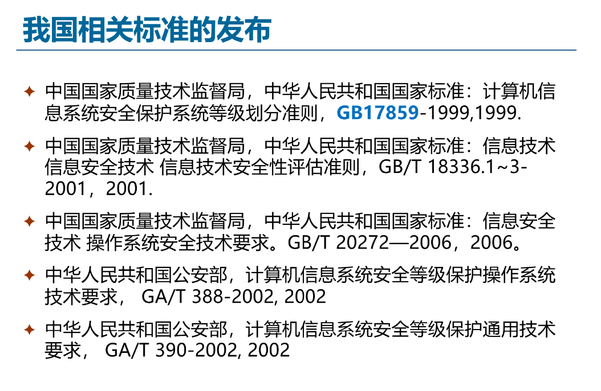

## 系统安全概念

### 可信基（Trusted Computing Base）

可信基是为实现计算机系统安全保护的所有安全保护机制的集合，包括软件、硬件和固件（硬件上的软件）。

通俗来讲，可信计算基（TCB）是计算机系统中你所信任的那一部分（如果它失效，可能会影响安全性）。

TCB 应尽可能简单，TCB 越大，就越难保证其安全性。

系统采用分层构建，高层依赖于低层，但低层不依赖于高层。由于一个组件在安全性上几乎总是依赖于其更低层次，因此 TCB 通常包含所有更低层次。保护措施添加的层次越低，TCB 就越小。TCB 越小，就越容易验证。

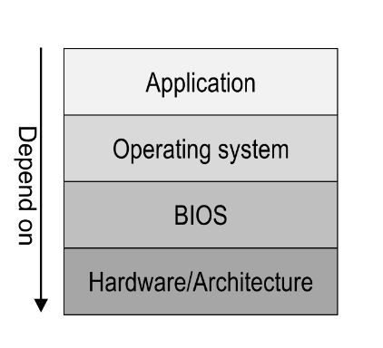

### 攻击面（Attacking Surface）

攻击面是一个组件被其他组件攻击的所有方法的集合，可能来自上层、同层和底层。

攻击面越小，就越容易保护。

### 纵深防御（Defense in-depth）

纵深防御是一个用于信息安全的概念，指在信息技术（IT）系统中部署多层安全控制（防御）措施。其目的是在安全控制失效或漏洞被利用时提供冗余保障。

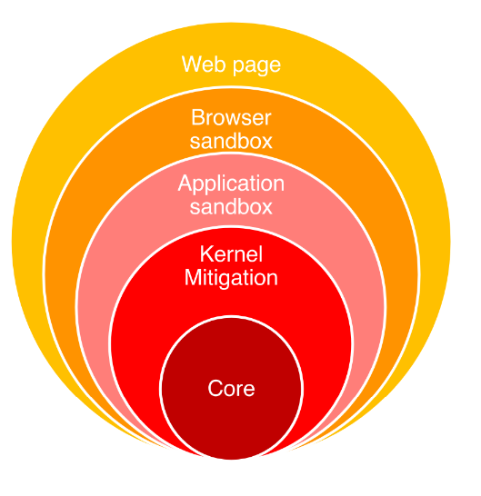

## 访问控制

访问控制（Access control）是安全的关键要素，用于决定谁在何种情况下被允许访问特定的数据、应用和资源。它是按照访问实体的身份来限制其访问对象的一种机制，为了实现对不同应用访问不同数据的权限控制。

访问控制有三个核心手段：身份验证（Authentication）、授权（Authorization）和审计（Audit）。

### 认证（Authentication）

验证某个发起访问请求的主体的身份。

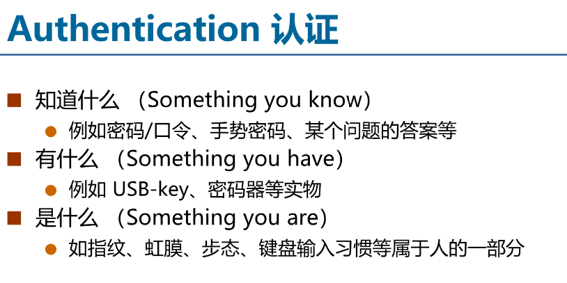

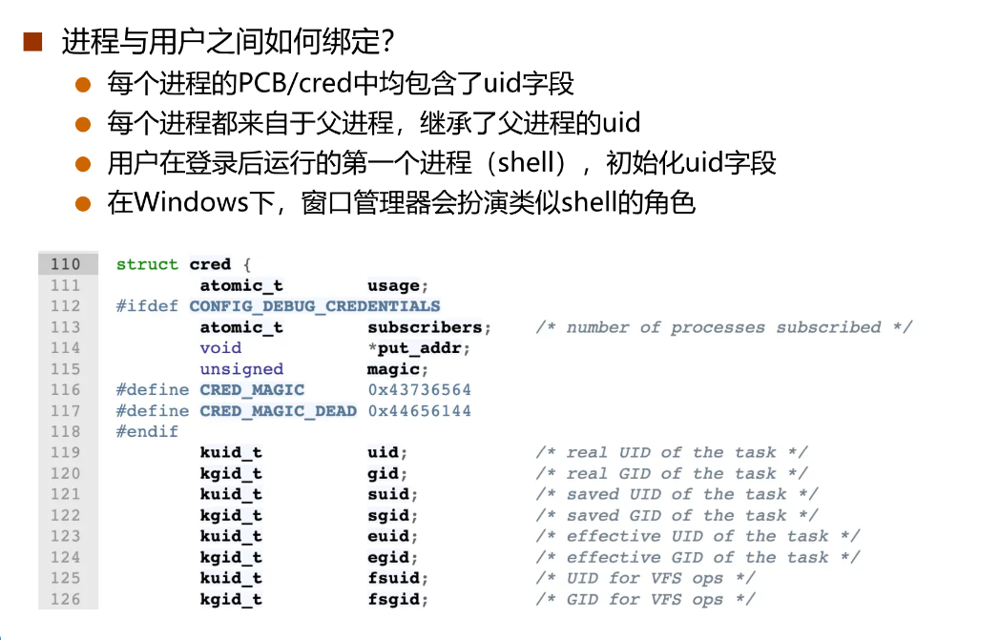

### 授权（Authorization）

授予某个身份一定的权限以访问特定的对象。

我们可以用访问控制列表（ACL）来实现授权。

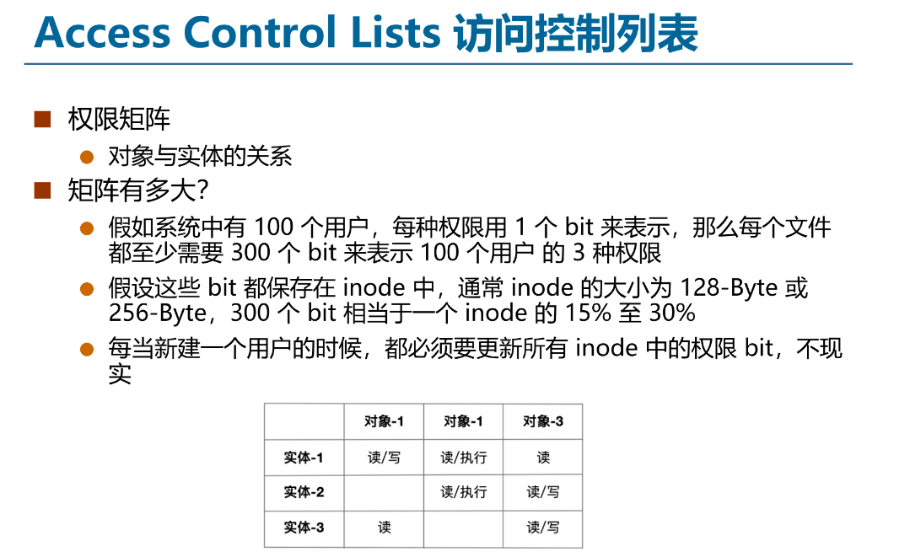

为了简化权限矩阵，我们可以使用角色（Role）来实现授权，即基于角色的访问控制（RBAC）。

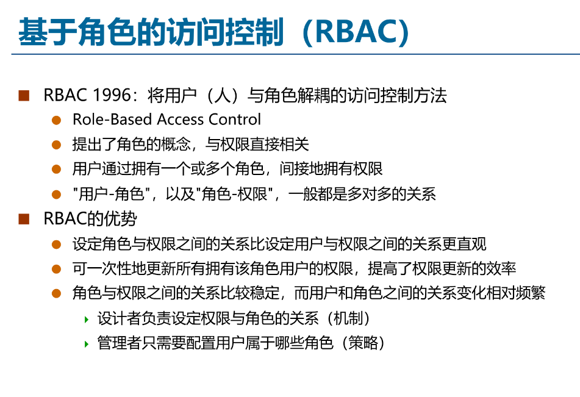

在Linux系统中，使用POSIX的文件权限来实现授权机制。

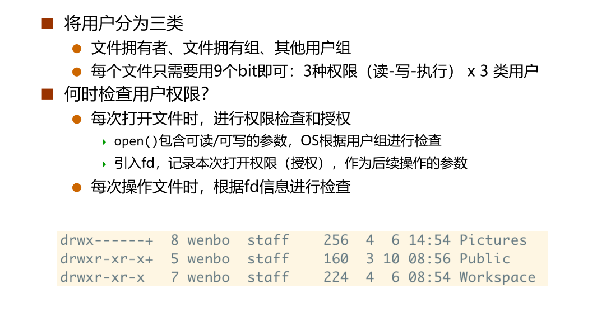

在用户修改密码时，Linux使用了setuid机制来实现。

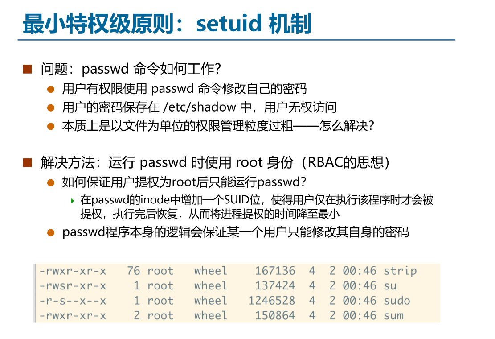

但setuid机制存在安全问题。

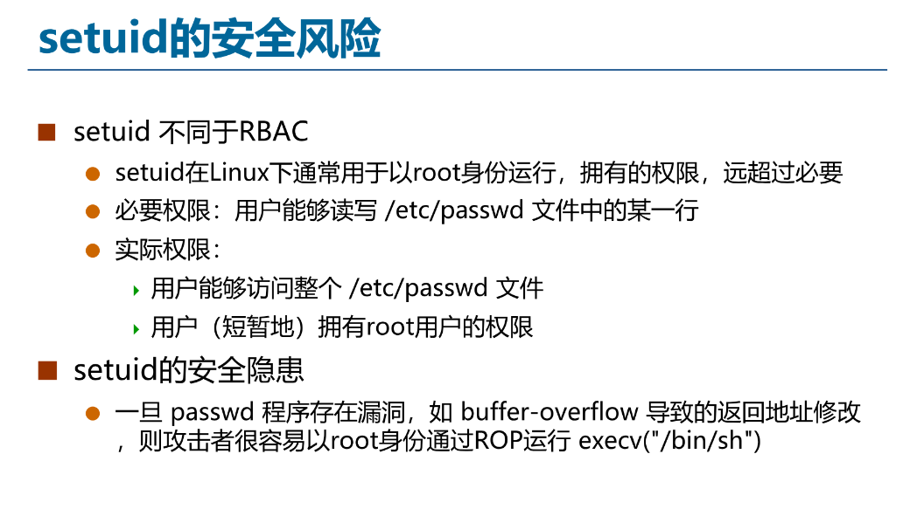

为了解决setuid问题，Linux引入了capability机制。它提供了更细粒度的权限控制。

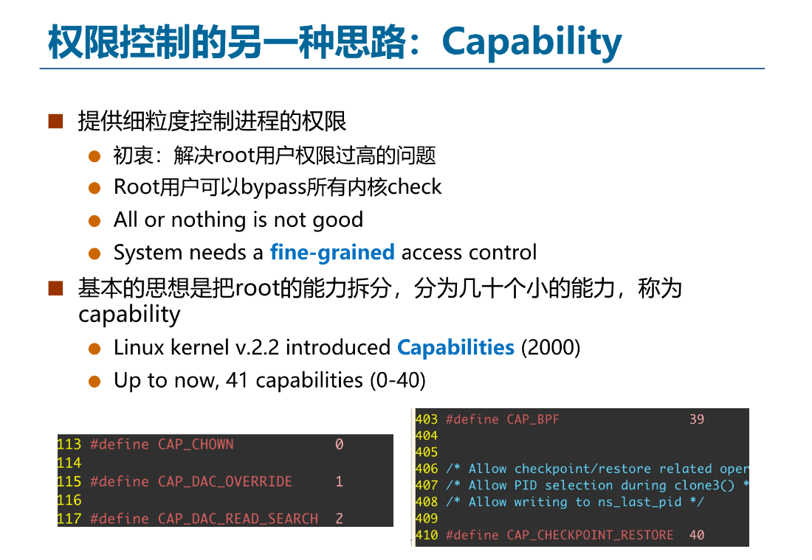

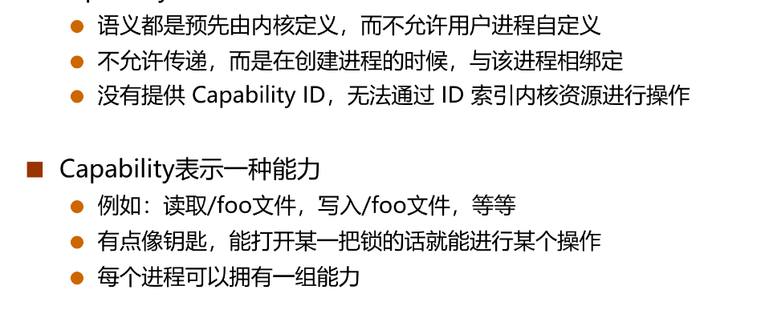

Linux的capability实现如下：

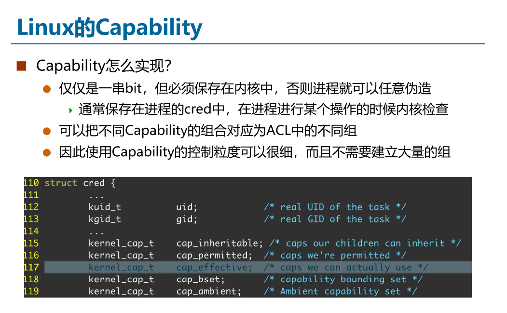

文件描述符 fd 可以看做是一类 Capability。fd 是一个指向保存在内核中数据结构的"指针"，拥有 fd 就拥有了访问对应文件的权限。一个文件可以对应不同 fd，相应的权限可以不同。  
fd 也可以在不同进程之间传递：父进程可以传递给子进程，非父子进程之间可以通过 sendmsg 传递 fd。

Linux的capability在实现过程中出现了很大的问题。理想状态是Linux分出的41个capabilities均分root能力。但实际实现中，它的权限分配不均，且使用十分混乱。例如，CAP_SYS_ADMIN占据了1/3的 permission checks，导致它变成了一个超级权限（“the new root”）。  

以上两种机制各有优缺点：
- ACL（访问控制列表）：
    - 可容纳大量对象
    - 易于一次性授予多个对象的访问权限
    - 每次访问都需要执行开销较大的操作
- Capability：
    - 难以管理大量的能力
    - 能力必须来源于某处
    - 使用起来很快（仅需指针解引用）

大多数系统两者兼用：使用 ACL 打开对象（例如 fopen()），使用能力执行操作（例如 read()）。

### 审计（Audit）

审计是指记录用户和程序的操作，以便后续分析。

提供审计框架是获得 CC-CAPP/EAL（通用准则-受控访问保护轮廓/评估保证级）认证的一项重要要求。

Linux 审计框架提供了一个符合 CAPP（受控访问保护轮廓）标准的审计系统，能够可靠地收集系统上任何与安全相关（或非安全相关）的事件信息。、

### 引用监视器
引用监视器（Reference Monitor）是实现访问控制的一种方式，主体必须通过引用（reference）的方式间接访问对象，Reference monitor 位于主体和对象之间，对主体和对象之间的引用进行检查。

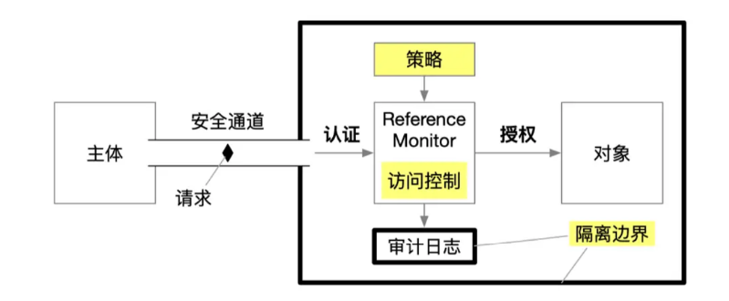

Reference Monitor 负责两件事：

- Authentication：确定发起请求实体的身份。
- Authorization：确定实体确实拥有访问资源的权限。

引用监视器机制必须保证其不可被绕过(Non-bypassable)。设计者必须充分考虑应用访问对象的所有可能路径，并保证所有路径都必须通过引用才能进行。

例如，应用必须通过文件描述符来访问文件，而无法直接访问磁盘上的数据或通过 inode 号来访问文件数据。文件系统此时就是引用监视器，文件描述符就是引用。

### DAC与MAC

#### 自主访问控制（DAC: Discretionary Access Control）

指一个对象的拥有者有权限决定该对象是否可以被其他人访问。

例如，文件系统就是一类典型的 DAC，因为文件的拥有者可以设置文件如何被其他用户访问。换句话说，DAC 允许一个普通用户配置其所拥有的对象的访问权限。

但是对部分场景（如军队）来说，DAC 过于灵活。

#### 强制访问控制（MAC: Mandatory Access Control）

由“系统”增加一些强制的、不可改变的规则。例如，在军队中，如果某个文件设置为机密，那么就算是指挥官也不能把这个文件给没有权限的人看——这个规则是由军法（系统）规定的。

MAC与DAC可以结合，此时MAC的优先级更高。

## 系统安全攻防

对系统的攻防分为三种：

- 代码注入攻击（Code Injection Attack）：攻击者将恶意代码注入目标程序（例如通过输入字段、SQL查询、脚本等），使程序执行非预期的命令。常见类型包括 SQL 注入、命令注入、脚本注入等。
- 代码重用攻击（Code Reuse Attack）：攻击者不注入新代码，而是利用程序内部已有的合法代码片段（如 libc 函数、 gadget 序列）拼接成恶意行为。典型代表包括返回导向编程（ROP）和跳转导向编程（JOP）。
- 非控制数据攻击（Non-Control Data Attack）：与传统控制流劫持不同，此类攻击不篡改程序的控制流（如返回地址、函数指针），而是修改程序中的关键数据（如配置标志、用户权限、文件名、决策变量等），从而在不改变执行路径的情况下造成危害。

一个例子如下：

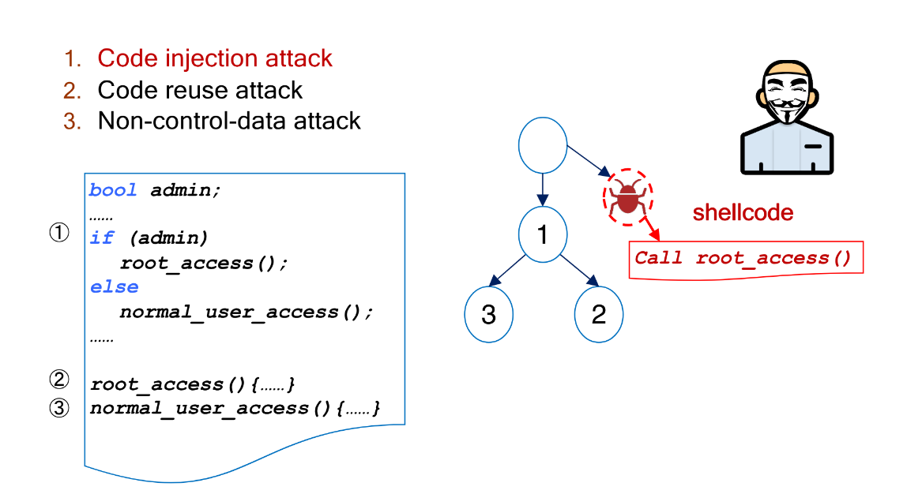

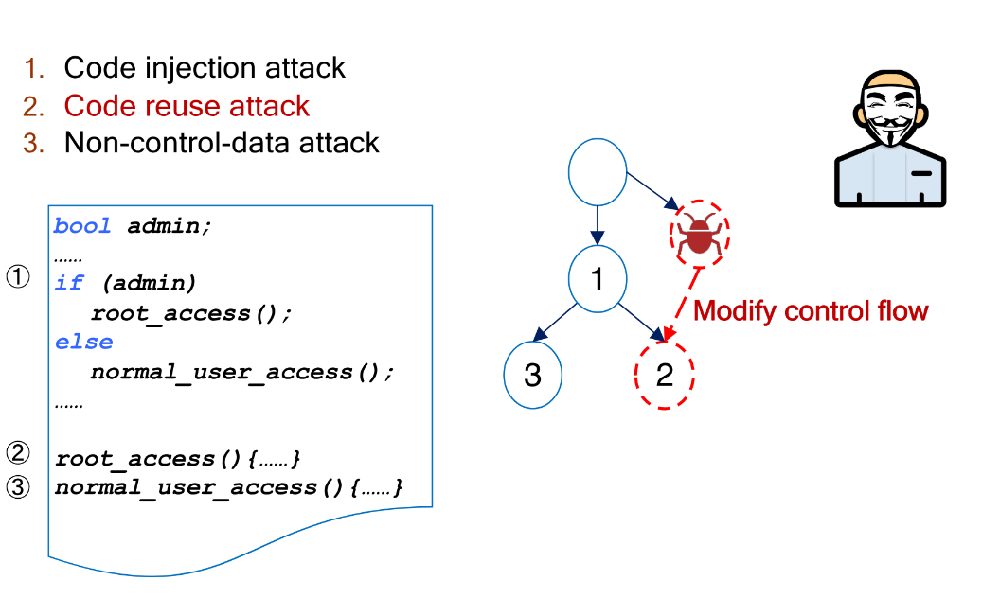

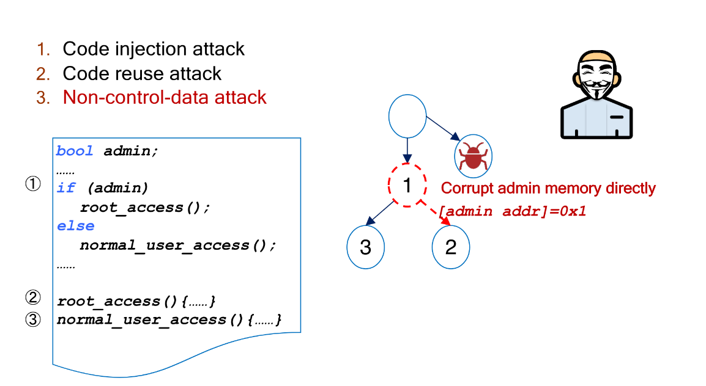

系统安全的攻防是不断发展演化的。

!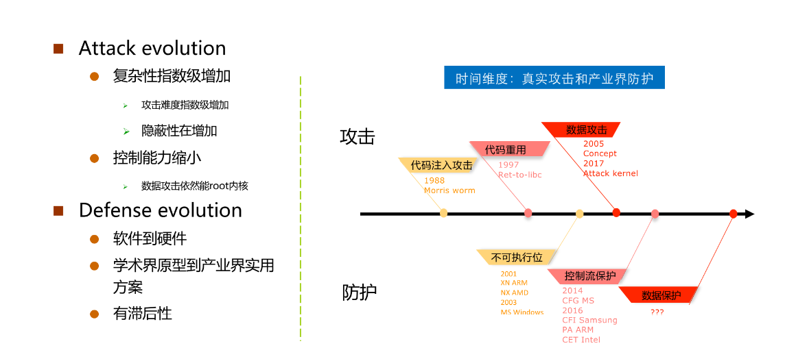
