# SIMD

SIMD 是 Single Instruction, Multiple Data（单指令流多数据流）的缩写，是计算机并行处理的一种架构类型。

## 向量处理器

采用向量数据表示及相应向量指令的流水线处理器，称为**向量处理器**。不具有向量数据表示及相应向量指令的流水线处理器，称为**标量处理器**。

向量处理器处理数据有三种方法：
- 水平处理：向量计算按行从左到右水平进行。
- 垂直处理：向量计算按列从上到下垂直进行。
- 纵横处理方法（分组处理方法）：水平处理与垂直处理相结合的方式。

拿$D=A*(B+C)$为例，其中$A$、$B$、$C$、$D$都是长度为$N$的向量。

水平处理方法：向量计算按行从左到右水平进行。

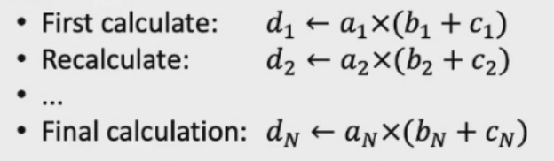

这种方法计算的数据相关次数为$N$ 次，功能切换次数为$2N$ 次。

水平处理方法存在的问题：

- 在计算每个分量时，会产生**RAW相关（写后读相关）**，流水线效率较低。

- 若采用静态多功能流水线，则需频繁切换流水线功能；流水线的**吞吐率**甚至低于顺序串行执行。

- 水平处理方法不适用于向量处理器。

垂直处理方法：向量计算按列从上到下垂直进行。

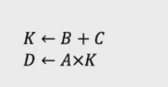

这种方法计算的数据相关次数为$1$ 次，功能切换次数为$2$ 次。

垂直处理方法对处理器的结构有要求————存储器-存储器型结构。向量指令的源向量和目标向量均存放在存储器中，运算的中间结果也需要送回存储器。

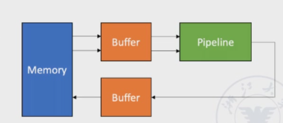


纵横（分组）处理方法:

将向量分成若干组，按垂直方式处理，并依次处理每一组。

对于上述示例，设 $N = S \times n + r$，其中 $N$ 为向量长度，$S$ 为组数，$n$ 为每组长度，$r$ 为余数。若将剩余的 $r$ 个数也作为一组，则总共有 $S+1$ 组。

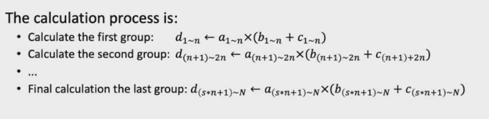

这种方法计算的数据相关次数为$S+1$ 次，功能切换次数为$2(S+1)$ 次。


纵横（分组）处理方法只需要使用寄存器-寄存器型结构的处理器。即设置可快速访问的向量寄存器，用于存放源向量、目标向量及中间结果，使运算部件的输入端和输出端与向量寄存器相连，构成寄存器-寄存器型的运算流水线。

典型的寄存器型向量处理器有很多，如CRAY-1等等。

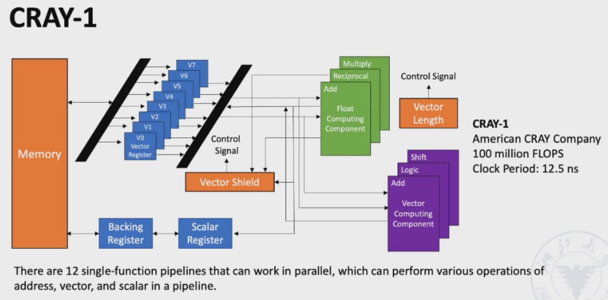

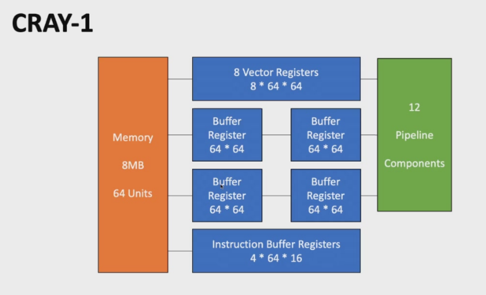


我们可以采取多种方法提高向量处理器的性能：

- 设置多个功能单元，并使它们并行工作。
- 使用向量链接技术，加快一串向量指令的执行速度。
    - 向量链接特性：存在两条相关的指令，它们为先写后读的关系。在功能部件之间无冲突且无源向量冲突的情况下，功能部件可以链接成流水线进行处理，从而达到加速执行的目的。
    - 链接特性的本质：是将流水线定向的思想引入向量执行过程的结果。

- 采用循环挖掘技术，加速循环处理。
    - 当向量的长度大于向量寄存器的长度时，必须将长向量分割成固定长度的段，然后通过循环处理，每次循环只处理一个向量段。以上就是分段向量技术。
- 使用多处理器系统，进一步提高性能。

## 阵列处理器

设置 N 个处理单元 $PE_0$ 到 $PE_{N-1}$。他们以某种方式互连，形成一个阵列。在单个控制单元的控制下，对各个处理单元分配的数据并行完成同一条指令所规定的操作。这样的处理器称为阵列处理器。阵列处理器有时也称为并行处理器。

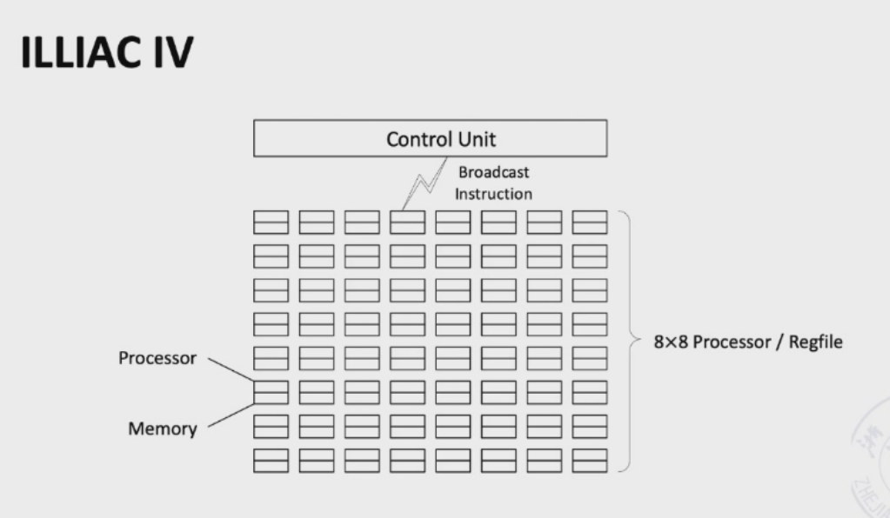

根据系统中存储器的组成方式，阵列处理器可分为两种基本结构：分布式存储器和集中式共享存储器。

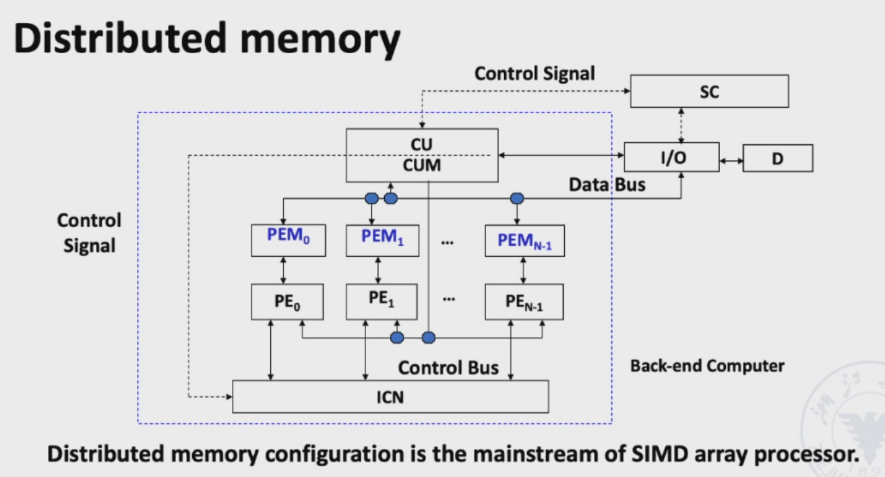

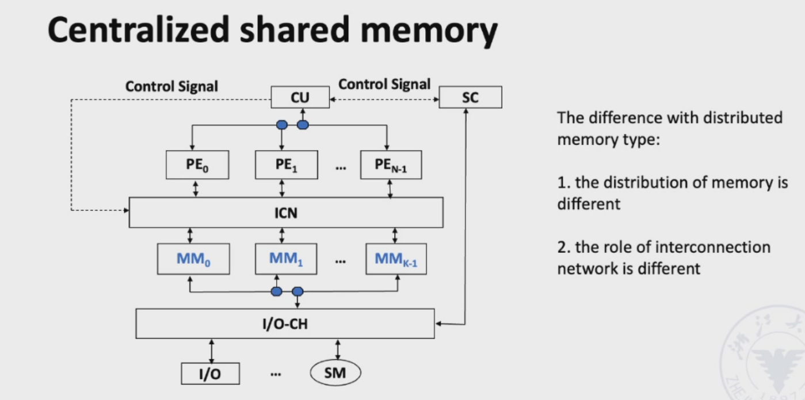

### 互联网络

互连网络由交换单元按照一定拓扑结构和控制方式构成的网络，用于实现计算机系统内部多个处理器或多个功能部件之间的互连。位于并行计算机系统内部。

互连网络通常由五部分组成：CPU、存储器、接口、链路和交换节点。

- **接口**：从 CPU 和存储器获取信息，并将信息发送到另一个 CPU 和存储器的设备。典型设备是网络接口卡。
- **链路**：传输数据位的物理通道。链路可以是电缆、双绞线或光纤，可以是串行或并行，每条链路都有其最大带宽。链路可以是单工、半双工和全双工，链路使用的时钟机制可以是同步或异步。
- **交换节点**：互连网络的信息交换和控制站。它是一种具有多个输入端口和多个输出端口的设备，能够进行数据缓冲存储和路径选择。

互联网络分为两种基本类型：单级互连网络和多级互连网络。

- 单级互连网络：仅在唯一一级上提供有限数量的连接，以实现任意两个处理单元之间的信息传输。
- 多级互连网络：由多个单级网络串联而成，以实现任意两个处理单元之间的连接。


对于互连网络的所有 $N$ 个输入端（$0, 1, ..., j, ..., N-1$ ），输入端 $j$ 与输出端 $f(j)$ 之间存在函数对应关系。输入端 $j$ 和输出端 $f(j)$ 通常采用二进制编码，通过二者的二进制编码可以找出相应的函数规律。这种对应规律即为互连函数。

### 单级互连网络

#### 立方体单级互连网络

对 $N$ 个输入端和输出端采用 $n$ 位（$n = \log_2 N$ ）二进制编码 $P_n, \ldots, P_i, \ldots, P_1, P_0$。

存在 $n$  种不同的互连函数：

$$
\text{Cube}_i(P_{n-1}, \ldots, P_i, \ldots, P_1, P_0) = P_{n-1}, \ldots, \overline{P_i}, \ldots, P_1, P_0
$$

对于有八个PE的立方体单级互连网络，其互连函数如下：

$$
\text{cube}_0(X_2X_1X_0) = (X_2X_1\overline{X_0}) 
$$

$$
\text{cube}_1(X_2X_1X_0) = (X_2\overline{X_1}X_0) 
$$

$$
\text{cube}_1(X_2X_1X_0) = (\overline{X_2}X_1X_0) 
$$

把三个互联函数连接的输入段和输出端用图形表示如下：

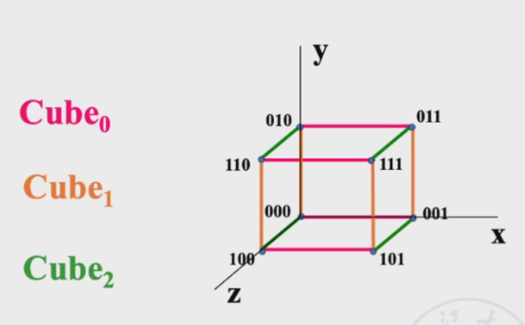

三维立方体最多只需 3 次传送，即可在任意两个处理单元之间传输数据。

当维数 $n > 3$ 时，称为超立方体网络。

$$
\text{Cube}_i(P_{n-1} \cdots P_i \cdots P_1 P_0) = P_{n-1} \cdots \overline{P_i} \cdots P_1 P_0
$$

$0 \leq i \leq n-1$，$P_i$是输入端端口号二进制编码的第 $i$  位。

单级 $n$维立方体网络的最大距离为$n$。即最多经过$n$次传送，即可实现任意两个 PE 之间的数据传送。

#### PM2I单级互联网络


互连函数（2n 条）：

$$
PM2_{+i}(j) = (j + 2^i) \mod N 
$$

$$
\quad PM2_{-i}(j) = (j - 2^i) \mod N
$$

$N$是互联网络的节点数

$$
0 \leq j \leq N - 1, \quad 0 \leq i \leq \log_2 N - 1
$$

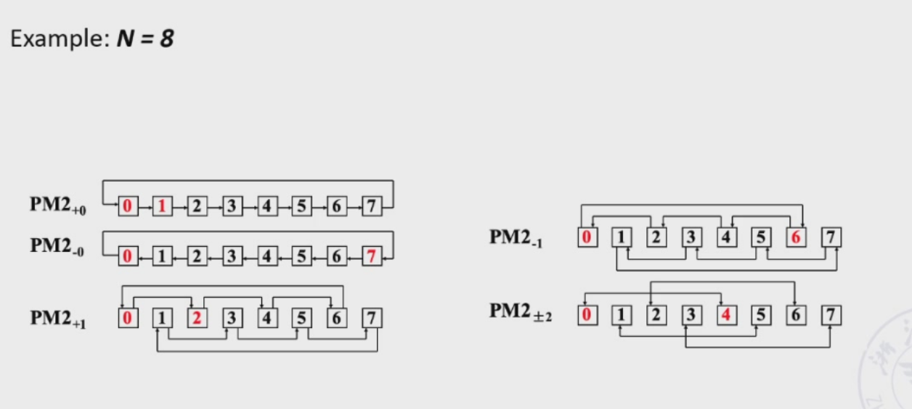

#### 洗牌交换网络

由两部分组成：洗牌 + 交换

N 维洗牌函数：

$$
shuffle(P_{n-1}P_{n-2} \dots P_1P_0) = P_{n-2} \dots P_1P_0P_{n-1}
$$

$n = \log_2 N,\quad P_{n-1}P_{n-2}\dots P_1P_0$ 是输入数字的二进制编码


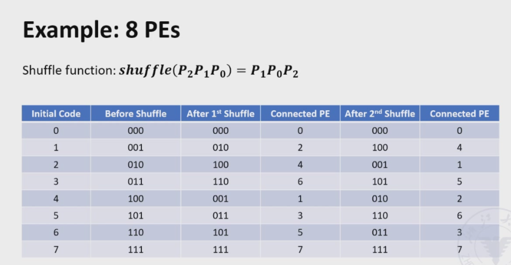

洗牌函数的一个重要特性是经过 $N$次洗牌后，所有 $N$ 个处理单元（PE）将恢复到最初的排列顺序。

但我们不难看出，洗牌交换网络并不能做到每个节点之间的互联。

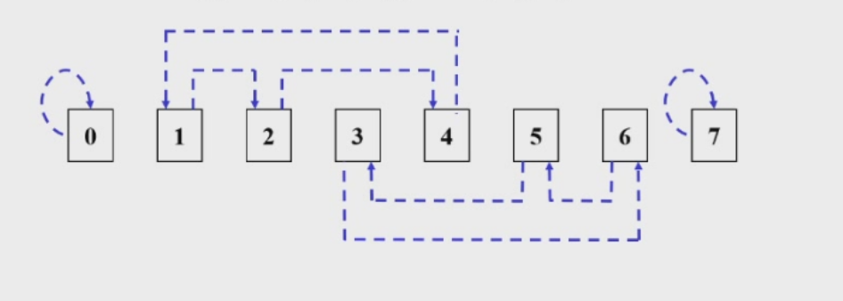

因此我们需要在洗牌交换网络的基础上增加交换网络，以实现每个节点之间的互联。

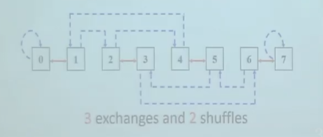

从编号全为“0”的节点到全为“1”的节点，数据传输最多需要经过：$n$ 次交换和 $n-1$ 次洗牌。

#### 单级互联网络的特点

- 结构简单，成本低
- 连接灵活，能满足算法与应用的需求
- 传输步数少，阵列运算速度提高
- 规则性和模块化较好，增强了系统的可扩展性
- 便于大规模集成


### 互联网络之间的静态连接

#### 线性阵列

对于包含 $N$ 个节点的线性阵列，共有 $N-1$ 条链路，直径为 $N-1$（任意两点之间的最大距离），度为 $2$，非对称，等分宽度为 $1$。当 $N$ 很大时，通信效率非常低。

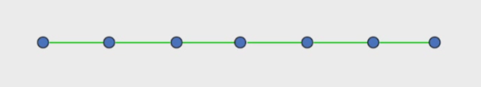

#### 环形阵列

对于由 $N$ 个节点组成的环形网络，考虑相邻节点的数据传输方向：

- 双向环：链路数为 $N$，直径为 $[N/2]$，度为 $2$，对称，等分宽度为 $2$。

- 单向环：链路数为 $N$，直径为 $N-1$，度为 $2$，对称，等分宽度为 $2$。

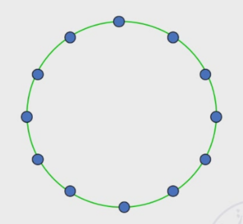

#### 带弦环阵列

对于图中具有 12 个节点的双向带弦环

- 节点度为 3：链路数为 18，直径为 4（例如红色节点），度为 3，非对称，等分宽度为 2。

- 节点度为 4：链路数为 24，直径为 3（例如红色节点），度为 4，对称，等分宽度为 8。

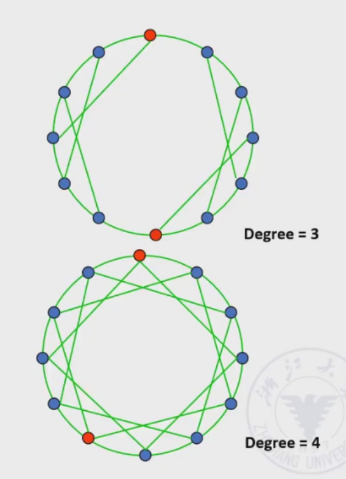

#### 完全二叉树

一棵 $K$ 层的完全二叉树应有 $N = 2^{K-1}$ 个节点，最大节点度为 $3$，直径为 $2(K-1)$（即从最右边的叶子节点到最左边的叶子节点），非对称，等分宽度为 $1$。

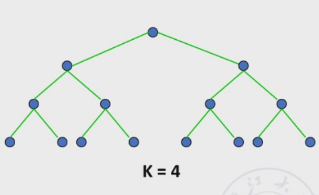

#### 星形阵列

星形阵列实际上是一个两层树（如下图所示）。

一个包含 $N$ 个节点的星形网络有 $N-1$ 条链路，直径为 $2$，最大节点度为 $N-1$，非对称，等分宽度为 $1$。

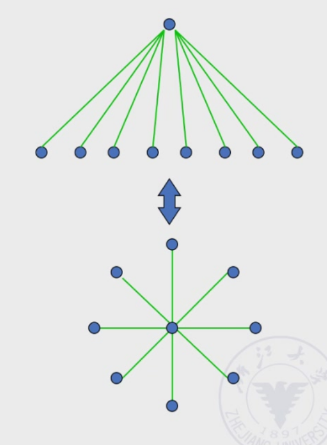

#### 网格

一个包含 $N$ 个节点的 $r \times r$ 网络有 $2N - 2r$ 条链路，直径为 $2(r-1)$，节点度为 $4$，非对称，等分宽度为 $r$。（$r = \sqrt{N}$）

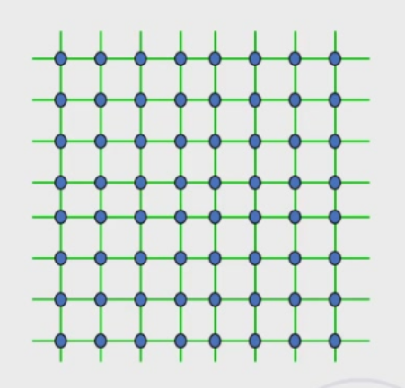

#### 二维环形曲面

一个包含 $N$ 个节点的 $r \times r$ 网络有 $2N$ 条链路，直径为 $2 \lfloor r/2 \rfloor$，节点度为 $4$，非对称。（$r = \sqrt{N}$）

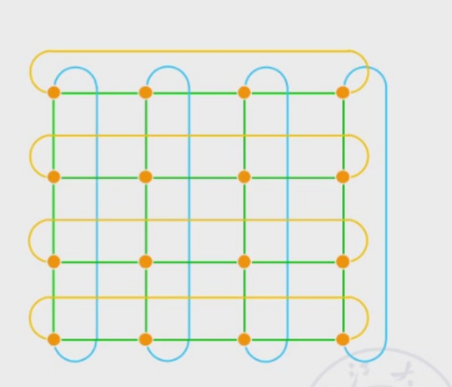

#### 超立方体

一个 $n$ 维立方体由 $N = 2^n$ 个节点组成，这些节点分布在 $n$ 个维度上，每个维度有两个节点。直径为 $n$，度为 $n$，对称。

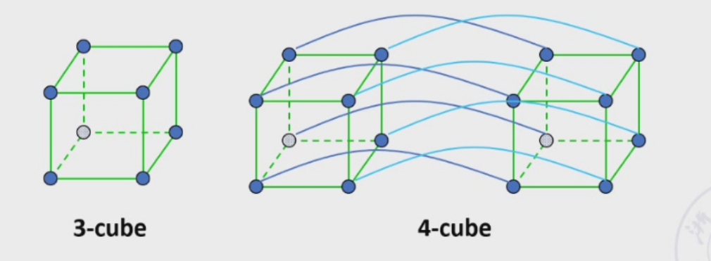

#### 带环的立方体

一个带环的 $n$ 维立方体由 $N = 2^n$ 个节点环组成，每个节点环是一个包含 $n$ 个节点的环，因此总节点数为 $n \cdot 2^n$，节点度为 $3$，且对称。

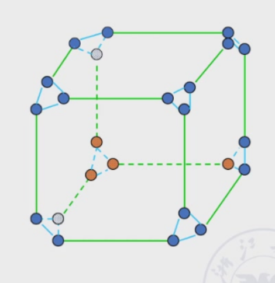

#### 总结

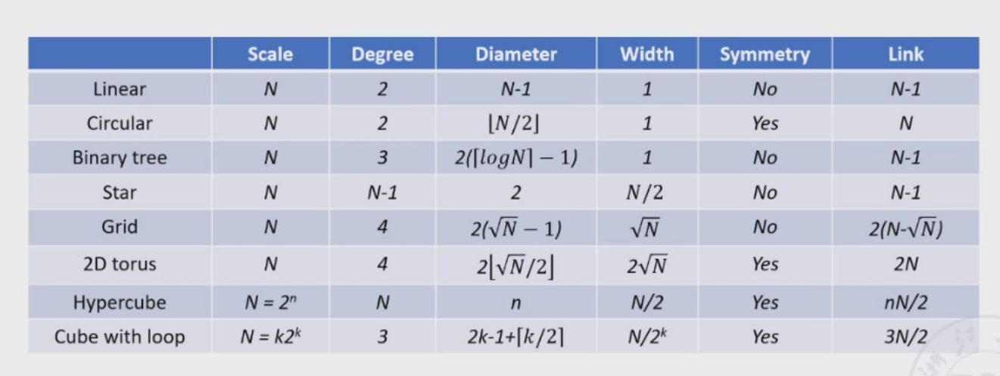

### 动态网络

动态网络中的连接不是固定的，可以在程序执行过程中根据需要改变。

网络中的交叉开关是主动的，可以通过设置这些开关的状态来重构链路。

只有网络边界上的交叉开关才能与处理器相连。

动态网络主要包括**总线**、**交叉开关**和**多级互连网络**。

总线实际上是一组连接处理器、内存和 I/O 等外设的导线和插座。在某一时刻，它只能用于一对源和目标之间的数据传输。

当有多对源和目标请求使用总线时，需要进行总线仲裁。当 CPU 数量较多时，总线争用会很严重（≤32）。

线性阵列与总线的区别：线性阵列允许不同的源和目标节点并发使用系统的不同部分。而总线则是通过切换连接到其上的许多节点来实现分时特性。同一时刻只有一对节点在传输数据。

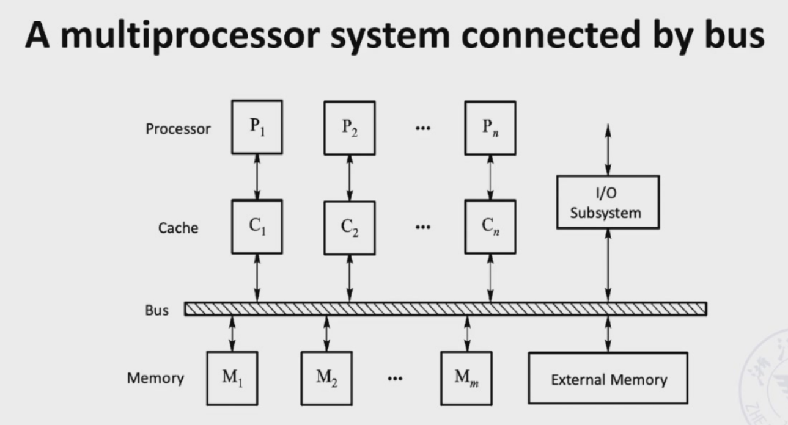

交叉开关（交换单元）：一个具有m个输入和m个输出的交叉开关记为m×m 交叉开关，$m = 2k$。常见的有2×2、4×4、8×8 等。

下图四个状态对应2×2交叉开关的四种功能：直通、交换、上广播，下广播。

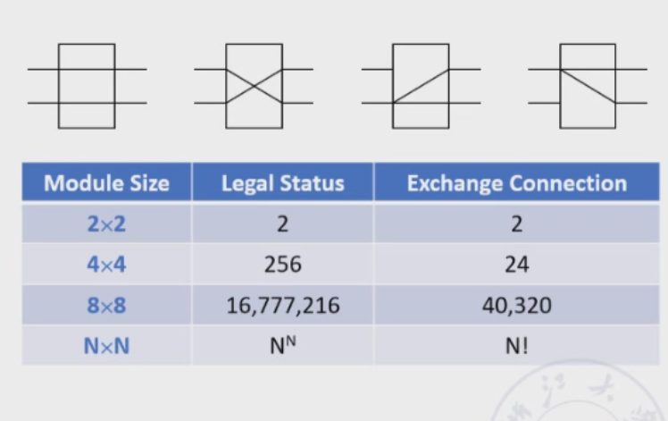


根据交叉开关的功能，2×2交叉开关可以分为二功能和四功能交叉开关。二功能交叉开关只能实现直通和交换。

多端交叉开关也有更多的功能，如广播、多播等。

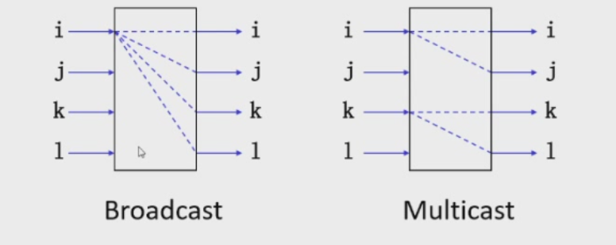


交叉开关可以连接一个个单级互联网络的输入端和输出端，形成多级互联网络。

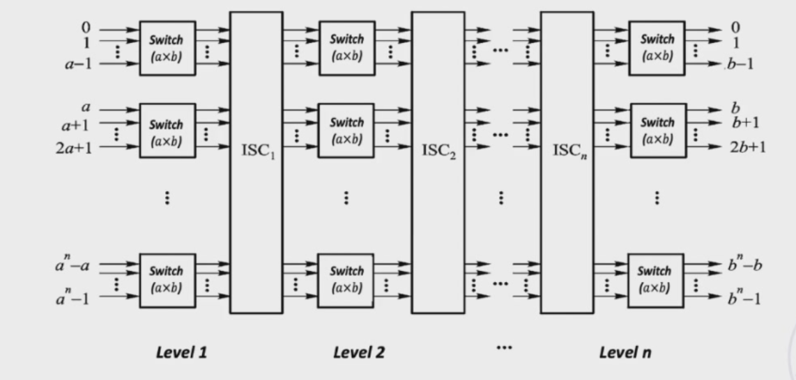


为了实现任意处理单元之间的连接，可以采用以下方式：

- 循环互连网络：使用单级网络循环多次
- 多级互连网络：将多个单级互连网络串联起来
- 多级循环互连网络：在多级互连网络的基础上，循环多次

#### 多级立方体互连网络

- 交叉开关：二功能交叉开关
- 控制方式：级控制、部分级控制和单元控制
- 拓扑结构：立方体结构
- N 单元多级立方体网络拓扑图
    - 由 $n = \log_2 N$ 确定多级立方体网络的级数 $n$
    - 从输入到输出将级编号为 0, 1, …, $n-1$
    - 每一级包含 $N/2$ 个二功能交叉开关
    - 设第 $i$ 级所有交叉开关的两个输入/输出端按照 Cube$_i$ 关系编号
    - 将每一级上编号相同的端点连接起来

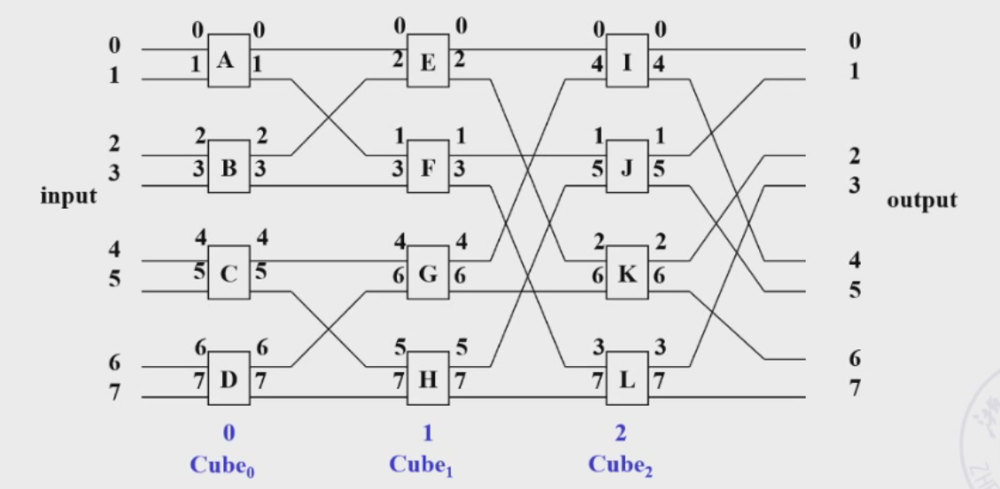

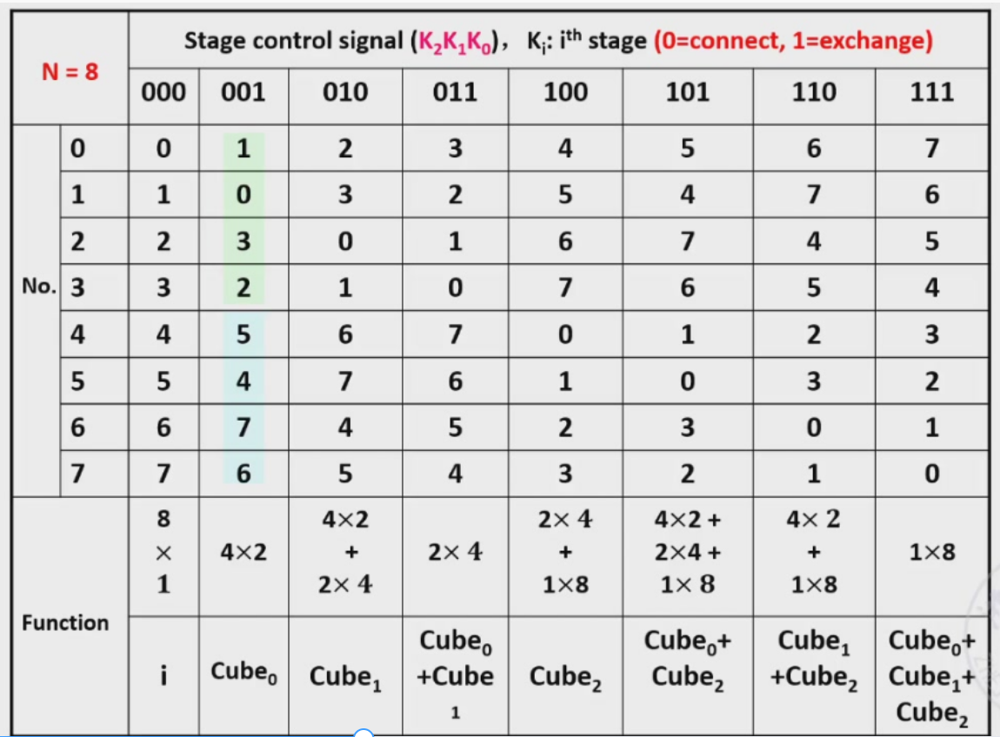

#### 多级洗牌交换网络

- 多级洗牌交换网络也称为Omega 网络
- 交叉开关：四功能交叉开关
- 控制方式：单元控制
- 拓扑结构：洗牌拓扑后接四功能交叉开关

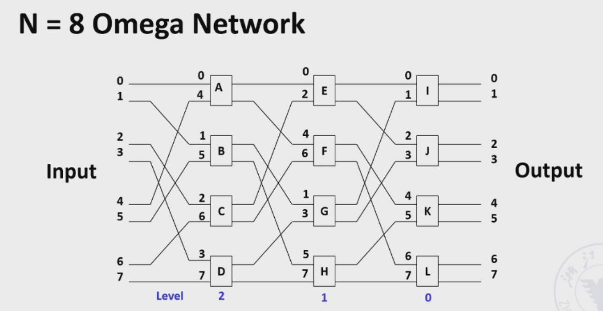

如果将 Omega 网络的交换单元限制为仅使用“直连”和“交换”功能，则该网络将成为 n 立方体网络的逆网络。

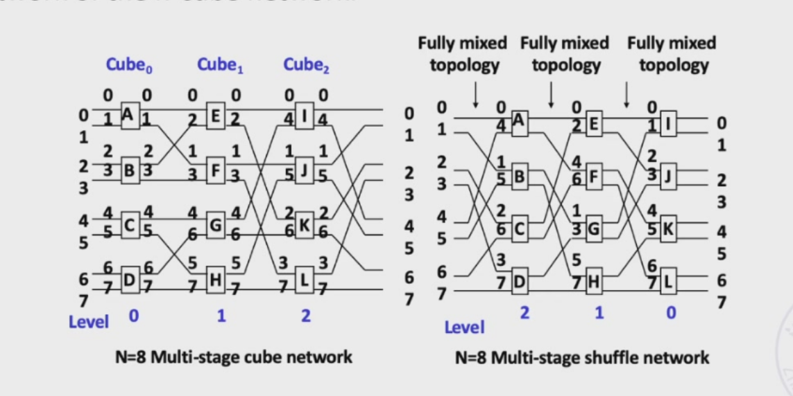

Omega 网络与 n 立方体网络的区别在于：

- Omega 网络的数据流级数顺序为：$n-1, n-2, \dots, 1, 0$。n 立方体网络的数据流级数顺序为：$0, 1, \dots, n-1$。
- Omega 网络使用四功能交叉开关。n 立方体网络使用二功能交叉开关。

- Omega 网络能实现一对多的广播功能。n 立方体网络无法实现。

## SIMD 的优点

- SIMD 架构能够利用显著的数据级并行性，适用于：
    - 面向矩阵的科学计算
    - 面向媒体的图像和声音处理器

- SIMD 比 MIMD 更节能
    - 每个数据操作只需取一条指令
    - 这使得 SIMD 适用于个人移动设备

- SIMD 允许程序员继续以顺序思维进行编程


## GPU

图形处理单元（GPU）的基本思路是采用一种“分工合作”的模式（异构执行模型）：CPU 充当主机，GPU 专门负责大量重复的并行计算任务（设备）。为了方便程序员开发，人们为 GPU 设计了一种类似 C 语言的编程语言，并将 GPU 上各种形式的并行处理统一成“CUDA 线程”（Compute Unified Device Architecture），这种编程模型就叫“单指令多线程”。

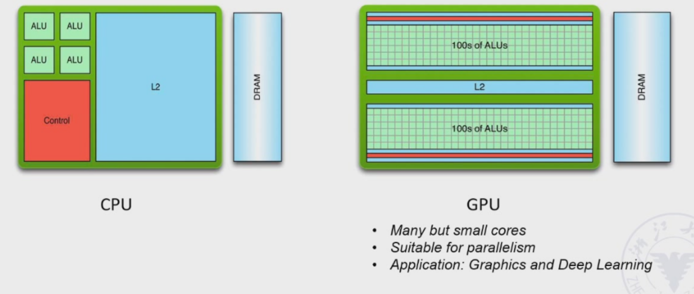

我们称执行整个CUDA线程块的硬件为多线程 SIMD 处理器。GPU 本质上就是多线程 SIMD 处理器。

GPU 直接用硬件负责线程管理，而非应用程序或操作系统。

每个数据元素对应一个线程，线程组织成块，块组织成网格。

GPU的内存结构：

- GPU 内存由所有网格（向量化循环）共享。
- 局部内存由同一线程块（向量化循环体）内的所有 SIMD 指令线程共享。
- 私有内存为单个 CUDA 线程私有。

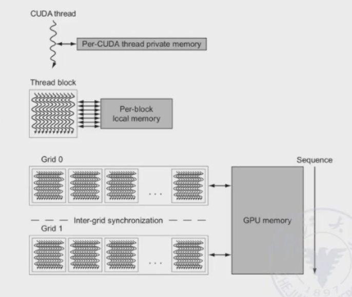

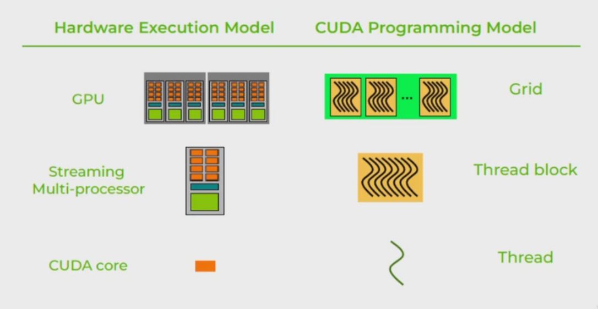

## LLP（Loop-Level Parallelism）

程序中的循环是多种并行性的主要来源。发现并处理循环级并行性对于利用数据级并行性（DLP）和线程级并行性（TLP），以及更激进的静态指令级并行性（如超长指令字 VLIW）方法都至关重要。

重点在于判断后续迭代中的数据访问是否依赖于先前迭代中产生的数据值（循环携带依赖）。

如下程序就不存在循环携带依赖：

```c
for (i=999; i>=0; i=i-1){
    x[i] = x[i] + s;
}
```

而下面程序就存在循环携带依赖：

```c
for (i = 0; i < 100; i++) {
    a[i+1] = a[i] + c[i]; //S1
    b[i+1] = b[i] + a[i+1];//S2
}
```

- S1 和 S2 使用了 S1 在前一次迭代中计算的值  
- S2 使用了 S1 在同一次迭代中计算的值

在下例中，S1 使用了 S2 在前一次迭代中计算的值，但由于这种依赖不是循环的，因此该循环是并行的。

```c
for (i = 0; i < 100; i++) {
    a[i]+a[i]+b[i];//S1
    b[i+1]=c[i]+d[i]//S2
}
```

我们可以将上述程序改写为：
```c
a[0]=a[0]+b[0];
for (i = 0; i < 99; i++) {
    b[i+1]=c[i]+d[i];
    a[i+1]=a[i+1]+b[i+1];
}
b[100]=c[99]+d[99];
```


