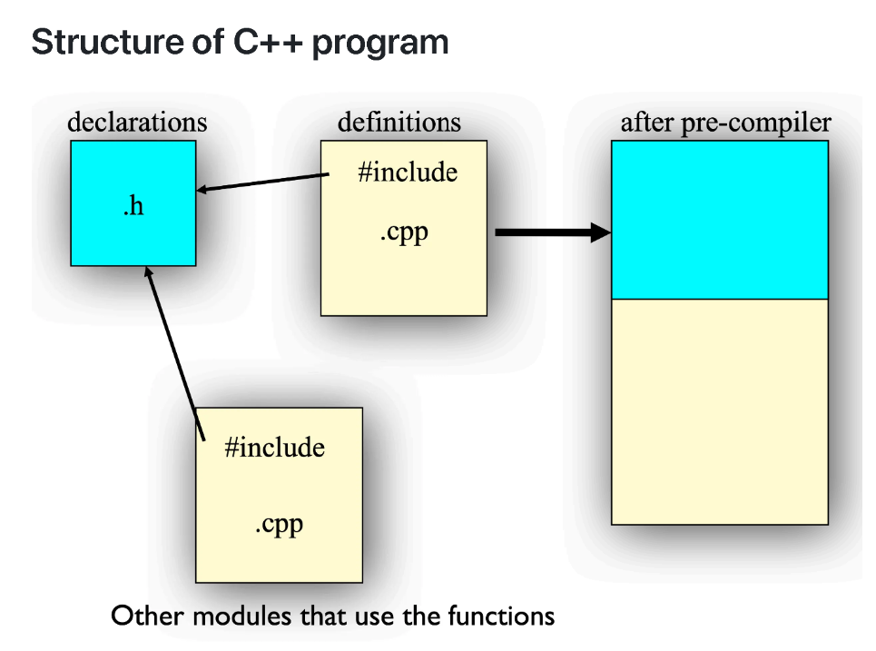
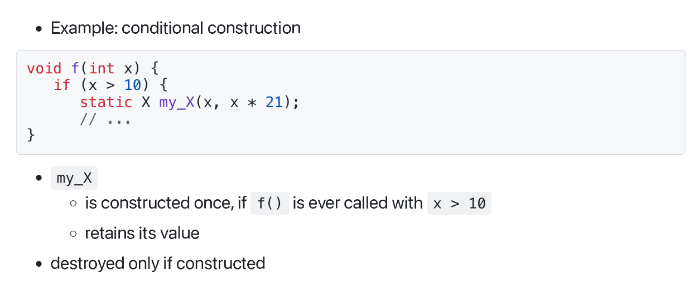
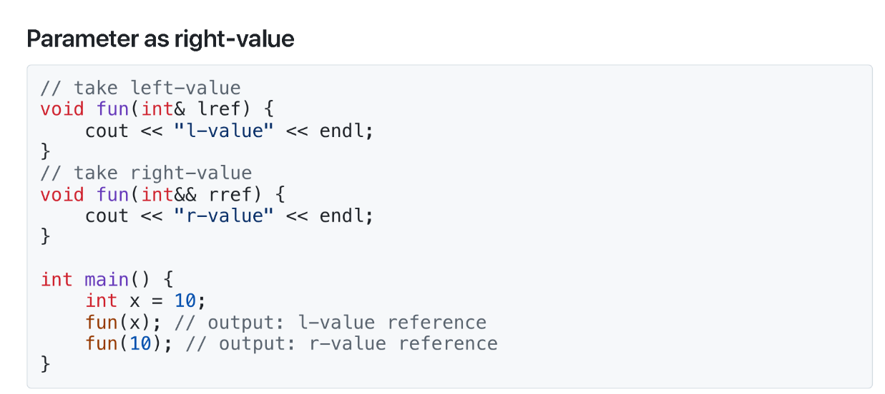
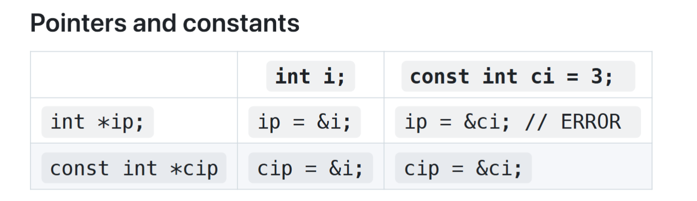
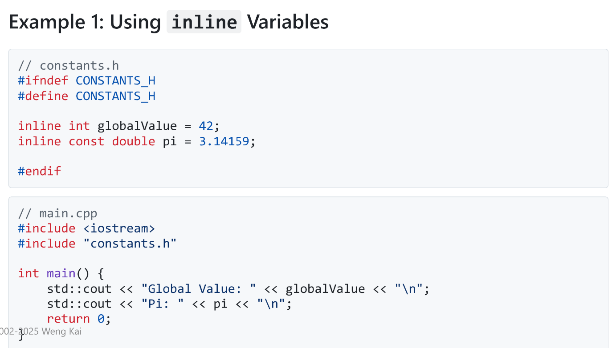
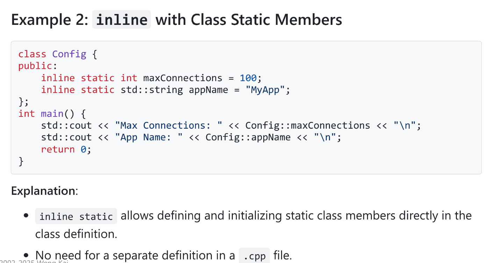

# 结构与类
## 结构
在C语言中，结构体是一种用户定义的数据类型，它可以包含多个数据成员，每个数据成员都有自己的类型和名称。结构体可以用来表示复杂的数据结构，比如学生信息、图形图像、日期等。

但有关结构体的函数定义不能定义在结构体内部，只能定义在外部。

```c
typedef struct point {
float x;
float y;
} Point;
Point a;
a.x = 1;a.y = 2;
void print(Point* p)
{
printf("%d %d\n",p->x,p->y);
}
print(&a);
```

在C++中，结构体可以包含构造函数、析构函数、成员函数等，可以实现更复杂的功能。

```c++
struct Point {
void init(int x,int y);
void move(int dx,int dy);
void print();
int x;
int y;
};
```

结构体的成员函数可以在结构体外部定义，但需要声明。

```c++
void Point::init(int ix, int iy)
{
x = ix; y = iy;
}
void Point::move(int dx,int dy)
{
x+= dx; y+= dy;
}
void Point::print()
{
cout << x << ' ' << y << endl;
}
```

如果要访问结构体的成员函数和成员变量，可以通过`.`运算符来访问。如果是指向结构体的指针，则可以通过`->`运算符来访问。
```c++
Point p;
p.init(1,2);
p.move(3,4);
Point* p2 = &p;
p2->print();
```

结构体的成员函数可以直接访问和修改结构体的成员变量和其他成员函数。
```c++
void Point::move_and_print(int dx, int dy)
{
move(dx,dy);
print();
}
```

this变量是指向当前对象的指针，是所有成员函数隐藏变量，你无法定义它，但可以直接使用它。  
`void Point::move(int dx, int dy);`可以被视为`void move(Point* this, int dx, int dy);`

### 解析器::
在C++中，解析器::是用来区分全局作用域和命名空间作用域的。在全局作用域中，::可以省略，但在命名空间作用域中，::是必须的。

- `<Class Name>::<Function Name>`：调用类作用域的函数。
- `::<Function Name>`：调用全局作用域的函数。

``` c++ 
void S::f(){
    ::f(); // 调用全局作用域的函数，而不是递归调用。
    ::a++; // 全局变量a的递增。
    a++; // 类S作用域的变量a的递增。
}
```
## 类
类是面向对象编程的基本单元，它包含数据成员、成员函数和构造函数。

### 类定义
在C++中，类定义分为两部分：类声明和类实现。  
类的声明以及该类中的函数原型位于头文件（.h）中，所有这些函数的函数体都在源文件（.cpp）中定义。
类定义的代码如下：

```c++
class ClassName {
// class members
};
```

类的函数定义和成员定义和结构体类似，

#### 编译过程
- 编译器一次只能编译一个.cpp文件，并生成.obj文件。
- 链接器将所有.obj文件和库文件链接成一个可执行文件。
- 如果要对一个.cpp文件提供其他.cpp文件中的类，则需要在编译命令中添加相应的头文件.h。



#### 头文件

.cpp文件是一个编译单元。外部变量、函数原型、类声明都在头文件.h中定义。

如果一个函数或类在头文件中声明，那么在所有使用该函数或类以及函数定义的地方或定义类成员函数的地方都必须包含该头文件。

`#include`是将被包含的文件插入到.cpp文件中`#include`语句所在的位置。

`#include"filename.h"`：首先在当前目录查找，如果找不到，则在系统目录查找。

`#include<filename.h>`/`#include<filename>`：系统目录查找。

标准头文件的结构如下：

```c++
#ifndef HEADER_FLAG
#define HEADER_FLAG
// Type declaration here...
#endif // HEADER_FLAG
```

注意：  
- 每个头文件仅定义一个类
- 与同一文件名前缀下的一个源文件.cpp相关联
- 头文件的内容必须在预处理器指令`#ifndef` `#define` 和 `#endif`之间定义。


### 类的初始化与清理

在创建类的对象时，我们可能需要对类中定义的成员变量进行初始化。一个解决方法是在类中定义一个`init()`函数，该函数在对象创建时调用。

```c++
struct Point {
void init(int x,int y);
void print() const;
void move(int dx,int dy);
int x;
int y;
};
Point a;
// a as a local variable
a.init(1,2);
a.move(2,2);
a.print();
```
但如果用户忘记调用`init()`函数，则会导致未初始化的变量。为了避免这种情况，我们的一个解决方案是在类定义中给定成员变量的默认值。

```c++
struct Point {
void init(int x,int y);
void print() const;
void move(int dx,int dy);
int x = 0;
int y = 0;
};
```

一种更有效的方式是通过构造函数保证初始化。构造函数是类中特殊的成员函数，它的名字与类名相同，它在对象创建时自动调用。构造函数允许你指定对象的构建方式，并为对象提供初始值。

```c++
struct Point {
Point(int xx,int yy) : x(xx), y(yy) {}
void print() const;
void move(int dx,int dy);
int x;
int y;
};
```
默认构造函数是指没有参数的构造函数，它可以为对象提供默认值。  
如果你有构造函数，编译器会确保构造过程始终发生。如果（且仅当）一个类（或结构体）没有提供构造函数，编译器会自动生成默认构造函数。


当对象不再需要时，我们需要对其进行清理，释放其占用的内存。在C++中，我们可以通过析构函数来实现。析构函数的作用是释放对象占用的内存，并释放对象中申请的资源。  
析构函数以类名开头，前面加上`~`，析构函数不能有返回值，不能有参数，不能被重载。

```c++
struct Point {
Point(int xx,int yy) : x(xx), y(yy) {}
~Point() { 
    cout << "Destructor called" << endl; 
}
};
```

```c++
Point(int xx,int yy) : x(xx), y(yy) {}
```
在这个构造函数中，我们用了成员初始化列表。它是 C++ 构造函数中用来直接初始化成员变量的一种语法，写在构造函数参数列表之后、函数体之前，以冒号 `: `开头，多个成员之间用逗号分隔。当成员是`const` 类型、引用类型、没有默认构造函数的类类型，都需要必须使用成员初始化列表进行初始化。

当对象超出作用域时，析构函数会由编译器自动调用。
```c++
#include <iostream>
class MyClass {
public:
    MyClass() { std::cout << "构造函数\n"; }
    ~MyClass() { std::cout << "析构函数\n"; }
};

int main() {
    {
        MyClass obj;  // 在块内定义对象
        // 使用 obj ...
    } // 此处 obj 超出作用域，析构函数被自动调用
    std::cout << "对象已超出作用域\n";
    return 0;
}
```


>作用域是程序中变量可以被访问的区域。常见的作用域有：  
1 块作用域：由一对花括号 {} 包围的代码块，例如函数体、循环体、if 语句块。    
2 函数作用域：整个函数体内。    
3 类作用域：类定义内部。  
4 命名空间作用域：命名空间内部。  
局部变量（在函数或块内定义的非静态变量）具有块作用域，它们的生命周期从定义点开始，到包含它们的最小块的末尾结束。  
编译器在作用域的{处分配该作用域的内存，并在}处释放该内存。  


##  访问控制
类的成员可以分类并被标记为：`public`、`private`、`protected`。

- `public`：表示后续成员声明对所有人可用。
- `private`：表示只有该类的内部函数成员才能访问该成员。

```c++
class MyClass {
public:
    int publicMember; // public member
private:
    int privateMember; // private member
};
```

一个对象可以访问同一类的另一个对象的`private`成员。

`friend`关键字是一种显式授予对非结构成员函数的访问权限的机制。  
可以将全局函数声明为友元，也可以将另一个类的成员函数，甚至整个类声明为友元。

```c++
class X {
public:
    void initialize();
    friend void g(X*, int);//全局函数
    friend void Y::f(X*); // Y类的成员函数
    friend class struct Z; // Z结构体
private:
    int privateMember; // private member
};
```

若一个成员未指定它的访问权限，则在类中默认是`private`，而在结构体中默认是`public`。


## 局部对象
局部变量在方法内部定义，其作用域仅限于所属的方法。当方法结束时，局部变量也就销毁了。

```c++
int TicketMachine::refundBalance() {
    int amountToRefund;
    amountToRefund = balance;
    balance = 0;
    return amountToRefund;
}
```
与字段同名的局部变量将会阻止在方法内部访问该字段。

```c++
int x = 10;
void f() {
    int x = 20; // 局部变量
    cout << x << endl; // 输出 20
}
```

### 字段、参数、局部变量  
这三种变量都能够存储与其定义类型相适应的值。  
#### 字段
字段定义在构造函数和方法之外，但在类内部。   
字段用于存储在整个对象生命周期内持续存在的数据。因此，它们维护着对象的当前状态。它们的生命周期与其所属对象的生命周期相同。  
字段具有类作用域：它们的可访问性扩展到整个类，因此可以在定义它们的类的任何构造函数或方法中使用。  
#### 形式参数
形式参数和局部变量仅在构造函数或方法执行期间存在。它们的生命周期仅持续一次调用，因此其值在调用之间会丢失。因此，它们充当的是临时存储位置，而非永久存储位置。  
形式参数定义在构造函数或方法的头部。它们从外部获取值，由构成构造函数或方法调用的实际参数值进行初始化。    
形式参数的作用域仅限于定义它们的构造函数或方法。
#### 局部变量
局部变量定义在构造函数或方法的主体内部。它们只能在定义它们的构造函数或方法内部进行初始化和使用。  
局部变量在用于表达式之前必须先进行初始化——它们不会获得默认值。  
局部变量的作用域仅限于定义它们的代码块。在该代码块之外的任何地方都无法访问它们。  

## 全局对象
全局对象是指在程序的整个生命周期内都存在的对象。它们的生命周期与程序的生命周期相同。

考虑以下代码

```cpp
#include "X.h"
X global_x(12, 34);
X global_x2(8, 16);
```

`X`类的构造函数在进入 `main()` 之前被调用，`main()` 不再是第一个被调用的函数。

析构函数在以下情况被调用，`main()` 退出时，或`exit()` 被调用时。

### 静态初始化依赖
单个文件内的构造顺序是已知的，而不同文件之间的构造顺序未指定。因此，如果不同文件中的非局部静态对象存在依赖关系时，就会产生问题。

非局部静态对象指的是： 

- 定义在全局或命名空间作用域的对象
- 在类中声明为 `static` 的对象
- 在文件作用域定义为 `static` 的对象

解决方法：

- 避免静态初始化依赖
- 将静态变量按正确顺序定义在单文件内

### Static(静态)
两层基本含义：静态存储和受限访问  
在 C++ 中，除函数和类内部外，不要使用 `static`来限制访问。

我们可以在静态局部对象前面加上 `static` 关键字，使其具有静态存储。   
此时构造发生在对象定义执行时，且至多被调用一次，析构则是发生在程序退出时。



`static` 也可用于成员变量和成员函数。使成员变量和函数对所有类成员函数全局可见。它初始化一次，在文件作用域进行。

静态成员变量和成员函数的声明在`.h`文件中。

```c++
class StatMem{
    int getHeight(){ return m_h;}
    void setHeight(int h){ m_h = h;}
    int getWeight(){ return m_w;}
    void setWeight(int w){ m_w = w;}
    static int m_h;
    int m_w;
};
```

静态成员变量和成员函数的定义在`.cpp`文件中，在此时不能用`static`关键字修饰，且需要全局初始化。

```c++
int StatMem::m_h = 12;

int main(){
    StatMem s1, s2;
    s1.setHeight(15);
    cout << s2.getHeight() << endl; // 15
    s1.setWeight(20);
    cout << s2.getWeight() << endl; // 不确定值
}
```

静态成员变量和成员函数的作用域是整个类，而不是某个对象。因此，它们可以被所有对象共享。

静态成员函数没有隐式指针`this`，所以它只能访问静态成员变量，而不能访问非静态成员变量。而静态成员函数的优势就是可以直接通过类名调用，而不需要通过对象调用。（当然也可以通过对象调用）


总结的static用法以及静态对象的性质如下：


## 引用
引用是一种在 C++ 中操作对象的新方式

``` c++
char c;    // 一个字符
char *p = &c;  // 一个指向字符的指针
char &r = c;  // 一个指向字符的引用
```

`&` 表示其右侧的变量是一个引用，对一个变量引用的形式为`类型& 引用名 = 变量名`。

在参数列表和成员变量中，引用的形式为`类型& 引用名`，由调用者或构造函数确定绑定关系。

引用的实质就是对变量的别名，因此对引用的修改会影响到其绑定的变量。

``` c++
int X=47;
int &Y=X; // Y is a reference to X
// X and Y now refer to the same variable
cout<<"Y="<<y; //printsY=47
Y = 18;
cout<<"X="<<x; //printsX=18
```

引用在定义时必须用变量进行初始化，即建立绑定关系，与指针不同，引用在运行时不会改变绑定关系。

引用的目标必须具有内存位置，不能是字面值常量或是算数表达式。
``` c++
void func(int &x);
func(4);// 警告或错误！
func(i * 3); // 警告或错误！
```

不能有引用的引用，不能有指向引用的指针。

``` c++
int &*p;    // 非法
```
指向指针的引用是允许的。

``` c++
void f(int *&p);
```

不能有引用的数组。

### 引用与指针的比较
- 引用
    - 不能为空
    - 依赖于已有变量，是某个变量的别名
    - 不能更改指向新的“地址”位置

- 指针 
    - 可以设为空
    - 独立于已有对象
    - 可以更改指向不同的地址

### 左值与右值


- 左值可以简单理解为能用在赋值语句左侧的值：
  - 变量、引用
  - 运算符 `*`、`[ ]`、`.` 和 `->` 的结果

- 右值是可以用在赋值语句右侧的值：
  - 字面量
  - 表达式

- 引用参数只能接受左值 —— 引用是左值的别名

- 在C++11中，右值是由两个概念构成的，⼀个是将亡值（xvalue，eXpiringValue），另⼀个则是纯右值（prvalue，Pure Rvalue）
    - 纯右值就是C++98标准中右值的概念，讲的是⽤于辨识临时变量和⼀些不跟对象关联的值。⽐如⾮引⽤返回的函数返回的临时变量值就是⼀个纯右值。⼀些运算表达式，⽐如 1 + 3 产⽣的临时变量值，也是纯右值。⽽不跟对象关联的字⾯量值，⽐如： 2 、 'c' 、 true ，也是纯右值。此外，类型转换函数的返回值、lambda表达式等，也都是右值。
    - 将亡值则是C++11新增的跟右值引⽤相关的表达式，这样表达式通常是将要被移动的对象（移为他⽤），⽐如返回右值引⽤ T&& 的函数返回值、 std::move 的返回值，或者转换为 T&& 的类型转换函数的返回值

#### 右值引用
右值引⽤就是对⼀个右值进⾏引⽤的类型。事实上，由于右值通常不具有名字，我们也只能通过引⽤的⽅式找到它的存在。通常情况下，我们只能是从右值表达式获得其引⽤。⽐如：

```c++
T && a = ReturnRvalue();
```

这个表达式中，假设 `ReturnRvalue` 返回⼀个右值，我们就声明了⼀个名为 `a` 的右值引⽤，其值等于 `ReturnRvalue` 函数返回的临时变量的值。

右值引⽤和左值引⽤都是属于引⽤类型。⽆论是声明⼀个左值引⽤还是右值引⽤，都必须⽴即进⾏初始化。⽽其原因可以理解为是引⽤类型本身⾃⼰并不拥有所绑定对象的内存，只是该对象的⼀个别名。左值引⽤是具名变量值的别名，⽽右值引⽤则是不具名（匿名）变量的别名。

```c++
T && a = ReturnRvalue();
```

ReturnRvalue 函数返回的右值在表达式语句结束后，其⽣命也就终结了（通常我们也称其具有表达式⽣命期），⽽通过右值引⽤的声明，该右值⼜“重获新⽣”，其⽣命期将与右值引⽤类型变量 a 的⽣命期⼀样。只要 a 还“活着”，该右值临时量将会⼀直“存活”下去

所以相⽐于以下语句的声明⽅式：

```c++
T b = ReturnRvalue();
```

右值引⽤变量声明就会少⼀次对象的析构及⼀次对象的构造。因为 a 是右值引⽤，直接绑定了 ReturnRvalue() 返回的临时量，⽽ b 只是由临时值构造⽽成的，⽽临时量在表达式结束后会析构因应就会多⼀次析构和构造的开销。

能够声明右值引⽤ a 的前提是 ReturnRvalue 返回的是⼀个右值。通常情况下，右值引⽤是不能够绑定到任何的左值的。⽐如下⾯的表达式就是⽆法通过编译的。

```c++
int c;
int && d = c;
```

相对地，在C++98标准中就已经出现的左值引⽤是否可以绑定到右值（由右值进⾏初始化）呢？⽐如：

```c++
T & e = ReturnRvalue();
const T & f = ReturnRvalue();
```

e 的初始化会导致编译时错误，⽽ f 则不会。

在常量左值引⽤在C++98标准中开始就是个“万能”的引⽤类型。它可以接受⾮常量左值、常量左值、右值对其进⾏初始化。⽽且在使⽤右值对其初始化的时候，常量左值引⽤还可以像右值引⽤⼀样将右值的⽣命期延⻓。相⽐于右值引⽤所引⽤的右值，常量左值所引⽤的右值在它的“余⽣”中只能是只读的。相对地，⾮常量左值只能接受⾮常量左值对其进⾏初始化。

右值引用也可以作为函数的参数传入：




## 常量
在c++中，要定义一个常量，我们需要在变量的类型前加上关键字`const`。常量在赋值后不可以被修改。
```c++
const int x = 123;
x = 27; // illegal!
x++; // illegal!
int y = x; // Ok, copy const to non-const
y = x;
// Ok, same thing
const int z = y; // ok, const is safer
```

其中`const int x =123`这种在编译时就已经确定了常量值的形式叫做编译时常量，而`const int z = y`这种在运行时才确定值的形式叫做运行时常量。
常量也是变量，它遵循作用域规则。

C++ 中的 const 默认为内部链接，编译器会尽量避免为 const 分配存储空间 —— 将其值保存在符号表中。extern 会强制分配存储空间。

除非使用显式的 extern 声明，const必须初始化。

常量可以被利用：
```c++
const int class_size = 12;int finalGrade[class_size]; // okint x;
cin >> x;
const int size = x;
double classAverage[size]; // ok
```

const 可以用于聚合类型，但会分配存储空间。在这种情况下，const 的含义是“一块不可更改的存储空间”。

然而，该值不能在编译时使用，因为编译器不需要在编译时知道该存储空间的内容。
```c++
const int i[] = { 1, 2, 3, 4 };
float f[i[3]]; // 非法
struct S { int i, j; };
const S s[] = { { 1, 2 }, { 3, 4 } };
double d[s[1].j]; // 非法
```

指针也可以是常量。当指针是常量时，形如`int * const p`，它指向的地址不能被修改，但它指向的对象的值可以被修改。当形式如`const int *a`或`int const*a`时，这通常指的是`*a`为常量，即无法通过`a`指针改变内存空间所存储的值，但可以改变`a`指向的地址。

```c++
char * const q = "abc"; // q is const
*q = 'c'; // OK
q++; // ERROR
const char *p = "ABCD"; // (*p) is a const char
*p = 'b'; // ERROR! (*p) is the const
```



```c++
char* s = "Hello, world!";
```

- `s` 是一个指针，初始化为指向一个字符串常量
- 实际上这应该是 `const char *s` 类型，但编译器接受不带 `const` 的写法
- 不要尝试修改其中的字符值（这是未定义行为）
- 如果需要修改字符串，请将其放入数组中：`char s[] = "Hello, world!";`


非 const 值总是可以作为 const 来使用

```c++
const int i = 10;
void f(const int* x);
int a = 15;
f(&a); // 正确
const int b = a;

f(&b); // 正确
b = a + 1; // 错误！
```

但在没有显式转换（`const_cast`）的情况下，不能将常量对象作为非常量对象来使用。

函数返回变量只是值的传递，返回变量类型可以修改。

``` c++
int f3() { return 1; }
const int f4() { return 1; }
int main() {
    const int j = f3(); // 没问题
    int k = f4(); // 这样也没问题！
}
```

然而，如果函数返回的是一个const指针，如`const int*`类型，则不能修改指针所指向的值。


### constexpr
constexper是C++11中新增的关键字，用来指示表达式或函数在编译期求值，而不是在运行期。

```c++
constexpr int square(int x){
    return x*x;//只有一条return语句
}

constexpr int a = square(3); // a的值在编译器计算为9
```

if constexpr在编译期可以决定分支，未选中的分支不参与编译。

```c++
auto get_value(int t){
    if constexpr(std::is_pointer_v<int>)
        return *t;
    else
        return t;
}
```

### 常量对象
常量对象是指在程序运行期间其值不能被修改的对象。

但有些成员函数可能对其内部变量产生修改，那编译器应该如何得知常量对象的成员函数是否能被安全调用呢。这时我们就需要将成员函数声明为 const。使得常量对象只能调用const成员函数。

```c++
int Date::set_day(int d){
    //...error check d here...   
    day = d;  // ok, non-const so can modify
    }
int Date::get_day()const{    
    day++;   //ERROR modifies data member
    set_day(12); // ERROR calls non-const member
    return day;  // ok
    }
```

声明为const的成员函数不会对任何成员变量进行写入，也不会调用任何非const的成员函数。

在声明和定义中都要重复使用 const 关键字
```c++
int get_day() const;
int get_day() const { return day };
```

不修改数据的成员函数应声明为 const，这样的 const 成员函数对于声明为 const 的常量对象是安全的。

const关键字实际上修饰的是成员函数中隐含的this指针，所以静态成员函数不能被声明为const。

mutable关键字用来修饰成员变量，它的作用是允许某个成员变量在const成员函数中被修改。它只能用于类的非静态成员变量，不能用于类的静态成员变量、局部变量和全局变量。

对于类中的常量成员变量，我们必须在构造函数的初始化列表中初始化

## 动态内存分配
在c++中，动态内存分配和释放主要是通过new和delete运算符来完成的。

- new
    - `new int;`
    - `new Stash;`
    - `new int[10]`

- delete
    - `delete p;`
    - `delete[] p;`

new 是在程序运行时分配内存的方式。指针成为访问该内存的唯一途径。

`{}`可用于向新生成的对象传递初始值。

delete 使你在使用完内存后可以将其归还给内存池。

```c++
int * psome = newint [10];
delete[] psome;
```

`new` 操作符返回该内存块第一个元素的地址。  
方括号的存在告诉程序应该释放整个数组，而不仅仅是单个元素。

以下是new 和 delete 的一些使用技巧：

- 不要使用 `delete` 来释放并非由 `new` 分配的内存。
- 不要连续两次使用 `delete` 释放同一块内存。
- 如果使用 `new []` 分配了数组，则应使用 `delete []`。
- 如果使用 `new` 分配了单个实体，则应使用 `delete`（不带方括号）。
- 对空指针应用 `delete` 是安全的（不会发生任何操作）。

## 函数重载
c++支持函数重载，即一个函数可以根据不同的参数列表来实现不同的功能。或者说，同一个函数名可以对应多个函数定义，只要它们的参数列表不同。

```c++
void print(char * str, int width); //#1
void print(double d, int width); //#2
void print(long l, int width); //#3
void print(int i, int width); //#4
void print(char *str); //#5
print("Pancakes", 15); //#1
print("Syrup");// #5
print(1999.0, 10);// #2
print(1999, 12);// #3
print(1999L, 15);// #4
```

当有多个同名函数且调用时参数列表均匹配时，编译器会报错。

```c++
void f(short i);
void f(double d);
f('a');
f(2);//error
f(2L);//error
f(3.2);//error
```

在函数重载时，可以允许一个同名函数为const，另一个为非const。

```c++
void A::print() const {
    cout<< "A::print() const"<<endl;
}
void A::print() {
    cout<< "A::print() non-const"<<endl;
}
A a1;
a1.print(); // A::print() non-const
const A a2;
a2.print(); // A::print() const
```

一个类的构造函数也可以被重载。

```c++
class Info {
public:
Info() { InitRest();} // target
Info(int i) : Info() { tyep = i; } // delegating
Info(char e) : Info() { name = e; }
};
```

在c++11中引入了委托构造函数，即一个构造函数可以调用同一个类的另一个构造函数来完成部分或全部初始化工作。（在上例中，`Info(int i)`和`Info(char e)`在初始化列表中写 `: Info()`，表示先调用默认构造函数，然后再执行自己的函数体。）

委托关系可以形成调用链，但这种情况应该尽量避免。

```cpp
class Info {
public:
    Info(): Info(1) {}               // 委托
    Info(int i): Info(i, 'a') {}     // 目标 & 委托
    Info(char e): Info(1, e) {}
private:
    Info(int i, char e): type(i), name(e) {} // 目标
};
```

## 默认参数

默认参数是在声明中给出的一个值，如果你在函数调用中没有提供该参数的值，编译器会自动插入这个值。

```cpp
Stash(int size, int initQuantity = 0);
```

在定义带有参数列表的函数时，默认参数必须从右向左依次添加。

```cpp
int harpo(int n, int m = 4, int j = 5);
int chico(int n, int m = 6, int j);   // 非法
int groucho(int k = 1, int m = 2, int n = 3);
beeps = harpo(2);
beeps = harpo(1, 8);
beeps = harpo(8, 7, 6);
```

默认参数的值是在函数的声明（原型）中指定的，而不能在函数定义的头部中再次指定。如果声明和定义中都写了默认值，编译器可能遇到不一致的值，产生歧义或错误。
```cpp
// 声明
void func(int a, int b = 10);

// 定义中又写默认值 —— 错误
void func(int a, int b = 10) {  // 编译错误：重复指定默认参数
}
```

## 内联函数

函数调用时是需要时间开销的，如进行以下操作：

- 压入参数
- 压入返回地址
- 准备返回值
- 弹出所有压入的内容

内联函数会在调用处直接展开，就像预处理器的宏一样，从而消除函数调用的开销。

```cpp
inline int f(int i) {
return i*2;
}
main() {
int a=4;
int b = f(a);
}
```

内联函数的定义实际上只是声明。内联函数的定义可能不会在 `.obj` 文件中生成任何代码。因此，你必须将内联函数的函数体放在头文件中。然后在需要使用该函数的地方 `#include` 这个头文件。  

被调用函数的函数体会被插入到调用函数的位置。这可能会增加代码体积，但减少了函数调用的时间开销。因此它以空间换取了速度。在大多数情况下，这是值得的。它比 C 语言中的宏要好得多。它会检查参数的类型。

在类声明内部定义的任何函数都会自动成为内联函数，即使不加`inline`关键字也是如此。也可以可以将内联成员函数的定义放在类的大括号之外。    
以下两种表述等价：

```cpp
class A {
public:
    int f(int i) { return i*2; }
};
```

```cpp
class A{
public:
    inline int f(int i);
};

inline int A::f(int i) {
    return i*2;
}
```


- 应该内联的情况：
    - 小型函数，2到3行
    - 频繁调用的函数，例如在循环内部

- 不应该内联的情况
    - 非常大的函数，超过20行
    - 递归函数

为了简便，我们有时可以把所有函数都设为内联，或者永远不把函数设为内联。

在某些时候，编译器不一定必须遵从你要求将函数设为内联的请求。它可能会认为该函数过大，或者注意到它调用了自身（递归对于内联函数是不允许或实际上不可能的），又或者你所用的编译器可能没有实现该特性。
### 内联变量

在 C++17 及更高版本中，`inline` 关键字除了可以用于函数之外，还可以用于变量。`inline` 变量解决了与头文件中的全局变量和常量定义相关的一个常见问题。

在 C++17 之前，在头文件中定义变量会导致问题，因为包含该头文件的每个翻译单元（即 `.cpp` 文件）都会生成该变量的一个独立副本。这通常会在链接阶段导致多重定义错误。

为了避免这个问题，通常使用 `extern` 在头文件中声明变量，并在一个单独的 `.cpp` 文件中定义：

```cpp
// header.h
extern int globalValue;

// source.cpp
int globalValue = 42;
```

这种方法可行，但需要将声明和定义分开，这并不总是很方便。

使用 `inline` 变量，你可以直接在头文件中定义变量而不会引起链接器错误。它有以下特性：

- 跨翻译单元的单一定义：即使变量被多个文件包含，编译器也确保 `inline` 变量只存在一个实例。
- 在头文件中初始化：你可以在头文件中同时声明和初始化变量，使代码更加简洁。
- 全局或静态变量：适用于全局常量、类的静态成员或单例模式。





以下是常见的使用内联变量的情况：

- 在头文件中定义全局常量时。
- 使用直接在类定义中初始化的静态类成员时。
- 需要在多个文件之间保持变量的单一定义时。
- 需要简化配置值或设置的管理时。

内联变量不是万能的，以下是不应该使用内联变量的情况：

- 避免将 `inline` 变量用于大型对象或占用大量内存的变量。这可能导致不必要的内存使用。
- 不要将 `inline` 用于需要在每个编译单元中保持唯一实例的变量。
- 对于可以在运行时修改的变量，谨慎使用 `inline`，因为这可能导致意外的副作用。