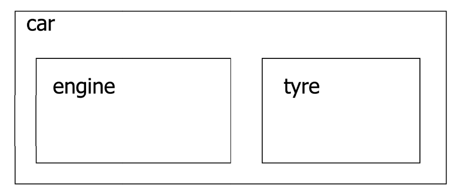
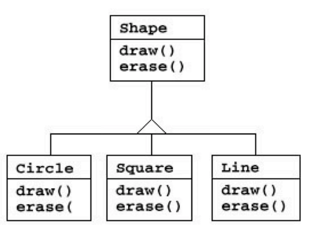
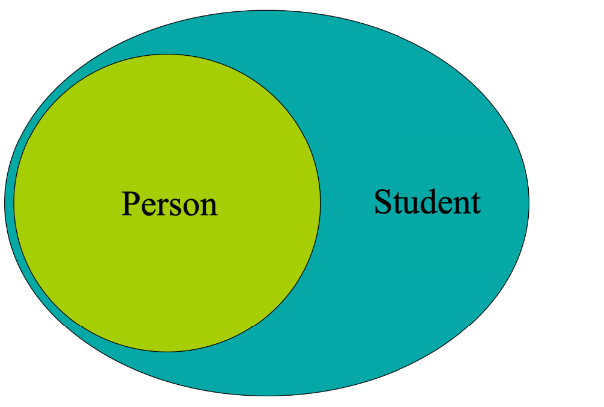
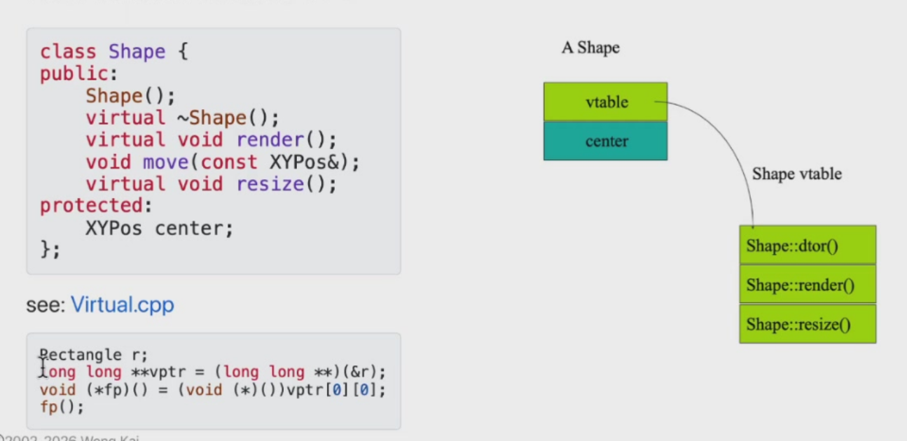
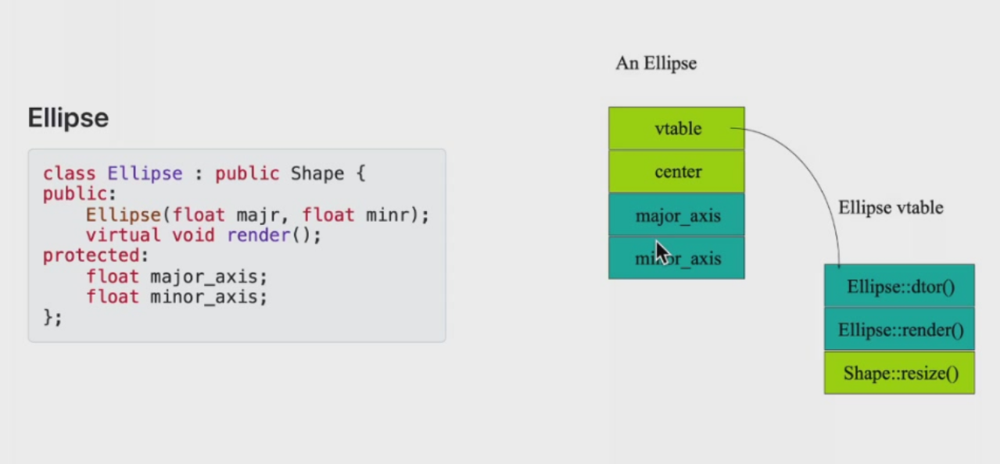
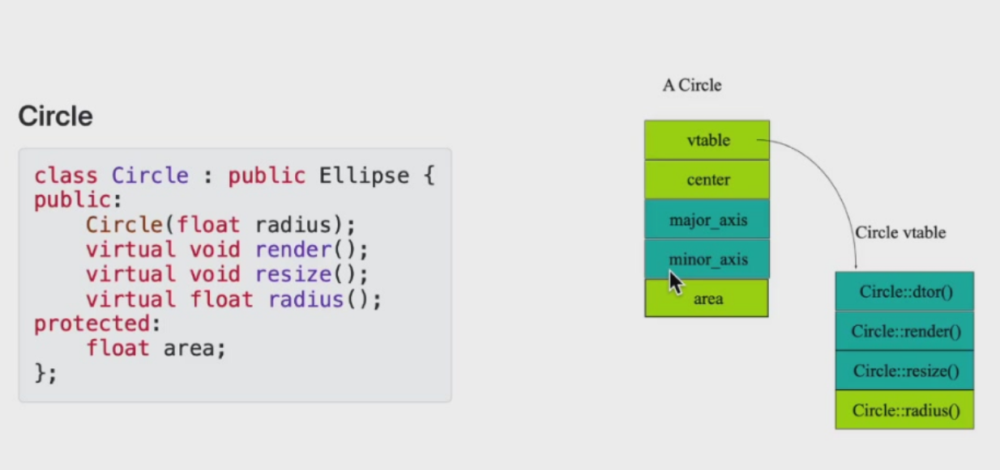
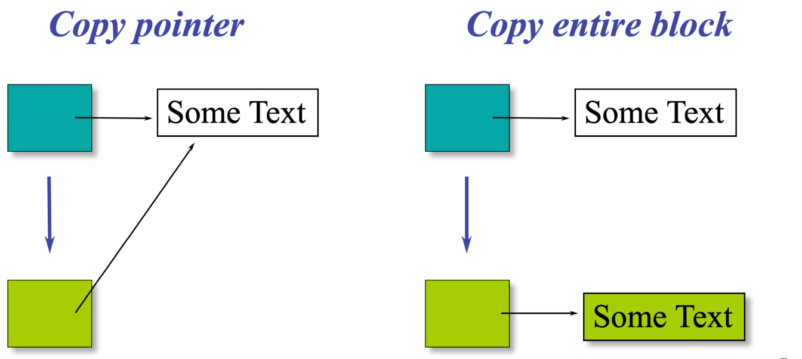

# 函数复用

## 组合
组合即是使用已有对象构造新对象

这是一种“拥有”（has-a）关系，即一个对象拥有另一个对象。



每个对象都有自己的内存空间，该内存空间由其他对象组成。  

组合有两种方式：完全包含和通过引用包含（通过引用包含允许共享）。

“完全包含”指的是一个对象将另一个对象作为其直接成员变量（而不是指针或引用），这样被包含的对象的内存就在外层对象内部，生命周期完全由外层对象管理。而引用包含指的是外层对象只保存一个指向被包含对象的指针或引用，而不是直接保存被包含对象本身。

```c++
class Person { ... };
class Currency { ... };
class SavingsAccount {public:
SavingsAccount(
const char* name,
const char* address,
int cents );
~SavingsAccount();
void print();
private:
Person m_saver;
Currency m_balance;
};
```

```c++
SavingsAccount::SavingsAccount (
const char* name,
const char* address,
int cents ) : m_saver(name, address),
m_balance(0, cents) {}
void SavingsAccount::print() {
m_saver.print();
m_balance.print();
}
```


所有嵌入式对象都会被初始化，如果你没有提供参数，并且存在默认构造函数（或可以生成一个），则会调用默认构造函数。

构造函数可以带有初始化列表，可以包含任意数量的对象，用逗号分隔。它可以为子构造函数提供参数。

嵌入式对象析构函数会被自动调用。析构的顺序是从外到内。

如果我们像下面这样编写构造函数（假设子对象有相应的 set 访问器）：

```cpp
SavingsAccount::SavingsAccount(
    const char* name,
    const char* address,
    int cents ) {
    m_saver.set_name( name );
    m_saver.set_address( address );
    m_balance.set_cents( cents );
}
```

那么默认构造函数会被调用。

我们通常将嵌入对象设为私有，如果你希望在新对象中拥有子对象的整个公共接口，可以将子对象嵌入为公有：

```cpp
class SavingsAccount {
public:
    Person m_saver;   // 假设 Person 类有 set_name() 方法
    // ...
};

SavingsAccount account;
account.m_saver.set_name("Fred");
```


对于完全包含，构造函数和析构函数会被自动调用；而对于通过引用包含，初始化与销毁对象是你的责任。

通过引用包含通常用于以下情况：

- 逻辑关系不是完全的包含关系
- 对象的大小在开始时未知
- 资源需要在运行时分配/连接

其他面向对象编程语言仅使用引用包含方式。


## 命名空间
命名空间是一个作用域，就像类一样，它可以包含类、函数、变量等。当只需要名称封装时，优先使用命名空间。

我们在定义命名空间时，需要将定义放在头文件中。

```cpp
// Mylib.h
namespace MyLib {
    void foo();
    class Cat {
    public:
            void Meow();
    };
}
```

在使用命名空间中的元素时，使用作用域解析运算符来限定命名空间中的名称。但这种方式十分繁琐。

```cpp
#include "MyLib.h"
void main() {
    MyLib::foo();
    MyLib::Cat c;
    c.Meow();
}
``` 

我们可以用using 声明在某个地方指明名称的来源
，同时消除冗余的作用域限定。

```cpp
void main() {
    using MyLib::foo;
    using MyLib::Cat;
    foo();
    Cat c;
    c.Meow();
}
```

我们可以直接用`using namespace MyLib;`来导入整个命名空间，使命名空间中的所有名称可用。
```cpp
void main() {
    using namespace std;
    using namespace MyLib;
    foo();
    Cat c;
    c.Meow();
    cout << "hello" << endl;
}
```

using 指令可能会产生潜在的歧义。

```cpp
// Mylib.h
namespace XLib {
    void x();
    void y();
}

namespace YLib {
    void y();
    void z();
}
```

```cpp
void main() {
    using namespace XLib;
    using namespace YLib;
    x(); // OK
    y(); // Error: ambiguous
    XLib::y(); // OK, resolves to XLib
    z(); // OK
}
```


命名空间名称太短可能会发生冲突，名称太长又难以使用，所以我们可以给命名空间取一个别名。

```cpp
namespace supercalifragilistic {
    void f();
}
namespace short =supercalifragilistic;
short::f();
```

命名空间也可以组合，这使得我们可以将多个命名空间组织在一起。

```cpp
namespace first {
    void x();
    void y();
}
namespace second {
    void y();
    void z();
}
```

```cpp
namespace mine {
    using namespace first;
    using namespace second;
    using first::y(); // resolve clashes to first::x()
    void mystuff();
    // ...
}
```

你可以不组合整个命名空间，而是从一个命名空间中挑选所需的名称，把它们放到另一个命名空间中。

```cpp
namespace mine {
    using orig::Cat; // use Cat class from orig
    void x();
    void y();
}
```

这里这些名称并不是复制，而是直接引用。所以如果将来被引用命名空间中的某个函数、变量或类型被修改了，对应引用它的命名空间中的对应名称会自动跟着变化，不需要你手动更新。

命名空间可以分布在多个文件中。多个命名空间声明会添加到同一个命名空间中。

```cpp
// header1.h
namespace X {
    void f();
}

// header2.h
namespace X {
    void g(); // 现在 X 拥有 f() 和 g()
}
```

## 继承
继承是指复制现有类，然后对复制后的类进行添加和修改。



继承是面向对象设计方法的重要组成部分，支持共享成员数据、成员函数和接口。

继承也可以定义为将一个类的行为或实现定义为另一个类的超集的能力。

继承代表了 is a 关系。如“Student is a Person”。


当创建一个类时，不需要重新编写重复的数据成员和成员函数，只需指定新建的类继承了一个已有的类的成员即可。这个已有的类称为基类，新建的类称为派生类。

```c++
// 基类
class Animal {
    // eat() 函数
    // sleep() 函数
};


//派生类
class Dog : public Animal {
    // bark() 函数
};
```

派生类继承了所有基类的成员变量和函数，但对于基类中的私有成员变量和函数，派生类不能直接访问，必须通过基类的成员函数来使用它们。访问权限为protected的成员可以直接访问。


如果派生类声明了和基类同名的成员变量或成员函数，则会隐藏基类的成员，但并不会覆盖这些成员。

基类的构造函数、析构函数和拷贝构造函数，基类的重载运算符，基类的友元函数不会被派生类所继承。

因此在派生类的对象被创建时，最先构造的是基类的对象，如果没有向基类传递显式参数，则将调用默认构造函数。

```c++
class A {
public:
    A(int i) {}
};
class B : public A {
public:
    B(int i): A(i), d(i) {}
private:
    int d;
};

```

若派生类对象被当作基类对象访问，则访问的也是基类的成员变量和成员函数。

```c++
class A{
public:
    void print_A(){
        cout<<x<<endl;
    }
    void print(){
        cout<<"A"<<endl;
    }
private:
    int x=10;
}
class B:public A{
    public:
    void print_B(){
        cout<<x<<endl;
    }
    void print(){
        cout<<"B"<<endl;
    }
private:
    int x=20;
}

void A_print(A a){
    a.print();
}

int main(){
    B b;
    b.print_A();//10
    b.print_B();//20
    b.print(); //B
    A_print(b); //A
}
```

派生类用using 声明来使基类的成员函数成为自己的。（解决name hiding问题：即子类改写了基类中的同名函数，导致基类的同名函数被掩盖（而不是基类同名函数的重载））
```c++
class Base{
public:
    void f(double ){
        cout<<"double\n";
    }
};
class Derived:Base{
public:
    using Base::f;
    void f(int ){
        cout<<"int\n";
    }
};
int main(){
    Derived d;
    d.f(10); //int
    d.f(3.14); //double
    return 0;
}
```

using 还可以使得基类的构造函数被派生类继承。

```c++
class Base {
public:
    Base(int i) {}
};

class Derived : public Base {
public:
    using Base::Base; // 继承基类的构造函数
};

int main() {
    Derived d(10); // 调用基类的构造函数
    return 0;
}
```

如果基类的函数具有默认参数值，using的派生类无法得到默认参数值，就必须转化为多个重载的函数。

```c++
class A{
public:
    A(int a=3,double b=4.5){}
};
```

以上构造函数实际上可以被看作是：

```c++
A(int,double);
A(int);
A();
```

那么，被using之后就会产生相应的多个函数。


继承的优点有很多：

- 避免代码重复
- 代码复用
- 更易于维护
- 可扩展性

当一个类派生自基类，该基类可以被继承为 public、protected 或 private 几种类型。但我们几乎不使用 protected 或 private 继承，通常使用 public 继承。当使用不同类型的继承时，遵循以下几个规则：

- public 继承：当一个类派生自公有基类时，基类的公有成员也是派生类的公有成员，基类的保护成员也是派生类的保护成员，基类的私有成员不能直接被派生类访问，但是可以通过调用基类的公有和保护成员来访问。
- protected 继承：当一个类派生自保护基类时，基类的公有和保护成员将成为派生类的保护成员。
- private 继承：当一个类派生自私有基类时，基类的公有和保护成员将成为派生类的私有成员。


一个派生类可以有多个基类，它继承了多个基类的特性。这被称为多继承。

```c++
class <派生类名>:<继承方式1><基类名1>,<继承方式2><基类名2>,…
{
<派生类类体>
};
```

## 多态

子类的对象可以在需要基类对象的地方使用。（这称为替换（substitution））

公有继承意味着替换，如果 B 是 A 的一种（B is a A），那么对 A 成立的所有事实对 B 也成立，那么任何可以使用 A 的地方都可以使用 B。


假设$D$是$B$的派生类，那么$D$类型的变量可以赋值给$B$类型的变量（这不是替换！），也可以把$D$类型的指针赋值给$B$类型的指针，也可以把$D$类型的对象绑定$B$类型的引用。

Up-casting即向上造型，即将将派生类的对象视为基类的对象。

```c++
class A{
public:
    void prt(){
        cout<<"A\n";
    }
}
class B:public A{
public:
    void prt(){
        cout<<"B\n";
    }
}
int main(){
    A *b=new B;
    b->prt();//A
    delete b;
}
```

当派生类对象被当作基类对象访问，则访问的也是基类的成员变量和成员函数。为了访问派生类独有的成员，需要使用动态绑定。


动态绑定（Dynamic Binding），也叫后期绑定（Late Binding），指的是：在程序运行时，才根据对象的实际类型来决定调用哪个方法，而不是在编译时根据引用或指针的类型来决定。

在 C++ 中要实现动态绑定，需要满足：

1.使用公有继承。

2.基类中将相应函数声明为virtual（虚函数）。

3.通过基类的指针或引用来调用该函数。


```c++
class A{
public:
    virtual void prt(){
        cout<<"A\n";
    }
};
class B:public A{
public:
    void prt(){
        cout<<"B\n";
    }
};
int main(){
    A *b=new B;
    b->prt();//B
    delete b;
}
```

变量声明的类型称为其静态类型。变量所引用的对象的类型称为其动态类型。编译器的工作是检查静态类型的违规情况。所以，当一个基类的指针或引用指向派生类的对象时，若调用的函数是派生类特有的函数，且在基类中没有相应的虚函数，则编译器会报错。

对象的指针或引用变量是多态变量，它们可以持有声明类型的对象，或者声明类型的子类型的对象。


向上造型和动态绑定是多态的基础。

对于派生类的需要重写基类的函数，可以添加override关键字，将函数指定为“重写”函数，编译器会检查函数签名是否匹配。

```c++
class A{
public:
    virtual void prt() const{
        cout<<"A\n";
    }
};
/* 以下情况编译器会报错，因为函数签名不匹配
class B:public A{
public:
    void prt(int x) const override{
        cout<<"B\n";
    }
};*/
class B:public A{
public:
    void prt() const override{
        cout<<"B\n";
    }
};
int main(){
    A *b=new B;
    b->prt();//B
    delete b;
}
```

关键字 final 可以用于防止进一步的重写

```c++
void f(void) const override final {}
```

函数 `f` 必须是继承链中的某一个虚函数


### virtual 函数的原理
virtual函数工作的原理是：编译器在编译期间，为每个虚函数生成一个虚函数表（Virtual Function Table，VFT），并在运行时，将虚函数表的地址放入对象中。当对象调用虚函数时，实际上是调用虚函数表中的地址。







如果我们把派生类的变量直接赋值给基类的变量，

```c++
Ellipse ellly(20F, 40F);
Circle circ(60F);
elly = circ; 
```

`circ` 的面积被切片了（只有 `circ` 中能塞进 `elly` 的部分被复制），而`circ` 的虚函数表被忽略，`elly` 中的虚函数表是 Ellipse 的虚函数表，因此无法实现动态绑定。

### 虚析构函数

如果析构函数可能被继承，则应将其设为虚函数。

```c++
Shape *p = new Ellipse(100.0F, 200.0F); ...
delete p;
```

在这个例子中，我们期望调用 `Ellipse::~Ellipse()`，同时它会自动调用 `Shape::~Shape()`。

但如果 `Shape::~Shape()` 不是虚函数，则只会调用 `Shape::~Shape()`，而不会调用 `Ellipse::~Ellipse()`。

>‌将构造函数声明为纯虚函数是没有意义的。C++语言规范明确禁止构造函数成为虚函数，尝试声明会导致编译错误。

>静态成员函数不能声明为虚函数‌。虚函数通过‌虚函数表（vtable）‌和‌this指针‌实现运行时多态，调用时需根据对象的实际类型动态绑定到对应函数。静态成员函数属于类本身，而非某个对象实例，调用时无需对象，无this指针‌，因此‌无法访问虚函数表‌。

### 纯虚函数

纯虚函数是一种特殊的虚函数，它不提供函数体，只有函数签名。语法格式为 `virtual 返回类型 函数名 (参数)=0;`

包含纯虚函数的类称为‌抽象类‌，该类‌不能直接实例化对象‌，只能通过指针或引用访问派生类对象 。纯虚函数强制要求派生类必须重写实现，若派生类未完全实现所有纯虚函数，则派生类仍为抽象类，无法实例化 。‌‌

```c++
class Shape{
public:
    virtual void draw() const = 0; // 纯虚函数
    virtual void resize(float factor) = 0; // 纯虚函数
    virtual float area() const = 0; // 纯虚函数
};
```

### *菱形继承

菱形继承是指两个派生类（B、C）共同继承同一基类（A），然后另一个类（D）同时继承这两个派生类，形成菱形。

它会造成两个问题：

- 数据冗余：D 中包含两份 A 的成员副本。
- 访问二义性：直接访问 A 的成员时（如 d.member），编译器无法确定是通过 B 路径还是 C 路径，导致编译错误。

```c++
class A { public: int x; };
class B : public A {};
class C : public A {};
class D : public B, public C {};
D d;
d.x = 5;           // 错误：二义性
d.B::x = 5;        // 手动指定路径（但仍有冗余）
```

解决方案是虚继承，它使用 virtual 关键字声明继承关系，使共享基类在最终派生类中只保留一份实例。

```c++
class A { public: int x; };
class B : virtual public A {};
class C : virtual public A {};
class D : public B, public C {};
D d;
d.x = 5;   // 正确，仅一份 x
```

在构造时，虚基类优先构造：在所有非虚基类之前，由最终派生类（D）直接调用虚基类（A）的构造函数。

```c++
class A { public: A(int){} };
class B : virtual public A { public: B() : A(1){} };
class C : virtual public A { public: C() : A(2){} };
class D : public B, public C {
public:
    D() : A(0), B(), C() {}  // 必须显式初始化虚基类 A
};
```
若 D 不显式调用 A 的构造函数，则调用 A 的默认构造函数（若不存在则编译错误）。

## 拷贝和移动

### 拷贝

拷贝即从现有的对象中创建新的对象。

例如：在调用函数时拷贝：

```c++
// Currency as pass-by-value argument
void func(Currency p) {
cout << "X = " << p.dollars();
}
...
Currency bucks(100, 0);
func(bucks); // bucks is copied into p
```


拷贝操作由拷贝构造函数实现，而不是普通的构造函数。拷贝构造函数可以由用户定义，它有唯一的签名形式：`T::T(const T&);`，显式参数使用传引用（call-by-reference）方式。（const 保证了在构造过程中不会意外修改源对象）

如果你没有提供拷贝构造函数，C++ 会为你自动生成一个。它会
逐个拷贝每个成员变量，对于数字、对象、数组等成员来说没有问题，但它会拷贝每个指针（的值），这可能导致数据被共享。

这种行为被称为“浅拷贝”，因为它只拷贝了指针，而不拷贝指针指向的数据。



如果被拷贝的对象被析构了，那么拷贝对象的指针所指的内存就被释放了，这就造成了“悬挂指针”问题。

如果要拷贝的对象包含指针，那么我们最好通过自己定义的拷贝构造函数来实现深拷贝。

```c++
class Person {
public:
Person(const char *s);
~Person();
void print();
// ... accessor functions
private:
char *name;
// char * instead of string
//... more info e.g. age, address, phone
};

Person::Person( const Person& w ) {
    name = new char[::strlen(w.name)+1];
    ::strcpy(name, w.name);
};
```

拷贝构造会在以下情况被调用：

- 当调用函数时。
  
```c++
void roster( Person ); // declare function
Person child( "Ruby" ); // create object
roster( child );
// call function
```

- 当初始化时。

```c++
Person baby_a("Fred");
// these use the copy ctor
Person baby_b = baby_a;
// not an assignment
Person baby_c( baby_a ); // not an assignment
```

- 当函数返回时。

```c++
Person get_person() {
    Person p("Alice");
    return p; // copy ctor called
}

Person p = get_person(); // copy ctor called
```

编译器在安全的情况下可以“优化掉”拷贝。

如果不需要拷贝构造函数，则将其声明为私有（private），这样可以阻止默认拷贝构造函数的生成，如果尝试按值传递对象，将产生编译器错误。
```c++
class NonCopyable {
private:
    int data;

    // 将拷贝构造函数声明为私有，且只声明不定义
    NonCopyable(const NonCopyable& other);

    // 同时将赋值操作符也声明为私有（可选，但通常一起禁用）
    NonCopyable& operator=(const NonCopyable& other);

public:
    NonCopyable(int val = 0) : data(val) {}

    void print() const {
        std::cout << "Data: " << data << std::endl;
    }
};

int main() {
    NonCopyable obj1(42);
    obj1.print();

    // 以下任何尝试拷贝 obj1 的代码都会导致编译错误

    // NonCopyable obj2 = obj1;   // 错误：拷贝构造函数是私有的
    // NonCopyable obj3(obj1);    // 错误：拷贝构造函数是私有的
    // obj3 = obj1;               // 错误：赋值操作符是私有的

    // 按值传递也会触发拷贝构造，因此同样错误
    // auto func = [](NonCopyable x) { x.print(); };
    // func(obj1);                 // 错误：拷贝构造函数是私有的

    return 0;
}
```

以下是有关函数传入传出对象的规范：

- 如果需要存储对象，就传入对象（本身）
- 如果只需要获取值，就传入常量指针或常量引用
- 如果需要对对象进行修改操作，就传入指针或引用
- 如果在函数内部创建了对象，就（通过返回值）传出对象
- 仅能传出传入对象的指针或引用
- 绝对不要 `new` 一个对象然后返回它的指针（主函数不知道对象是否需要被删除）

### 移动语义

拷⻉函数中为指针成员分配新的内存再进⾏内容拷⻉的⽅法有些时候不是必要的。

```c++
#include <iostream>
using namespace std;

//这是一个成员包含指针的类
class HasPtrMem {
public:
    HasPtrMem() : d(new int(0)) {
        cout << "Construct:" << ++n_cstr << endl;
    }
    
    HasPtrMem(const HasPtrMem& h) {
        cout << "Copy construct:" << ++n_cptr << endl;
    }
    
    ~HasPtrMem() {
        cout << "Destruct:" << ++n_dstr << endl;
    }
    
private:
    int* d;
    static int n_cstr;
    static int n_dstr;
    static int n_cptr;
};

int HasPtrMem::n_cstr = 0;
int HasPtrMem::n_dstr = 0;
int HasPtrMem::n_cptr = 0;

HasPtrMem GetTemp() {
    return HasPtrMem();//①
}

int main(){tqa
    HasPtrMem m = GetTemp();//②
    
    return 0;
}
```

我们可以看到，在①处，GetTemp()函数通过拷贝构造函数创建了一个临时对象来当作返回值，在②处，我们又通过拷贝构造函数将这个临时对象拷贝给m。

但是这样的拷贝是不必要的，因为临时对象在函数返回后会被销毁，我们完全可以直接将临时对象中的指针赋值给m，这样就不需要再复制一块内存了。

我们可以通过移动构造函数解决此问题。

```c++
HasPtrMem::HasPtrMem(HasPtrMem&& h):d(h.d) {
    h.d = nullptr;
    cout << "Move construct:" << ++n_mve << endl;
}
```

在这个移动构造函数中，我们的参数是一个右值引用。我们将h中的指针直接赋值给d，并将h中的指针置为nullptr，这样就完成了“移动”操作。在原临时对象被析构时，由于d指向nullptr，所以不会将原指针指向的内存释放掉。

移动构造是一种特殊的拷贝构造。 如果拷贝行为发生时，如果被拷贝的对象是右值，那么移动构造语义就可以得到执⾏。右值可以是临时对象、表达式的结果、函数返回值等。

std::move()函数可以将一个左值转换为右值。继⽽我们可以通过右值引⽤使⽤该值，⽤于移动语义。但被转化的左值，其⽣命期并没有随着左右值的转化⽽改变。

std::swap()函数可以实现两个对象的交换。
```c++ 
void swap(T& a, T& b) {
T tmp{a}; // 调⽤⽤拷⻉构造函数
a = b; // 拷⻉赋值运算符
b = tmp; // 拷⻉赋值运算符
}
```

用std::move()函数可以实现对swap函数的优化。

```c++
void swap(T& a, T& b) {
T temp{std::move(a)};
a = std::move(b);
b = std::move(tmp);
}
```

## 对象的初始化

C++ 有许多对象初始化的方式。

```c++
//⼩括号初始化
string str("hello");
//等号初始化
string str = "hello";
//⼤括号初始化
struct Studnet
{
char *name;
int age;
};
Studnet s = {"dablelv", 18};//Plain of Data类型对象
Studnet sArr[] = {{"dablelv", 18}, {"tommy", 19}}; //POD数组
```

在c++11中，定义了一种列表初始化方式。

```c++
class Test
{
int a;
int b;
public:
Test(int i, int j);
};
Test t{0, 0};
//C++11 only，相当于 Test t(0,0);
Test *pT = new Test{1, 2};
//C++11 only，相当于 Test* pT=new Test(1,2);
int *a = new int[3]{1, 2, 0}; //C++11 only
Test *pArr = new Test[2]{Test{1, 2}, Test{3, 4}}; //C++11 only
```

在c++11中，也可以用大括号对容器进行初始化。

```c++
// C++11 container initializer
vector<string> vs={ "first", "second", "third"};
map<string,string> singers ={ {"Lady Gaga", "+1 (212) 555-7890"},{"Beyonce Knowles", "+1 (212) 555-0987"}};
```

## 运算符重载

运算符重载（operator overloading）是指在已有的运算符的基础上，重新定义其行为，以允许用户定义的类型像内置类型一样操作。

可以被重载的运算符包括：

```c++
+ - * / % ^ & | ~
= += -= *= /= %=
^= &= |=
<< >> >>= <<=
++ --
== != < > <= >=
! && ||
, ->* ->() []
new delete
new[] delete[]
```

不可以被重载的运算符包括：

```c++
.()
.*
::
?:
sizeof
typeid
static_cast dynamic_cast const_cast
reinterpret_cast
```

运算符重载有一些限制条件：

- 只能重载已有的运算符（不能为求幂运算创建 ** 运算符）
- 运算符必须在类或枚举类型上进行重载
- 重载的运算符必须保持操作数的个数和保持优先级

在重载运算符时，我们使用operator关键字作为名称的前缀，后跟重载的运算符。

```c++
operator type() const; // 重载类型转换运算符
```

重载运算符可以作为类的成员函数，当然我们必须要能访问类的定义。

此时运算符的第一个参数是隐式的。

- 对于二元运算符（`+`、`-`、`*` 等），成员函数需要一个参数。
- 对于一元运算符（一元负号 `-`、`!` 等），成员函数不需要参数：

```c++
class Integer {
public:
    Integer( int n = 0 ) : i(n) {}
    const Integer operator+(const Integer& n) const
    {
        return Integer(i + n.i);
    }
    //...
private:
    int i;
};
```

在类内定义的运算符不对receiver进行类型转化。当运算符重载为成员函数时，左操作数（receiver）的类型必须是该类的对象（或引用），编译器不会对它做任何隐式类型转换。但右操作数（显式参数）可以有不同的类型，只要该类型能够与运算符函数声明中的参数类型匹配（或通过隐式转换匹配）。


```c++
Integer x(1), y(5), z;
z = x+y; //correct
z = x+2; //右操作数 3（int）会通过 Integer(int) 构造函数隐式转换为 Integer
z = 3+y; //左操作数 3 不是 Integer 对象，无法调用成员函数 operator+。编译器不会将 3 转换为 Integer 来匹配成员函数（因为 receiver 不进行类型转换）。
```

重载运算符也可以作为全局函数，但这种情况下，由于全局函数无法访问类的私有成员，因此可以声明为相关类的友元函数，或者使用公有接口。

```c++
class Integer {
friend const Integer operator+ ( const Integer& lhs, const Integer& rhs);
// ...
}
const Integer operator+(const Integer& lhs, const Integer& rhs) {
    return Integer( lhs.i + rhs.i );
}
```

重载运算符作为全局函数时（双目运算符），对接收的两个参数都会进行类型转换。

```c++
Z = x + y;
Z = x + 3;
Z = 3 + y;
Z = 3 + 7;
```

一元运算符最好是成员函数，其中`= [] ->() ->*`必须是成员函数，而二元运算符应该是非成员函数。

参数传递时，如果参数是只读的，则以 const 引用方式传递（内置类型除外）；对于不修改类的成员函数，将其声明为 const（如布尔运算符、+、- 等）；对于全局函数，如果左操作数会被修改，则以引用方式传递（如赋值运算符）。

重载运算符的返回类型也需要根据运算符的预期含义来选择。

- `+-*/%^&~`：`const T operatorX(const T& l, const T& r);`
- `! && || < <= == != >= >`： `bool operatorX(const T& l, const T& r);`
- `[]`：`E& T::operator[](int i);`

运算符`++`和`--`的重载有两种形式，一种是前置形式，另一种是后置形式。后置形式接受一个 int 参数。

```c++
class Integer {
public:
    ...
    const Integer& operator++();   // 前置++
    const Integer operator++(int);  // 后置++
    const Integer& operator--();    // 前置--
    const Integer operator--(int);  // 后置--
};
```

前置形式返回的是引用，后置形式返回的是值或对象。

```c++
const Integer& Integer::operator++() {
    *this += 1; // increment
    return *this; // fetch
}
// int argument not used so leave unnamed so
// won't get compiler warnings
const Integer Integer::operator++( int ){
    Integer old( *this ); // fetch
    ++(*this); // increment
    return old; // return
}
```

关系运算符如`!=、==、<、<=、>、>=`的重载，返回值类型必须是 bool。

```c++
class Integer {
public:
...
bool operator==( const Integer& rhs ) const;
bool operator!=( const Integer& rhs ) const;
bool operator<( const Integer& rhs ) const;
bool operator>( const Integer& rhs ) const;
bool operator<=( const Integer& rhs ) const;
bool operator>=( const Integer& rhs ) const;
}
```
以下是关系运算符的重载实现。

```c++
bool Integer::operator==( const Integer& rhs ) const {
    return i == rhs.i;
}
// implement lhs != rhs in terms of !(lhs == rhs)
bool Integer::operator!=( const Integer& rhs ) const {
    return !(*this == rhs);
}
bool Integer::operator<( const Integer& rhs ) const {
    return i < rhs.i;
}

// implement lhs > rhs in terms of lhs < rhs
bool Integer::operator>( const Integer& rhs ) const {
    return rhs < *this;
}
// implement lhs <= rhs in terms of !(rhs < lhs)
bool Integer::operator<=( const Integer& rhs ) const {
    return !(rhs < *this);
}
// implement lhs >= rhs in terms of !(lhs < rhs)
bool Integer::operator>=( const Integer& rhs ) const {
    return !(*this < rhs);
}
```

下标运算符 operator[] 的重载必须是成员函数。且它应该返回一个引用。

```c++
class Vector {
public:
    ...
    int& operator[]( int i ) const {
        return m_array[i];
    }

private:
    int size;
    int *m_array;
};
```

我们可以重载流提取运算符`>>`，它必须是一个两个参数的自由函数（非成员函数），第一个参数是 istream&，第二个参数是要读取到的值的引用，返回istream& 以支持链式操作（`cin>>x>>y>>z`）。

```c++
istream& operator>>( istream& is, T& obj ) {
    // read obj from is
    return is;
}
```

我们也可以重载流插入运算符`<<`，它也必须是一个两个参数的自由函数（非成员函数），第一个参数是 ostream&，第二个参数是任意值，返回ostream& 以支持链式操作。

```c++
ostream& operator<<( ostream& os, const T& obj ) {
    // write obj to os
    return os;
}
```

我们也可以定义自己的操纵器。

```c++

// skeleton for an output stream manipulator
ostream& manip(ostream& out) {
    ...
    return out;
}
ostream& tab ( ostream& out ) {
    return out << '\t';
}
cout << "Hello" << tab << "World!" << endl;
```

我们需要区分赋值和初始化的区别：

```c++
MyType b;
MyType a = b;
a = b;
```

前者是一个初始化，它调用的是拷贝构造函数，后者是一个赋值，它调用的是赋值运算符。

如果你不自己定义，编译器会自动创建一个 `type::operator=(type)`，它与类的默认拷贝构造函数相似，对成员逐一赋值，但对于指针成员，它只拷贝了指针，而不拷贝指针指向的数据。所以对于包含动态分配内存的类，需要声明赋值运算符（以及拷贝构造函数）。

赋值运算符的重载也必须是成员函数。在编写赋值运算符的重载时，一定要考虑到自赋值的情况。

```c++
T& T::operator=( const T& rhs ) {
// check for self assignment
if ( this != &rhs) {
// perform assignment
}
return *this;
}
//This checks address vs. check value (*this != rhs)
```

对于指针成员，若被赋值对象的指针指向一块内存，则需要释放原有内存，并分配一块新的内存，再进行赋值。

若要禁止赋值，可以将 `operator=` 显式声明为 `private`

转换运算符可用于将一个类的对象转换为另一个类对象或内置类型。编译器通常会使用以下单参数构造函数或隐式类型转换运算符进行隐式转换。

```c++
class PathName {
string name;
public:
// or could be multi-argument with defaults
PathName(const string&);
~ PathName();
};
...
string abc("abc");
PathName xyz(abc); // OK!
xyz = abc; // OK abc => PathName(abc)
```

若禁止通过单参数构造函数进行隐式转换，则可以在构造函数前加上 `explicit` 关键字。

```c++
class PathName {
string name;
public:
explicit PathName(const string&);
~ PathName();
};
...
string abc("abc");
PathName xyz(abc); // OK!
xyz = abc; // error!
```

对于内置类型或其他的类，我们可以重载类型转换运算符。运算符转化的函数将在需要时被自动调用。

转换运算符的声明形式为：`X::operator type();`。运算符名称是任意类型描述符，它没有显式参数，也不用指定返回类型。

```c++
class Rational {
public:
    operator double() const; // Rational 转换为 double
};

Rational::operator double() const {
    return numerator_ / (double)denominator_;
}

Rational r(1,3); 
double d = 1.3 * r; // r 转换为 double
```

c++有很多内置类型转换，如:`char->short->int->float->double`，`char->short->int->long`。

针对任意类型的T，有以下隐式转换：
`T->T&`，`T&->T`，`T*->void*`，`T*->T[]`，`T->const T`等等。

如上所述，用户定义的类型转换`T->C`有两种情况：

- 如果 `C(T)` 是 `C` 的一个合法构造函数调用
- 如果为 `T` 定义了 `operator C()`

但若两种情况均存在，在进行类型转换时会报错，因为无法确定应该调用哪个函数进行转换。
```c++
class Orange; // Class declaration

class Apple {
public:
  operator Orange() const; // Convert Apple to Orange
};

class Orange {
public:
  Orange(Apple); // Convert Apple to Orange
};

void f(Orange) {}

int main() {
  Apple a;
  f(a); // Error: ambiguous conversion
}
```


在进行类型转换时，我们最好使用用显式转换函数。例如，在 Rational 类中，不要使用转换运算符，而是声明一个成员函数：`double toDouble() const`。这样，我们就可以使用 `rational.toDouble()` 来进行类型转换。

对于类型转换的重载，C++ 会检查每个参数以寻找“最佳匹配”，首先是精确匹配，其次是涉及内置转换的匹配，最后才是用户定义的类型转换。

## 模板

模板（template）是一种通用的编程机制，它允许我们定义一个通用的函数或类，而不需要为每个具体的数据类型编写不同的代码。是一种泛型编程。

我们可以定义两种类型的模板：类模板和函数模板。

### 函数模板

针对两个整型参数的交换函数：

```c++
void swap(int &x, int &y) {
    int temp = x;
    x = y;
    y = temp;
}
```
我们可以定义一个模板函数，它接受任意类型的两个参数，并交换它们的值。

```c++
template <class T>
void swap(T &x, T &y) {
T temp = x;
x = y;
y = temp;
}
```

- `template` 关键字用于引入模板
- `class T` 指定了一个参数化的类型名称
- 这里的 `class` 表示任意内置类型或用户自定义类型
- `typename T` 与 `class T` 在此处可以互换使用
- 在模板内部，将 `T` 用作类型名称


模板类/函数和模板参数是一个声明，在运行时才会实例化。此时将特定类型替换到模板中，创建函数或类定义的新主体，并进行语法错误、类型检查。

模板函数是函数模板的一个实例化。当有显式的相同函数时，如`void swap(int &x, int &y)`，编译器将不会实例化模板函数，而是直接使用已有的函数。

```c++
int i=3;
int j=4;
swap(i, j);// use explicit int swap
float k = 4.5;
float m = 3.7;
swap(k, m);// instanstiate float swap
std::string s("Hello");std::string t("World");
swap(s, t);// std::string swap
```

在实例化函数模板时，仅使用类型上的精确匹配，不会应用任何类型转换操作（即使隐式类型转换也会被忽略）。

```c++
swap(int, int); // ok
swap(double, double); // ok
swap(int, double); // error!
```

重载规则：首先检查是否存在唯一的普通函数匹配，然后检查是否存在唯一的函数模板匹配，最后对函数进行重载决议。

```c++
void f(float i,float k) {};
template <class T>
void f(T t, T u) {};
f(1.0,2.0);
f(1,2);
f(1,2.0);
```

编译器根据传递给函数的实际参数来推导模板类型，也可以显式指定（例如，当模板参数未出现在函数签名中时）。

```c++
template < class T >
void foo(void) {/*... */ }
foo<int>(); // type T is int
foo<float>(); // type T is float
```

### 类模板

类模板是以类型为参数的类，容器类许多都是通过类模板来实现的。

```c++
template <class T>
class Vector {
public:
    Vector(int);
    ~Vector();
    Vector(const Vector&);
    Vector& operator=(const Vector&);
    T& operator[](int);
private:
    T* m_elements;
    int m_size;
};
```

在使用类模板时，需要显式指定模板参数。

```c++
Vector<int> v1(100);
Vector<Complex> v2(256);
v1[20] = 10;
v2[20] = v1[20]; // ok if int->Complex defined
```

在类模板外定义类的成员函数时，需要加`template <class T>`，同时要在类名后声明模板参数。

```c++
template <class T>
Vector<T>::Vector(int size) : m_size(size) {
    m_elements = new T[m_size];
}
template <class T>
T& Vector<T>::operator[](int indx) {
    if (indx < m_size && indx > 0) {
        return m_elements[indx];
    } else { ...
    }
}
```

模板可以使用多种类型。

```c++
template< class Key, class Value>class HashTable {
    const Value& lookup(const Key&) const;
    void install(const Key&, const Value&);
    ...
};
```

模板可以嵌套 —— 它们只是新的类型：`Vector< Vector< double *>>`。

类型参数可以十分复杂：`Vector< int (*)(Vector<double>&, int)>`。

模板参数可以是常量表达式，也可以有默认参数。

```c++
template <class T, int bounds = 100>
class FixedVector {
public:
    FixedVector();
    // ...
    T& operator[](int);
private:
    T elements[bounds]; // fixed size array!
};
```

```c++
FixedVector<int, 50> v1;
FixedVector<int, 10*5> v2;
FixedVector<int> v3; // 使用默认值
```

模板可以从非模板类继承：

```c++
template <class A>
class Derived : public Base { ... }
```


模板可以从模板类继承：

```c++
template <class A>
class Derived : public List<A> { ... }
```

非模板类可以从模板的实例化继承:

```c++
class SupervisorGroup : public
List<Employee*> { ... }
```

由于模板是声明而非定义，我们通常将模板的定义和声明放在头文件中。

### 完美转发

完美转发(perfect forwarding)，是指在模板函数中，完全依照模板的参数类型将参数传递给模板中调用的另外一个函数

```c++
template <typename T>
void IamForwarding (T t) {
    IrunCodeActually(t);
}
```

如上使用基本类型转发，会在传参的时候产生一次额外的临时对象拷贝。所以通常需要的是一个引用类型，就不会有拷贝的开销。
```c++
template <typename T>
void IamForwarding (&T t) {
    IrunCodeActually(t);
}
```
其次需要考虑函数对类型的接受能力，因为目标函数可能需要既接受左值引用，又接受右值引用，如果转发函数只能接受其中的一部分，也不完美。如上只能接受左值引用。

C++11 引入了引用折叠规则，结合 `T&&` 形式的万能引用，使得模板参数可以完美区分左值和右值。传入左值时，参数变为左值引用；传入右值时，参数变为右值引用。由于`t`本身是一个左值（无论是左值引用还是右值引用），它可以通过 `static_cast<T&&>(t)` 或 `std::forward<T>(t)` 保持原始的值类别进行转发。

```c++
template <typename T>
void IamForwarding (T&& t) {
    // 在这里，t 是一个左值（因为它是具名变量）
    //static_cast<T&&>(t) 保持了原始的值类别
    IrunCodeActually(static_cast<T&&>(t));
}
```


