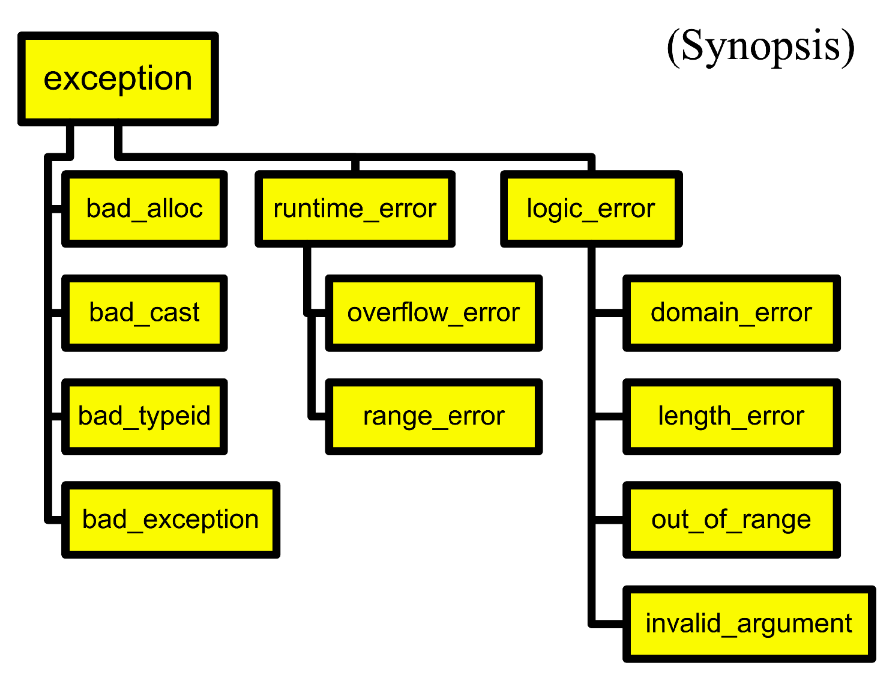

# 异常

在C++中，异常是一种机制，用于处理程序在运行时发生的错误，这些错误通常是可以预见但不可避免的。

异常处理机制允许某段程序代码在发生这类错误时，能够让调用程序或调用者得知异常发生，并采取相应的措施来处理它。

引入异常的一大显著优势在于它能简化错误处理代码。它将异常处理逻辑与实际执行的逻辑分离开来。

在C++中，异常处理机制由以下三个关键字组成：

- `try`：用于指定一个代码块，其中可能会发生异常。
- `catch`：用于指定一个代码块，用于处理异常。
- `throw`：用于抛出一个异常。

在抛出异常后，程序会自动跳转到与`throw`语句匹配的`catch`块中。`throw`语句后的任何代码都不会被执行。

我们可以定义一个异常类。例如：

```cpp
class VectorIndexError {
public:
    VectorIndexError(int v) : m_badValue(v) { }
    ~VectorIndexError() { }
    void diagnostic() {
        cerr << "index " << m_badValue
        << "out of range!";
    }
private:
    int m_badValue;
};
```

我们可以在对应的代码块中使用`throw`语句抛出这个异常。例如：

```cpp
template <class T>
T& Vector<T>::operator[](int indx) {
    if (indx < 0 || indx >= m_size) {
        // VectorIndexError e(indx);
        // throw e;
        throw VectorIndexError(indx);
    }
return m_elements[indx];
}
```

对于调用抛出异常的函数的代码块来说，对异常的处理方式有四种：

- 不关心异常，此时异常会向上传播，直到被处理。

```cpp
int func() {
    Vector<int> v(12);
    v[3] = 5;
    int i = v[42]; // out of range
    // control never gets here!
    return i * 5;
}
```

- 使用`try`和`catch`块来捕获异常，并处理它。

```cpp
void outer() {
    try {
        func();
        func2();
    } catch (VectorIndexError& e) {
        e.diagnostic();
        // This exception does not propagate
    }
    cout << "Control is here after exception";
}
```

- 使用`try`和`catch`块来捕获异常，并局部处理，同时将异常向上抛出。

```cpp
void outer2() {
    String err("exception caught");
    try {
        func();
    } catch (VectorIndexError) {
        cout << err;
        throw; // propagate the exception
    }
}
```

- 使用`try`和`catch`块来捕获异常，但不关心异常的类型。

```cpp
void outer3() {
    try {
        outer2();
    } catch (...) {
        // ... catch all exceptions
        cout << "exception caught";
    }
}
```


从上面这四种情况我们可以看出：`throw` 语句抛出异常，控制权一直回传到该异常的第一个处理程序，这种传播会沿着调用链进行。`throw exp;`用于抛出用于匹配的值，`throw;`用于重新抛出正在被处理的异常，仅在处理程序内有效。


`try`语句能框定一个代码块，此块中的代码可能抛出异常，后面跟着一个或多个`catch`语句，用于处理异常。它指明你期望在哪里处理异常。

`catch`语句用于捕获异常，它是异常处理程序，可以按类型选择异常，也可以可以重新抛出异常。  
它接受单个参数，即要捕获的异常类型。`catch (...)`用于捕获所有类型的异常。但它不能接收任何参数，因此不能捕获异常的值。  
处理程序按照出现的顺序进行检查，如果捕获的异常类型与可以处理的异常类型不匹配，程序会继续执行下一个`catch`语句，直到找到匹配的`catch`语句。若没有找到匹配的`catch`语句，异常会继续向上传递（即沿调用栈向上一层传播），直到在某个外层函数中找到匹配的处理程序，或者到达 main 函数仍未处理，最终导致程序调用 std::terminate 终止。


在定义异常时，可以使用继承来组织异常结构。
```cpp
class MathErr {
    ...
    virtual void diagnostic();
};
class OverflowErr : public MathErr { ... }
class UnderflowErr : public MathErr { ... }
class ZeroDivideErr : public MathErr { ... }
```

在c++中，有一些内置的异常类，例如`std::runtime_error`、`std::out_of_range`等。这些异常类继承自`std::exception`。



我们可以声明函数可能引发的异常类型，使用`throw`关键字。

```cpp
void func() throw (MathErr) {
    // ...
}
```

在编译时不会检查，但在运行时，若有列表之外的异常向外传播，则会引发`unexpected`异常。

```cpp
Printer::print(Document&) throw(PrinterOffLine, BadDocument) {
    // 这个函数承诺：只可能抛出 PrinterOffLine 或 BadDocument 两种异常
    // 如果抛出了其他异常，运行时会导致 unexpected 被调用
}
void goodguy() throw () {
    // 空异常规范：承诺绝不抛出任何异常
    // 如果函数体内有 throw 或调用了可能抛异常的函数，运行时仍可能抛出，
    // 但此时会触发 unexpected（编译不检查）
}

void average() {
    // 没有任何异常规范 -> 可以抛出任意类型的异常
    // 编译器不做任何限制，调用者需要自行处理可能出现的异常
}

void lala() noexcept;
    // C++11 引入的 noexcept 关键字
    // 等价于 throw()，承诺不抛出异常
    // 如果违反，程序会调用 std::terminate（而不是 unexpected）
```

异常是应用于指示错误，以下是一个不恰当的使用示例。

```cpp
try {
    for (;;) {
        p = list.next()
        // ...
    }
} catch (List::end_of_list) {
    // 在这里处理列表结束，而不是指示错误
}
```

## 构造函数的异常

构造函数也可以抛出异常，不过可能会造成严重的问题。

构造对象有两种常见的方式：`A a;`和`A *p = new A()`。

在第一种方式中，对象被存储在栈上，当对应的作用域结束时，会自动回收栈空间。若在构造函数中抛出异常，由于对象创建失败，所以对象的析构函数不会被调用。在抛出异常之前如果类的成员指针有指针赋值的操作，虽然指针本身会在作用域结束时被回收，指针所指的内存不会被回收（一般在析构函数中回收），这会导致内存泄漏。

在第二种方式中，对象被存储在堆上。若构造函数抛出异常，虽然一般来讲堆上的对象需要用`delete`释放，但C++ 标准保证在构造时抛出异常的对象自身的内存会被自动释放（不会泄漏），但构造函数内部如果手动分配了其他资源（如 new 给成员指针），则这些资源仍可能泄漏，因为析构函数不会被调用。

解决问题的方法，一是使用两阶段构造，即在构造函数中完成常规工作：初始化所有成员对象、初始化所有基本类型成员、将所有指针初始化为0、绝不请求任何资源（文件、网络连接、内存等等）。在 Init() 中完成额外的初始化工作。

二是遵守RAII（Resource Acquisition Is Initialization）原则，仅使用局部对象。在构造函数中获取外部资源，如果获取失败，在构造函数中捕获异常并记录此次失败。确保该资源不会被使用。因为对象位于栈上，因此内存处于可控状态，外部资源在析构函数中释放。

在析构函数中抛出异常同样也比较麻烦，解决方案也与上面类似，即使用两阶段析构。

## 异常的传递

我们优先通过引用来捕获异常。

通过值传递抛出/捕获异常会导致对象切片问题。

```cpp
struct X {};
struct Y : public X {};
try {
    throw Y();
} catch(X x) {
    // was it X or Y?
}
```

对象切片问题指的是：当用基类类型的变量按值接收一个派生类对象时，派生类中特有的成员会被“切掉”，只保留基类部分。在异常处理中，如果你抛出一个派生类异常对象，但用 catch (Base e) 按值捕获，那么这个派生类对象会被切片成基类对象，对象切片问题指的是：当用基类类型的变量按值接收一个派生类对象时，导致派生类中额外携带的信息丢失，且无法通过基类指针/引用调用派生类的虚函数（多态失效）。

通过指针方式抛出/捕获异常，会在正常代码与异常处理代码之间引入耦合。

```cpp
try {
    throw new Y();
} catch(Y* p) {
    // whoops, forgot to delete..
}
```

抛出指针通常指向堆上分配的对象。这意味着正常代码需要new这个异常对象，而处理代码必须在catch中负责delete它。