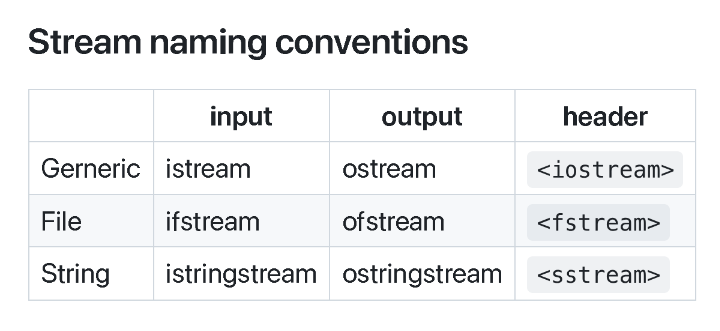
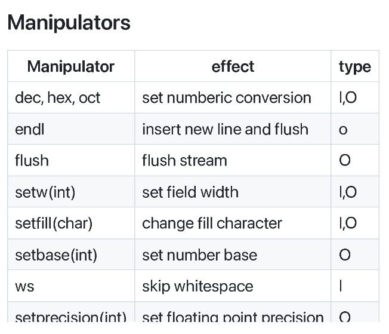
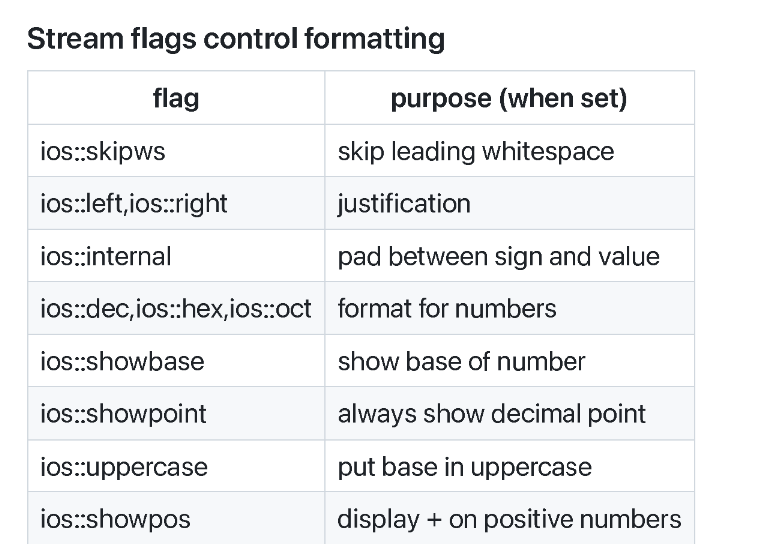
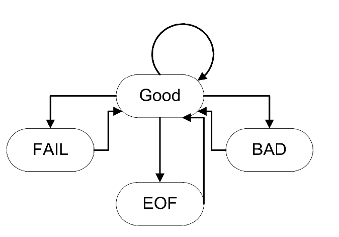
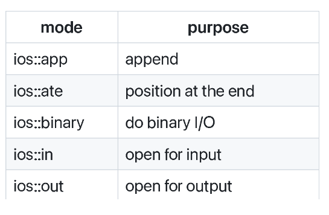

# C++的输入输出

C++的输入输出操作是通过流（stream）来实现的。流是设备的通用逻辑接口。它的最大特性是顺序性。

## 流的分类

C++定义了三种流类型：




流有两种：文本流和二进制流。

- 文本流：处理 ASCII 文本，按行组织，执行一些字符转换（例如：换行符 $\rightarrow$对应操作系统的实际文件表示）。它包括文件和字符缓冲区。

- 二进制流：处理二进制数据，不执行任何字符转换。

C++的预定义流有四种：

- `cin`：标准输入流，用于从标准输入读取数据。
- `cout`：标准输出流，用于向标准输出写入数据。
- `cerr`：标准错误流，无缓冲的错误（调试）输出。
- `clog`：标准日志流，无缓冲的错误（调试）输出。

## 流操作符

流操作最常见的有三种：

- 提取器(extractor)：从流中读取一个值。重载`>>` 运算符。
- 插入器(inserter)：向流中写入一个值。重载`<<` 运算符。
- 操纵器(manipulator)：改变流的状态。

其他输入操作符也有很多，如：

`int get()`

- `istream` 的成员函数，返回流中的下一个字符

- 如果没有字符剩余，则返回 EOF

示例：将输入复制到输出

```cpp
int ch;
while ((ch = cin.get()) != EOF)
    cout.put(ch);
```

`istream& get(char& ch)`

- 独立函数，将下一个字符放入参数中
- 类似于 `int get();`


`istream& getline (istream& is, string& str, char delim='\n')`

- 独立函数，读取一行字符串，直到遇到分隔符（默认是换行符）


`ignore(int limit = 1, int delim = EOF)`

- `istream` 的成员函数，跳过 `limit` 个字符或直到遇到分隔符
- 如果找到分隔符，则跳过该分隔符

其他输出操作符也有很多，如：

`put(char)`

- 输出一个字符

```cpp
cout.put('a');
cerr.put('!');
```

`flush()`

- 强制刷新流的内容

```cpp
cout << "Enter a number";
cout.flush();
```

操纵器用于修改流的状态，需要iomanip库来使用。

```cpp
#include <iostream>
#include <iomanip>
main() {
    cout << setprecision(2) << 1000.243 <<endl;// 输出1e03
    cout << setw(20) << "OK!";// 输出20个空格后输出OK!
    return 0;
}
```

以下是常用的操纵器：



你也可以定义自己的操纵器：

```cpp
// skeleton for an output stream manipulator
ostream& manip(ostream& out) {
    ...
    return out;
}
```

以下是一个例子：

```cpp
ostream& tab ( ostream& out ) {
    return out << '\t';
}
cout << "Hello" << tab << "World!" << endl;
```

C++定义了一些流标志位来对流进行格式化，以下是常用的流标志位：



我们可以通过使用操纵器：`setiosflags(ios::flag)` 和 `unsetiosflags(ios::flag)` 来设置和清除流标志位。也可以使用流成员函数：`setf(ios::flag)` 和 `unsetf(ios::flag)` 来设置和清除流标志位。

```cpp
#include <iostream>
#include <iomanip>
main() {
    cout. setf(ios::showpos | ios::scientific);
    cout << 123 << " " << 456.78 << endl;
    //输出 +123 +4.567800e+02
    cout << resetiosflags(ios::showpos) << 123;
    //输出 123
    return 0;
}
```

## 流的状态

流的状态有四个：GOOD、FAIL、EOF、BAD。



只有在GOOD状态下，流才能正常读取和写入数据。

可以根据以下四个函数来检查流的状态：

- `good()`：如果处于GOOD状态，返回 `true`
- `eof()` ：如果位于文件末尾，返回 `true`
- `fail()`：如果发生错误，返回 `true`
- `bad()`：如果处于BAD状态，返回 `true`

`clear()` 可以重置流的状态为GOOD。

以下是一个例子：

```cpp
int n;
cout << "Enter a value for n, then [Enter]" << flush;

while (cin.good()) {
    cin >> n;
    if (cin) { // input was ok
        cin.ignore(INT_MAX, '\n'); // flush newline
        break;
    }
    if (cin.fail()) {
        cin.clear(); // clear the error state
        cin.ignore(INT_MAX, '\n'); // skip garbage
        cout << "No good, try again!" << flush;
    }
}
```

## 文件流


`ifstream`、`ofstream` 用于将文件连接到流


打开模式用于指定如何创建文件，以下是常用的打开模式：



还有一些更多的流操作：

- `open(const char *, int flags, int)`：打开文件

```cpp
ifstream inputS;
inputS.open("somefile", ios::in);
if (!inputS) {
    cerr << "Unable to open somefile";
    ...
}
```

- `close()`：关闭文件

## IO 流缓冲区

- 每个 IO 流都有一个流缓冲区
- `streambuf` 类定义了缓冲区抽象
- 成员函数 `rdbuf()` 返回指向流缓冲区的指针
- `<<` 操作针对 streambuf 进行了重载，它可以直接连接缓冲区。

以下是拷贝一个文件到标准输出的例子：

```cpp
#include <fstream>
#include <assert>
main(int argc, char *argv[]) {
    assert(argc == 2);
    ifstream in(argv[1]);
    assert(in); // check that stream opened
    cout << in.rdbuf(); // Drain file!
}
```