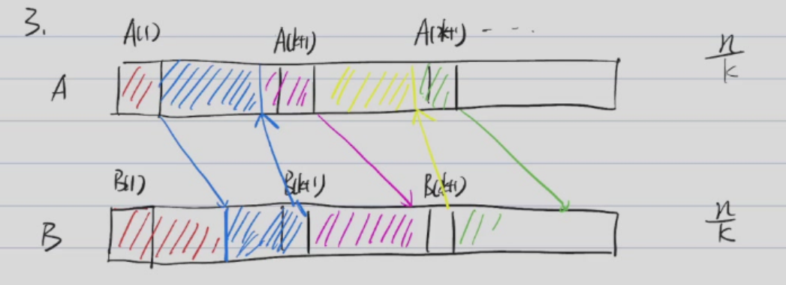

# 并行算法
## 求和
给定$n$个数$a_1,a_2,\cdots,a_n$，求它们的和。

并行算法：并行计算每两个数的和，然后递归地再并行计算每两个的和，直到得出最终结果。


$T_p(n)$表示在p个处理器上并行计算求和的时间复杂度。则有：$T_1(n)=O(n)$，$T_\infty(n)=O(\log n)$。

对于任意的$T_p(n)$，我们可以得到$T_p(n)\geq T_\infty(n)$且$T_p(n)\geq T_1(n)/p$，则我们可以得到
$$
T_p(n)\geq \frac{1}{2}(T_1(n)/p+T_\infty(n))
$$
又由Brent定理（证明见:浙江大学 高级数据结构与算法分析 毛宇尘 2025-12-16第6-8节），$T_p(n)\leq T_1(n)/p+T_\infty(n)$，所以
$$
T_p(n)=\Theta(T_1(n)/p+T_\infty(n))
$$

由以上分析一个并行算法的时间复杂度与$T_1(n)$和$T_\infty(n)$有关。

其中$T_1(n)$可以表示为$W(n)$，$T_\infty(n)$可以表示为$D(n)$。

## Prefix Sum
给定$n$个数$a_1,a_2,\cdots,a_n$，求它们的所有前缀和$s_i=a_1+a_2+\cdots+a_i$。

若串行解决问题：$W(n)=O(n)$且$D(n)=O(n)$（没有用到多核）。

若对每个前缀和同时进行计算，每个前缀和的求解方式采用求和的并行算法，则：$W(n)=O(n^2)$且$D(n)=O(\log n)$。

我们可以再对这个并行算法进行简化。使得$W(n)=O(n)$且$D(n)=O(\log n)$。（见:浙江大学 高级数据结构与算法分析 毛宇尘 2025-12-16第6-8节）

## 并行排序
给定$n$个数$a_1,a_2,\cdots,a_n$，对它们进行排序。

若把元素集合划分为两个子集，并行计算两个子集的排序，这两个子集的排序也可以划分并并行计算，排序完成后再合并。我们可以把这个并行算法分为三个阶段：划分、排序、合并。

- 划分：$W(n)=O(1)$，$D(n)=O(1)$
- 排序：$W(n)=2W(n/2)$，$D(n)=D(n/2)$
- 合并：$W(n)=O(n)$，$D(n)=O(n)$

可以解得：$W(n)=O(n\log n)$，$D(n)=O(n)$。

我们可以发现这个并行算法主要的时间限制在于两个集合合并的时候是串行计算的，因此并行算法的效率并不高。

给定两个以及排序的序列$A$和$B$，我们定义$rank(i,B) \quad i \in A$为$B$中小于等于$A_i$的元素个数，同理，$rank(j,A) \quad j \in B$为$A$中小于等于$B_j$的元素个数。设我们要将$A$和$B$合并成一个序列$C$，如果我们得知$rank(i,A)$和$rank(i,B)$，那么对于$A$中的每一个元素$i$，我们可以确定它在$C$中的位置，即$C[i+rank(i,B)]=A[i]$，对于$B$中的每一个元素$j$，我们也可以确定它在$C$中的位置，即$C[j+rank(j,A)]=B[j]$，而这件事情是可以并行去做的，即$D(n)=O(1)$。

于是我们将上述优化转变成如何高效求解$rank(j,A)$和$rank(i,B)$的问题。

对于ranking问题，我们可以串行求解：
```
if A[i] < B[j]:
    rank(i,B)=j
    i++
if A[i] > B[j]:
    rank(j,A)=i
    j++
```

这样求解的话$W(n)=O(n)$，$D(n)=O(n)$。

另一种更高效的思路是binary search。$W(n)=O(n\log n)$，$D(n)=O(\log n)$。

我们能不能保证在$W(n)$不增的情况下，使得$D(n)$达到$O(log n)$呢？我们可以考虑下面的算法：

- 首先从$A$中选出$A[1],A[k+1],\cdots,A[nk+1]$共$n/k$个元素，再从$B$中选出$B[1],B[k+1],\cdots,B[nk+1]$共$n/k$个元素，并用binary search求出这些元素的$rank(i,A)$和$rank(j,B)$。这一步的总工作量为$W_1=O(n\log n/k)$且$D_1=O(\log n)$。
- 我们可以通过这几个元素将两个序列划分成$n/k$个子部分（如下图所示），我们只需要知道这些子部分的两个序列元素的相对排序，我们就可以知道在整个序列中这些元素的排序，即可以求解$rank(i,A)$和$rank(j,B)$。



- 每个子部分最多有$2k$个元素，通过binarysearch把这些部分元素之间的相对rank求出，这个过程：$W_2=O(k)\cdot O(n/k)=O(n)$且$D_2=O(k)$
- 使得$k=log n$，这个算法的总工作量为$W(n)=O(n+n\log n/k)=O(n)$且总深度为$D(n)=O(\log n+k)=O(\log n)$。

通过上述过程，我们可以得到并行排序的合并一步$D(n)$可以优化为$O(\log n)$。则总体的$D(n)$为$O(\log^2 n)$。  
通过进一步优化，我们可以使$D(n)=O(\log n)$。

## Maximum finding
给定$n$个数$a_1,a_2,\cdots,a_n$，求其中最大的数。

串行算法：$W(n)=O(n)$，$D(n)=O(n)$

binary tree: $W(n)=O(n)$，$D(n)=O(\log n)$

除了上述两种方法，我们可以通过两两比较的方式求解，我们构造另一个集合$B:b_1,b_2,\cdots,b_n$，然后执行下列算法：
```
for 1<=i<=n:
    B[i]=0
for every pair (i,j) with 1<=i<=j<=n:
    if A[i] < A[j]:
        B[i]=1
    else if A[i] > A[j]:
        B[j]=1
for 1<=i<=n:
    if B[i]==0:
        return A[i]
```
这个算法$W(n)=O(n^2)$，$D(n)=O(1)$

我们也可以通过divide and conquer的方法，将集合A分成$\sqrt{n}$个子集，递归地并行计算每个子集的最大值，一共有$\sqrt{n}$个最大值，再通过并行地两两比较的方式求出最终结果。  
这个算法$W(n)=\sqrt{n}W(\sqrt{n})+O(\sqrt{n}^2)$，求得$W(n)=O(n\log \log n)$。  
$D(n)=D(\sqrt{n})+O(1)$，求得$D(n)=O(\log \log n)$。

我们还可以在此基础上继续优化，我们将集合A分成$k$个子集，每个子集包含$n/k$个元素，我们串行求解每个子集的最大值。$W_1=O(n/k)*k=O(n)$，$D_1=O(n/k)$。  
然后我们通过divide and conquer求出这$k$个最大值的最大值。则$W_2=O(k\log\log k)$，$D_2=O(\log\log k)$。  
令$k=\frac{n}{\log \log n}$，则$W(n)=O(n)$，$D(n)=O(\log \log n)$。

如果还需要进一步优化，我们可以引入随机算法，使得$W(n)=O(n)$且$D(n)=O(1)$。

首先我们证明一个子过程的$W(n)$和$D(n)$分别为$O(n)$和$O(1)$。即找到$n^{\frac{7}{8}}$的最大值。

我们将这$n^{\frac{7}{8}}$分成$n^{\frac{3}{4}}$组，每一组有$n^{\frac{1}{8}}$个元素。通过并行两两比较得到这$n^{\frac{3}{4}}$组的最大值，则$W_1=O((n^{\frac{1}{8}})^2*n^{\frac{3}{4}})=O(n)$且$D_1=O(1)$。作完这一步之后，我们会得到$n^{\frac{3}{4}}$个最大值，我们再将这$n^{\frac{3}{4}}$个最大值分成$n^{\frac{1}{2}}$组，每一组有$n^{\frac{1}{4}}$个元素。通过并行两两比较得到这$n^{\frac{1}{4}}$组的最大值，则$W_2=O((n^{\frac{1}{4}})^2*n^{\frac{1}{2}})=O(n)$且$D_2=O(1)$。做完这一步之后，我们会得到$n^{\frac{1}{2}}$个最大值，我们对这$n^{\frac{1}{2}}$个最大值进行两两比较，$W_3=O((n^{\frac{1}{2}})^2)=O(n)$且$D_3=O(1)$。

综上所述，$W(n)=O(n)$且$D(n)=O(1)$。

我们建立一个$n^{\frac{7}{8}}$大小的数组$B$，并将$A$中的随机的$n^{\frac{7}{8}}$个元素放入$B$中。得到$B$的$W_1=O(n)$且$D_1=O(1)$（可以对每个位置上的元素并行随机挑选），调用上述我们讨论的子过程，$W_2=O(n)$且$D_2=O(1)$。

通过上述过程，我们可以求出$B$中的最大值$m$。但其不一定是$A$中的最大值。

我们假设$A$中有至少$\sqrt{n}$个元素比$m$要大，这种情况发生的概率为$(1-\frac{\sqrt{n}}{n})^{n^{\frac{7}{8}}}\leq e^{-\frac{n^{\frac{7}{8}}}{\sqrt{n}}}=e^{-n^{\frac{3}{8}}}\leq \frac{1}{n^2}$，当$n$较大时，这个概率是很小的。

我们建一个数组$B'$，$B'$的大小为$n^{\frac{7}{8}}$，让$A$中的数并行的与$m$比较，若其比$m$大，就随机放入$B'$中的任意位置。若某两个数同时放入同一位置（并行），则让它们同时写入（可能后值会覆盖前值），求$B'$的最大值$m'$，即可。

我们求当$A$中有小于$\sqrt{n}$个元素比$m$要大时，$m'$是$A$中的最大值的概率。$m'$不是$A$中最大值当且仅当在并行写入时冲突被覆盖，这种情况产生的概率$P \leq \frac{1}{n^{\frac{7}{8}}} \cdot \sqrt{n}=\frac{1}{n^{\frac{3}{8}}}$，这也是一个很小的概率。

综上所述，通过这个算法，我们可以以很高的概率求出$A$中的最大值。且$W(n)=O(n)$且$D(n)=O(1)$。

