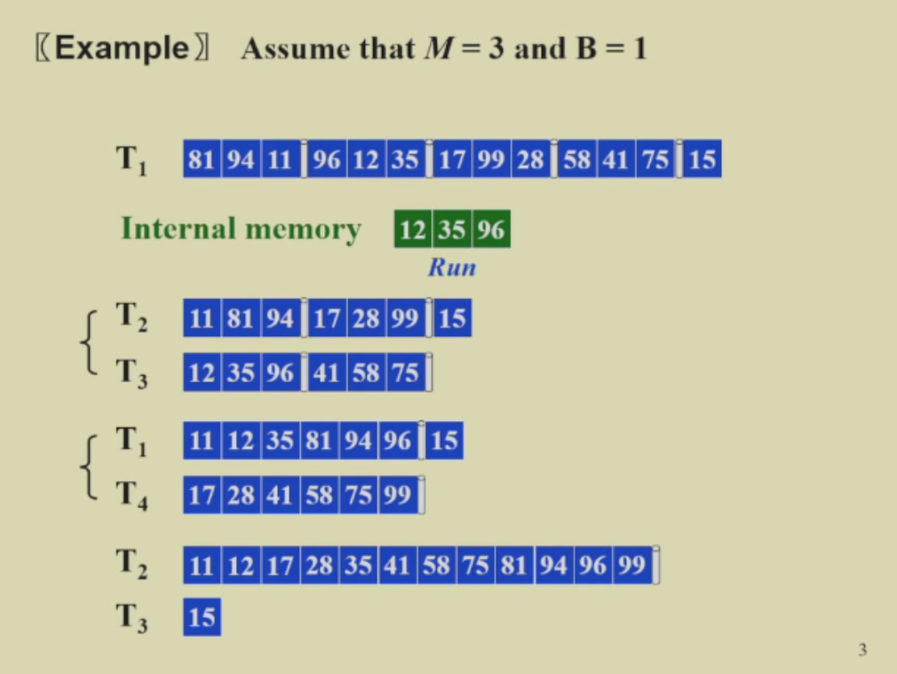
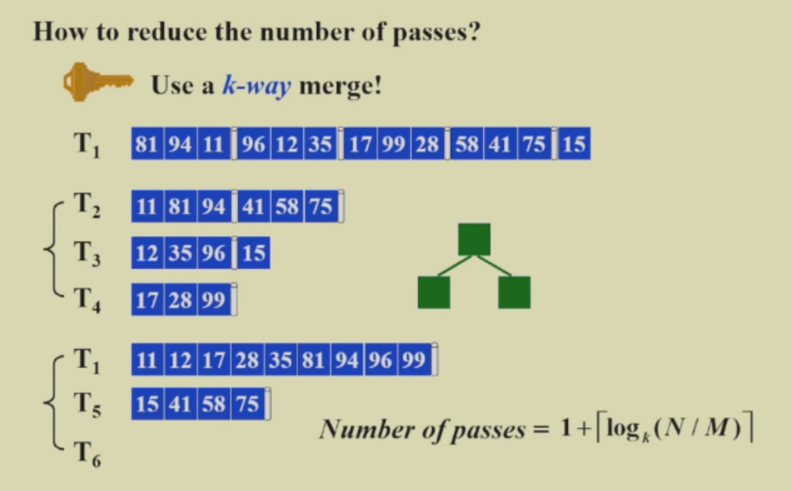

# 外部排序
## 外部内存模型
考虑一个模型，它利用外部存储器（如磁盘）来存储输入数据，我们假定外部存储器的容量远大于内存容量。内存有$M$个存储单元。输入数据$N$初始存储在外部存储器中（$N>>M$）。每次输入数据都需要从外部存储器中读入或输出内存，每次读入或输出的大小为$B$个存储单元，我们把这个操作成为一次I/O操作。

外部存储器若为磁盘，则它由多个磁带组成，每条磁带只能顺序读取或写入，不能随机访问。

我们主要关注两项指标：number of passes（每个输入数据在处理时需要经过多少次I/O操作），以及I/O cost（I/O操作的总次数）。

### 扫描操作(scan)
扫描操作是指将输入数据从外部存储器读入内存并查看。

- number of passes：1
- I/O cost：$N/B$

### 排序操作(sort)

- number of passes：$1+\log_2(N/M)$
- I/O cost：$\frac{2N}{B}(1+\log_2(N/M))=O(\frac{N}{B}\log_2 (N/M))$

用k条磁带来做k_way merge：polyphase merge。（具体讨论见:浙江大学 高级数据结构与算法分析 毛宇尘 2025-12-23第6-8节）