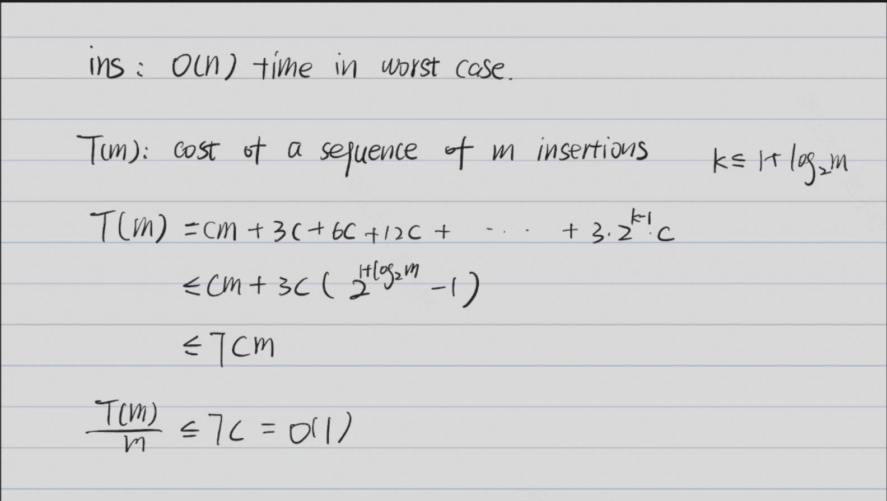
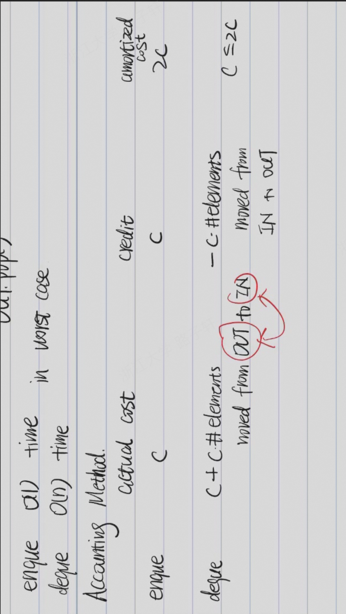
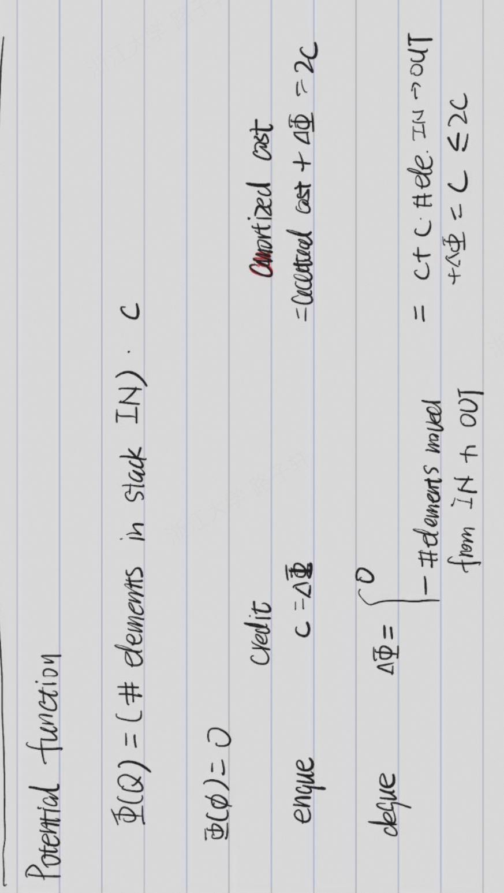

# 摊还分析(amortize analysis)
摊还分析是求一个操作序列所执行操作的平均时间。有三种常用的分析技术：

- 聚合分析：对于所有的$n$，执行一个$n$操作序列的最坏情况花费的总时间为$T(n)$,则每个操作的平均时间为$T(n)/n$。
- 核算法：用核算法进行摊还分析时， 对不同的操作赋予不同的费用， 对于某些操作的费用可能大于其实际操作的代价。我们将赋予一个操作的费用称为它的摊还代价。当操作的摊还代价大于实际的代价时，将差额存入数据结构的特定对象中，存入的差额就称为信用。对于后面的摊还代价小于实际代价的情况，信用可以用来支付差额。因此可以将摊还代价分为实际操作的代价和信用。这些摊还代价对于不同的操作其赋予的值可能是不同的（不涉及数据结构的改变），这区别于聚合分析。如果我们想用核算法的摊还代价来证明每个操作的平均代价的最坏去情况可能很小，就必须确保摊还代价大于实际代价的上界，也就是信用必须为非负值。
- 势能法：势能法是一种基于核算法的摊还分析方法，它将预付代价与整个数据结构相关（不同对象的同一操作代价可能不同），这种表示称为势能，将势能释放即可用来支付未来操作的代价。 势能法工作方式：假设对于一个初始的数据结构$D_0$执行$n$个操作。对每个$i = 0, 1, 2, 3,.....,n-1, n$， 令$c_i$为第i个操作的实际代价， 令$D_i$为在数据结构$D_{i-1}$上执行$i$操作得到的数据结构。势函数$φ$将每个数据结构$D_i$映射为一个实数值$φ(D_i)$, 这个实数值关联到数据结构$D_i$的势，第$i$个操作的摊还代价定义为：
$$
c_i + φ(D_i) - φ(D_{i-1})
$$
  因此每个操作的摊还代价等于实际代价加上此操作引起的势能变化
## 聚合分析——动态数组
- 插入操作
  - 判断数组是否已被填满（初始为1）
  - 若已被填满则创建一个大小为原来两倍的数组
  - 将原数组的元素复制到新数组中
  - 插入新元素
- 对此插入操作的摊还分析如下
 

## 核算法/势能法——双栈队列
- 双栈队列有两个栈，一个入栈和一个出栈。
- 入队操作：压入入栈中。
- 出队操作：若出栈非空，则弹出出栈的元素；若出栈为空，则将入栈中的元素全部弹出到出栈中，再弹出出栈的元素。
- 入队操作的最坏时间复杂度为O(1)，出队操作的最坏时间复杂度为O(n)。
- 双栈队列的均摊分析如下（需要引入credit）：

- `amortized cost = actual cost + credit`
- 也可以引入势函数来表示credit的变化

## 对splay树操作的摊还分析
（证明见:浙江大学 高级数据结构与算法分析 毛宇尘 2025-09-28第6-8节）
## 搜索的评估
### 召回率和准确率
- 召回率(recall)是指检索出所有相关文档的能力，准确率(precision)是指检索出的相关文档中真正相关文档的能力。
- 召回率和准确率的定义：
  - 召回率($R$) = 正确检索出的文档数 / 所有相关文档数    ($0 ≤ R ≤ 1$)
  - 准确率($P$) = 正确检索出的文档数 / 所有检索出的文档数 ($0 ≤ P ≤ 1$)    