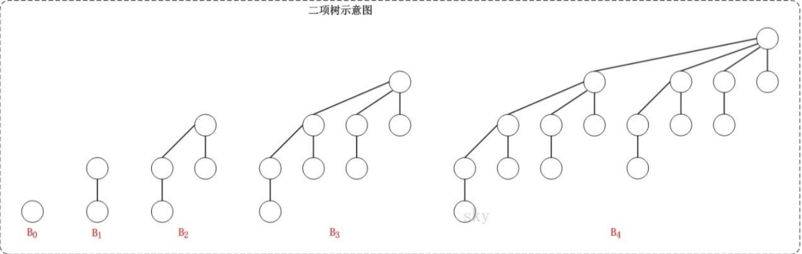
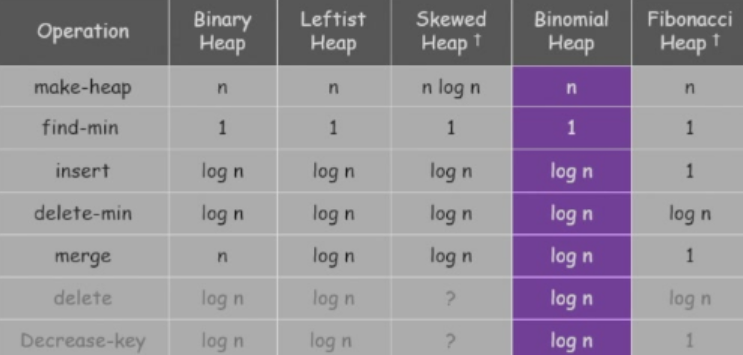

# 堆
## 左倾堆/左式堆
### 性质
- 满足最小堆的性质，即每个节点的值都小于或等于其子节点的值
- null path length(npl(u))：从u节点向下到null节点的最短路径长度
- 左倾堆满足：npl(u.left)>=npl(u.right)
- 定理：对于一个有n个节点的左倾堆，从根节点到null节点的右路径（一直走右节点）上的节点数m满足$m<=log_2(n+1)$
### 堆的合并
- 若其中一个堆为空，则返回另一个堆
- 比较两个堆的根节点值，将根较小的堆保留为结果堆，递归合并其右子树与另一堆
- 将合并结果设为该堆的右子树
- 若此时左子树的Npl小于右子树，交换左右子树
- 更新当前节点的Npl值
- 合并操作是沿着右路径进行的，那么左式堆的合并操作的时间复杂度为O(logN)
### 插入
- 插入操作等价于将一个单节点堆与原堆执行合并操作
- 插入操作的时间复杂度也是O(logN)
### 删除最小元
- 找到根节点删除
- 将右子树与左子树合并即可
- 合并操作的时间复杂度也是O(logN)
### 删除
- 删除操作只会对从根节点到删除节点路径上的点产生影响。
- 先删除此节点，将其左右子树保留
- 从下向上对路径上的节点进行修复
- 当路径上的点为其父节点的右子节点，更新此节点和父节点的npl即可，继续递归向上
- 当路径上的点u为其父节点v的左子节点，设v的右子节点为m
    - 若npl(u)<npl(m)，将v的左右子树互换，更新npl(v)，继续递归向上
    - 若npl(u)>npl(m)，对上面的节点将不会产生影响，则停止修复操作。
- 将修复后的左式堆和删除节点的左右子树合并即可。
- 易证删除操作的时间复杂度也是O(logN)
### 建堆
- 直接构造传统的最小堆即可，时间复杂度为O(n)。
## 斜堆
### 合并
- 若其中一个堆为空，则返回另一个堆
- 比较两个堆的根节点值，将根较小的堆保留为结果堆，递归合并其右子树与另一堆
- 将合并结果设为该堆的左子树
### 插入
- 插入操作等价于将一个单节点堆与原堆执行合并操作
### 删除最小元
- 找到根节点删除
- 将左子树与右子树合并即可
### 删除
- 斜堆不支持删除操作
### 插入操作的摊还分析
- 给定堆中任意节点，如果其右子树节点的数量，大于其子树节点数量的一半，我们说这个节点是heavy的，否则为light的。
- 则定义斜堆的势函数为：f(H)=(the number of heavy nodes in H)*C，其中C为常数。f(H)满足非负性。
- 设合并前两个堆右路径的轻节点数和重节点数一共为a和b，合并操作的实际代价为：O(1)*互换操作的数目(a+b)*C。
- 势函数变化分析：由于合并操作：重节点的右子树节点数增加，变得更重，但又由于合并后左右子树互换，导致重节点变轻节点，则势函数变化了-b，而轻节点可能会变重，则势函数的变化小于等于(-b+a)*C。
- 均摊费用则小于等于2aC，小于等于O(a)，小于等于O(logN)。
## 二项堆
### 二项树
二项树是一种递归定义的有序树，其递归定义如下：
- 二项树B0只有一个节点；
- 二项树Bk由两颗二项树Bk−1组成，其中一棵树是另一棵树的根的最左儿子（或最右儿子）。

#### 性质
- 二项树Bk的高度为$k$
- 二项树Bk的节点数为$2^k$
- 二项树Bk深度为d的节点数为$\binom{k}{d}$
### 定义
- 二项堆是二项树组成的森林，且每个二项树都是不同类型的，每个二项树都满足最小（最大）堆的性质。
- 对于一个有n个节点的二项堆，它将有不多于$log_2n$棵树，且树的类型与n的二进制位一一对应，如$n=13=(1101)_2$，则该二项堆有$B_3,B_2,B_0$三棵树。
### 操作
- 与二进制的操作类似进行合并插入删除操作即可。
## 各种堆的时间复杂度比较
