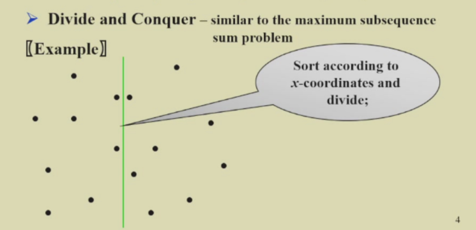
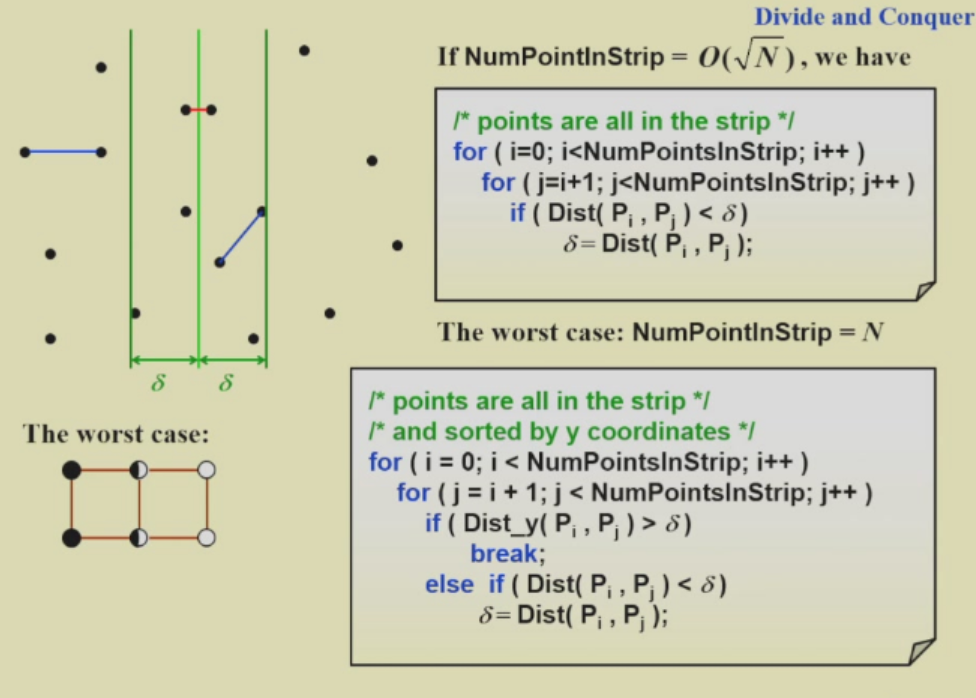
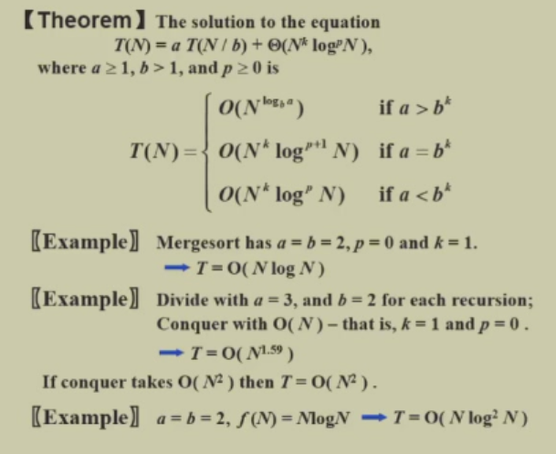
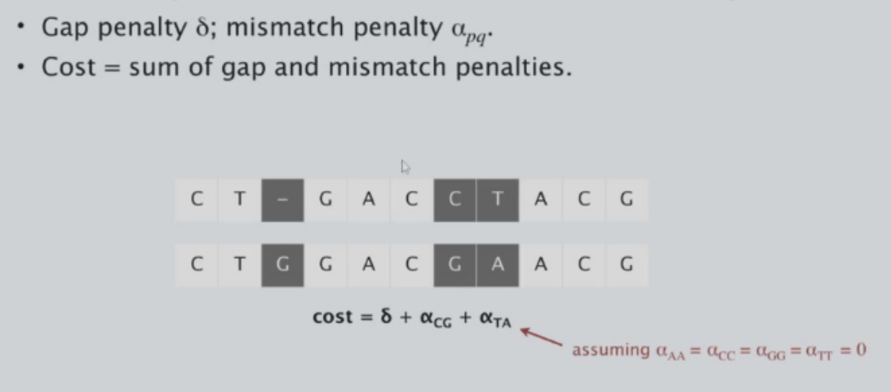

# 基本算法（回溯、分治、动态规划）
## 回溯
### 基本概念
- 回溯算法（Backtracking）是一种深度优先搜索（DFS）算法，它在搜索树的每个节点处扩展，直到找到解或达到搜索树的底部。
- 回溯算法的基本思想是：从根节点开始，尝试所有可能的路径。如果路径不行，就退回到上一个节点，并在当前节点的不同分支中选择另一条路径。
### 应用
- 八皇后问题
- Turnpike 问题
- $\alpha-\beta$ 剪枝算法（见人工智能导论）
## 分治算法
### 基本概念
- 分治算法（Divide and Conquer）是一种递归算法，它将一个大问题分解成两个或更多的小问题，递归地解决这些小问题，然后再合并这些子问题的解来产生原问题的解。
### 应用
- 归并排序
- 计算逆序对的数量（类似归并排序）
- 最近点问题：给定平面上的N个点，找出最近的点对。（如果两个点位置相同，则这对点的距离为0，即为最近点对。）




### Master Theorem 主定理
已知$T(n)=aT(n/b)+n^c$，求时间复杂度

- 如果$\frac{a}{b^c}=1$，$T(n)=O(n^c log_{b}n)$
- 如果$\frac{a}{b^c}>1$，$T(n)=O(n^{log_{b}a})$
- 如果$\frac{a}{b^c}<1$，$T(n)=O(n^c)$

Master Theorem 主定理适合求解形如$T(N)=aT(N/b)+f(N)$的递归式算法的时间复杂度。

若存在常数$k<1$使得 $af(N/b)= kf(N)$，则 
$$
T(N)=O(f(N))
$$
如果存在常数$K>1$使得$af(N/b)=Kf(N)$，则
$$
T(N)=Θ(N^{log_ba})
$$
如果$af(N/b)=f(N)$，则
$$
T(N)=Θ(f(N)log_bN)
$$

## 动态规划
### 基本概念
- 动态规划也就是记忆化搜索。
- 动态规划的基本思想是：将复杂问题递归分解成子问题，并利用子问题的解来递推求解原问题。
- 动态规划的关键是定义子问题的重叠性。且要注意子问题的最优子结构性质。
### 应用
- 矩阵乘法的排序
- 选择二叉搜索树
- Subset Sum问题(0-1背包问题的简化版)
#### 0/1 背包问题
>参考资料：https://blog.csdn.net/SydneyCarton_/article/details/115979205

给定背包的承重$W$，一堆物品的重量$weights[ ]$和价值$values[ ]$，求背包能装入物品的最大总$value$

定义一个二维数组 $dp[物品总数][承重+1]$ 存储当前$value$，其中 $dp[i][j]$ 表示：从前 $i$ 件物品中找出一些放入背包，在总重不超过承重$j$的情况下，能达到的最大$value$。
第 $i$ 件物品重量为 $weight[i]$，价值为 $value[i]$，根据第 $i$ 件物品是否添加到背包中，可以分两种情况讨论：

① 第 $i$ 件物品的重量超过背包承重，即 $weight[i] > j$。此时就算拿出背包中的所有物品也无法放下，所以它不可能被放入背包，因此有：$dp[i][j] = dp[i-1][j]$

② 第 $i$ 件物品可以添加到背包中（可能拿出一些已有物品）。此时也可以有放入与不放入两种情况，应取$value$更大的那种。

（2.1）若不放入，有：$dp[i][j] = dp[i-1][j]$

（2.2）若放入，情况变为从某个状态下加入第$i$件物品并达到$dp[i][j]$结果，可知前一状态时的背包承重应为 $j-weight[i]$。因此有：$dp[i][j] = dp[i-1][ j-weight[i] ] + value[i]$。

综上，递推式为：
``` c
   dp[i][j] = max( dp[i-1][j], max( dp[i-1][ j-weight[i] ] + value[i], dp[i-1][j] ) );
即 dp[i][j] = max( dp[i-1][ j-weight[i] ] + value[i], dp[i-1][j] );
```
dp数组的一维简化：
可以看到不管第 $i$ 件物品有没有加到背包中，新一轮 $i$ 下的$dp$值都只由 $i-1$ 决定，并且这种决定对于 $j$ 是单方向的（即较大的 $j$ 处的值只和较小或相同的 $j$ 的值有关），因此若 $j$ 从$W \rightarrow 0$ 递减，$dp$的数组可以依次覆盖。

完整代码
``` c
int* dp = (int*)malloc((W+1)*sizeof(int));
for (int i = 0; i <= W; i++) dp[i] = 0;

for (int i = 0; i <= n; i++) { 			// n = 物品数
	for (int j = W; j >= 1; j--) { 		// 逆序遍历
		if (j >= weights[i]) {
			dp[j] = max(dp[j], dp[ j-weights[i] ] + values[i] );
		}
	}
}
return dp[W];
```
#### Maximum Subarray Problem 最大子数组问题
给定$n$个整数$a_1,a_2,...,a_n$，按顺序排列，从中挑出连续的子序列，使得子序列的和最大。

定义$OPT[j]$为以$a_j$结尾的最大子序列和，则有：
$$
OPT[j] = max(OPT[j-1]+a_j, a_j)
$$
其中$OPT[0]$=0。

因此，$OPT[j]$的最大值即为所求解。

#### 字符串对齐问题
目标：给定两个字符串 $x_1, x_2, \ldots, x_m$ 和 $y_1, y_2, \ldots, y_n$ ，找到一个最小成本的对齐。  

对齐：一个对齐  $M$  是一组有序对 $x_i - y_j$ ，使得每个字符最多出现在一个配对中，且不存在交叉。  

对齐 $M$ 的成本为：  

$$
\text{cost}(M) = \sum_{(x_i, y_j) \in M} \alpha_{x_i, y_j}+\sum_{i:x_i \text{ unmatched}}\delta+ \sum_{j:y_j \text{ unmatched}}\delta
$$

其中 $\alpha_{x_i, y_j}$ 表示 $x_i$ 和 $y_j$ 错误匹配的代价，$\delta$ 表示对应空格的代价。



我们定义$OPT[i][j]$为$x_1,x_2,...,x_i$和$y_1,y_2,...,y_j$的最小成本对齐。则有：
$$
OPT[0][j]=j\delta,OPT[i][0]=i\delta
$$

$$
OPT[i][j]=\min\left\{OPT[i-1][j-1]+\alpha_{x_i,y_j},OPT[i-1][j]+\delta,OPT[i][j-1]+\delta\right\}
$$

易证：动态规划解决这个问题需要$O(mn)$的时间复杂度和空间复杂度。

定理：存在一种算法使得解决这个问题需要$O(nm)$的时间复杂度和$O(n+m)$的空间复杂度。[Hirschberg 算法]