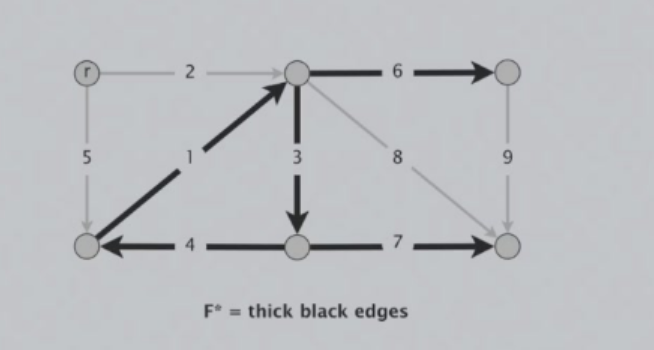
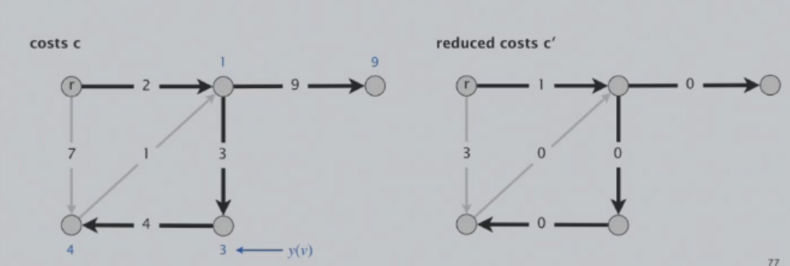
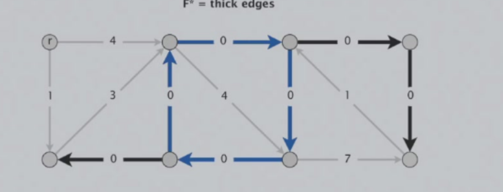
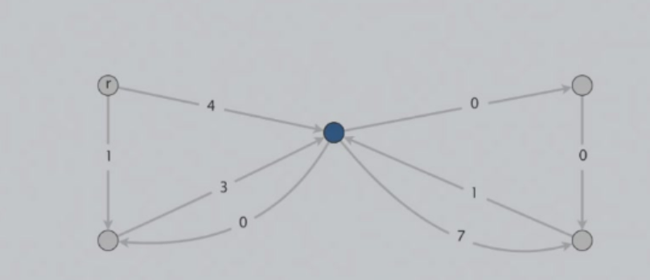
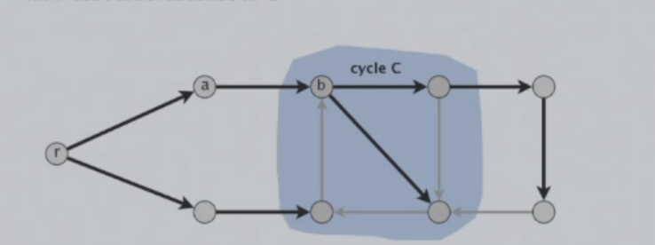
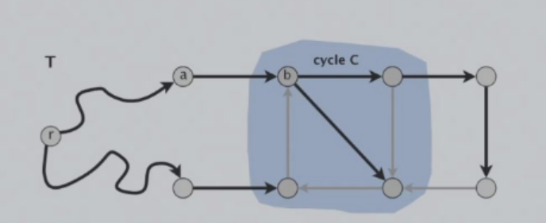
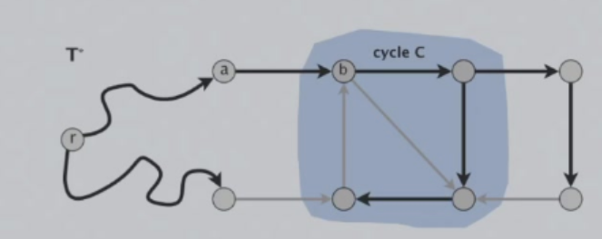

# 贪心算法
贪心算法是指，在对问题求解时，总是做出在当前看来是最好的选择。也就是说，不从整体最优上加以考虑，他所做出的是在某种意义上的局部最优解。贪心算法的关键在于如何做出当前看来是最优的选择。
## 具体问题
### LPT 问题
给定一组任务，每个任务完成都需要一定的时间，每个任务都有自己的完工时间，即完成该任务的时间加上前置任务的完成时间。如何安排这些任务，使得所有任务的完工时间之和最短？

贪心策略：按照完成任务的时间从小到大排序
### activity selection problem
给定一组活动，每个活动都有一个开始时间和结束时间，如何选择一组活动，使得参与的活动最多且不相互冲突？

贪心策略：按照结束时间从小到大排序，选择结束时间最早的活动，并排除与该活动冲突的活动。

### 哈夫曼编码
哈夫曼编码是一种数据压缩技术，它利用了一种叫做最优二叉树的编码结构。给定一组字符及其出现频率，哈夫曼编码的过程就是构造一棵二叉树，使得树的带权路径长度（WPL）或树的编码长度（CL）达到最小。
每个概率对应一个节点（树），先按出现的概率大小排队，把两个最小的概率合并成树，这棵树的根节点就是这两个概率的和。把这棵树和剩余的概率重新排队，再把最小的两个概率相加，再重新排队，直到最后变成1，最后得到的树就是哈夫曼树。
#### 实现
- 最小堆：O(nlogn)
- 双队列（频率已经排好序）：一个队列存放初始的节点，一个队列存放合并的节点。每次取出两个队列中最小的两个节点，合并后排入存放合并节点队列的末尾。直到最后只剩下一个节点，即为哈夫曼树。O(n)
### 最小有向树
有向树：一个有向图的子图满足两个条件：1. 它没有有向回环；2.每个顶点入度为一（根节点除外），那么这个子图就是这个有向图的一颗有向树。
对于一个加权图，找到其最小有向树（边之和最小）。

贪心策略：对于每个节点，选择指向此节点的边中，权值最小的那条边，若这些边恰好不构成有向回环，那么这些边就能构成最小有向树。  
若出现回环（如下图所示）

我们先将权值简化，将指向每个节点边的权值都减去指向该节点边的最小权值，使得指向每个节点边的最小权值都等于0，这样不会改变最优解的结构。

对于回环，回环上的边权值均为0（均为最小边）

由于权值为0的特殊性，我们可以将这个回环上的点视为一个节点，再对新树递归的去找最小有向树即可。

但是，这样会导致一个问题，即若最优解有两条边指向回环上的点，这种情况可能会被忽略.

我们可以证明，这种情况可以改造为只有一条边指向回环上的点的解且总权值不会增加。

## 验证贪心算法的最优性
Exchange argument:对于给定的任意解，若都可以通过一定的变化，使得其变为贪心解，且该贪心解的代价小于等于原来的解，则可以证明该贪心算法是最优的。