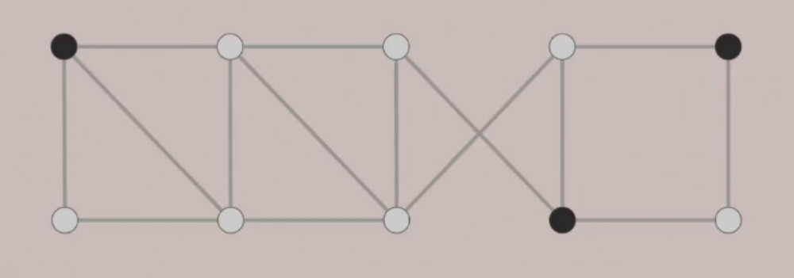

# P与NP
## 停机问题
停机问题就是判断任意一个程序是否会在有限的时间之内结束运行的问题。该问题等价于如下的判定问题：给定一个程序P和输入w, 程序P在输入w下是否能够最终停止。
这个问题的结论是一个可以解决停机问题的通用算法是不存在的。

证明如下：
设停机问题有解，即：存在过程H(P, I)可以给出程序P在输入I的情况下是否可停机。假设若P在输入I时可停机，H输出“停机”，反之输出“死循环”（就是一直在运行）。

再设有一个过程K(P)可以给出在某个输入P下K是否可以停机。
伪代码如下：
```
int H(procedure,Input); // 这里的H函数有两种返回值，死循环(1) 或 停机(0)
int K(P)
{
    if (H(P,P) == 1){//如果P死循环
        return 0; //这里会停机
    }else{//如果P停机
        while(1){} // 这里会死循环
    }
}
```
现在假设H的输入为K，则H变为H(K,K)，K的输入为它自己，即K(K)。
假设H(K,K)==1，即如果输入K时程序K一直运行，则返回0，表示K停机，产生矛盾。
假设H(K,k)!=1，即如果输入K时程序K停机，则执行死循环，表示K一直运行，产生矛盾。
证明完毕，也就是说如果存在H(P,I)则会产生上述悖论，所以不存在解决停机问题的方法。


>版权声明：本文为CSDN博主「touche001」的原创文章，遵循CC 4.0 BY-SA版权协议，转载请附上原文出处链接及本声明。
原文链接：https://blog.csdn.net/u013361114/article/details/24981173

## P问题
根据解决问题的复杂度，我们可以把问题分为两类：

- 容易解决的问题：指那些可以在多项式时间内解决的问题。
- 困难问题：指那些难以在多项式时间内解决的问题。
  
P问题就是指那些可以在多项式时间内解决的问题。
## 归约（reduction）
存在x,y两个问题，x可在多项式时间内归约到y，当且仅当我们可以通过  
（1）多项式个标准计算  
（2）对能解决y问题的黑盒进行多项式次调用  
来解决x，记为$x \leq_p y$。

**若y是P问题，则x是P问题；若x不可在多项式时间内解决，则y也不可在多项式时间内解决**

### 独立集和顶点覆盖
顶点覆盖（VC）：给定图G和整数k，是否存在k个顶点，使得G中每条边都至少有一个端点在这k个顶点中？
独立集（IS）：给定图G和整数k，是否存在k个顶点，使得这k个顶点中任意两个都不相邻？

S是一个独立集当且仅当V/S是顶点覆盖



顶点覆盖（VC）和独立集（IS）可双向多项式归约，即$VC \equiv_p IS$。

### 汉密尔顿圈和旅行商问题
汉密尔顿圈（HC）：给定一张图，是否存在一个经过所有顶点恰好一次的环。
旅行商问题（TSP）：给定一个有权完全图，给定一个k，是否存在经过所有顶点恰好一次的环且经过边的总长。

给定一个图$G$，将其边的权重设为1，再将其补成完全图$G’$，补的边权重设为2。则$G$的汉密尔顿圈问题等价为当$k=V$（原图边的个数）时，对于$G’$的旅行商问题有没有解。

由上可证明$HC \leq_p TSP$

### 3-SAT
给定m个3文字子句（如($x₁∨¬x₂∨x₃$)），变量集为n个布尔变量，问是否存在变量赋值使所有子句都为真？

#### 3-SAT可被多项式归约为IS问题
3-SAT可多项式归约到独立集问题，核心是用“子句-变量”构造图，将逻辑可满足性转化为独立集存在性。
（1）构造图G
对每个3文字子句（如$cᵢ=(a∨b∨c)$，a、b、c是变量或其否定，在G中创建3个顶点，分别对应子句中的3个文字（记为$vᵢₐ、vᵢᵦ、vᵢc$）；
同一子句内的3个顶点两两连边（形成一个“三角形”）——确保独立集在每个子句中最多选1个顶点；
对任意两个“矛盾文字”（如x和¬x，无论来自哪个子句），对应的顶点连边——确保独立集不会同时选矛盾文字（避免赋值冲突）。
（2）设定独立集大小k = m（子句总数）
要满足所有m个子句，需从每个子句中选1个“为真的文字”，对应独立集选m个顶点（每个子句选1个，无冲突）。
#### 3-SAT可多项式归约为HC问题
> 证明略
## P与NP问题
P问题代表可以在多项式时间内解决的问题集合，NP代表可以在多项式时间内被验证的问题集合。已经证明$P \subseteq NP$。
### NP完全问题
对所有NP问题，若他们都可在多项式时间内归约到最难的一个NP问题，则这个问题成为NP完全问题。
若此类问题能被证明能在多项式时间内解决，则就可证明P=NP
典型的NP完全问题有:3-SAT、TSP等等
### coNP问题
coNP问题是所有NP问题的“补问题”构成的复杂度类，核心是“验证‘否实例’能在多项式时间内完成”（NP是验证“是实例”）。很容易证明$P \subseteq NP \cap  coNP$
是   
