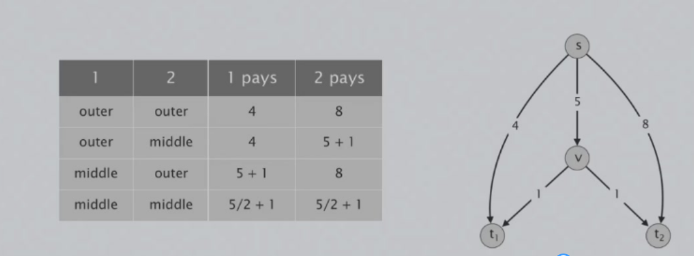
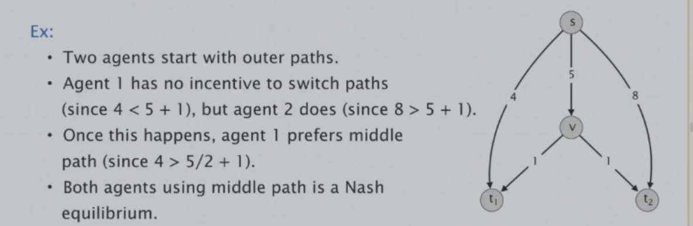
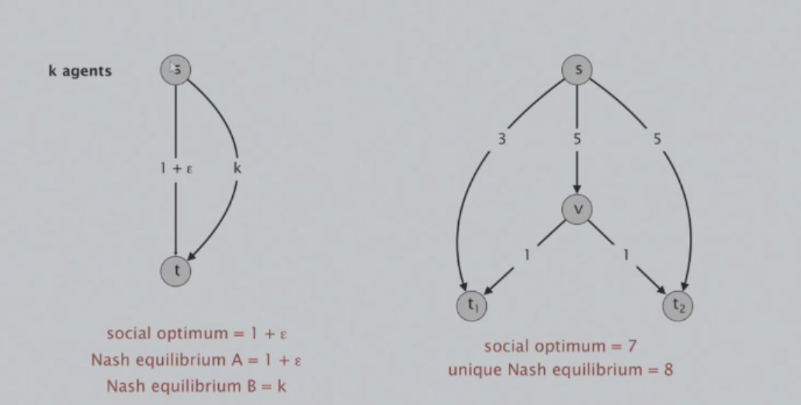
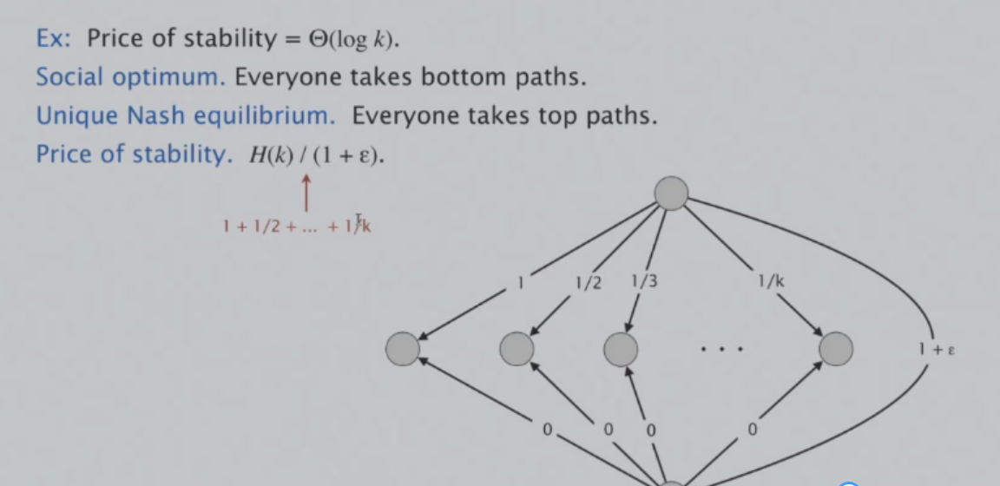
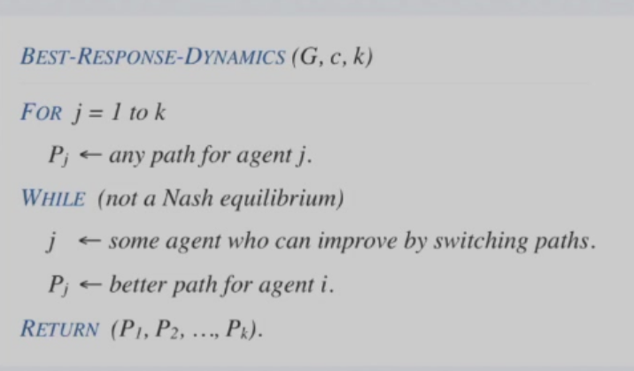

# 局部搜索
## 顶点覆盖（Vertex Cover）
给定一个图$G=(V,E)$，找到一个最小的顶点覆盖（对于$S \subseteq V$，使得对于每个$e\in E$，至少有一个顶点$s\in S$）

给定$N(S)$：由$S’$组成的集合，$S’$是一个顶点覆盖，且$S’$可以由$S$增加或删除一个节点得到。
### 梯度下降法
1. 让$V$为$S$
2. 当$\exists S’ \in N(S)$且$|S|>|S’|$
3. 将$S’$赋值给$S$
4. 重复2，3步
### Metropolis算法
此算法借鉴了物理学的Gibbs-Boltzmann分布。

1. 选择初始解$S$
2. 随机选择一个新的解$S’\in N(S)$
3. 如果$|S|>|S’|$，则$S\leftarrow S’$
4. 否则，以概率$e^{-\frac{\Delta C}{kT}}$接受$S’$，$\Delta C= |S’|-|S|$
5. 重复2，3，4步
### 模拟退火算法
与Metropolis算法相似，只不过在Metropolis算法中$T$是固定的，而在模拟退火算法中$T$是随着迭代次数的增加而衰减。
## Hopfield神经网络（Hopfield Neural Network）
给定一个图$G=(V,E)$，每条边都有自己的权重$w_{xy}\in Z$，顶点$V_i$有状态$s_i \in \{ -1,1 \}$，这个状态函数$S: V \rightarrow \{ -1,1\}$被称为这个图的一个配置（configuration）

如果一个边连接顶点x，y，满足$w_{xy} s_{x} s_{y}<0$，则称这个边为“好边”，否则称这个边为“坏边”。

一个顶点被称为是“满足的”当且仅当这个顶点所连接的“好边”的权重的绝对值之和大于等于“坏边”的权重的绝对值之和。

能不能找到一个配置，使得这个图中所有的顶点都是“满足的”。

### 状态反转法
易证：如果一个顶点不是“满足的”，将这个顶点的状态反转，则这个顶点就会变成“满足的”。

根据这个性质，我们可以有如下算法：

1. 给定任意一个配置
2. 若在此配置下有些顶点不是“满足的”
3. 从中挑一个顶点反转其状态
4. 重复2，3步

定理：这个算法最多只有$\sum_{e}|w_e|$次迭代就会停止。

证明：我们定义势函数$f(S)$为所有“好边”的势函数之和。

则若$S$反转$u$后得到$S’$，则有：$f(S’)>f(S)$，则势函数最多增加$\sum_{e}|w_e|$次，则迭代次数也就最多为这个值。

## 最大分割问题
给定一个有权图$G=(V,E)$，这个图的一个切割$(A,B)$是对它的顶点集的分割，满足$A \cap B = \emptyset$，$A \cup B = V$，$\delta(A,B)=\{ (u,v)\in E:u\in A ,v\in B \}$，$w(A,B)=\sum_{e \in \delta(A,B)}w_e$，求一个切割$(A,B)$，使得$w(A,B)$最大。
 
可以将其转化为实际问题为：给定n个活动，和m个人，每个人都喜欢n个活动中的两个活动，安排每个活动在上午或下午使得尽可能多的人能参加自己喜欢的两个活动。

对于一个切割$(A,B)$，我们把一个顶点$u$称为“可改进的”如果改变$u$所属的子集会使$w(A,B)$变大。

### 最大割反转
1. 给定任意一个切割
2. 若在此配置下有些顶点是“可改进的”
3. 从中挑一个顶点改变所属的子集
4. 重复2，3步

定理：这个算法最多只有$\sum_{e}w_e$次迭代就会停止。

定理2：根据这个算法产生的切割$(A,B)$，$w(A,B)\geq \frac{1}{2}\sum_{e}w_e\geq \frac{1}{2}w(A^*,B^*)$，其中$(A^*,B^*)$是最大分割。  
证明：$\forall u \in A,\sum_{v\in A}w_{uv}\leq \sum_{v\in B}w_{uv}$，则对所有$u \in A$加和可得：$2\sum_{e=(u,v)\in E |u,v \in A}w_{e}\leq w(A,B)$

同理，$\forall v \in B,\sum_{u\in B}w_{uv}\leq \sum_{u\in A}w_{uv}$，则对所有$v \in B$加和可得：$2\sum_{e=(u,v)\in E |u,v \in B}w_{e}\leq w(A,B)$

由于$\sum_{e}w_e = \sum_{e=(u,v)\in E |u,v \in A}w_{e}+\sum_{e=(u,v)\in E |u,v \in B}w_{e}+w(A,B)$，则有：$\sum_{e}w_e\leq 2w(A,B)$， 结论得证。

我们可以对这个算法进行改进，首先重定义“可改进的”的顶点，我们把一个顶点$u$称为“可改进的”如果改变$u$所属的子集会使$w(A,B)$变大$\frac{2\epsilon}{n}w(A,B)$，这会提升算法的效率。

则定理2变为：$(2+\epsilon)w(A,B)\geq w(A^*,B^*)$.

或者我们可以扩大选择的邻域，将每次挑1个顶点改变所属的子集改为每次挑最多k个节点改变所属的子集，当然，这样会使得算法的运行时间变长。还有一些特殊的邻域选择，如kl-neighborhood。

## 多播路由（Multicast Routing）
给定一个有向图  $G = (V, E)$ ，其边成本  $c_e \geq 0$ ，一个源节点  $s$ ，以及 $k$ 个对应终端节点  $t_1, \ldots, t_k$ 的智能体。智能体 $j$ 必须构建一条从节点 $s$ 到其终端 $t_j$ 的路径$P_j$ 。如果 $x$ 个智能体使用同一边边 $e$ ，则每个智能体支付$c_e / x$。

每个智能体持续准备根据其他智能体的改变来改进自己的解，使自己的解在总花费上尽可能小。

当没有智能体去改变自己的解时，达到纳什均衡。

当所有智能体的总成本最小时，达到全局最优解，也称社会最优。显然，通常情况下可能存在多个纳什均衡，即使其唯一，也不一定是全局最优解。

我们称最佳纳什均衡与社会最优解的比率称为稳定性价格。
稳定性价格最坏情况下可以达到$O(log n)$，以下是一个例子：

定理：以下算法最终会终止并会达到纳什均衡。

且能证明；存在一个纳什均衡，使得所有参与者的总成本至多为社会最优的$H(k)$倍，其中$H(k)=\sum_{i=1}^{k}\frac{1}{k}$。（证明见:浙江大学 高级数据结构与算法分析 毛宇尘 2025-12-02第6-8节）