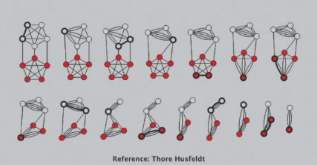

# 随机算法

##  Secretary problem

有$n$个面试者，每个面试者都会被打分，你需要招募其中最好的面试者，且必须要在当前面试者被打分后立即做出决定是否接受。

任何确定型的算法，在最坏情况下都会招募$n$个面试者才能招募到最好的面试者。

随机算法的思路是：

1. 随机排列面试者的面试顺序
2. 对于每个面试者，如果他是当前得分最高的，则接受，否则拒绝。

我们可以计算随机算法总共招聘人数的期望：

对于每个面试者，随机变量$X_i$表示他是否被接受，$X_i=1$表示接受，$X_i=0$表示拒绝。则随机算法的期望是：

$$
\begin{aligned}
&E[X_1+X_2+\cdots+X_n]=\sum_{i=1}^n P(X_i=1) \\
&P(X_i=1)=\frac{1}{i}\\
&E[X_1+X_2+\cdots+X_n]=\sum_{i=1}^n \frac{1}{i} \\
&ln(n+1)\leq \sum_{i=1}^n \frac{1}{i} \leq 1+ln(n) 
\end{aligned}
$$

由上述推导我们可以得到随机算法的解的期望为$O(ln(n))$。

我们改变一下问题：我们只选择一个面试者，要求招到的面试者尽可能是最好的。

随机算法的思路是：

1. 随机排列面试者的面试顺序
2. 面试前$k$个面试者
3. 从第$k+1$个面试者开始，如果他的得分比前$k$个面试者都高，则接受，否则拒绝。

设事件$A_i$为最好的人排在第$i$个位置，$B_i$为第$i$个面试者被接受。则招到最好的人的概况为：

$$
P=\sum_{i=1}^n P(A_i)\cdot P(B_i|A_i)=\frac{1}{n}\sum_{i=1}^n P(B_i|A_i) = \frac{1}{n}\sum_{i=k+1}^{n} \frac{k}{i-1}=\frac{1}{n}\sum_{i=k}^{n-1}\frac{k}{i} \geq \frac{k}{n} \int_{k}^{n-1} \frac{1}{x} dx = \frac{k}{n}ln \frac{k}{n} 
$$

## 快速排序
 
快速排序最重要的思想就是分治法，即将一个数组分成两个子数组，分别对这两个子数组进行排序，然后再将两个子数组合并。

分组的依据在于从数组中选取一个元素作为基准，我们称之为pivot，如果选择的pivot能将数组分成两个至少为原数组元素个数为$1/4$的两个子数组，则我们称这是一个好的pivot，随机选到好的pivot的概率为$1/2$
（在大数据量的情况下）。

如果我们选取的pivot不是好的pivot，则我们在随机选取pivot，直到选取的pivot是好的pivot为止。通过这种pivot选取方法，我们可以保证在平均情况下，快速排序的时间复杂度为$O(nlogn)$。但可以证明，如果随机选取piovt，快速排序的期望时间复杂度也为$O(nlogn)$，所以在实际应用中，只需要随机选取pivot即可。

## Global minimum cut

全局最小割问题是指给定一个无向无权图$G=(V,E)$，找到一个割$S$，使得割的边数最少。

### 收缩算法
- 随机选择一条边$e(u,v)$
- 收缩边$e$
- 用一个新的节点$w$替换$u$和$v$
- 更新边
- 重复此过程直至图中仅剩两个节点$u_1$和$u_2$
- 割集即为分别组成$u_1$和$u_2$的点的集合。

要想通过收缩算法得到最优解，我们需要保证在每一次缩边操作中，我们不能选到在最优解中的边。设$A_i$为第$i$次收缩操作没有选到最优解中的边，|E|为图$G$的边数，则有：

$$
\begin{align}
&P(A_1)=1-\frac{k}{|E|} \\
&degree(u)\geq k \rightarrow |E|\geq \frac{kn}{2} \\
&P(A_1)\geq 1- \frac{2}{n}\\
&P(A_2|A_1)=1-\frac{k}{|E'|}\geq 1-\frac{2}{n-1} \\
&P(A_i|A_1,A_2,...,A_{i-1}) \geq 1-\frac{2}{n-i+1} \\
&P(A_1,A_2,...,A_i)=P(A_1)P(A_2|A_1)P(A_3|A_1,A_2)...\geq \\
&\prod_{j=1}^{i-1} (1-\frac{2}{n-j+1})= \frac{2}{n(n-1)}\geq \frac{1}{n^2}
\end{align}
$$

因此，做$k$次收缩操作失败的概率为:

$$
P\leq (1-\frac{2}{n^2})^k\leq e^{-2k/n^2}
$$

令$k=n^2ln(n)$，则失败的概率会小于$\frac{1}{n^2}$。

## 蒙特卡洛算法和拉斯维加斯算法
像快速排序随机算法这种解一定正确、但运行时间不固定的算法为拉斯维加斯算法，像全局最小割随机算法这种运行时间固定，但解不一定正确的算法为蒙特卡洛算法。

可以证明：拉斯维加斯算法可以转化为蒙特卡洛算法。