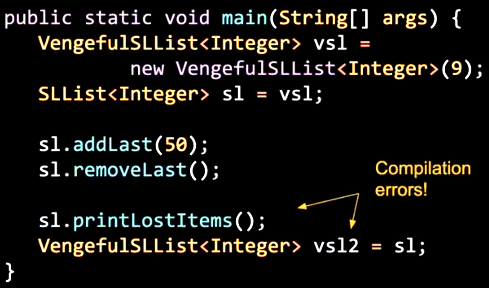
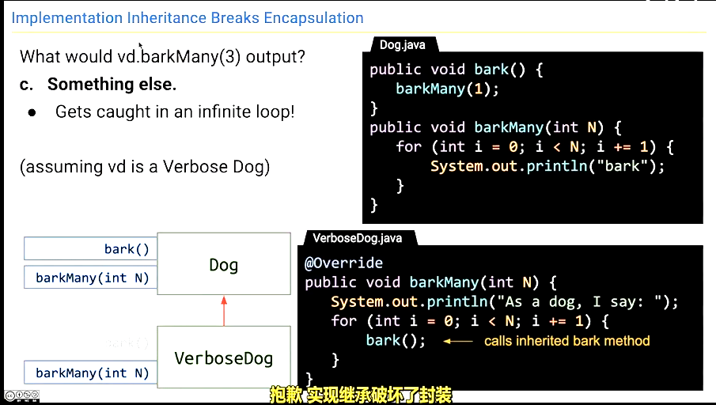

# 继承
## 继承的引入
- 对于两个类似的类，比如AList和SLList，他们会有相同的操作，比如找出两个字符串列表的最长单词。一个最直接的方法是定义两个不同的方法（虽然它们的实现可能是完全相同的）
```java
public String longestWord(List<String> words) {
    ...
}
public String longestWord(SLList<String> words) {
    ...
}
```
- 这两个方法有相同的名称，但是却有不同的参数类型，这种做法叫做方法重载(overloading)，这种做法虽然可以解决问题，但是会导致代码冗余且难以维护。
## 接口
- 接口(interface)是一种特殊的类，它只包含方法签名和常量，而不包含方法体。
- 接口可以被用来定义一个类的行为，但是不能实例化。
- 例如我们可以建立一个列表的接口，里面包含了AList、SLList等列表都应该有的一些方法：
```java
public interface List<T> {
    public void insert(T item, int position);
    public void addFirst(T item);
    public void addLast(T item);
    public T remove(int position);
    public T get(int position);
    public int size();
    public boolean isEmpty();
}
```
- 在定义接口之后，我们对于具体的类需要用implements关键字来实现接口：
```java
public class SLList<T> implements List<T> {
    ...
}
```
- 如果要调用一个接口，子类必须实现接口中定义的所有方法。
- 这样，SLList就实现了List接口，子类对应接口的方法签名完全一致（相同名称、相同参数类型），我们也可以说子类中的方法覆盖了这个接口中声明的方法，这种做法叫做函数覆盖(method overriding)。
- 在覆盖函数前可以加@Override注解来检查是否正确覆盖了接口中的函数。
```java
public class SLList<T> implements List<T> {
    ...
}
```
- 接口也可以作为参数类型，比如我们可以定义一个方法，它接受一个List接口作为参数：
```java
public void printList(List<T> list) {
    for (int i = 0; i < list.size(); i++) {
        System.out.println(list.get(i));
    }
}
```
- 接口中的方法可以有默认实现，这样子类可以不用实现接口中定义的所有方法，有默认实现的方法前面要加default关键字。
```java
public interface List<T> {
    default public void print(){
        for (int i = 0; i < size(); i++) {
            System.out.println(get(i)+" ");
        }
        System.out.println();//换行
    }
}
```
- 当然，有默认实现的方法也可以被子类覆盖。
## 补充：静态类型和动态类型
- 在Java中的变量有两种类型：静态类型和动态类型。
- 静态类型是在编译时确定的类型，比如int x = 10; x的静态类型就是int。
- 动态类型是在运行时确定的类型，比如List<String> list = new ArrayList<String>(); list的动态类型就是ArrayList<String>。
- 如果一个变量的静态类型和动态类型不一致，如静态类型是List<String>，动态类型是ArrayList<String>，且动态类型重写了List<String>中的方法，那么调用这个方法时，会调用动态类型的方法，而不是静态类型的方法。
- 但由于编译器只检查静态类型的正确性，所以有时一些看似正确的代码会编译错误（如：静态类型是List<String> list用了ArrayList<String>中独有的方法，或是将一个ArrayList<String>赋值给一个List<String>变量）。



- 为了解决这种问题，我们需要进行强制类型转换。
```
public static Dog maxDog(Dog d1, Dog d2){...}
...
Poodle p1 = new Poodle("Frank",5);
Poodle p2 = new Poodle("Tom",3);
Poodle larger = (Poodle)maxDog(p1,p2);
```
- 在上例中，我们将maxDog()方法返回的参数类型从Dog改为Poodle，这样就可以调用这个方法了。
- 当然这种做法有利有弊，如果maxDog()方法返回的Dog并不是Poodle类型，那么就会出现运行时错误。
## 类继承
- 类继承可以让一个类获得另一个类的所有属性和方法，并可以对其进行扩展。
```java
public class Animal {
    public void eat() {
        System.out.println("animal is eating");
    }
}

public class Dog extends Animal {
    public void bark() {
        System.out.println("dog is barking");
    }
}
```
- Dog类继承了Animal类，Dog类可以调用Animal类中的方法，也可以添加自己的方法。
> **当父类的属性和方法为private时，子类无法访问，只能访问父类的public的属性和方法。**
- 在子类中你可以使用super关键字来调用父类的方法。
```java
public class VengefulSLList<T> extends SLList<T> {
    private SLList<T> lostItem;
    public VengefulSLList() {
        lostItem = new SLList<T>();
    }
    public Item removelast() {
        Item x = super.removeLast();
        lostItem.addLast(x);
        return x;
    }
}
```
- 在子类的实例创建时，在子类的调用函数运行时，会自动调用父类的构造函数。如上例，VengefulSLList的构造函数实际等价于：
```java
public VengefulSLList() {
    super();
    lostItem = new SLList<T>();
}
```
- 但当你创立一个带参数的构造函数时，例如：
```java
public  VengefulSLList(x) {
    lostItem = new SLList<T>();
}
```
- Java会自动调用父类的无参数构造函数，所以这时super函数就是必要的了。
```java
public VengefulSLList(x) {
    super(x);
    lostItem = new SLList<T>();
}
```
## Object类
- Object类是所有类的父类，当创建类时都隐式地继承了Object类。
- Object类提供了一些方法，比如equals()、hashCode()、toString()等。
## 封装
- 封装(encapsulation)是面向对象编程的一个重要概念。
- 封装是指将数据和操作数据的代码封装在一起，对外提供接口，隐藏内部的实现细节。
- 封装的好处是可以隐藏实现细节，使得代码更加容易维护和修改，提高代码的可复用性。
- 在Java中，可以通过访问权限控制对属性和方法的访问权限，来实现封装。
- 在类的继承中，有可能会破坏封装。

