# 树
## 平衡树
- 若在一颗树二叉中某节点左右子树的高度之差不超过1，则这个节点被称为平衡的
- 若一颗树的所有节点都是平衡的，则这棵树是平衡的
- 完全二叉树一定是平衡二叉树，但反之不成立
## AVL树
- 若一颗树是平衡的且是BST，则称这棵树是AVL tree
- 对AVL树，find，pred，succ，ins，del操作的时间复杂度均为O(logn)
  
### 旋转操作
- 左旋转：将某节点的右子树上移，并将其祖先节点作为左子树，连接原先的左子树和此节点的左子树，此节点的右子树不变。
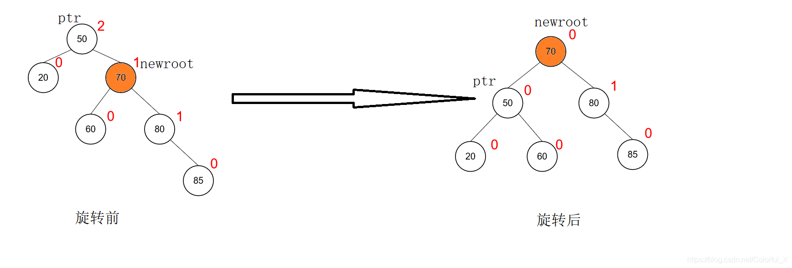
- 右旋转：同左旋转
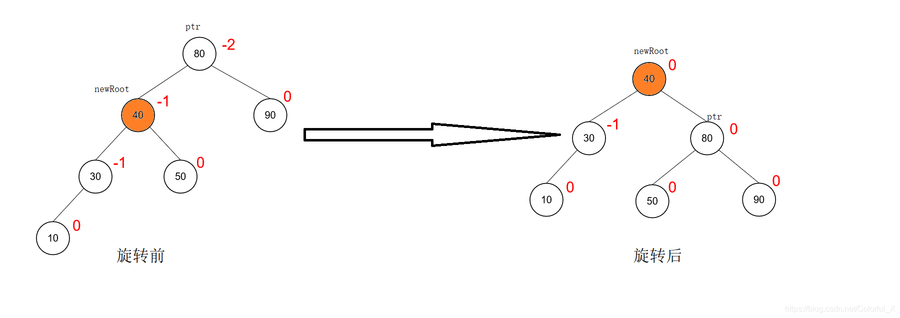
- BST旋转之后依旧是BST
### 插入操作
- 以BST的形式插入
- 只有插入节点的祖先与插入节点本身可能会变得不平衡，且高度差至多为2。
- 通过旋转操作重新使树恢复平衡
    - 找到最深的非平衡节点u（其左右子树高相差2）（图中为A）。
    - 其树高较高的子树节点为v（以下以左子树为例）（图中为B）。
    - v的左右子树为w1,w2（图中为D，E）,**高度之差一定为1**
    - 若左子树较高（D）（左左型），则对v进行右旋转。
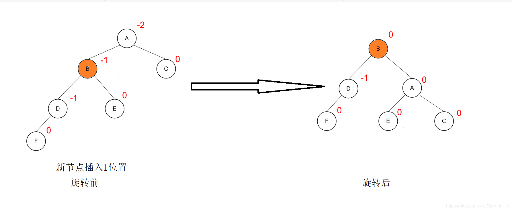
    - 若右子树较高（E）（左右型），则对w2进行左旋转，再对w2进行右旋转。
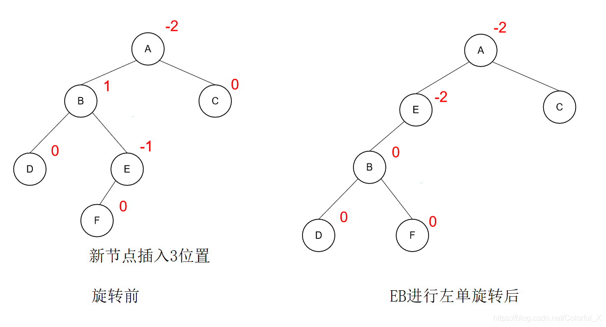
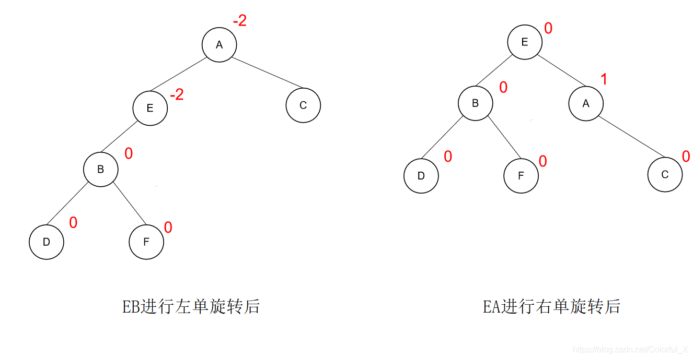
### 删除操作
- 以BST的形式删除
- 通过旋转操作重新使树恢复平衡
- 对ALV树的删除操作等效于删除叶子节点
- 对ALV树的删除操作只会使一个节点变得不平衡
- 调整平衡的操作方式与插入操作类似
- **删除操作中，v的左右子树w1，w2有可能相同，此时按左左型处理**
## 红黑树
### 定义
- 红黑树满足以下性质
    - 它是BST
    - 所有内部节点（非空节点）必须是红色或黑色
    - 根为黑色
    - 所有叶节点（在此处为空节点）为黑色a
    - 所有红色节点的子节点均为黑色
    - 对树中所有节点u，所有以此节点为始，到达叶子节点的路径所包含黑色节点的数量相同
### 黑高
对某节点u，以此节点为始，到达叶子节点的路径所包含黑色节点的数量的最大值（包含u）称为u的黑高。
### 关于黑高的性质
- 某节点和它的兄弟节点的黑高相等
- 对所有节点u，  $h(u)>=bh(u)>=h(u)/2$
- 由上两条结论，某节点与它的兄弟节点的高之比大于等于0.5，小于等于2
- 定理：**有n个内部节点的红黑树高小于等于 $2+2log_2(n+1)$**
### 插入操作
- 以BST的形式插入，将插入节点初始化为红色
- 若插入节点为根节点，则将其标记为黑色
- 若插入节点的父节点为黑色，则插入操作结束
- 若插入节点的父节点为红色，则进行以下操作
    - 若父节点和叔节点均为红色，则将父节点和叔节点标记为黑色，祖父节点标记为红色，并将祖父节点作为插入节点，重复上述操作
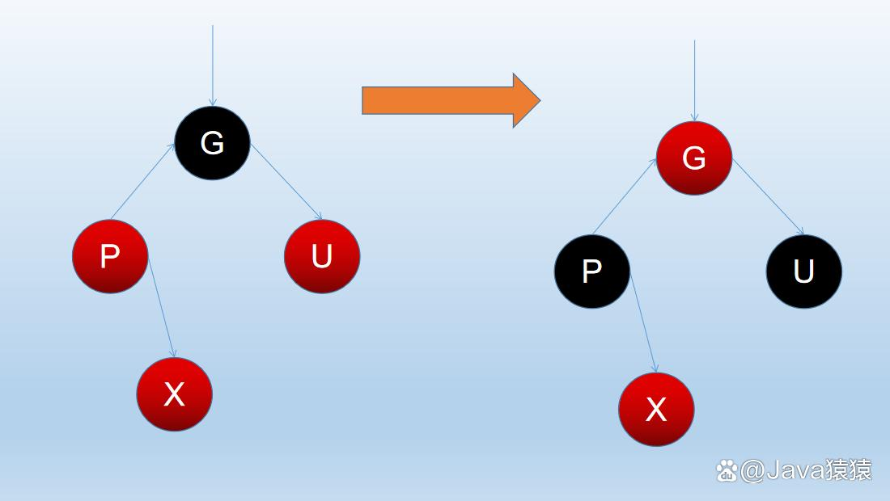
    - 若叔节点为黑色
        - 若插入节点为父节点的左子节点，则将祖父节点右旋，将原父节点标记为黑色，祖父节点标记为红色。
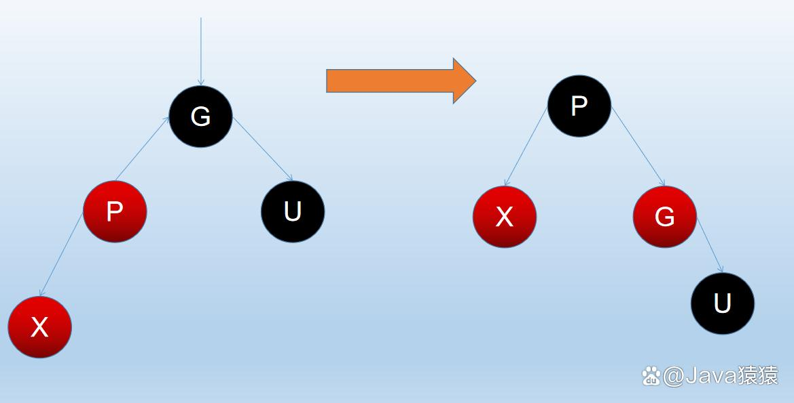
        - 若插入节点为父节点的右子节点，则将父节点左旋，将原父节点作为新插入节点，变为插入情况2
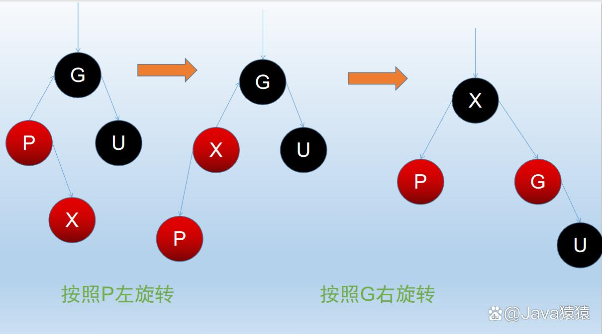
### 删除操作
- 以BST的形式删除，则删除节点最多只有一个内部子节点。
- 若删除节点为红色，则只有一种情况，即删除节点的左右子树均为空节点（黑色），则直接删除即可。
- 若删除节点为黑色，则有两种情况。
  - 1.若它连接红色节点，则将其替换成黑色节点即可。
  - 2.若它连接两个黑色节点，为了平衡黑高，需要引入双黑节点，即一个节点有两个双黑标记。（只考虑双黑节点为左子节点的情况）
    - 2.1若双黑节点的兄弟节点为黑色
        - 2.1.1若此兄弟节点有两个黑色字节点。
            - 2.1.1.1若父节点为红色，则将父节点标记为黑色，兄弟节点标记为红色，双黑节点变为黑色，结束。
            - 2.1.1.2若父节点为根，兄弟节点标记为红色，双黑节点变为黑色，结束。
            - 2.1.1.3若父节点为黑色，则将父节点标记为双黑节点，兄弟节点标记为红色，原双黑节点变为黑色，重复对新双黑节点讨论。
        - 2.1.2若此兄弟节点右子节点为红色，将这个节点（兄弟节点的右子节点）变为黑色，将父亲节点左旋，将兄弟节点的颜色（黑色）和原父亲节点（黑红均可）的颜色互换，将双黑节点变为黑节点，结束。
        - 2.1.3若此兄弟节点左子节点(v)为红色，右子节点为黑色，将兄弟节点(u)右旋，再将父节点(p)左旋，使v变为父节点，让v为p的颜色，让p为黑色，将双黑节点变为黑节点，结束。
    - 2.2若双黑节点的兄弟节点(u)为红色，则将父亲节点(p)左旋，将u变为黑色，将p变为红色，此时变为2.1的情况。
## 伸展树
-伸展树是一种平衡二叉查找树，它通过 伸展（splay）操作 不断将某个节点旋转到根节点，使得整棵树仍然满足二叉查找树的性质
### 伸展操作
- u是根的子节点，旋转一次即可变成根
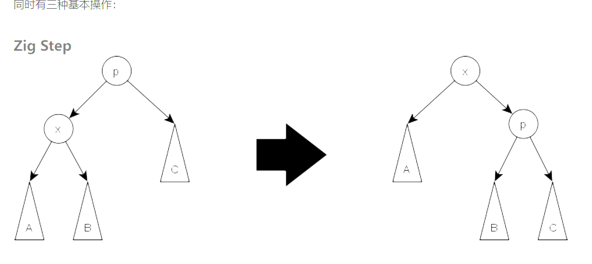
- 若u有祖父节点
   - 若u与其父亲节点所属子树相同（如：其父亲为祖父节点的左子节点，u也为其父亲的左子节点），则先对祖父节点旋转，再将父亲节点旋转。
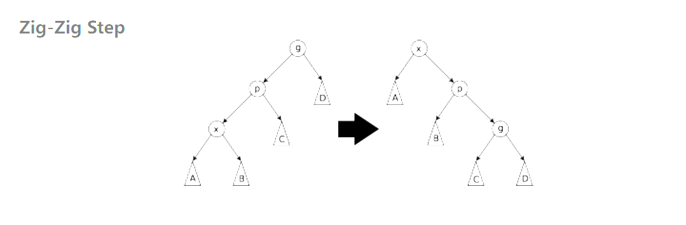
   - 若u与其父亲节点所属子树不同，则先对父亲节点旋转，再对祖父节点旋转。
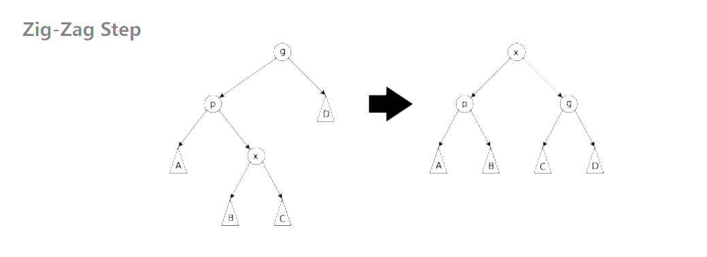

### 插入操作
- 插入节点u
- 伸展u
### 删除操作
- 伸展u
- 若u只有一个孩子
  - 直接删除u即可
- 若u有两个孩子
  - 找到右子树的最小节点进行伸展，让其作为新的根
## 动态数组
### 插入操作
- 判断数组是否已被填满（初始为一）
- 若已被填满则创建一个大小为原来两倍的数组
- 将原数组的元素复制到新数组中
- 插入新元素
## B+树
### 定义
一棵m阶B+树是具有如下性质：
- 非叶根节点的子树个数为[2,m]
- 非根内部节点的子树个数为$[ \lceil m/2 \rceil, m]$，键值个数比子树个数少一
- 非根叶节点的键值个数为$[ \lceil m/2 \rceil, m]$
- 所有叶节点都在同一层
- 非根内部节点有k个键值，按顺序排列，则有k+1个指针，指向子树的根节点，且$\forall i \in [1,k]$， 第i+1的子树中的键值都大于此节点的第i个键值
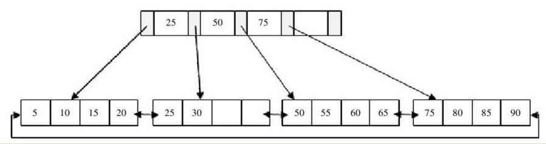
### 插入操作
- 找到叶子节点，将新键值插入到叶子节点的末尾
- 若插入导致节点的键值个数大于m，则将节点分裂，将中间的键值复制到父节点，若没有父节点则新建父节点，并更新父节点的指针。
- 若上述操作导致非叶子节点的键值个数大于等于m，则将此节点分裂，将中间的键值移除，并添加到父节点中，并更新父节点的指针。
- 重复上述操作，直到插入完成。
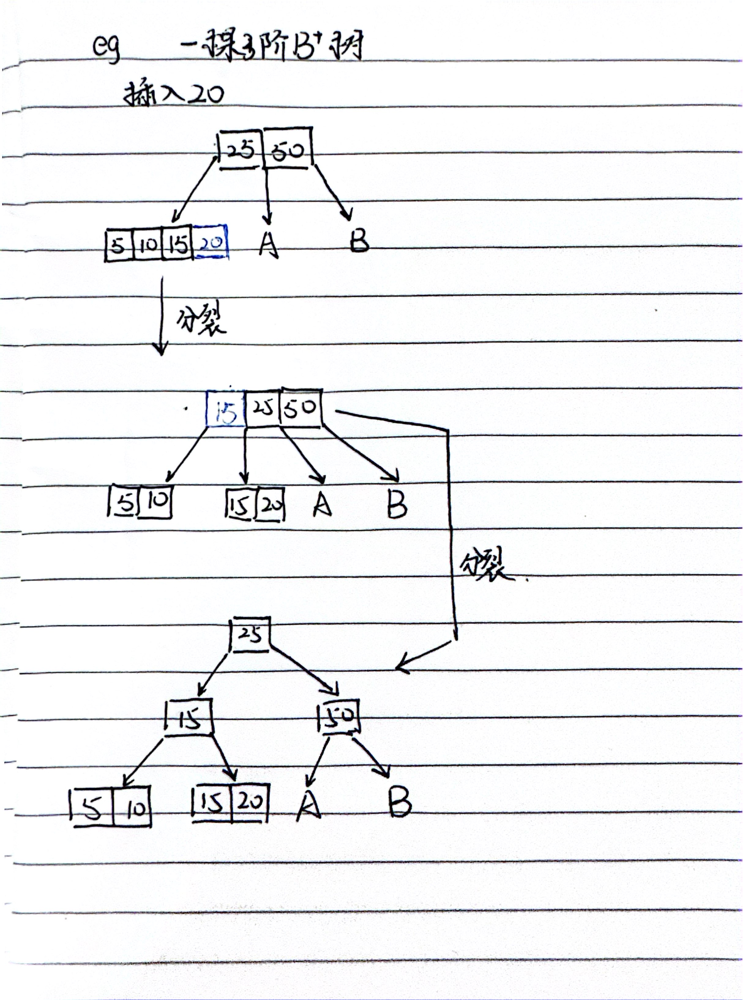
### 删除操作
- B+树使用填充因子（fill factor）来控制树的删除变化，50%是填充因子可设的最小值。B+树的删除操作同样必须保证删除后叶节点中的记录依然排序。
- 直接删除：如果待删关键字位于非满载（未达到最小填充因子）的叶节点内，则可安全地将其移除而不违反任何结构性约束。
- 借位调整：当目标关键词存在于已处于最低限度填充值状态下的叶节点时，在尝试执行删除之前应先考察相邻兄弟节点是否有多余元素可供借用；若有，则完成转移后继续正常流程进行实际删除，同时要更新内部节点。
- 合并处理：对于既无法简单去除又找不到合适供体实施借位情形下的欠饱和节点来说，唯一出路便是同侧边最近的一个同胞合为一体，并更新父辈记录指向新的联合实体。值得注意的是，这种做法可能会引发上层结构连锁反应式的重组直至整棵树恢复稳定形态为止。
- 检查合并条件：在删除键值对后，需要检查是否满足合并条件。通常优先选择左兄弟节点进行合并（如果可用）。如果左兄弟节点不可用，则尝试与右兄弟节点合并。
- 更新父节点：如果发生合并，则更新父节点以反映子节点的变化。

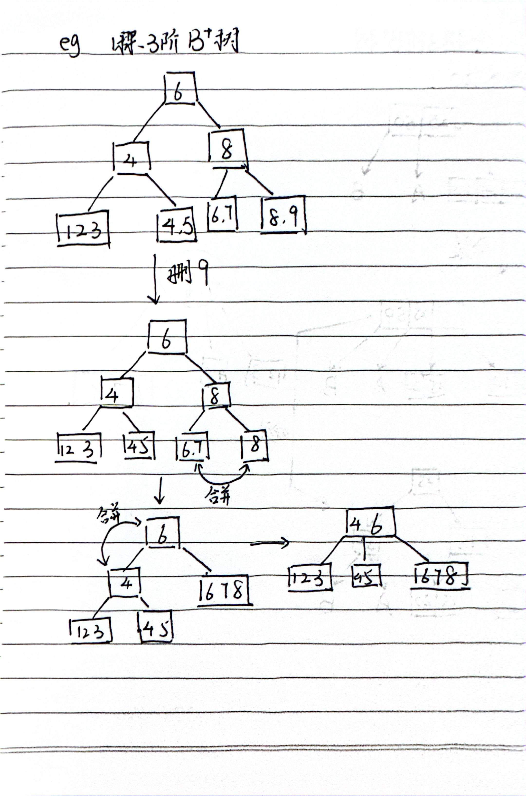