# 知识表达与推理
## 命题逻辑
- 命题：确定为**真**或为**假**的陈述句，无法判断真伪的描述性句子不能作为命题。
- 原子命题：不包含其他命题作为其组成部分的命题
- 复合命题：由两个或多个原子命题通过逻辑运算符连接而成的命题
- 逻辑运算符：与、或、非、异或、条件
- 逻辑等价: 两个命题的真值相同，用≡表示。
- 推理：从已知的命题出发，通过逻辑推理，推导出新的命题，用=>表示。
## 谓词逻辑
- 刻画主体（个体和群体）之间逻辑关系的方法。
- 个体：所研究领域中可以独立存在的具体或抽象的概念
- 谓词：刻画个体属性或描述个体之间关系存在性的元素，其值为真或假
- 包含一个参数的谓词称为一元谓词，表示一元关系，通常用于刻画个体是否包含特定的属性，如P(x):x是质数，表示某个数是否为质数；包含多个参数的谓词称为多元谓词，表示多元关系，通常用于表示个体之间的关系，如P(x,y):x是y的因子，表示x是否是y的因子。
- 全称量词：表示所有可能的个体，用∀表示，如∀x(P(x))表示所有x都为质数；存在量词：表示至少有一个个体满足条件，用∃表示，如∃x(P(x))表示存在一个质数。
## 知识图谱推理
- 知识图谱由有向图构成，被用来描述现实世界实体以及实体间的关系，是人工智能进行知识表达的重要方式。在知识图谱中，每个节点表示客观世界中的一个实体，两个节点之间的连线表示节点具有某一关系。知识图谱中存在连线的两个实体可表达为形如<实体1，关系，实体2>的三元组。这种三元组也可以表示为一阶逻辑(first order logic, FOL)的形式，从而为基于知识图谱的推理提供理论支撑。
- 关系推理对实体间的关系进行推理，能从现有知识中发现新的知识，在实体间建立新关联，从而扩充和丰富现有知识库。
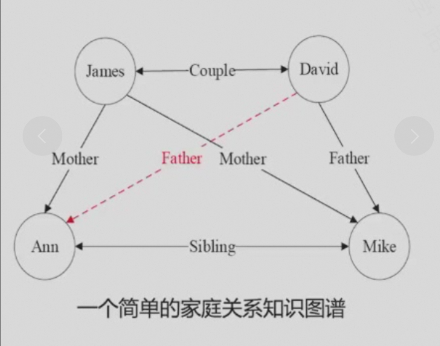
- 推理分为两个步骤：归纳和演绎（以推导David是Ann的父亲为例）：
    - 从数据到知识（推导规则）：归纳  
      $ (\forall x)(\forall y)(\forall z)(Mother(z,y) \wedge Couple(x,y) \rightarrow Father(x,y)) $
    - 从知识到数据（推导实例）：演绎  
      $ father(David,Ann) $
### FOIL(First-Order Inductive Logic)算法
- 在FOIL中，目标谓词是需要推断规则的结论，也称为规则头，在给定推理结论后，FOIL算法学习得到使得结论满足的前提条件，即目标谓词作为结论的推理规则。
#### 正例、反例和背景样例
- 正例：已知的事实，即已知的事实能够作为推理的依据，如$ Father(David,Mike)$。
- 反例：反例是推理的不足之处，即推理结论与反例矛盾，如$\neg Father(David,Jame) $。
- 背景样例：推理的背景，即推理的前提条件,如$ Sibling(Mike,Ann) $。
#### 算法思路
- 从一般到特殊，逐步添加目标谓词的前提约束谓词，直到所构成的推理规则不覆盖任何反例。从一般到特殊指的是对目标谓词或前提约束谓词中的变量赋予具体值，如将$ (\forall x)(\forall y)(\forall z)(Mother(z,y) \wedge Couple(x,y) \rightarrow Father(x,y)) $这一推理规则中目标谓词$ Father(x,y) $ 赋予具体值$ Father(David,Ann) $，进而进行推理。
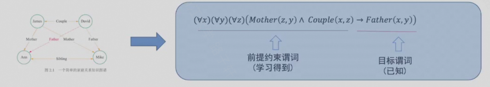
-  添加前提约束谓词所得推理规则的质量好坏由信息增益值来衡量。
-  FOIL信息增益值计算方法如下：
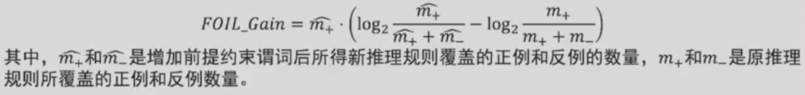
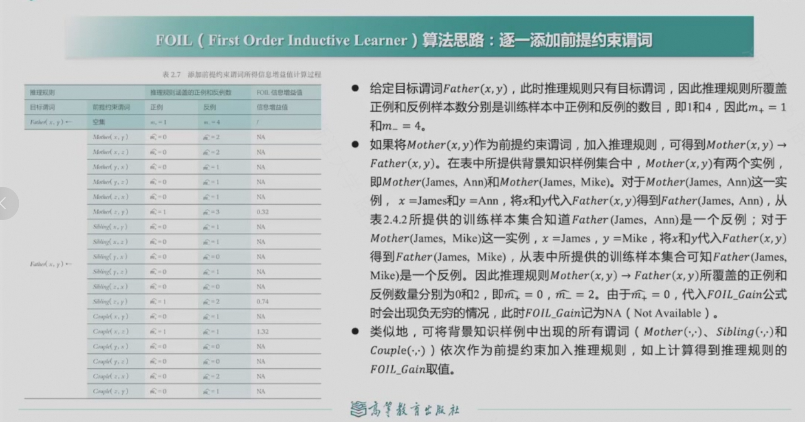

- 从这个学习过程可知，给定目标谓词，FOIL算法从实例（正例、反例、背景样例）出发，不断测试所得推理规则是否还包含反例，一旦不包含，则学习结束，由此充分展示了“归纳学习”的思想。
### 路径排序推理算法
- 路径排序推理算法的基本思想是将实体之间的关联路径作为特征，来学习目标关系的分类器，路径排序算法的工作流程分为三步：
- 特征抽取：生成并选择路径特征集合。生成路径的方式有随机游走、深度优先搜索、广度优先搜索等。
- 特征计算：计算每个训练样例的特征值$ P(s \rightarrow t; \pi_j)$。该特征值可以从实体节点$ s $ 出发，通过关系路径$ \pi_j $ 到达实体节点$ t $ 的概率；也可以表示为布尔值，表示实体$ s $ 到实体$ t $之间是否存在路径$ \pi_j $。还可以是实体之间路径出现频次、概率等。
- 分类器训练：根据训练样例的特征值，为目标训练分类器，当训练好分类器后，即可将该分类器用于推理两个实体之间是否存在目标关系。

## 概率图谱推理
- 用概率表述两个相邻节点之间的关系。而基于概率图进行的推理被称为概率推理。
- 概率图模型一般分为贝叶斯网络和马尔可夫网络两大类。
### 贝叶斯网络
- 贝叶斯网络是一种有向无环图模型，由节点和边组成，节点表示随机变量，边表示变量之间的依赖关系。
- 贝叶斯网络满足局部马尔可夫性，即在给定一个节点的父节点的情况下，该父亲节点有条件的独立于它的非后代节点。
- 贝叶斯网络的所有因素的联合分布等于所有节点的P(节点|其父节点)的乘积。
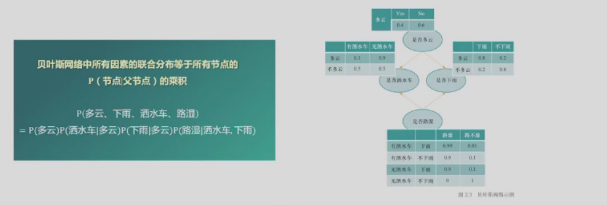
### 马尔可夫逻辑网络
- 马尔可夫网络是一种无向图模型，无向边表示节点与节点之间的相互概率依赖。
- 马尔可夫网络在一阶谓词逻辑中添加了不确定性而对严格推理进行了松绑，更好反映了客观世界的复杂性。
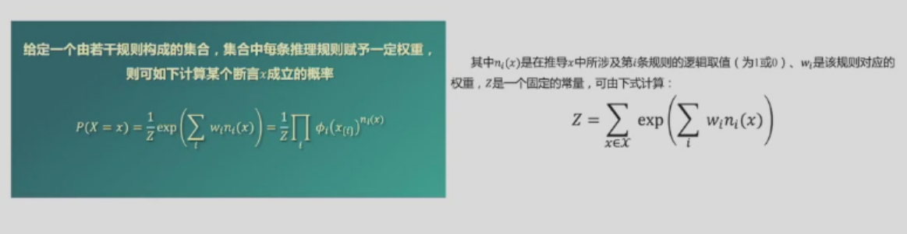
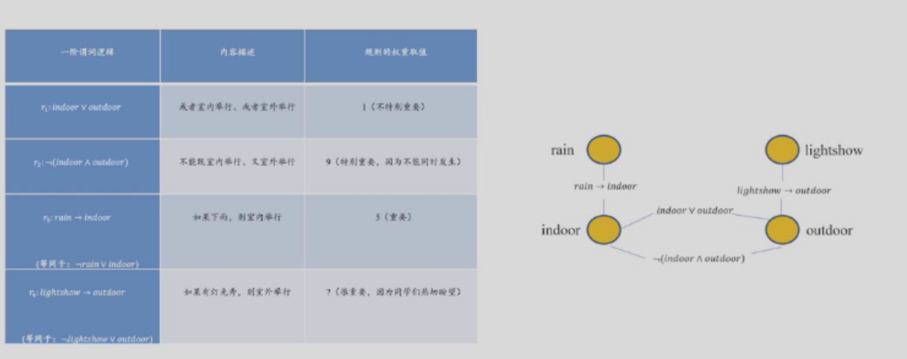
## 因果图谱推理
- 因果图谱推理是一种基于因果关系的推理方法，其基本思想是将因果关系作为图谱中的边，将因果链作为图谱中的路径，从而推导出因果链上的因果关系。
- 因果图是一种有向无环图（DAG），DAG可用于描述变量联合分布或者数据生成机制的模型，被称为“贝叶斯网络”。
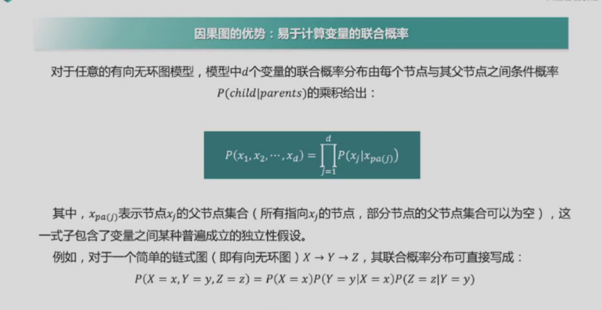
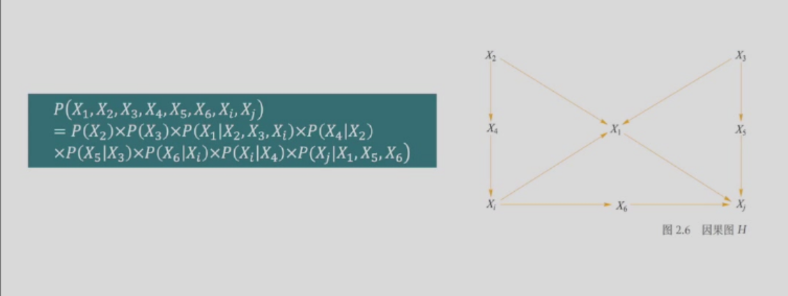
### 因果干预与do算子
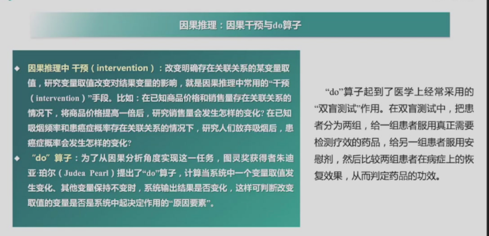
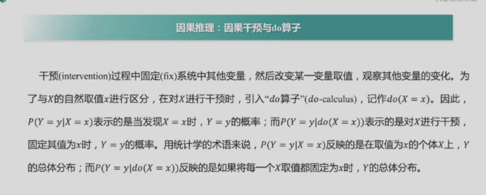
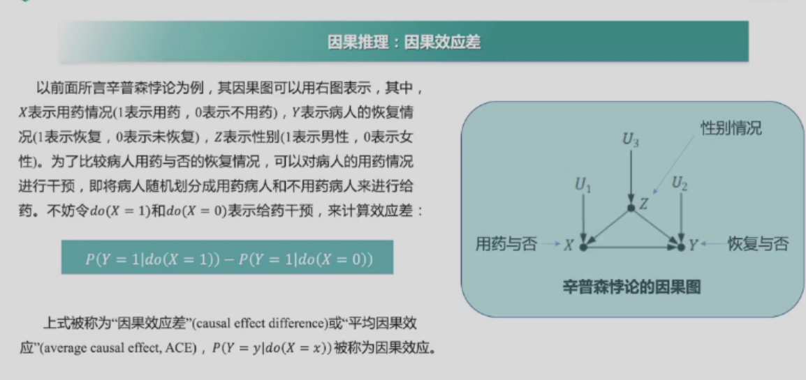
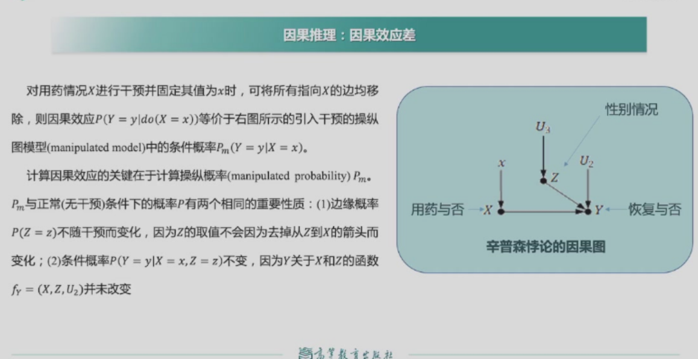
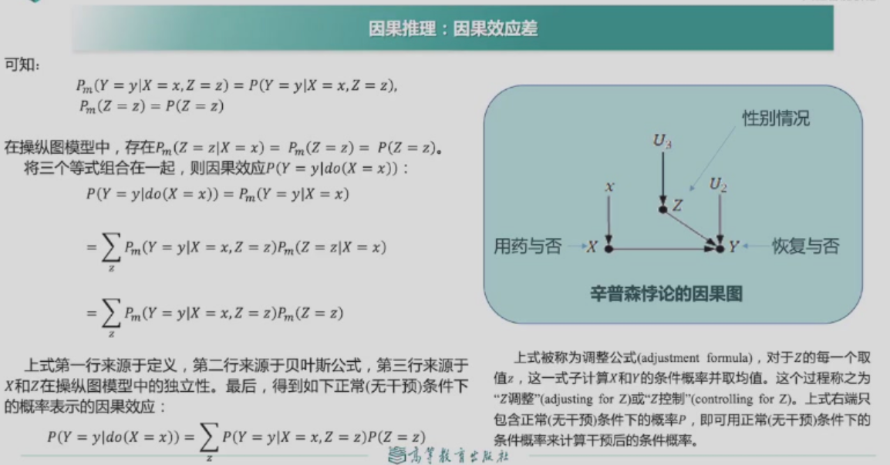
### 反事实推理
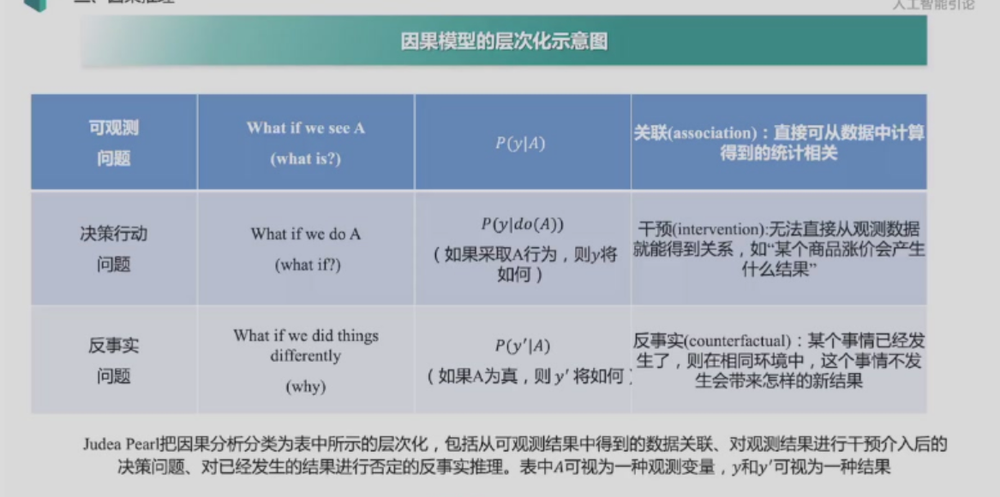