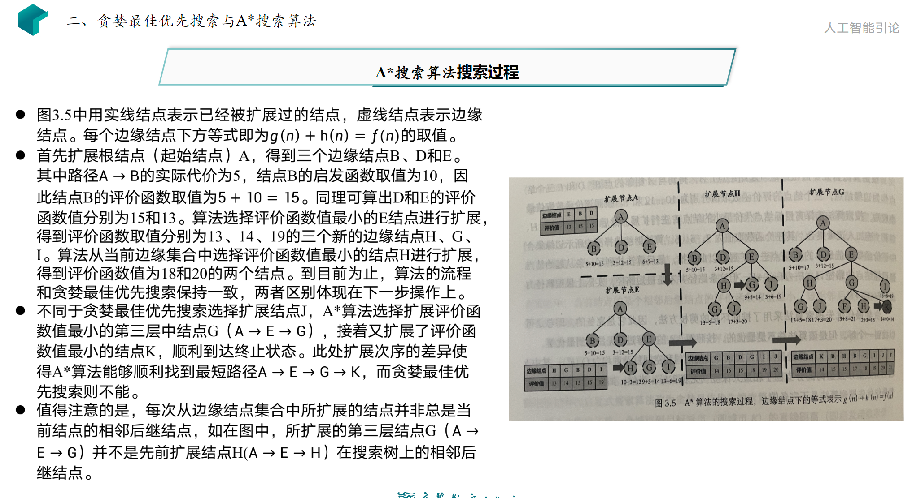
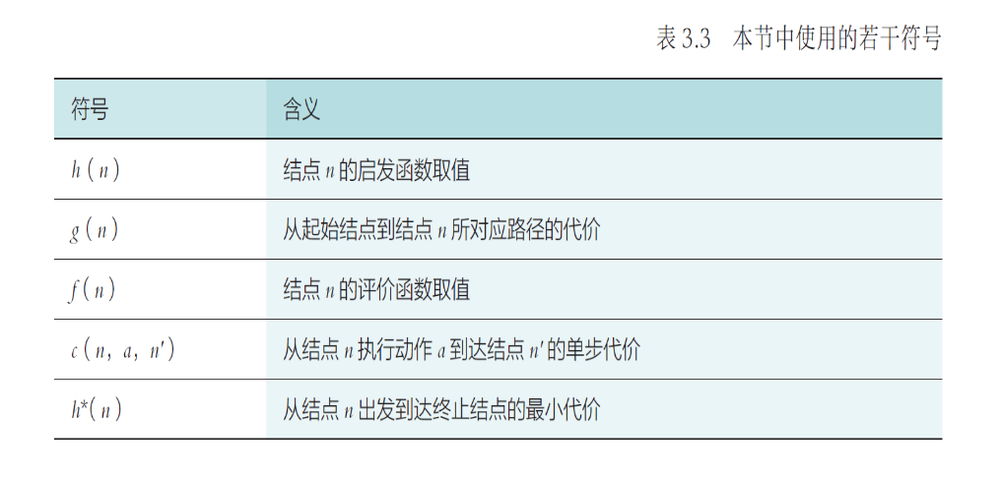
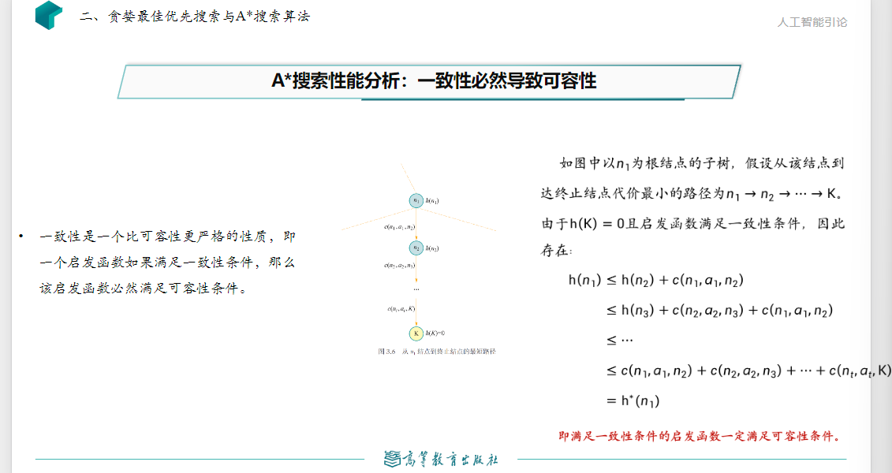
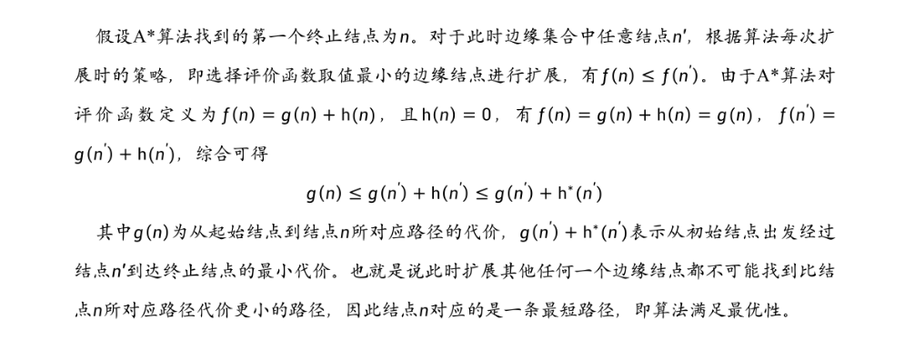
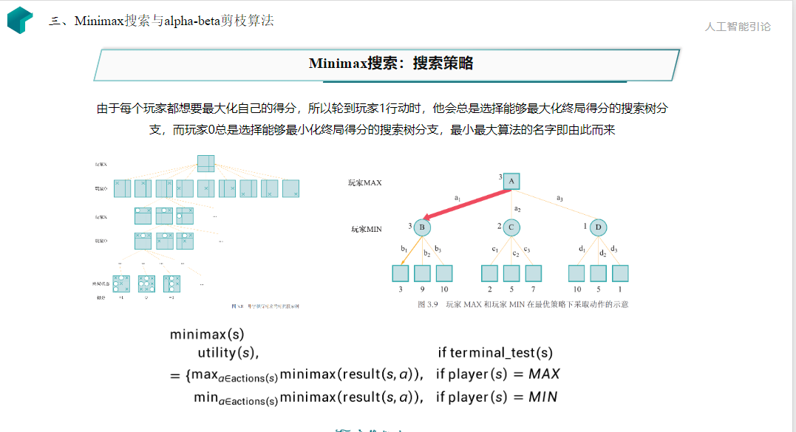

# 搜索探寻与问题求解
## 搜索的基本概念
### 搜索的形式化描述
- 状态：广义来说，状态是对搜索算法和搜索环境当前所处情形的描述信息。
- 动作：算法从一个状态转移到另一个状态的行为称为动作。
- 状态转移：算法选择了一个动作后，其所处的状态也会发生相应变化，这个过程被称为状态转移。
- 路径：以一个状态为起点，搜索算法通过执行一系列动作后，将会在不同状态之间不断转移。将这个过程中经历的状态记录下来，可以得到一个状态序列，称为路径。
- 代价：通过该路径的时间开销。
- 目标测试：用于判断状态s是否为目标状态，目标测试通过意味着搜索算法完成。
- 搜索过程可视为搜索树的构建。
### 搜索算法的评判标准
- 完备性：当问题存在解时，算法是否能找出一个解。
- 最优性：算法是否保证找到的第一个解为最优解。
- 时间复杂度
- 空间复杂度
### 评价函数和启发函数
- 评价函数：从当前节点n出发，根据评价函数来选择后续节点。
- 启发函数：计算从节点n到目标节点之间所形成路径的最小代价值。

## 贪婪最佳优先搜索
- 将启发函数作为评价函数的搜索过程。
- 具有完备性但不一定具有最优性

## A*搜索
- 评价函数与启发函数各司其职，考虑历史轨迹。

### A*搜索的性能分析
A*算法的完备性和最优性取决于搜索问题和启发函数的性质。

#### 启发函数的性质
启发函数有两条性质：可容性和一致性。
##### 可容性
- 对于任意节点n，有$h(n)\leq h^*(n)$，如果n是目标节点，则有$h(n)=0$。
- $h^*(n)$是从节点n出发到达终止结点所付出的最小代价。
- 可容性的启发函数即启发函数不会过高估计从节点n到终止节点所应该付出的代价（即估计代价小于等于实际代价）。
- 在上述问题中，对每个节点其状态（城市）到目标状态K之间的行驶距离不会小于两城的直接距离，启发函数满足可容性。
##### 一致性
- 启发函数的一致性满足条件$h(n)\leq c(n,a,m)+h(m)$，其中$c(n,a,m)$表示节点n通过动作a到达其相应后续节点m的代价。
- 在上述问题中，对任意节点n，m，单步代价定义为n,m在二维平面内的欧式距离，由于三角形不等式，城市n到目标城市K之间直线距离一定小于等于从城市n到其相邻城市m的直线距离与城市m到目标城市K之间直线距离之和，因此启发函数满足一致性。
- 一致性必然导致可容性

### 完备性
如果求解问题和启发函数满足以下条件，则A*算法是完备的：
- 搜索树中分支数量是有限的，即每个节点的后继节点数是有限的。
- 单步代价的下界是一个正数。
- 启发函数有下界。
### 最优性
- **如果启发函数是可容的，那么A*算法满足最优性**

## Minimax搜索————对抗搜素或博弈搜素

## Alpha-Beta剪枝
- Alpha-Beta剪枝是一种启发式搜索方法，它通过对搜索树进行剪枝来减少搜索树的大小，从而提高搜索效率。

