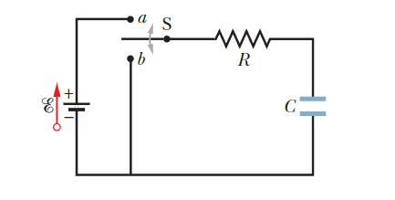
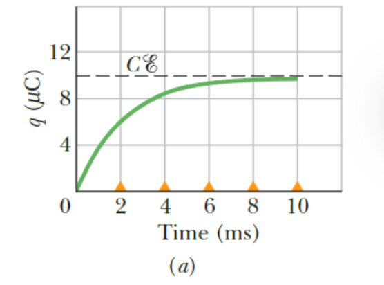
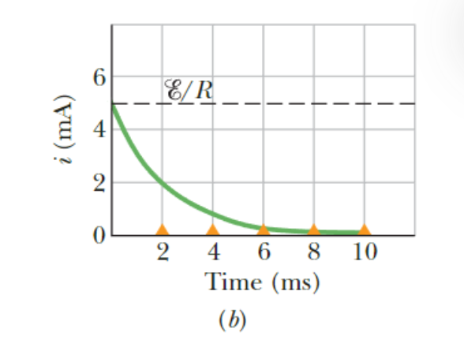
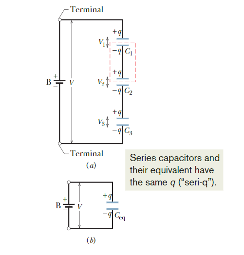
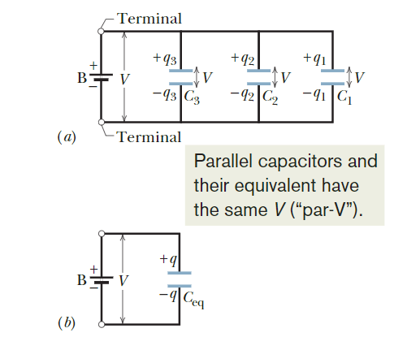

# 电路
## 电动势
我们定义一个装置的电动势为该装置在将电荷从低电位端移动到高电位端时，对单位电荷所做的功：$\mathcal E = \frac{W}{q}$ 
- 理想电动势装置对电荷从一端到另一端的内部运动没有内部电阻。
- 真实的电动势装置对电荷的内部运动具有内部电阻。当该装置中有电流流过时，其两端的电势差与其电动势不同。
## 基尔霍夫回路定律
- 由能量守恒定律，单电路回路总能量的变化率为：$\frac{dU}{dt} = i\mathcal E - i^2R=0$
- 由此我们可得:$\mathcal E - iR=0$，这可以推广到电路中的任何回路。
- 这就是基尔霍夫回路定律：**在电路中任意一个回路的完整遍历过程中，所遇到的电势变化的代数和必须为零**。
- 由电荷守恒，我们还可以得到基尔霍夫节点定律：**流入任何节点的电流之和等于流出该节点的电流之和**。
## 电容器中储存的能量
- 将总电容器电荷增加到最终值q所需的功是$W = \int d W = \int_{0}^{q}(q ' / C)d q ' = q^{2} / (2 C)$。该功以势能U的形式储存在电容器中，因此$U= \frac{q^{2}}{2 C} = \frac{1}{2}C V^{2}$。
- 由于$U= \frac{q^{2}}{2 C} =\frac{q^{2}d}{2\epsilon_0 A}$，所以电容器存储的能量与电容器的板间距成正比。
- 由$C=\epsilon_{0}A/d$以及$V=Ed$,我们得出$U= \frac{1}{2}C V^{2} = \frac{1}{2}\epsilon_{0}E^{2}(A d)$，由此，能量密度u（两板之间的单位体积的势能）是均匀的：$u = \frac{1}{2}\epsilon_{0}E^{2}$，此结果适用于任何电场。因此，带电电容器的电势能可看作存储在极板之间的电场中。
## RC电路
- 由电容C、电动势为E的理想电池和电阻R组成的RC串联电路。

### 电容充电
- 当电路在a处闭合时，电容器极板和电池端子之间开始有电荷流动。电容器的电势能变化为$\frac{d U}{d t} = \frac{d}{d t}\left(\frac{q^{2}}{2 C}\right) = \frac{q}{C}\frac{d q}{d t}$
- 根据能量守恒定律，变化来源于电池单位时间产生的能量和电阻单位时间消耗的能量，即：$\frac{d U}{d t} = \frac{q}{C}\frac{d q}{d t} = i \mathcal E - i^{2}R $.注意到$i = dq/dt$，我们发现$R \frac{d q}{d t} + \frac{q}{C} = \varepsilon $。
- 我们首先确定特征时间尺度，或RC电路的电容时间常数。通过量纲分析，我们可以写出$τ=RC$。也就是说，$Rdq/dt$和$q/C$的量纲相同。
- 可以验证电荷q的解为$q = C \mathcal E(1 - e^{ - t / \tau})$。

- 完全充电的电容器的平衡（最终）电荷等于$q₀= C\mathcal E$。
- 因此，电流随时间变化为 $i = \frac{d q}{d t} = \left(\frac{\mathcal E}{R}\right)e^{ - t / \tau}$。

- 电容器两端的电势差随着$V_{C} = \frac{q}{C} = \mathcal E(1 - e^{ - t / \tau})$。
- 当该电势差等于电池两端的电势差时，电流为零。
### 电容放电
- 假设电容器被充电至电势 $V₀ = q₀/C$。在新的时间 t=0，开关S从a抛向b，电容器通过电阻R放电。同样，电容器的势能变化为$\frac{d}{d t}\left(\frac{q^{2}}{2 C}\right) = \frac{q}{C}\frac{d q}{d t}$。
- 根据能量守恒定律，能量变化通过电阻以$i²R$的形式耗散，其中$i = dq/dt$。
- 因此，描述q的微分方程是$\frac{d q}{d t} + \frac{q}{c} = 0$。
- 完全充电的电容器上的电荷量为$q_{0} = C \mathcal E$。
- 电荷量q的解为$q = q₀e^{-t/τ}$。因此，我们得到 $i = dq/dt = - (q₀/τ)e^{-t/τ} = - (\mathcal E/R)e^{-t/τ}$。
## 电容器的串并联
### 串联电容器
- 当多个电容器串联时，电容器具有相同的电荷量q。施加的电势差V等于所有电容器两端电势差的总和：$V = \sum_{j = 1}^{n}V_{j}$。
- 串联电容器可以被一个等效电容器替代，该等效电容器具有与实际串联电容器相同的电荷q和相同的总电势差V，则该等效电容器的电容为：$\frac{1}{C_{e q}} = \sum_{j = 1}^{n}\frac{1}{C_{j}}$。

### 并联电容器
- 当在并联的多个电容器两端施加电势差V时，该电势差将施加在每个电容器上。
- 电容器上储存的总电荷q是每个电容器上储存电荷的总和：$q=∑q_j$。
- 并联电容器可以用一个等效电容器代替，该电容器具有与实际电容器相同的总电荷q和相同电势差V，则该等效电容器的电容为：$C_{e q} = \sum_{j = 1}^{n}C_{j}$

## 电容器与介电材料
- 介电材料是一种绝缘材料，可用于填充电容器极板之间的空间。
- 对固定的电荷量，介电质的作用是降低板间的电势差。
- 相应地，电容会增加一个数值因子$κ$（≥1），这个因子被称为绝缘材料的介电常数（相对介电常数）。
- 事实上，在一个完全由介电常数为κ的介电材料填充的区域中，所有包含介电常数$ε₀$的静电方程都应通过将$ε₀$替换为$ε=κε₀$（材料的介电常数）进行修改。
- 例如，对于位于介电材料内部的点电荷，$E = \frac{1}{4 \pi \epsilon}\frac{q}{r^{2}} = \frac{1}{4 \pi \kappa \epsilon_{0}}\frac{q}{r^{2}} $。
- 真空的介电常数定义为1，空气的介电常数略大于1。
- 如果施加的电场足够大（超过介电强度），介电材料将发生击穿并在板间形成导电路径。
- 介电质的作用是使原电场 $E₀ = q/(ϵ₀A)$ 降低 $κ$ 倍；因此我们可以写成$E = \frac{q}{\kappa \epsilon_{0}A} = \frac{E_{0}}{\kappa} = \frac{q}{\kappa \epsilon_{0}A} = \frac{q / \kappa}{\epsilon_{0}A}$。
- 极化电荷 $q' $满足$ q - q ' = q / \kappa$
### 电介质中的高斯定律
- $\epsilon_{0}\oint \overrightarrow{E}\cdot d \overrightarrow{A} = q - q ' = q / \kappa$。
- 这样，我们仍然使用真空中的原始高斯定律。或者，我们可以将高斯定律改写为
$\epsilon_{0}\oint \kappa \overrightarrow{E}\cdot d \overrightarrow{A} = \oint \overrightarrow{D}\cdot d \overrightarrow{A} = q $，其中我们定义电位移（电通量密度）$D =\epsilon_{0}\kappa E$，高斯面包围的电荷$q$仅为自由电荷而不包括介电材料产生的极化电荷。
- 拓展：定义极化强度矢量$\overrightarrow{P}$，反应单位体积内电偶极矩的和。$\overrightarrow{P} = \frac{\sum_{}^{}\overrightarrow{p}}{\Delta V}=\frac{N\overrightarrow{p}}{\Delta V}=n\overrightarrow{p}=nq\overrightarrow{l}$，其中$n$是单位体积内的电偶极矩的数量。  
- $\overrightarrow{P}\cdot d\overrightarrow{A}=nq\overrightarrow{l}\cdot d\overrightarrow{A}=-dq'$对其做曲面积分，得$\oint \overrightarrow{P}\cdot d\overrightarrow{A}=-\sum q'$。
- 由于$\epsilon_{0}\oint \overrightarrow{E}\cdot d \overrightarrow{A} = q + \sum q'=q -\overrightarrow{P}\cdot d\overrightarrow{A}$ 
- 所以$\oint(\epsilon_{0}\overrightarrow{E}+\overrightarrow{P})\cdot d\overrightarrow{A}=q$。
- 则$\overrightarrow{D}$也可以定义为$\overrightarrow{D}=\epsilon_{0}\overrightarrow{E}+\overrightarrow{P}$。这是一个通用定义。
- 当极化强度和电场强度成正比时，才有$D =\epsilon_{0}\kappa E$